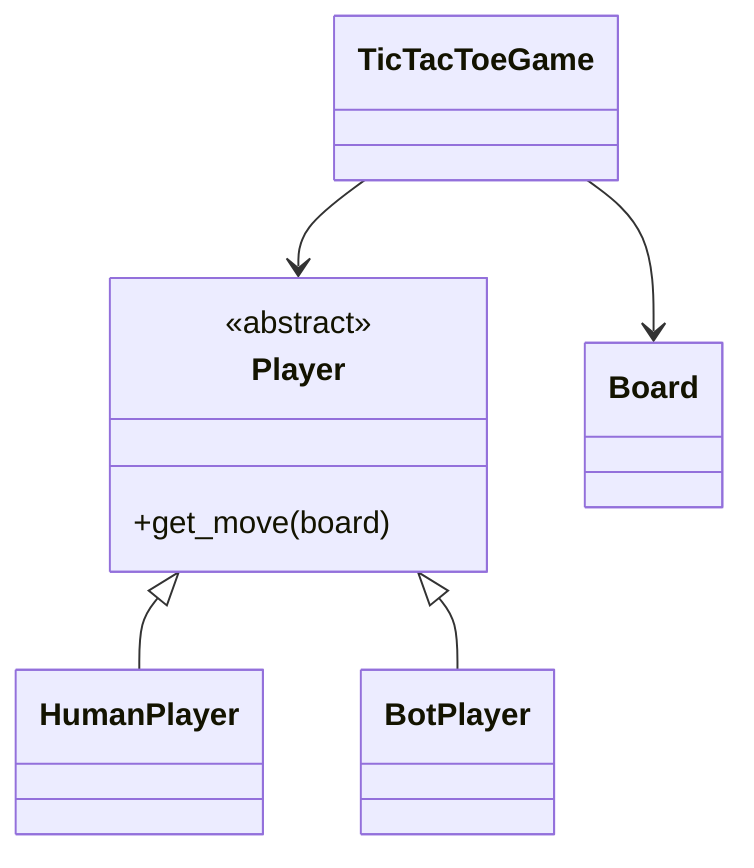
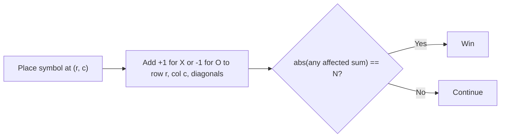

# Tic-Tac-Toe - Interview Questions & Answers

> **Target Level:** Senior/Staff Engineer (6+ years)  
> **Evaluation Focus:** AI algorithms, state space, minimax, extensibility

---

## Question 1: Core Design
**Interviewer:** *"Design a Tic-Tac-Toe game supporting Human vs Human, Human vs AI, and AI vs AI modes."*

### 🎯 Expected Answer

**Strategy Pattern for Player Types:**
```python
class Player(ABC):
    @abstractmethod
    def get_move(self, board: Board) -> Tuple[int, int]:
        pass

class HumanPlayer(Player):
    def get_move(self, board) -> Tuple[int, int]:
        ...  # read via injected input_fn, re-prompt on bad input

class BotPlayer(Player):
    def get_move(self, board) -> Tuple[int, int]:
        ...  # memoised minimax over a copy of the board
```

**Why Strategy over if-else?** With if-else, adding a new AI difficulty means modifying the `get_move` method. With Strategy, you add a class and the game loop doesn't change (OCP).

*Figure: Player strategies; the game depends only on the Player interface.*



**Board encapsulation:**
```python
class Board:
    def is_valid_move(self, pos) -> bool                          # guard
    def place_move(self, pos, symbol) -> Optional[PlayerSymbol]   # mutator; returns winner
    def undo_move(self) -> Position                               # exact inverse
    def check_winner(self) -> Optional[PlayerSymbol]              # O(1) query
    def get_available_moves(self) -> List[Position]
```
The game (`TicTacToeGame.make_move(symbol, pos)`) adds what the board shouldn't know: whose turn it is and whether the game is over.

### 💡 Technical Deep Dive: Win Detection

**K = N (classic):** keep a running sum per row, column and the two diagonals (+1 for X, −1 for O). After placing at `(r, c)`, the move won iff `abs(rows[r]) == n or abs(cols[c]) == n or abs(diag) == n or abs(anti) == n`. O(1) per move, O(N) memory. This is what `Board._bump` does, and `undo` just subtracts.

*Figure: O(1) win check with running sums per row, column and diagonal (K = N).*



**K < N (gomoku-style):** sums don't work. Only lines through the *last move* can be new wins, so walk the 4 directions from it and count consecutive same symbols: O(K) per move.

The full-board scan below is O(N²·K) per check. Correct, and fine to write first, but say why you'd replace it:
```python
def check_win_nxn(board, N, K):
    for r in range(N):
        for c in range(N):
            if board[r][c] is None: continue
            symbol = board[r][c]
            # Check 4 directions: →, ↓, ↘, ↙
            for dr, dc in [(0,1), (1,0), (1,1), (1,-1)]:
                count = 0
                for i in range(K):
                    nr, nc = r + dr*i, c + dc*i
                    if 0 <= nr < N and 0 <= nc < N and board[nr][nc] == symbol:
                        count += 1
                    else: break
                if count == K: return symbol
    return None
```

---

## Question 2: Minimax AI
**Interviewer:** *"Implement an unbeatable AI. Walk me through the algorithm."*

### 🎯 Expected Answer

**Minimax with Alpha-Beta Pruning** (the code uses memoisation instead; see below):
```python
def minimax(board, symbol, is_maximizing, alpha=-inf, beta=inf):
    # Terminal states
    winner = board.check_winner()
    if winner == AI_SYMBOL: return 1
    if winner == HUMAN_SYMBOL: return -1
    if board.is_full(): return 0

    if is_maximizing:
        best_score = -inf
        for move in board.get_available_moves():
            board.place_move(move, AI_SYMBOL)
            score = minimax(board, symbol, False, alpha, beta)
            board.undo_move(move)
            best_score = max(best_score, score)
            alpha = max(alpha, score)
            if beta <= alpha: break  # β-cutoff
        return best_score
    # Minimizing player...
```

**Numbers:** the full 3×3 game tree has 549,946 nodes (255,168 finished games; 9! = 362,880 is only an upper bound on 9-move sequences and ignores early wins). Alpha-beta with good ordering cuts that to a few thousand nodes. But there are only **5,478 distinct legal positions**, so memoising minimax on the position (a transposition table) is even simpler and exact. That is what `BotPlayer` does.

Two details that separate a good answer:
- **Prefer faster wins.** Plain ±1 scoring makes the bot indifferent between winning now and winning in three moves, and it sometimes "plays with its food". Score a win as `1 + empty cells left`.
- **Memo keys must capture everything the value depends on.** Position + side to move is enough when scores depend only on the position. If you add a depth limit, the remaining depth must be in the key too.

None of this scales to "larger boards": 4×4 already has ~10⁷ positions, so plain-Python exhaustive search isn't interactive. That is where depth limits and heuristics come in.

### 🔍 Trade-off Analysis: Optimal vs. Satisfying

| Approach | Pros | Cons | When |
|----------|------|------|------|
| Minimax | Guaranteed optimal | O(b^d) exponential | 3×3 |
| Alpha-Beta / memo | Much faster | Same result | 3×3; 4×4 only with a strong engine |
| Monte Carlo | Handles large spaces | Probabilistic | 6×6+ |
| Heuristic + depth limit | Fast, adjustable | May make suboptimal moves | N×N |

---

## Question 3: Scaling to N×N
**Interviewer:** *"How would you extend this to a 4×4 or N×N board?"*

### 🎯 Key Points

1. **Win condition becomes parameterized**: N-in-a-row instead of 3-in-a-row
2. **Board representation**: Bitboard (int per player) for performance
3. **AI complexity**: Exhaustive minimax is impractical from 4×4 up (≈10⁷ positions for 4×4, 3^25 ≈ 8.5 × 10¹¹ as an upper bound for 5×5). Switch to:
   - **Heuristic evaluation**: Evaluate board state without full search
   - **Monte Carlo Tree Search (MCTS)**: Simulate random playouts, choose best
   - **Opening book**: Pre-computed best moves for common openings

---

## Question 4: Multi-Player Extensions
**Interviewer:** *"How would you support 3+ players or team play?"*

| Feature | Implementation |
|---------|---------------|
| **3+ players** | More symbols (X, O, Δ, □). Win condition: all 3 in a row must be same symbol. Draw harder to reach. |
| **Team play** | Two symbols per team. Win if team controls a line. |
| **Tournament** | Bracket generation. ELO rating system. Match history. |

---

## Question 5: Design Patterns

| Pattern | Where | In the code? |
|---------|-------|--------------|
| **Strategy** | `HumanPlayer` / `BotPlayer` / `ScriptedPlayer` | Yes |
| **Facade** | `TicTacToeGame` | Yes |
| **Command** | Move record for undo/redo/replay | The history list is enough here; a `Move` class earns its keep only with redo or networked replay |
| **Observer** | UI refresh | `play(on_move=...)` is a single callback; promote to Observer only with several listeners |

`GameStatus` is an enum, not the State pattern; a Factory for two player types is ceremony. Naming patterns the code doesn't need is a negative signal.

---

## Question 6: Testing Strategy

**Unit tests to write** (all in `test_tic_tac_toe.py`):
1. Win detection — every row, column and diagonal, for both symbols, on 3×3, 4×4 and 5×5
2. Draw detection — full board, no winner
3. AI correctness — the bot never loses as X *or* as O: enumerate every opponent reply at every turn (a few hundred games), not a handful of hand-picked ones
4. Bot prefers an immediate win over a block, and blocks when it must
5. Invalid move rejection — occupied cell, out of bounds, out of turn, after game over; a failed move doesn't advance the turn
6. Undo — counters really reversed (place the opposite symbol afterwards and confirm no phantom win)
7. Concurrency — 9 threads race to make X's first move; exactly one lands
8. The demo runs with no stdin (guards against an `input()` regression)

---

## Question 7: The Follow-ups Interviewers Actually Push On

**"Make it N×N with K in a row."**
`Board(size)` already handles N×N with K = N via line sums. For K < N, check the four lines through the last move, O(K). Bot: depth-limited search plus a heuristic (open lines, threats), because exhaustive search is out.

**"Two people tap at the same time" / "the request is retried."**
`make_move(symbol, pos)` runs under a lock and checks turn order, so the second request fails with `NotYourTurnError` and changes nothing. For retries over a network, include the move number the client saw; a retry of an already-applied move returns the current state instead of an error.

**"Add undo and redo."**
Undo pops the history and reverses the counters. Redo needs a second stack that's cleared on any new move. If undo is available in multiplayer, decide who may undo (only the last mover, before the opponent replies).

**"Add difficulty levels."**
Easy: random legal move (seeded for tests). Medium: depth-limited minimax or "win if you can, block if you must, else random". Hard: full memoised minimax. All are `Player` strategies.

**"Your bot sometimes delays a win."**
±1 scoring makes all wins equal. Score by remaining empty cells (or `10 − depth`) so earlier wins score higher.

**"How do you test something with `input()` in it?"**
You don't. Inject `input_fn`/`output_fn`, keep the game loop free of I/O, and make the default demo scripted.

---

## ⚠️ Common Mistakes

- `input()` inside the game or player logic, so nothing runs in CI.
- Undo that clears the cell but not the derived state (history, counters, cached winner).
- Win check that scans the whole board on every move without acknowledging it, or only checks rows and columns.
- Allowing a move after the game is won, or out of turn.
- Minimax with ±1 scoring (no preference for faster wins), or memo keys that miss side-to-move.
- Claiming alpha-beta makes larger boards "real-time".
- Listing State/Observer/Factory/Memento for a 200-line program.

## 🎚️ Senior vs Staff Signal

- **Senior:** clean Board/Player/Game split, O(1) win check, exceptions for invalid and out-of-turn moves, correct minimax, unit tests including "bot never loses".
- **Staff:** also keeps I/O out of the domain and says why, gives players a copy of the board, makes `make_move` the single locked mutator, knows the real state-space numbers (5,478 positions; tree of 549,946 nodes) and picks memoisation over alpha-beta because of them, and frames the online version around idempotent, ordered moves rather than a bigger architecture diagram.
