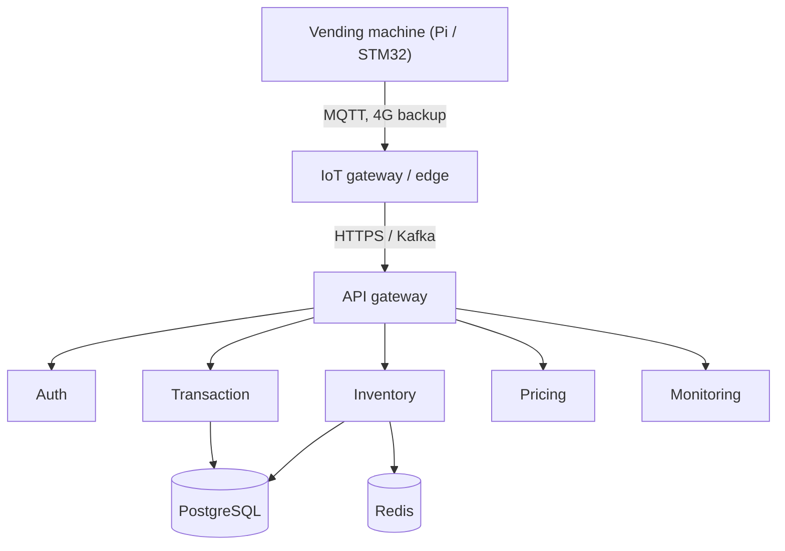
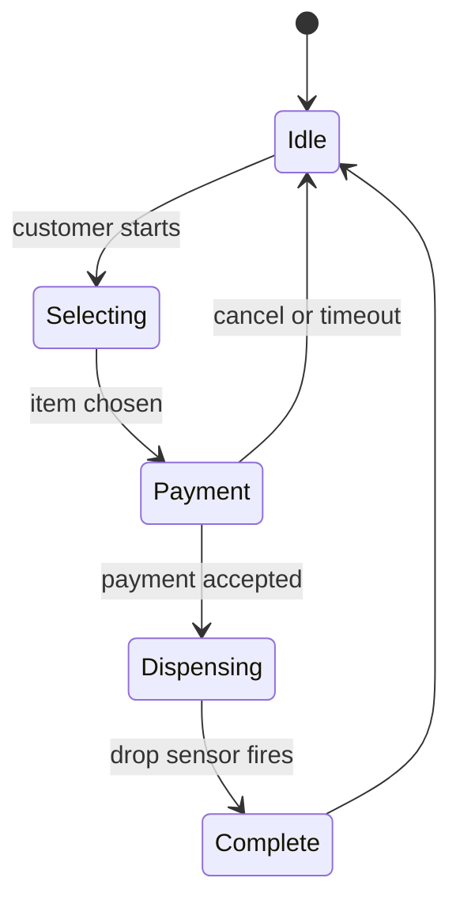
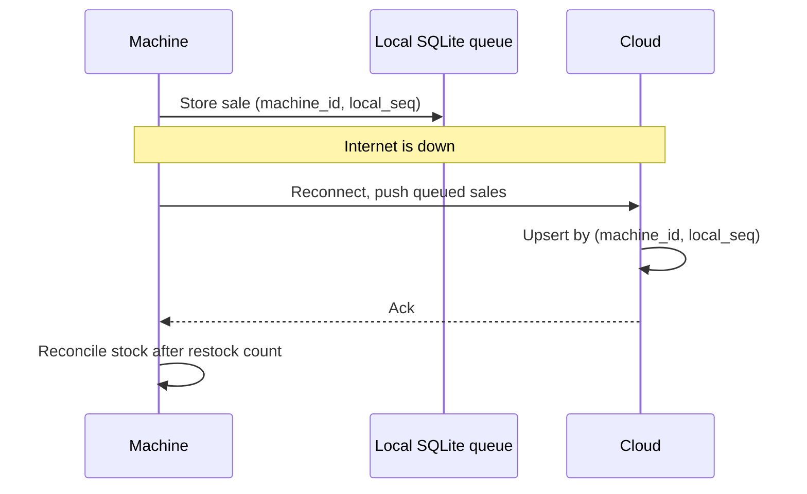

# 🏗️ Vending Machine — High-Level Design

> **Target Level:** Senior/Staff Engineer | **Focus:** IoT, embedded systems, payment processing, inventory chain

---

## 1. SYSTEM OVERVIEW

**Purpose:** IoT-connected vending machine network with real-time inventory tracking, remote monitoring, and dynamic pricing.

**Scale:** 10,000 machines, 100K transactions/day, 1M products tracked

**Users:** End customers (buyers), Route operators (restock), Admins (pricing, analytics)

**Use Cases:** Buy product (cash/card/UPI), Remote inventory check, Restock planning, Dynamic pricing

**Constraints:** Offline operation (machine works without internet), <2s transaction time, 99.5% payment success

---

## 2. HIGH-LEVEL ARCHITECTURE

```
┌───────────────────────┐
│     Vending Machine    │
│ (Raspberry Pi/STM32)   │
│ - Coin acceptor        │
│ - Card reader          │
│ - Dispenser motors     │
│ - Display              │
└──────────┬────────────┘
           │ MQTT (offline-capable)
           │ 4G/LTE backup
┌──────────▼────────────┐
│  IoT Gateway / Edge   │
│  (Local aggregation)   │
└──────────┬────────────┘
           │ HTTPS / Kafka
┌──────────▼────────────┐
│     API Gateway        │
└──────────┬────────────┘
           │
┌─────┬─────┬─────┬─────┐
│     │     │     │     │
▼     ▼     ▼     ▼     ▼
Auth  Inven-Trans-Price Moni-
      tory  action Eng   tor
      Svc   Svc    Svc   Svc
│     │     │     │     │
└─────┴──┬──┴──┬──┴─────┘
         │     │
    ┌────▼─┐ ┌─▼────┐
    │ Redis│ │Post- │
    │Cache │ │greSQL│
    └──────┘ └──────┘
```

*Figure: machine to cloud services.*



### 🎬 Animated Sequence Diagram

<p align="center">
  <video controls width="900" style="border-radius: 12px; box-shadow: 0 4px 24px rgba(0,0,0,0.3);" loop playsinline preload="metadata">
    <source src="../../../assets/videos/vending-machine-sequence.mp4" type="video/mp4" />
    Your browser does not support the video tag.
  </video>
  <br/>
  <em>🎬 Animated Vending Machine Sequence — Insert Money → Select Item → Dispense → Change Return. Click ▶ to play/pause. Created with <a href="https://remotion.dev">Remotion</a>.</em>
</p>

---

## 3. KEY COMPONENTS & INTERVIEW Q&A

### Machine Firmware (Python on Raspberry Pi / C on STM32)
- State machine: Idle → Selecting → Payment → Dispensing → Complete
- Local inventory tracking
- Offline transaction queue

*Figure: machine state machine.*



**🔴 Interview Question:** *"How does the machine handle transactions when the internet is down?"*

**✅ Answer:**
1. **Offline mode:** Machine queues transactions locally (SQLite file)
2. **Payment:** Cash always works offline. Card either goes cash-only, or uses EMV offline approval / store-and-forward under a small floor limit (e.g. $5) — the operator accepts a bounded fraud loss to keep selling
3. **Sync on reconnect:** When connection restores, push queued transactions to cloud. Each carries a machine-generated id `(machine_id, local_seq)`, so a resend after a lost ack is deduplicated, not double-counted
4. **Conflict resolution:** Cloud validates each transaction — if product row was restocked between offline queue and sync, adjust inventory accordingly
5. **Machine state:** Reconcile physical inventory (count after restock) vs. cloud state

*Figure: offline queue and idempotent sync on reconnect.*



---

### Inventory Service (Python)
- Real-time stock per machine
- Restock alerts (threshold-based)
- Expiry tracking for perishable items
- FIFO slot management

**🔴 Interview Question:** *"How do you optimize restock routes for 10,000 machines?"*

**✅ Answer:**
1. **Vehicle Routing Problem (VRP):** Model as capacitated VRP with time windows
2. **Priority scoring:** `restock_urgency = (reorder_level - current_stock) / daily_sell_rate`
3. **Route optimization:** Use OR-Tools or similar solver — minimize distance while respecting truck capacity
4. **Dynamic re-routing:** If machine goes offline mid-route, recalculate
5. **Seasonal prediction:** ML model predicts restock needs by day of week, weather, nearby events

---

### Transaction Service (Node.js)
- Payment gateway integration (card, UPI, cash)
- Idempotency keys for retry safety
- Refund processing

**🔴 Interview Question:** *"How do you handle partial payment or insufficient change?"*

**✅ Answer:**
1. **Insufficient change:** Light "Exact change only" when the coin float is low. Independently, before accepting a coin/note that overpays, run the change check; if change can't be made, reject that piece back to the customer. Never take the money and short-change.
2. **Partial payment:** Inserted cash sits in escrow until the product drops. Cancel (or a jam, or the selection timing out) returns the exact pieces.
3. **Change algorithm:** Bounded coin change (DP over available counts), not greedy: with a limited coin supply greedy fails even for USD (30c from one quarter + three dimes).

---

## 4. DATA MODEL

```sql
CREATE TABLE machines (
    id UUID, location TEXT, firmware_version TEXT,
    last_online TIMESTAMP, status TEXT
);
CREATE TABLE slots (
    id UUID, machine_id UUID, position INT,
    product_id UUID, quantity INT, capacity INT,
    reorder_level INT, expiry_date DATE
);
CREATE TABLE transactions (
    machine_id UUID, local_seq BIGINT,      -- generated on the machine
    slot_id UUID, amount_cents BIGINT,      -- integer minor units, never float
    payment_method TEXT, status TEXT,       -- AUTHORIZED / DISPENSED / CAPTURED / VOIDED / REFUNDED
    gateway_auth_id TEXT, created_at TIMESTAMP,
    PRIMARY KEY (machine_id, local_seq)     -- idempotent ingestion of retried uploads
);
```

---

## 5. TRADE-OFF ANALYSIS

| Decision | Choice | Rationale |
|----------|--------|-----------|
| Machine OS | Embedded Linux | Flexibility vs. RTOS. Need Python for ML models |
| Connectivity | MQTT + 4G | MQTT is lightweight, 4G for remote locations |
| Offline mode | Local queue + sync | Must work without internet for cash payments |
| Card reader | Cloud-based auth | P2PE encryption, tokenization for PCI compliance |

---

## 6. SCALABILITY

**Capacity:** 100K transactions/day ≈ 1.2 TPS average. A sale takes ~20–30 s at the machine, so even a busy machine does ~1–2/min; with a 10× peak factor the fleet is in the **tens of TPS**, plus telemetry (10K machines × 1 heartbeat/min ≈ 170 msg/s). The cloud side is not the hard part — the hard part is correctness at the edge (offline, power loss, payment reconciliation).

**Solution:** MQTT → Kafka for transaction and telemetry ingestion (absorbs reconnect bursts when many machines come back online at once), consumers upsert by `(machine_id, local_seq)`, Redis for real-time machine status.

**Availability:** 99.95% cloud, 99.9% per-machine (offline fallback)

---

## 7. FAILURE MODES & CONSISTENCY

The machine is the source of truth for its own stock and cash; the cloud is eventually consistent with it.

| Failure | What goes wrong | Handling |
|---------|-----------------|----------|
| Dispense jams / drop sensor sees nothing | Customer paid, got nothing | Cash: return escrow. Card: **void** the authorization (we capture only after the drop sensor fires) |
| Power loss after authorize, before capture | Hold on the card, unknown whether product dropped | Write a journal entry (`AUTHORIZED`, then `DISPENSED`) to local flash before each step; on boot, capture `DISPENSED`, void `AUTHORIZED`. Uncaptured holds also expire at the issuer |
| Power loss with cash in escrow | Customer's coins in limbo | Escrow is physical: on boot the escrow is returned. Log the event for audit |
| Upload retried after lost ack (MQTT QoS 1 is at-least-once) | Duplicate transaction | Idempotent upsert on `(machine_id, local_seq)` |
| Gateway timeout during authorize | Unknown whether the hold exists | Send an idempotency key with the auth request; on timeout, retry with the same key or query by it, then void if not proceeding |
| Cloud price change while machine is offline | Machine sells at old price | Price lists are versioned; machine applies a new list only when idle; transactions record the price version used |
| Stock drift (theft, mis-load) | Cloud stock wrong | Operator count at restock is authoritative and resets the slot count |
