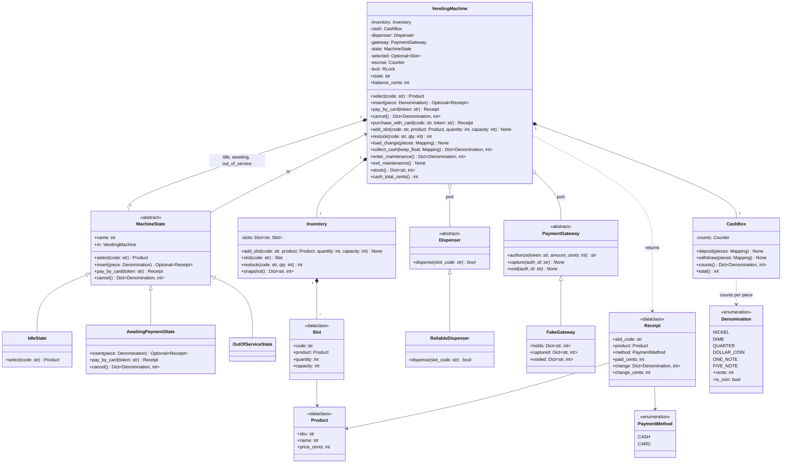

# 🧠 Vending Machine LLD — Thought Process Guide

> **Goal:** Learn *how* to think when designing a Low-Level Design.

---

## 📊 Class Diagram



---

## ⏱️ How to Run This in a 45–60 min Interview

| Time | Step | What to say out loud |
|------|------|----------------------|
| 0–5 | **Clarify** | "Cash only, or card too? Which denominations, and which can it pay out? Select first or pay first? What happens if it can't make change? One item per transaction? Do I need maintenance/restock?" |
| 5–12 | **Entities + interfaces** | "Money is integer cents. States: idle, awaiting payment, out of service. Two ports to the outside world — `Dispenser` and `PaymentGateway` — because both can fail and I want to fake them in tests." |
| 12–35 | **Core code** | `Inventory`, `make_change`, the state classes, then `VendingMachine`. Write the cash path end to end first: select → insert → change check → dispense → commit. |
| 35–45 | **Failure + concurrency** | "Jam: refund escrow / void the hold. Can't make change: reject the piece. One lock per machine because restock and remote purchases run alongside the keypad." |
| 45–60 | **Extension** | Card payments (authorize/capture/void), timeouts, multi-item cart, pricing policy. |

**Clarifying questions worth asking** (defaults to propose):

- Payment methods? → cash and card.
- Order: select then pay, or pay then select? → select first (price is known, change check is possible).
- Can't make change? → reject the coin/note that overpays; light "exact change only".
- Which pieces are paid out? → coins only; notes are accepted and kept.
- Partial dispense / jam? → full refund, stock unchanged.
- Concurrency? → keypad is single-user, but operator and remote purchases are concurrent.

---

## Phase 1: Identify the Nouns

> *"A vending machine displays products. User selects a product, inserts money, and receives it with change."*

| Noun | Decision | Why |
|------|----------|-----|
| Denomination | Enum `(cents, is_coin)` | Fixed set; tuple values so a $1 coin and $1 note aren't Enum aliases |
| Product | Frozen dataclass | Immutable catalogue entry, price in cents |
| Slot | Dataclass | Where stock lives: code, product, quantity, capacity |
| Inventory | Class | Slot lookup, restock with capacity check |
| CashBox | Class | The machine's coins/notes |
| Escrow | `Counter` on the machine | Customer's pieces until the sale commits |
| Dispenser | ABC | Hardware that can fail |
| PaymentGateway | ABC | Card auth/capture/void |
| MachineState | Base class + 3 states | State pattern |
| Receipt | Frozen dataclass | Result of a sale |

## Phase 2: Assign Responsibilities

| Action | Owner | Why |
|--------|-------|-----|
| Is this action allowed now? | Current `MachineState` | No `if state == ...` chains |
| Can I make change? | `make_change()` | Pure function, easy to test |
| Hold customer cash | Machine `_escrow` | Must be returnable as-is |
| Drop the product | `Dispenser` | Hardware port; may fail |
| Charge a card | `PaymentGateway` | Two-phase so we never charge for nothing |
| Commit a sale | `VendingMachine._vend_cash/_vend_card` | One place moves stock and money together |

## Phase 3: The State Machine

```
IDLE --select(code)--> AWAITING_PAYMENT
AWAITING_PAYMENT --insert (balance < price)--> AWAITING_PAYMENT
AWAITING_PAYMENT --insert (completes, change OK)--> [dispense] --> IDLE
AWAITING_PAYMENT --insert (completes, no change)--> reject piece, stay
AWAITING_PAYMENT --pay_by_card--> [authorize, dispense, capture] --> IDLE
AWAITING_PAYMENT --cancel | jam--> refund --> IDLE
any --enter_maintenance--> (refund if open) OUT_OF_SERVICE --exit--> IDLE
```

## Phase 4: The Order of Operations That Keeps Money Safe

1. Validate the selection (exists, in stock).
2. Accept pieces into escrow.
3. On the piece that completes payment, check change **before** accepting it.
4. Drive the motor; if the drop sensor fails, refund/void and stop.
5. Commit: escrow → cash box, change out, stock − 1 (card: capture).

## Phase 5: Quick Checklist

✅ Integer cents, never float
✅ Escrow returned as the exact pieces on cancel
✅ Change computed with bounded DP, checked before taking the money
✅ Card captured only after a confirmed drop; voided on jam
✅ Every public method atomic under one machine lock
✅ Hardware and gateway behind ABCs, faked in tests
