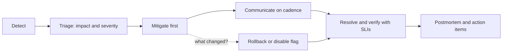
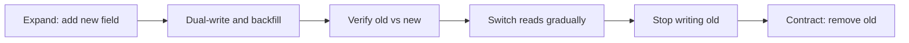
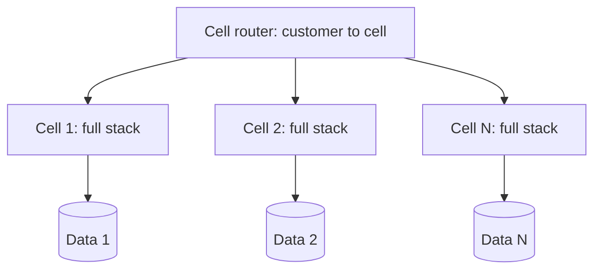

# 🛡️ Reliability & Operations for Staff Engineers

> **SLOs, incident leadership, postmortems, safe rollouts, migrations, capacity, and multi-region.** The operational half of "senior systems judgment," with the vocabulary and the answers interviewers expect.

---

## Table of Contents

1. [SLIs, SLOs and error budgets](#1-slis-slos-and-error-budgets)
2. [Alerting that doesn't burn out on-call](#2-alerting-that-doesnt-burn-out-on-call)
3. [Incident management](#3-incident-management)
4. [Blameless postmortems](#4-blameless-postmortems)
5. [Safe change: rollouts, flags, migrations](#5-safe-change-rollouts-flags-migrations)
6. [Capacity planning and load](#6-capacity-planning-and-load)
7. [Resilience patterns](#7-resilience-patterns)
8. [Multi-region and cell-based architecture](#8-multi-region-and-cell-based-architecture)
9. [Interview questions](#9-interview-questions)

---

## 1. SLIs, SLOs and error budgets

- **SLI** (indicator): a measured ratio of good events to total events. Example: `requests with status < 500 and latency < 300 ms / all requests`.
- **SLO** (objective): the target for an SLI over a window. Example: 99.9% over 30 days.
- **SLA** (agreement): a contractual promise with consequences, always looser than the internal SLO.
- **Error budget** = `1 − SLO`. At 99.9% over 30 days: 0.1% × 43,200 min ≈ **43 minutes** of full downtime-equivalent.

| SLO (30 days) | Allowed downtime |
|---|---|
| 99% | ~7.2 h |
| 99.9% | ~43 min |
| 99.95% | ~22 min |
| 99.99% | ~4.3 min |

**Choose SLIs from the user's view:** availability (successful requests), latency (a percentile threshold, never the mean), freshness (data age), correctness (right answer), durability. Measure at the **edge** (load balancer or client), not only inside the service.

**Using the budget:** when budget remains, ship faster and take risks; when it's exhausted, freeze risky launches and spend time on reliability. This turns "reliability vs. features" from an argument into a policy agreed in advance with product.

**Dependencies:** availability multiplies along serial dependencies. A service with 99.9% SLO that hard-depends on three 99.9% services can deliver at best ≈ 99.6%. Make dependencies soft (fallbacks, caching, async) wherever you can.

**Pick SLOs deliberately:** each extra nine costs roughly 10× more. Users can't tell 99.99% from 99.9% if their own network is 99.5%.

---

## 2. Alerting that doesn't burn out on-call

**Alert on symptoms (user pain), not causes.** Page on "error budget burning fast," not "CPU > 80%." Causes go on dashboards and low-urgency tickets.

**Multi-window, multi-burn-rate alerts** (from the Google SRE workbook) catch both fast and slow burns. Burn rate = how many times faster than sustainable you're consuming budget. Typical for a 30-day SLO:

| Severity | Burn rate | Long window | Short window | Budget consumed |
|---|---|---|---|---|
| Page | 14.4× | 1 h | 5 min | 2% |
| Page | 6× | 6 h | 30 min | 5% |
| Ticket | 1× | 3 days | 6 h | 10% |

The short window makes the alert reset quickly once fixed; the long window prevents flapping.

**Every page must be**: actionable, urgent, real, and tied to a runbook. If it fires and the on-call does nothing, delete or demote it. Track pages per shift; sustained more than ~2 per 12-hour shift is a reliability problem, not a staffing one.

---

## 3. Incident management

### Severity and roles

| Role | Responsibility |
|---|---|
| **Incident Commander (IC)** | Owns the response; assigns work; makes calls; does *not* debug |
| **Ops / Tech lead** | Hands-on investigation and mitigation |
| **Communications lead** | Status page, stakeholder updates on a fixed cadence (e.g. every 30 min) |
| **Scribe** | Timeline in real time (for the postmortem) |

### The loop

1. **Detect:** alert, customer report, or anomaly.
2. **Triage:** impact, scope, severity. Declare early; you can downgrade.
3. **Mitigate first:** rollback, disable the flag, fail over, shed load, scale out. **Restore service before finding the root cause.**
4. **Communicate:** internal channel, status page, executive summary; say what you know, what you don't, and when the next update is.
5. **Resolve and verify:** confirm with SLIs, not just "the graph looks better."
6. **Learn:** postmortem within a few days; track action items to completion.

**Heuristics:** "What changed?" is the most productive first question (deploys, config, flags, traffic, dependencies, certificates, quotas, clock/date). If a recent change correlates, roll it back before understanding it. Don't make several changes at once; you lose causality. Hand off cleanly on long incidents; tired responders make errors.

*Figure: the incident loop. Mitigate before root cause, then learn.*



---

## 4. Blameless postmortems

**Blameless** means we look for how the *system* let a reasonable person make that mistake, not who to punish. People who fear blame hide information.

**Structure:**

```markdown
# Postmortem: <short title>   (Severity, date, duration, author)
## Summary         what happened, impact (users, revenue, SLO budget burned), in 3-4 sentences
## Impact          numbers: affected requests/users, duration, data loss?
## Timeline        UTC timestamps: detection, escalation, mitigation, resolution
## Root cause(s)   the chain of conditions; use "5 whys" but stop at systemic causes
## Detection       how did we find out? how could we find out faster?
## What went well / what went poorly / where we got lucky
## Action items    each with owner, priority, due date, and type:
                   prevent (stop recurrence), detect (find faster), mitigate (reduce impact)
```

**Quality bar:** action items are specific and owned ("add a canary stage that gates on error rate," not "be more careful"); human error is never the root cause; "where we got lucky" is included; the doc is shared widely; action items are **tracked to completion** (the usual failure).

---

## 5. Safe change: rollouts, flags, migrations

Most outages are caused by change. Make change **small, gradual, observable, and reversible**.

### Progressive delivery

- **Canary:** route 1–5% to the new version, compare SLIs against the baseline automatically, promote or roll back.
- **Staged regions/cells:** one cell, then a region, then the rest. Never deploy everywhere at once.
- **Blue/green:** instant switch back; costs double capacity during the cutover.
- **Feature flags:** decouple deploy from release; kill switch for risky paths. Clean up stale flags; every flag is a branch you must test.
- **Shadow traffic / dark launch:** send real traffic to the new path and compare results without affecting users.

### Backward-compatible changes (expand / contract)

For schemas and APIs, never make a breaking change in one step:

1. **Expand:** add the new column/field/endpoint; old code ignores it.
2. **Dual-write** to old and new; **backfill** history.
3. **Verify:** compare old vs. new (counts, checksums, sampled reads).
4. **Switch reads** to new, gradually, behind a flag.
5. **Stop writing old;** observe.
6. **Contract:** remove the old column/field after a safe window.

*Figure: expand/contract migration, each step independently deployable and reversible.*



Every step must be deployable and rollback-able independently. Code must tolerate both versions running at once (rolling deploys guarantee that).

### Migration playbook

Define the end state and the *reason*; make the new path the easy path; migrate by cohort with a tracked dashboard; keep rollback until the old path is idle; **delete the old system** and its dashboards, alerts, and docs. Most migrations stall at 90% because deletion has no owner.

### Dangerous operations checklist

Config changes and certificate expiry are deploys too. Treat them with the same rollout. Require two-person review for destructive actions; use dry-run modes; keep backups *and test restores* (a backup you've never restored is a hope, not a backup).

---

## 6. Capacity planning and load

- **Know the bottleneck resource** for each service (CPU, memory, connections, disk IOPS, a downstream limit) and its **saturation point** from load tests.
- **Headroom:** run at ≤ 50–60% of tested capacity at peak so you can absorb a node/AZ loss (N+1 or N+2) and traffic surprises.
- **Forecast** from growth trends plus planned launches; review quarterly; include lead times (procurement, quota increases, cloud limits).
- **Autoscaling** helps with gradual change but not with spikes faster than scale-up time or with stateful/cold-start-heavy services. Pre-warm for known events.
- **Load test** in production-like environments with realistic data shapes; include failure scenarios (a node down at peak).
- **Queueing intuition:** latency grows non-linearly as utilization approaches 100% (for an M/M/1 queue, waiting time scales as `ρ / (1 − ρ)`). At 90% utilization, expect roughly 9× the service time in queue; at 95%, ~19×. This is why "it's only 90% CPU" is not fine.
- **Cost:** tag by team and service; the biggest costs are usually data egress, over-provisioned stateful stores, and logs/metrics cardinality.

---

## 7. Resilience patterns

| Pattern | Purpose | Gotcha |
|---|---|---|
| **Timeouts** (everywhere) | Bound the damage of a slow dependency | Set below the caller's own deadline; propagate the deadline |
| **Retries with backoff + jitter** | Survive transient errors | Only idempotent ops; cap with a **retry budget** to avoid storms; retry at one layer only |
| **Circuit breaker** | Stop calling a failing dependency; let it recover | Needs a sensible half-open probe; tune per dependency |
| **Bulkheads** | Isolate resource pools so one failure can't exhaust all | Cost: lower utilization |
| **Load shedding** | Reject excess work early to protect latency for the rest | Prioritize (critical over background); fail fast with 429/503 |
| **Backpressure** | Make producers slow down | Needs end-to-end propagation; unbounded queues hide the problem |
| **Graceful degradation** | Serve a reduced experience (cached/stale/simplified) | Define and test the degraded modes |
| **Idempotency** | Make retries and duplicates safe | Keys and storage lifetimes |
| **Hedged requests** | Cut tail latency by sending a second request after a delay | Extra load; only for idempotent reads |
| **Static stability** | Data plane keeps working when control plane is down | Pre-provision capacity; no hot-path dependency on control plane |

**Metastable failures:** systems that stay broken after the trigger is gone (e.g. retry storms and cache-miss stampedes keep load above capacity). Defend with load shedding, retry budgets, jittered TTLs, and the ability to drain traffic to recover.

---

## 8. Multi-region and cell-based architecture

### Multi-region options

| Model | RTO / RPO | Complexity | Notes |
|---|---|---|---|
| **Backup & restore** | hours / hours | Low | Cheapest; for non-critical systems |
| **Pilot light** | tens of minutes / minutes | Medium | Data replicated, compute scaled up on failover |
| **Warm standby** | minutes / seconds | Medium-high | Reduced-capacity copy always running |
| **Active-active** | ~0 / ~0 | Very high | Needs conflict resolution or a data model that avoids conflicts (partition users to a home region, CRDTs) |

Questions that decide it: what's the real RTO/RPO the business needs? Where does consistency matter (money, inventory) versus where eventual is fine? What's the cost of the added complexity and the risk of bugs in failover itself? **Test failover regularly**; an untested failover plan fails.

### Cell-based architecture

Partition the system into independent **cells**, each a complete stack serving a subset of customers. A thin router maps customer → cell.

- **Blast radius:** a bad deploy or poison request affects one cell (e.g. 1/20 of customers), not everyone.
- **Scalability:** add cells instead of scaling unbounded shared components.
- **Safer rollouts:** deploy cell by cell.
- **Costs:** routing layer becomes critical (keep it simple and static-stable); cross-cell queries and operations are harder; capacity is fragmented.

*Figure: a thin router maps each customer to one cell, so a bad deploy hits only that cell.*



### Shuffle sharding

Assign each customer a random small subset of workers; a noisy or poisonous customer can only hurt the few workers it maps to, and two customers rarely share the *same* subset. Dramatically reduces the chance that one customer's problem takes out another.

---

## 9. Interview questions

**Q1. "Define an SLO for a checkout API and how you'd use it."**
SLI: fraction of checkout requests that return non-5xx within 800 ms, measured at the load balancer. SLO: 99.95% over 30 days (~22 min of budget). Alert on multi-window burn rate. Budget policy: if >50% is burned mid-window, only reliability work and low-risk changes ship until it recovers. Review quarterly against user-visible impact.

**Q2. "You're paged: error rate spiked. Walk me through the first 15 minutes."**
Declare an incident and assign an IC if impact is real; assess scope (which endpoints/regions/customers). Ask what changed (deploys, flags, config, traffic, dependencies). If a change correlates, roll it back immediately. Otherwise mitigate by shedding load or failing over. Start comms with a cadence. Preserve evidence (logs, a profile) before restarting things. Root cause comes after service is restored.

**Q3. "How do you reduce on-call burden for a noisy service?"**
Measure (pages per shift, top alert sources, time-to-resolve), then fix the top offenders: delete non-actionable alerts, convert cause-based alerts to SLO burn alerts, automate the top runbook steps, fix the underlying defects (toil is a bug), and protect on-call with an explicit budget (e.g. ≤ 25% of time on interrupts) with leadership backing.

**Q4. "How would you migrate a critical table to a new schema/store with zero downtime?"**
Expand/contract: add the new store; dual-write behind a flag; backfill with checkpointing and throttling; verify with continuous diffing; shift reads by percentage; hold dual-write while rollback remains possible; cut writes; retire the old store. Plan for failures at each step, ownership of deletion, and a clear rollback trigger.

**Q5. "Active-active multi-region: would you do it?"**
Only if the business RTO/RPO truly require it and the data model can support it (per-user home region, idempotent/commutative operations, CRDTs, or accept conflicts). The cost is complexity and a new class of bugs; many systems are better served by warm standby with a tested failover. Decide per data type: money may need single-writer, while presence or counters can be multi-writer.

**Q6. "What's a metastable failure and how do you defend against it?"**
A state where a sustaining feedback loop (retries, cache misses, queue buildup) keeps the system overloaded after the original trigger is gone. Defenses: load shedding and admission control, retry budgets and jittered backoff, circuit breakers, bounded queues, request deadlines propagated downstream, and operational levers to drain or throttle traffic during recovery.

**Q7. "How do you know a canary is healthy?"**
Compare the canary against a concurrent baseline (not last week) on SLIs: error rate, latency percentiles, saturation, and business metrics. Require minimum traffic and duration, statistically meaningful differences, and automatic rollback on breach. Include a bake time long enough to hit slow failure modes (memory leaks, cache effects, daily cycles).

**Q8. "Postmortem action items keep not getting done. What do you change?"**
Make them few and high-leverage, with named owners and dates, in the normal tracker; review completion in a recurring ops review; report overdue items to leadership; reserve capacity; and distinguish prevent/detect/mitigate so the team funds the highest-value ones rather than writing a long list nobody owns.
