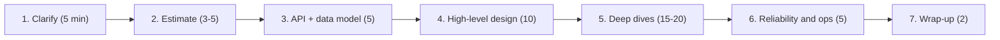

# 🧭 System Design Interview: Framework, Estimation, and What "Staff" Means

> **How to run a 45–60 minute design round**, the numbers to keep in your head, and the signals interviewers look for at Staff level. The case studies in this section all follow the structure below.

---

## Table of Contents

1. [What changes at Staff level](#1-what-changes-at-staff-level)
2. [The 45-minute framework](#2-the-45-minute-framework)
3. [Back-of-the-envelope estimation](#3-back-of-the-envelope-estimation)
4. [Numbers every engineer should know](#4-numbers-to-know)
5. [Building blocks and when to pick which](#5-building-blocks-and-when-to-pick-which)
6. [Trade-off vocabulary](#6-trade-off-vocabulary)
7. [Common failure modes in the interview](#7-common-failure-modes-in-the-interview)

---

## 1. What changes at Staff level

A senior candidate produces a design that works. A staff candidate also shows:

| Signal | What it looks like |
|---|---|
| **Scopes the problem** | Asks the 3–5 questions that change the architecture (scale, consistency needs, latency target, read/write ratio), then states assumptions instead of asking forever |
| **Drives the conversation** | Proposes the agenda, time-boxes, asks "do you want me to go deeper on X or Y?" |
| **Reasons in trade-offs** | "I'd choose X because Y; the cost is Z; I'd revisit if W changes." Never "X is best" |
| **Finds the hard part** | Every system has 1–2 genuinely hard problems (hot keys, fan-out, exactly-once, ordering). Spends time there |
| **Thinks in failure** | Dependencies fail, regions fail, deploys fail. Describes degradation and blast radius unprompted |
| **Thinks in operations** | Metrics, SLOs, rollout, migration, on-call burden, cost |
| **Thinks in evolution** | v1 that ships in a quarter vs. the end-state, and the path between them |
| **Knows what they don't know** | Flags assumptions and risks honestly ("I'd benchmark this before committing") |

If you only remember one thing: **a staff design interview is a conversation about decisions, not a diagram.**

---

## 2. The 45-minute framework

| Phase | Time | Output |
|---|---|---|
| 1. Clarify requirements | 5 min | Functional list, non-functional targets, explicit non-goals |
| 2. Estimate | 3–5 min | QPS, storage, bandwidth, which implies the shape of the system |
| 3. API and data model | 5 min | 3–6 endpoints; core entities; the access patterns that drive storage |
| 4. High-level design | 10 min | Boxes and arrows for the main flows (write path, read path) |
| 5. Deep dives | 15–20 min | The 2 hard problems, in detail, with alternatives |
| 6. Reliability, scale, ops | 5 min | Failure modes, hot spots, observability, rollout, cost |
| 7. Wrap-up | 2 min | Summarize decisions, risks, what you'd do next |

### Phase 1: Clarify requirements

Ask, then **write down** the answers:

- **Who are the users and what are the top 3 actions?** (functional scope)
- **Scale:** DAU / MAU, requests per user, data per request, growth.
- **Read:write ratio** and whether traffic is bursty (flash sales, live events).
- **Latency target** (p99 for the user-facing path) and **freshness** (is seconds-stale OK?).
- **Consistency:** what must never be wrong (money, inventory, uniqueness) versus what may be eventually correct (counts, feeds).
- **Availability** target and **durability** (can we ever lose data?).
- **Geography:** single region or global? Data residency?
- **Non-goals:** say what you are *not* building (analytics, admin UI, abuse detection) so the scope is explicit.

> **Tip:** convert vague requirements into numbers. "Fast" → "p99 < 200 ms". "Highly available" → "99.99%, i.e. ~52 min downtime a year."

### Phase 2: Estimate (see next section)

State the result as a decision: *"~12k read QPS peak 40k, mostly cacheable, so a cache tier plus a replicated store; 90 TB over 5 years, so sharding is needed from the start."*

### Phase 3: API and data model

- Define APIs with idempotency, pagination (cursor, not offset), auth, and versioning in mind.
- List **access patterns** first ("get timeline for user X, newest first"); they choose the schema and the database.
- Pick the partition key deliberately: it determines hot spots and what queries are cheap.

### Phase 4: High-level design

Draw the **write path** and the **read path** separately. Then name the data stores and why. Keep it to ~6–8 boxes, and say what each is responsible for.

### Phase 5: Deep dives

Let the interviewer steer; otherwise pick the hardest parts. For each: state the problem, give two or three options, pick one, state the cost, and say what would make you change your mind.

### Phase 6: Reliability, scale, operations

- **Failure modes:** each dependency down → what degrades? What is the blast radius?
- **Hot spots:** celebrity keys, thundering herds, skewed partitions.
- **Backpressure and load shedding;** timeouts, retries with jitter, circuit breakers.
- **Observability:** the 4 golden signals, an SLO, and the one alert that pages someone.
- **Rollout:** feature flags, canary, migration plan (dual write → backfill → verify → cutover → cleanup).
- **Cost:** the top two cost drivers and how you'd cut them.

*Figure: the 45-minute round at a glance, with time boxes.*

---

## 3. Back-of-the-envelope estimation

### Principles

- **Round aggressively.** 1 day ≈ 10⁵ seconds (86,400). 1 month ≈ 2.5×10⁶ s. 1 year ≈ 3×10⁷ s.
- **Powers of ten, not precision.** The goal is the order of magnitude, since that decides "one machine" vs "sharded."
- **Peak ≈ 2–5× average**, depending on how spiky the product is.
- **State assumptions out loud** so the interviewer can correct them.

### The core conversions

| Quantity | Value |
|---|---|
| Seconds per day | 86,400 ≈ **10⁵** |
| 1 M requests/day | ≈ **12 QPS** |
| 100 M requests/day | ≈ **1,200 QPS** (peak ≈ 3.5k) |
| 1 B requests/day | ≈ **12,000 QPS** |
| 1 KB × 1 M QPS | 1 GB/s ≈ **8 Gbps** |
| Daily data = QPS × size × 86,400 | e.g. 1,000 QPS × 1 KB × 86,400 ≈ 86 GB/day |

### Worked example: URL shortener

Assumptions: 100 M new URLs/day; read:write = 10:1; 500 bytes per record; retain 5 years.

- Writes: 100 M / 86,400 ≈ **1,200 QPS** (peak ~3.5k). Reads: ≈ **12,000 QPS** (peak ~35k).
- Storage: 100 M × 365 × 5 × 500 B ≈ **91 TB**.
- Keys: 100 M × 365 × 5 ≈ 182 B URLs. Base62 with 7 chars = 62⁷ ≈ **3.5 trillion**, so 7 characters is plenty (6 chars is only 57 billion).
- Cache: 20% of URLs drive ~80% of reads; cache the hot set (tens of GB), so one or two cache nodes absorb most reads.

**Conclusion to say aloud:** reads dominate and are highly cacheable; writes are small; 91 TB over 5 years means sharding by key from day one; no single-machine design works.

### Worked example: chat

Assumptions: 500 M DAU, 40 messages/user/day, 100 bytes/message.

- Messages/day = 500 M × 40 = **20 B**, i.e. ≈ **230k messages/s** average.
- Storage = 20 B × 100 B = **2 TB/day** (≈ 730 TB/year before replication and indexes).
- Connections: if 20% are online at peak, **100 M concurrent WebSockets**; at ~100k connections per gateway host, that's **~1,000 gateway hosts**. The connection tier is the dominant design problem.

### Worked example: video streaming egress

Assumptions: 1 B hours watched/day, average bitrate 3 Mbps.

- Bits/day = 10⁹ × 3,600 s × 3×10⁶ = 1.08×10¹⁹; ÷ 86,400 ≈ **125 Tbps average egress**. No origin can serve that: a **CDN** (and ISP-embedded caches) is the architecture.

### Estimation checklist

1. Users → requests per second (average, peak).
2. Request size → bandwidth in/out.
3. Retention × record size → storage, **× replication factor (3)** and index overhead (~1.5–2×).
4. Hot set size → cache memory.
5. Per-node capacity → node count (QPS ÷ per-node, with headroom of 50%).
6. Convert to a **design decision**: single node, replicated, sharded, CDN, async.

---

## 4. Numbers to know

Latency (order of magnitude; hardware and year dependent):

| Operation | Time |
|---|---|
| L1 cache reference | ~1 ns |
| Main memory reference | ~100 ns |
| SSD random read (NVMe) | ~20–100 µs |
| Same-datacenter round trip | ~0.5 ms |
| Read 1 MB sequentially from SSD | ~0.1–1 ms |
| Read 1 MB sequentially from memory | ~10–50 µs |
| HDD seek | ~5–10 ms |
| Cross-region round trip (US East ↔ West) | ~60–70 ms |
| US ↔ Europe round trip | ~80–100 ms |
| US ↔ Asia round trip | ~150–250 ms |

Throughput and capacity (rough, single node):

| Component | Ballpark |
|---|---|
| Well-tuned Redis | ~100k+ simple ops/s per core-ish; ~1M ops/s per node with pipelining |
| PostgreSQL / MySQL | ~5–20k simple writes/s; 20–100k+ indexed reads/s |
| Kafka broker | hundreds of MB/s; ~1M+ small msgs/s per cluster partition set |
| Nginx / L7 proxy | ~50k–100k+ req/s per host for small responses |
| One app server (typical web workload) | ~1–5k req/s |
| Network | 10–25 Gbps per host typical; 100 Gbps possible |

Availability budgets (per year): 99.9% = 8.8 h; 99.95% = 4.4 h; 99.99% = 52 min; 99.999% = 5 min. Remember availability **multiplies** along a serial dependency chain: five 99.9% dependencies give ≈ 99.5%.

Sizes: a tweet ≈ 300 B–1 KB; a photo ≈ 200 KB–2 MB; 1 min of 1080p video ≈ 50–100 MB; a UUID = 16 B; a pointer or ID ≈ 8 B.

> **Caveat to say in the room:** these are rules of thumb; I'd confirm with a benchmark on our hardware before sizing a real cluster.

---

## 5. Building blocks and when to pick which

| Need | Typical choice | Reach for it when | Watch out for |
|---|---|---|---|
| Relational data, transactions | PostgreSQL / MySQL | Strong consistency, joins, moderate scale | Single-writer limits; shard later by tenant/key |
| Key-value at huge scale | DynamoDB, Cassandra, ScyllaDB | Known access patterns, horizontal scale, low latency | Hot partitions; no ad-hoc queries |
| Document store | MongoDB | Flexible schema, aggregate-shaped data | Cross-document transactions, unbounded growth |
| Cache | Redis / Memcached | Hot reads, session, counters, rate limits | Invalidation, stampedes, memory cost |
| Search | Elasticsearch / OpenSearch | Full text, filters, ranking | Not a primary store; eventual consistency |
| Message queue / log | Kafka, SQS, Pub/Sub | Decoupling, buffering, replay, fan-out | Ordering only per partition; consumer lag |
| Object storage | S3 / GCS | Blobs, backups, data lake | Latency, per-request cost; eventual listing semantics in some systems |
| Time series | Prometheus, InfluxDB, TimescaleDB | Metrics, IoT | Cardinality explosions |
| Analytical store | ClickHouse, BigQuery, Snowflake | Aggregations over billions of rows | Not for point lookups or transactions |
| Coordination | etcd, ZooKeeper | Leader election, config, locks | Small data only; don't put the hot path through it |
| CDN | CloudFront, Fastly, Cloudflare | Static and cacheable content, video | Cache key design, purge, cost |
| Workflow / orchestration | Temporal, Step Functions | Long-running, retried, compensated processes | Determinism constraints, ops complexity |

**Default stance:** start with the boring tool you can operate (usually Postgres + Redis + a queue + S3). Introduce a specialized store when you can state the specific access pattern or scale that forces it.

---

## 6. Trade-off vocabulary

Use the right words, precisely:

- **Consistency:** linearizable (single global order, real-time), sequential, causal, read-your-writes, monotonic reads, eventual. Say which one you need and *where*.
- **CAP / PACELC:** during a **P**artition choose **A** or **C**; **E**lse (no partition) choose **L**atency or **C**onsistency. Most real decisions are the *else* clause.
- **Delivery:** at-most-once, at-least-once (+ idempotent consumers ⇒ effectively-once), exactly-once (only within a closed system or via transactions/dedupe).
- **Fan-out on write vs. on read:** precompute per-reader results (fast reads, expensive writes, bad for celebrities) vs. compute at read (cheap writes, slow reads). Real systems **hybridize**.
- **Push vs. pull;** polling vs. long-poll vs. WebSocket vs. SSE.
- **Sync vs. async:** what must the user wait for? Everything else goes behind a queue.
- **Sharding strategies:** range (scans, hot ends), hash (even, no scans), directory/lookup (flexible, extra hop), consistent hashing (minimal movement on resize).
- **Replication:** single-leader (simple, failover complexity), multi-leader (conflict resolution), leaderless/quorum (`R + W > N`).
- **Batching vs. latency;** compression vs. CPU; denormalization vs. write amplification.

---

## 7. Common failure modes in the interview

| Mistake | Fix |
|---|---|
| Jumping to boxes before requirements | Spend the first 5 minutes on scope and numbers |
| Buzzword architecture ("Kafka, Redis, microservices") with no why | For each component: the problem it solves and the alternative you rejected |
| Never saying a number | Estimate, and tie it to a decision |
| Treating the database as a magic box | State schema, partition key, and the queries it must serve |
| Ignoring failure | Walk each dependency failing; describe degradation |
| One "perfect" design | Present v1 and the evolution path; admit trade-offs |
| Over-engineering | "At 100 QPS a single Postgres is correct; here is the trigger to change" |
| Silent for long stretches | Think aloud; checkpoint with the interviewer |
| Going deep on the easy part | Identify and attack the 1–2 hard problems |
| Forgetting security, privacy, abuse | One minute on authN/authZ, rate limiting, PII, and abuse vectors |

### A reusable closing statement

> "To summarize: the core decisions were **A** (because …), **B** (because …), and **C** (because …). The main risks are **R1** and **R2**, which I'd mitigate with … The first thing I'd measure in production is …, and the signal that would make me revisit **B** is …"

---

**Next:** the case studies, each following this framework: [URL Shortener](01_URL_SHORTENER.md) · [News Feed](02_NEWS_FEED.md) · [Chat](03_CHAT_MESSAGING.md) · [Typeahead](04_TYPEAHEAD_SEARCH_SUGGESTIONS.md) · [Ad Click Aggregation](05_AD_CLICK_AGGREGATION.md) · [Video Streaming](06_VIDEO_STREAMING.md) · [File Sync](07_FILE_STORAGE_AND_SYNC.md) · [Payment Ledger](08_PAYMENTS_LEDGER.md)
