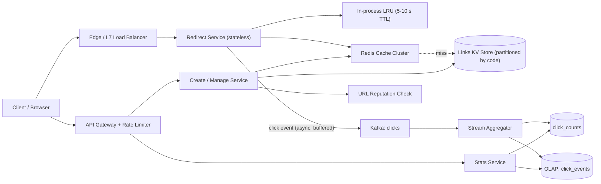

# 🔗 Design a URL Shortener (bit.ly style)

> **A read-heavy, write-light system whose real problems are unique short-code allocation, a sub-50 ms cached redirect path, counting a billion clicks a day without hot rows, and not becoming a phishing relay.** Follows the [framework](00_FRAMEWORK_AND_ESTIMATION.md) and reuses its worked numbers.

---

## Table of Contents

1. [Requirements](#1-requirements)
2. [Estimation](#2-estimation)
3. [API](#3-api)
4. [Data Model](#4-data-model)
5. [High-Level Design](#5-high-level-design)
6. [Deep Dives](#6-deep-dives)
7. [Failure Modes and Scaling](#7-failure-modes-and-scaling)
8. [Observability, Rollout and Cost](#8-observability-rollout-and-cost)
9. [Alternatives and Trade-offs](#9-alternatives-and-trade-offs)
10. [Staff-Level Follow-up Questions](#10-staff-level-follow-up-questions)
11. [Common Mistakes](#11-common-mistakes)

---

## 1. Requirements

### Functional

| # | Requirement |
|---|---|
| F1 | Create a short link for a long URL (anonymous or authenticated). |
| F2 | Redirect `GET /{code}` to the long URL. |
| F3 | Optional **custom alias** (`/spring-sale`), unique globally. |
| F4 | Optional **expiry** (`expires_at`); expired links stop redirecting. |
| F5 | Owners can disable or delete a link; the change takes effect quickly. |
| F6 | **Click analytics**: total clicks and time series per link (hour/day), with country and referrer breakdown as a stretch. |
| F7 | **Abuse handling**: block malicious destinations, rate-limit creation, support takedown. |

### Non-functional (numeric targets)

| Dimension | Target |
|---|---|
| Scale | 100 M new links/day, 1 B redirects/day (10:1), 5-year retention |
| Redirect latency | p99 < 50 ms server-side (excludes client network); cache-hit p99 < 10 ms |
| Redirect availability | 99.99% (about 52 min/year). Redirect is the product. |
| Create latency / availability | p99 < 300 ms; 99.9% |
| Durability | A created link is never lost once the API returned 2xx |
| Uniqueness | A code maps to exactly one destination at any time (strong, per key) |
| Analytics freshness | 95% of clicks visible within 2 minutes; counts may be approximate (see 6.3) |
| Takedown propagation | A blocked link stops redirecting everywhere within 60 s |

### Explicit non-goals

- Link previews, QR codes, A/B or per-device destinations, real-time click streaming, billing, UI.
- Exact-once click counting and bot-proof analytics (we filter obvious bots, not guarantee).

## 2. Estimation

Assumptions (match the framework's worked example): 100 M creates/day, 10:1 read:write, 500 B per link record, 5 years, peak = 3x average.

| Quantity | Arithmetic | Result |
|---|---|---|
| Create QPS | 100 M / 86,400 | **1,157 ≈ 1.2k** avg, **~3.5k** peak |
| Redirect QPS | 1 B / 86,400 | **11,574 ≈ 12k** avg, **~35k** peak |
| Links over 5 years | 100 M × 365 × 5 | **182.5 B** |
| Link storage (logical) | 182.5 B × 500 B | **91 TB** |
| Owner index | 182.5 B × 50 B | ≈ 9 TB, so ~**100 TB** logical |
| Replicated | 100 TB × 3 | **~300 TB** |
| Storage nodes | 300 TB / ~2 TB usable per node | **~150 nodes** |
| Key space | 62^7 = 3.52 × 10^12 | 182.5 B / 3.52 T = **5.2% full** after 5 years |
| Redirect response | ~400 B incl. headers × 35k/s | 14 MB/s ≈ 112 Mbps (trivial) |
| Cache hot set | 20% of the last 7 days of links: 0.2 × 700 M = 140 M entries × ~200 B | **~28 GB** (about 2x with Redis overhead, so ~60 GB) |
| Store reads at 90% hit ratio | 10% × 35k | **~3.5k/s** peak |
| Click events | 1 B/day × ~100 B | **100 GB/day**; 35k events/s peak = 3.5 MB/s |
| Raw click retention | 100 GB × 30 days | **3 TB** |

### Decisions this implies

- Reads dominate and are cacheable: a cache tier absorbs about 90% so the store sees ~3.5k reads/s at peak. The store is sized by **capacity (300 TB)**, not QPS.
- 300 TB replicated means a horizontally partitioned key-value store keyed by code from day one. A single Postgres is not an option.
- 7 characters is enough; the space is only 5.2% used in 5 years, so **random codes with a conditional insert** are viable (expected 1.055 attempts at the end).
- Click events are 35k/s peak but tiny in bytes: a log (Kafka) plus stream aggregation, never a database write per redirect.
- Creates are only ~3.5k/s peak, so a **single write region** is acceptable; redirects are served from every region.

## 3. API

Auth: creation and management use `Authorization: Bearer <token>` (or an API key); anonymous creation is allowed at a lower rate limit. **Redirect is unauthenticated.**

### 3.1 Create

```http
POST /v1/links
Authorization: Bearer <token>
Idempotency-Key: 7c1d6f0e-5a0b-4c53-9d0a-2f6a6e8b1c11
Content-Type: application/json

{
  "long_url": "https://example.com/products/42?utm_source=mail",
  "custom_alias": "spring-sale",
  "expires_at": "2027-03-01T00:00:00Z"
}
```

```http
HTTP/1.1 201 Created
{
  "code": "spring-sale",
  "short_url": "https://sho.rt/spring-sale",
  "expires_at": "2027-03-01T00:00:00Z"
}
```

- **Idempotency:** the pair `(owner_id, Idempotency-Key)` is stored for 24 h with a hash of the request body. A retry with the same key and body returns the original `201` and the same `code`; the same key with a different body returns `422`. Without this, a client timeout retry mints a second code.
- `409 Conflict` if the alias is taken. `400` for invalid URL (scheme must be http/https, max length 2,048, not pointing at our own domain to avoid loops). `422` if the destination is blocked by reputation. `429` when rate limited, with `Retry-After`.
- Aliases: 3 to 32 chars of `[A-Za-z0-9_-]`, case sensitive, not reserved (`api`, `admin`, ...).

### 3.2 Redirect

```http
GET /Ab3xK9q
HTTP/1.1 302 Found
Location: https://example.com/products/42?utm_source=mail
Cache-Control: private, max-age=0
```

- `404` for unknown, `410 Gone` for expired or deleted, `451` for legally or abuse-blocked. A blocked link may instead render an interstitial warning page.
- **302, not 301**: a 301 is cached by browsers indefinitely, so clicks never reach us (analytics lost) and a takedown cannot take effect for those clients. See 6.2.

### 3.3 Management and stats

```http
GET    /v1/links/{code}                         # metadata
PATCH  /v1/links/{code}   {"status":"disabled"} # disable / change expiry (If-Match: <version>)
DELETE /v1/links/{code}                         # soft delete, idempotent
GET    /v1/links?limit=50&cursor=eyJjIjoiMjAyNi0x...   # owner's links, newest first
GET    /v1/links/{code}/stats?from=2026-10-01&to=2026-10-08&granularity=day
```

Stats response: `{"code": "spring-sale", "total_clicks": 18342, "as_of": "2026-10-08T10:14:00Z", "series": [{"t": "2026-10-07", "clicks": 2210}]}`.

- List pagination is a **cursor** (opaque, base64 of `(created_at, code)`), never offset: the owner index is large and changes while paging.
- `PATCH` uses optimistic concurrency (`version`); the destination URL is **immutable** by default (changing it silently is a phishing vector, so require delete and recreate unless the owner is verified).

## 4. Data Model

Access patterns: (1) get link by code (hot, 12k/s); (2) insert if code absent; (3) list links by owner; (4) increment and read counts by code and time bucket.

| Table | Key | Attributes | Notes |
|---|---|---|---|
| `links` | **PK: `code`** (hash-partitioned) | `long_url`, `owner_id`, `created_at`, `expires_at`, `status` (active/disabled/blocked), `redirect_type`, `version` | ~500 B. Conditional put `attribute_not_exists(code)` is the uniqueness guarantee. |
| `links_by_owner` (index) | PK `owner_id`, sort `created_at DESC, code` | `code`, `status` | ~50 B. Eventually consistent index is fine. |
| `idempotency` | PK `(owner_id, idem_key)` | `request_hash`, `code`, `created_at` | TTL 24 h. Written with the link in one conditional batch where the store allows, else link first then idempotency row (see failure modes). |
| `click_counts` | PK `code`, sort `bucket_start` (hour) | `clicks` | Written only by the aggregator, with upserts that replace (6.3). |
| `click_events` | columnar OLAP table, ordered by `(code, ts)` | `ts, code, country, referrer, ua_class, event_id` | 30-day retention, source for breakdowns. |

**Partition key choice:** `code` is random, so hash partitioning spreads writes evenly with no sequential hot end. The only skew is read skew on viral links, handled by caching (6.2), not by partitioning.

**Why a partitioned key-value store (DynamoDB/Cassandra style) over SQL:** the dominant query is a point lookup by primary key; there are no joins; uniqueness is single-key (conditional put); capacity is 300 TB. Sharded MySQL/Postgres works too (shard by `hash(code)`, unique index per shard) but costs resharding tooling and operational effort at ~150 nodes. If the team already runs sharded MySQL well, that is a defensible v1.

**Expiry:** store `expires_at` and **check it at read time** in the redirect service. Use the store's TTL (or a background reaper) only to reclaim space; TTL deletion is lazy and can lag hours to days, so it must never be the enforcement mechanism.


## 5. High-Level Design



**Write path (create):**

1. Gateway authenticates, applies per-user and per-IP rate limits (token bucket in Redis), validates the body.
2. Create service checks the idempotency record; a hit returns the stored result.
3. Reputation check (blocklist lookup plus async deep scan): known-bad returns `422`. Unknown URLs are accepted and scanned asynchronously (see the abuse rows in section 7).
4. If a custom alias is given, use it as `code`; otherwise generate a random 7-char Base62 code.
5. Conditional put into `links`. On conflict: alias returns `409`; generated code retries with a new random code (up to 5 attempts, then 8 chars).
6. Write the `idempotency` row and `links_by_owner` entry, warm the cache with the new link (write-through, TTL 24 h), return `201`.

**Read path (redirect):**

1. LB routes to any redirect instance (stateless, no stickiness).
2. Look in the in-process LRU (hot links, TTL 5 to 10 s), then Redis. On a miss, read the store by `code`, populate Redis.
3. Evaluate: `status == active` and `now < expires_at`. Otherwise return 410/451/404.
4. Respond `302` immediately. Emit the click event **after** deciding the response, to a bounded local buffer that flushes to Kafka in batches. If the buffer is full or Kafka is down, drop the event and increment a counter; **never block or fail the redirect for analytics.**
5. Aggregator consumes `clicks`, produces per-minute then per-hour counts and OLAP rows.

## 6. Deep Dives

### 6.1 Generating unique short codes

**Problem:** every create needs a code unique across 182 B links, with no coordination bottleneck at 3.5k/s peak, codes should not be trivially enumerable (a private doc link shared by "obscurity"), and custom aliases share the same namespace.

**Options**

| Option | How | Problem |
|---|---|---|
| A. Hash and truncate | `base62(sha256(long_url))[:7]` | Collisions after truncation need a retry scheme anyway; same URL from two users maps to one code (analytics and expiry collide); salting to fix it turns it into option B. |
| B. Random code + conditional insert | Draw 7 random Base62 chars, `PUT if absent` | Retries as fill grows; needs a single uniqueness authority (the store's key). |
| C. Counter with ranges | Allocator hands each app server a block (e.g. 1 M ids); `code = base62(scramble(n))` | Allocator is a coordination point; sequential ids are enumerable unless scrambled; lost blocks on crash. |

Fill factor drives B: probability a draw collides is the fill fraction `f`. At 5.2% (year 5) expected attempts = 1/(1 - 0.052) = **1.055**. Five consecutive collisions: 0.052^5 = 3.8 × 10^-7, then fall back to 8 chars (62^8 = 2.18 × 10^14).

**Pick: B (random + conditional put), with the store's key constraint as the only authority.**

```python
def create_code(long_url, owner):
    for attempt in range(5):
        code = "".join(secrets.choice(BASE62) for _ in range(7))
        if links.put_if_absent(code, long_url, owner):     # single-key conditional write
            return code
    code = "".join(secrets.choice(BASE62) for _ in range(8))
    assert links.put_if_absent(code, long_url, owner)
    return code
```

Custom aliases hit the same `put_if_absent`, so an alias that equals an existing generated code is simply a `409`, and a generated code equal to an existing alias is just another retry. No separate namespace is needed. Reserved words are rejected before the write.

**Cost:** one extra round trip in about 5% of creates at year 5; no pre-checks (a read-then-write check races). Requires all creates to go to the single write region for strong uniqueness.

**Change my mind if:** fill passes ~30% (expected attempts 1.43; or move to 8 chars); we need **active-active multi-region writes** (then use option C with disjoint ranges per region so generated codes cannot collide, and route only custom aliases to a home region); or a security review wants proof of unpredictability (use `secrets`/CSPRNG, which the snippet does; with option C use a keyed Feistel permutation, not a plain multiplier, since a multiplicative scramble is recoverable from two samples).

### 6.2 The redirect hot path: caching, 301 vs 302, hot keys, takedown

**Problem:** 35k redirects/s peak, p99 < 50 ms, a viral link can take 100k/s on one key, yet disabling a malicious link must work within 60 s and clicks must be countable.

**Choices**

- **301 vs 302.** 301 is cacheable by the browser and CDNs with no expiry, which saves load but loses analytics and makes takedown impossible for clients that cached it. 302 (or 307 to preserve method) with `max-age=0`. Pick 302. If a customer explicitly wants SEO-style permanent redirects and no analytics, offer 301 per link.
- **Where to cache.** Options: (a) Redis only; (b) Redis plus a small in-process LRU; (c) CDN caches the 302 for 60 s. (c) removes almost all origin load for viral links but the CDN serves clicks we never see (analytics must come from edge logs) and takedown latency equals the TTL. **Pick (b)**, and keep (c) as a per-link opt-in for traffic spikes where edge logs are ingested.
- **Hot keys.** One Redis shard owns a key, so 100k/s on one key saturates it. The in-process LRU with a 5 to 10 s TTL means each of, say, 200 instances asks Redis for that key at most once per TTL, so Redis sees at most `instances / TTL` = 200 / 10 s to 200 / 5 s = 20 to 40 reads/s for that key instead of 100k/s.
- **Stampede on miss.** Single-flight per key in-process (one in-flight store read, others wait), plus jittered TTLs (24 h ± 10%) so a cohort does not expire together.
- **Negative caching.** Scanners probe random codes; cache "not found" for 30 s so they do not hammer the store. Only cache a negative after an **authoritative** read (in a replica region, after a miss locally, check the write region once) so a just-created link is not 404'd by replication lag.
- **Takedown path.** Write `status=blocked` to the store, `DEL` the Redis key, and publish an invalidation on a pub/sub channel that every instance subscribes to to evict the in-process entry. The in-process TTL (<= 10 s) bounds staleness if the message is lost, comfortably inside the 60 s target.

```python
def redirect(code):
    link = lru.get(code) or redis.get(code)
    if link is None:
        link = singleflight(code, lambda: store.get(code))   # authoritative read
        if link is None:
            redis.setex("nf:" + code, 30, 1); return 404
        redis.setex(code, jitter(86400), link)
    if link.status != "active": return 451 if link.status == "blocked" else 410
    if link.expires_at and now() >= link.expires_at: return 410
    emit_click_async(code, request)         # bounded buffer, drop on overflow
    return 302, link.long_url
```

Cache TTL must never exceed the link's remaining life: `ttl = min(86400, expires_at - now)`.

**Cost:** two cache layers to invalidate; up to 10 s of staleness after disable if pub/sub drops; extra memory per instance (small: a few hundred thousand entries).

**Change my mind if:** sustained million-QPS campaigns appear (go CDN-first with edge-log analytics), or Redis tail latency dominates p99 (grow the in-process tier).

### 6.3 Counting a billion clicks per day

**Problem:** 12k events/s average, 35k peak, and one viral link can be 100k/s. A `UPDATE links SET clicks = clicks + 1` per redirect creates a hot row and puts a write on the critical path.

**Options**

| Option | Behavior | Verdict |
|---|---|---|
| A. Increment a counter in the DB per click | Strongly consistent, hot row, redirect latency now includes a write, 35k writes/s | Reject |
| B. `INCR` in Redis per click, flush periodically | Cheap, but the counter is lost if the node dies before flush; no dimensions; one hot key again | OK for rate limiting, not analytics |
| C. Click event to a log, stream-aggregate to counts and OLAP | Redirect path unaffected; replayable; supports breakdowns; counts lag by seconds | **Pick** |

**Design (C):** the redirect instance buffers events locally and batches to Kafka (`clicks`, partitioned by `code` so one aggregator task sees all of a code's events, though a viral code then lands on one partition: 100k/s × 100 B = 10 MB/s, still fine for a single partition). The aggregator keeps 1-minute tumbling windows per `(code)` in state and, on window close, upserts the **absolute window total** (replace, not add):

```sql
INSERT INTO click_counts (code, bucket_start, clicks)
VALUES ($1, $2, $3)
ON CONFLICT (code, bucket_start) DO UPDATE SET clicks = EXCLUDED.clicks;
```

Because the upsert replaces rather than increments, a replayed or re-emitted window (aggregator restart, at-least-once delivery from Kafka) writes the same value and is idempotent. Late events within an allowed lateness (say 5 minutes) cause the window to be re-emitted with a larger total. Total clicks for a link = sum over buckets, served from cached hour/day rollups.

**Accuracy statement (say it aloud):** counts are **at-least-once at the log and exact at the aggregate if the log is complete**, but the redirect drops events when its buffer overflows or Kafka is unreachable. The target is under 0.1% loss in normal operation, tracked by comparing redirect-side `emitted` vs `dropped` counters and aggregator-side `consumed`. If billing depends on clicks, we would add a local disk-backed spool on redirect nodes and dedupe on `event_id`.

**Cost:** an extra pipeline (Kafka, stream job, OLAP) to operate; counts are 10 s to 2 min stale; a viral key concentrates on one Kafka partition (mitigate by keying on `code + random(0..7)` and summing in the aggregator when a key is detected as hot).

**Change my mind if:** analytics is only a total counter with no breakdowns and exactness does not matter (Redis `INCR` with periodic persistence is far cheaper); or customers need sub-second dashboards (add a Redis sliding window for the last hour).

## 7. Failure Modes and Scaling

| Failure | Impact | Mitigation |
|---|---|---|
| Redis cluster down | All reads hit the store: 35k/s vs 3.5k/s normal (10x) | In-process LRU absorbs hot keys; store capacity provisioned for ~3x of normal miss traffic; load-shed anonymous creates first; request coalescing; circuit breaker so slow Redis does not add latency (fall through after 5 ms timeout). |
| Store partition/node loss | Keys on that partition unreadable if all replicas lost | 3 replicas across AZs, quorum reads; cache serves most reads meanwhile; creates for that partition fail with `503` and retry. |
| Write region down | Creates unavailable | Redirects continue from replicas in other regions. Promote another region's store to writer (runbook, target RTO 15 min); replication lag defines possible lost creates, so acknowledge creates only after cross-AZ durability, accept async cross-region RPO of seconds. |
| Kafka down | No analytics | Redirect drops events beyond the buffer (counted and alerted); redirects unaffected. |
| Aggregator lag | Stale stats | Autoscale on consumer lag; stats show `as_of`. |
| Create succeeded, idempotency row write failed | A client retry creates a second code | Write the idempotency row first with state `pending`, then the link, then mark `done` (retries see `pending` and wait or return the code); orphan sweeper for `pending` > 5 min. |
| Reputation service down | Cannot screen | Fail **open for authenticated** owners with history, fail **closed** (or queue) for anonymous creates; the async deep scan catches up. |
| Malicious URL accepted | Reputation harm, domain blocklisted by browsers or email providers | Async scan (Safe Browsing-style list plus internal heuristics) within minutes; takedown path above; rate limits per IP and account; CAPTCHA on anonymous creates; `Link` interstitial for unknown newly created domains; trust tiers. |
| Bad deploy of redirect service | Global outage | Canary 1% then 10%, auto-rollback on SLO burn. |

**Hot keys.** Read skew: in-process LRU plus Redis replicas for reads (or client-side key splitting `code#0..3` for a detected hot key). Write skew does not exist for `links` (random keys). Click events for a hot code: salted Kafka key as in 6.3.

**Multi-region.** Redirect and cache run in every region; the `links` table is replicated asynchronously to each. Creates go to a single write region (3.5k/s peak does not justify active-active, and it keeps uniqueness trivial). A redirect miss in a replica region does one authoritative read from the write region before returning 404 (covers replication lag for just-created links); the creator's own region is also write-through cached. Custom aliases and idempotency keys are only ever written in the write region. Takedown writes go there and fan out invalidations to all regions' pub/sub.

## 8. Observability, Rollout and Cost

### SLIs and SLOs

| SLI | SLO |
|---|---|
| Redirect success rate (non-4xx-by-design responses) | 99.99% monthly |
| Redirect server-side latency | p99 < 50 ms, p50 < 5 ms |
| Create success rate / latency | 99.9% / p99 < 300 ms |
| Click pipeline freshness | 95% of events aggregated within 2 min |
| Click loss (`dropped / emitted`) | < 0.1% |
| Takedown propagation | 99% within 60 s |

### Alerts

- **Page:** redirect 5xx fast-burn (2% of the error budget in 1 h) or p99 > 100 ms for 5 min; store error rate; write-region create failure.
- **Ticket:** Kafka consumer lag > 5 min; click drop rate > 0.1%; key-space fill > 30%; cache hit ratio < 80%.

### Rollout and migration (replacing an existing shortener)

1. **Shadow:** new redirect service reads from the new store, compare responses against the old on mirrored traffic, no user impact.
2. **Dual write** creates to old and new; **backfill** old links into the new store in key order; verify with row counts and sampled hash comparison.
3. **Canary reads** 1% → 10% → 50% → 100% by code hash, keeping the old path as fallback on miss.
4. **Cutover** creates; keep the old store read-only for a rollback window; then decommission.

### Cost drivers

1. **Storage:** ~300 TB replicated across ~150 nodes. Levers: expire unclicked links after a policy window (for example no clicks in 24 months), tier cold links to cheaper storage with a slower first redirect (cache fill), compress `long_url`.
2. **Cache RAM:** ~60 GB hot set is cheap; the lever is hit ratio, not size.
3. **Click pipeline:** 100 GB/day raw; cut by sampling dimensions, 30-day raw retention then rollups only.

## 9. Alternatives and Trade-offs

| Decision | Chosen | Alternative | Why chosen / when to flip |
|---|---|---|---|
| Code generation | Random 7 chars + conditional put | Counter ranges; hash of URL | Simplest and non-enumerable at 5% fill; flip for active-active writes or fill > 30% |
| Redirect status | 302 | 301 | Analytics and takedown; flip per link for permanent SEO redirects |
| Store | Partitioned KV | Sharded Postgres/MySQL | Point lookups, 300 TB, single-key uniqueness; flip if team operates sharded SQL well |
| Counting | Event log + stream aggregate | DB increment; Redis INCR | Redirect path stays write-free; flip to Redis INCR if only a total is needed |
| Cache | Redis + in-process LRU | CDN edge caching | Fast takedown and exact analytics; flip for campaign spikes |
| Multi-region | Single write region, global reads | Active-active | 3.5k/s creates; avoids cross-region uniqueness; flip when create latency from far regions matters |
| Abuse screening | Sync blocklist + async scan | Sync deep scan | Keeps create p99 low; accepts a short exposure window |

## 10. Staff-Level Follow-up Questions

**1. Why not just hash the URL so identical URLs share a code?**
Deduplication sounds like a storage saving, but links carry owner, expiry, analytics and status, so two owners shortening the same URL need distinct codes. Hash truncation also collides and then needs the same retry logic as random codes. Per-owner dedupe is possible through the idempotency key or an `(owner_id, hash(long_url))` index if product wants it, but that is a product decision, not a storage optimization.

**2. A link is created and clicked 50 ms later in another region. What happens?**
Replication to that region may not have landed. The redirect misses locally, does one authoritative read from the write region, and serves the result while populating the local cache. We never negative-cache a miss until the authoritative read confirms it. The cost is one cross-region round trip on the first click only, which is acceptable.

**3. How do you take down a phishing link globally within 60 seconds?**
Write `status=blocked` to the store, delete the Redis key, and publish an invalidation that evicts in-process copies in all regions. If the message is lost, the in-process TTL of at most 10 s plus the Redis delete bound it well inside 60 s. This is also why we use 302 and not 301, and why the CDN caching opt-in has a TTL no longer than the takedown budget.

**4. How would you support 10x traffic (350k redirects/s peak)?**
Redirect instances and Redis scale horizontally and are stateless or sharded by key. The store sees only misses, so it stays small if the hit ratio holds; I would confirm that with the hot-set size, which grows with distinct active links, not with QPS. Click events grow to 350 MB/s into Kafka, still modest with more partitions. The first real constraint is likely hot-key concentration, solved with the in-process tier and salted partition keys, then CDN edge caching.

**5. How do you prevent the service from enabling spam and phishing at scale?**
Layers: authenticated creation with per-account and per-IP token buckets, CAPTCHA on anonymous creates, blocklist check on create, async scanning of new destinations, an interstitial for newly seen domains, immutable destinations, and abuse reporting that feeds the takedown path. Metrics watch for spikes in distinct domains per account. No layer is perfect, so the takedown latency and the account-level ban matter as much as detection.

**6. Can you guarantee a custom alias is unique under concurrent requests?**
Yes, because uniqueness is a single-key conditional write in one partition owned by one leader or quorum, not a read-then-write. Two concurrent creates of the same alias race on the condition and exactly one succeeds; the loser gets `409`. This depends on routing alias writes to a single write region; in an active-active design aliases would need a home region per alias or a consensus-backed store.

**7. Counts are wrong by 2% versus the customer's own server logs. Why, and what do you do?**
Likely causes: bot and prefetch traffic (we count or they do not), dropped events from a full buffer, 302 responses followed by users who abandon, and browsers prefetching. We would diff `emitted`, `dropped` and `consumed` to find our own loss first, then classify user agents. If the customer needs billing-grade counts, we add a durable spool and event-id dedupe and publish the definition of a "click" so both sides measure the same thing.

**8. How would you reclaim space from 182 B links?**
Expire by policy (for example no clicks for 24 months, after a notice) and move cold links to a cheaper tier. A background reaper finds expired links through a time-bucketed index on `expires_at`, not a table scan. Reuse reclaimed codes only after a quarantine period, since immediate reuse would send old clicks to a new destination.

**9. What is the first thing you would measure after launch?**
The cache hit ratio and the distribution of requests across codes, because the entire sizing rests on a 90% hit ratio from a 28 GB hot set. If real traffic is flatter than 80/20, the store must absorb more reads and the tier sizing changes. The second is create retry rate, to verify the 5% fill assumption.

## 11. Common Mistakes

| Mistake | Better |
|---|---|
| Check-then-insert for uniqueness | Single conditional put; handle the conflict |
| Incrementing a DB counter on each redirect | Async event log and aggregation; redirect path stays read-only |
| Relying on DB TTL for expiry | Enforce `expires_at` on read; TTL only reclaims space |
| Sequential IDs exposed directly | Random or keyed-permuted codes if links may be private |
| Ignoring abuse until the end | Rate limits, reputation checks, takedown are core design |
| Forgetting that a hot link is a hot key | In-process tier, replicas or key splitting, and a hot-key dashboard |

---

**Back to:** [Framework and Estimation](00_FRAMEWORK_AND_ESTIMATION.md) · **Next:** [News Feed](02_NEWS_FEED.md)
