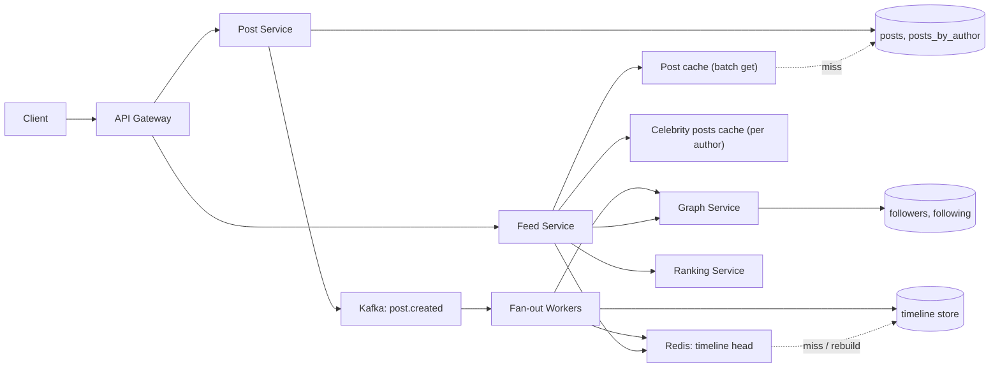

# 📰 Design a News Feed / Home Timeline

> **A follow-based social feed where reads outnumber writes 50:1, so we precompute timelines on write, except for celebrities, whose posts are merged at read time; the hard parts are fan-out skew, stable cursor pagination across a merge and a ranker, and keeping deletes and unfollows correct.** Follows the [framework](00_FRAMEWORK_AND_ESTIMATION.md).

## Table of Contents

1. [Requirements](#1-requirements)
2. [Estimation](#2-estimation)
3. [API](#3-api)
4. [Data Model](#4-data-model)
5. [High-Level Design](#5-high-level-design)
6. [Deep Dives](#6-deep-dives)
7. [Failure Modes and Scaling](#7-failure-modes-and-scaling)
8. [Observability, Rollout and Cost](#8-observability-rollout-and-cost)
9. [Alternatives and Trade-offs](#9-alternatives-and-trade-offs)
10. [Staff-Level Follow-up Questions](#10-staff-level-follow-up-questions)
11. [Common Mistakes](#11-common-mistakes)

---

## 1. Requirements

### Functional

| # | Requirement |
|---|---|
| F1 | Publish a post (text plus media references; media bytes live in object storage). |
| F2 | Follow and unfollow users (asymmetric graph). |
| F3 | **Home timeline**: posts from people I follow, newest first by default, paginated with a cursor. |
| F4 | Profile timeline: a user's own posts. |
| F5 | **Ranking hook**: the feed can be re-ranked by a model; chronological is the fallback. |
| F6 | Deleted posts, blocked users and unfollowed authors stop appearing. |

### Non-functional (numeric targets)

| Dimension | Target |
|---|---|
| Scale | 200 M DAU, 10 feed loads/user/day, 10% of DAU post, 2 posts each |
| Feed read latency | p99 < 300 ms end to end (20 items hydrated) |
| Feed availability | 99.95% (about 4.4 h/year); degrade to a stale or chronological feed rather than fail |
| Freshness | A post from a normal account appears in followers' feeds p99 < 10 s; celebrity posts visible at read time (no fan-out lag) |
| Post durability | An acknowledged post is never lost |
| Consistency | Eventual for timelines; **read-your-writes** for the author's own post; deletes effective at read time |
| Pagination | No duplicates or skipped items while paging, even as new posts arrive |

### Explicit non-goals

- Likes, comments, reposts and counts (separate services; only post hydration reads them).
- Media transcoding and CDN design, notifications, search, ads insertion, the ranking model itself (we design the hook).
- Spam and moderation pipelines beyond the delete and block semantics.

---

## 2. Estimation

Assumptions: above, plus mean 200 followers and 200 followees per user (heavy-tailed: a few accounts have tens of millions), 1 KB per post, 300 M users with a materialized timeline (active in 30 days), peak = 3x average.

| Quantity | Arithmetic | Result |
|---|---|---|
| Feed read QPS | 200 M × 10 / 86,400 | **23,148 ≈ 23k** avg, **~70k** peak |
| Post QPS | 200 M × 10% × 2 = 40 M / 86,400 | **463/s** avg, ~1.4k peak |
| Fan-out, pure push | 40 M × 200 = 8 B inserts/day / 86,400 | **92.6k/s** avg, ~280k peak |
| Fan-out, hybrid | assume 60% of push volume comes from authors above the threshold: 8 B × 0.4 = 3.2 B/day | 37k/s |
| Hybrid + skip inactive followers | assume 30% of remaining followers inactive: 3.2 B × 0.7 = 2.24 B/day | **25.9k/s** avg, ~78k peak |
| One celebrity post (50 M followers) at 100k inserts/s | 50 M / 100k | **500 s ≈ 8.3 min** to finish |
| Post hydration lookups | 70k feeds/s × 20 posts | **1.4 M lookups/s** peak |
| Timeline store | 300 M users × 800 entries × 16 B (post_id + score) | **3.84 TB**; ×3 replicas = **11.5 TB** |
| Redis timeline head | 200 M DAU × 100 entries × 16 B = 320 GB; ×2 overhead = 640 GB; + 1 replica = 1.28 TB | **~20 nodes of 64 GB** |
| Post storage | 40 M × 1 KB = 40 GB/day; × 365 × 5 = 73 TB; ×3 | **~220 TB** |
| Follow graph | 300 M × 200 = 60 B edges × 16 B = 960 GB; two directions = 1.92 TB; ×3 | **~5.8 TB** |
| Rank scoring (K = 100 candidates) | 23,148 feeds/s × 100 | **2.3 M scores/s** avg |
| Ranked-session cache | 23,148/s × 900 s TTL = 20.8 M sessions × 100 ids × 8 B | **~17 GB** |

### Decisions this implies

- Reads (23k feeds/s, but **1.4 M post lookups/s**) dominate; the timeline must be precomputed as IDs and the post cache is the hottest tier.
- Pure fan-out on write costs 8 B inserts/day and a single 50 M-follower post takes 8 minutes: **hybrid** it is. A pure pull design would be 200 followee lookups per read at 70k/s = 14 M lookups/s: too costly.
- Timelines store **IDs only** (16 B per entry); 3.84 TB is small. Only the head (100 entries for DAU) lives in RAM.
- Ranking at 2.3 M scores/s is a real compute bill: score only K = 100 candidates and cache the ranked session.
- The post store (220 TB) and graph (5.8 TB) are partitioned key-value data; the graph is small enough that the follower list of one user is the issue, not total size.

---

## 3. API

Auth: `Authorization: Bearer <token>`; the user id comes from the token, never the path, for write endpoints.

### 3.1 Publish (idempotent)

```http
POST /v1/posts
Idempotency-Key: 3e0f6a8c-91f1-4a56-8f6d-6a1b0f3d2c10
{ "text": "Shipped it.", "media": ["m_81f3"], "visibility": "public" }
```

```http
201 Created
{ "post_id": "1847362510923776001", "created_at": "2026-10-08T10:15:00.123Z" }
```

`post_id` is a time-ordered 64-bit id (timestamp, worker id, sequence), so ordering by id is ordering by time. The idempotency key (24 h) makes client retries return the same `post_id`. Deletion is `DELETE /v1/posts/{id}` (idempotent, soft delete with a tombstone).

### 3.2 Follow graph

```http
PUT    /v1/me/following/{user_id}     # idempotent: 204 whether or not already following
DELETE /v1/me/following/{user_id}     # idempotent
GET    /v1/users/{id}/followers?limit=100&cursor=...
```

`PUT` (not `POST`) because following twice must equal following once. Limits: 5,000 followees per account; rate-limit follow churn.

### 3.3 Home timeline

```http
GET /v1/feed/home?limit=20&cursor=eyJiIjoiMTg0NzM2...&mode=ranked
```

```json
{
  "items": [
    { "post_id": "1847362510923776001", "author": {"id": "u_42", "name": "Ana"},
      "text": "Shipped it.", "media": [], "created_at": "2026-10-08T10:15:00.123Z", "reason": "following" }
  ],
  "next_cursor": "eyJiIjoiMTg0NzM2MjUxMDkyMzc3NjAwMSIsInMiOiJzXzlmMiIsIm8iOjIwfQ",
  "stale": false
}
```

- The cursor is **opaque** and signed: it encodes a post-id upper bound `b` and, in ranked mode, `(session_id, offset)`. Clients never construct it. `limit` max 50.
- `stale: true` signals a degraded response (cache-only or chronological fallback).
- `GET /v1/feed/home?since_id=...` returns only newer posts for the "N new posts" pill (pull-to-refresh), not a count that would require a scan.

---

## 4. Data Model

Access patterns: (1) append a post id to many followers' timelines; (2) read the newest N of one user's timeline; (3) list a user's followers (to fan out) and followees (to find celebrities); (4) recent posts by one author; (5) batch fetch posts by id.

| Table | Partition key / sort key | Contents | Note |
|---|---|---|---|
| `posts` | `post_id` (hash) | author_id, body, media refs, visibility, created_at, deleted_at | Point and batch lookup; ids are time-ordered, so hash the partition, not range |
| `posts_by_author` | `author_id` / `post_id DESC` | pointer to post | Profile timeline; celebrity pull source |
| `following` | `follower_id` / `followee_id` | created_at | Who do I follow (read time) |
| `followers` | `(followee_id, bucket = hash(follower_id) % 64)` / `follower_id` | created_at | Fan-out source; **bucketing** splits a 50 M-row follower list into 64 partitions of ~0.8 M |
| `timeline` | `user_id` / `post_id DESC` | score (default = timestamp) | Trimmed to the latest 800; idempotent insert (same key twice is a no-op) |
| `user_flags` | `user_id` | follower_count, `is_celebrity` | Hysteresis: promote at 10,000 followers, demote below 5,000 |

**Why this store:** every pattern is keyed access or a range scan within one partition; there are no joins; write volume is high (26k timeline inserts/s average, ~78k peak) and the dataset is 220 TB. A wide-column or Dynamo-style store fits: partition by `user_id` for timelines gives a single-partition range read for a feed page. Redis holds the hot **head** (sorted set per user, trimmed to 100) and is rebuildable from the durable `timeline` table. A relational store would work for the graph at small scale, but follower-list scans for popular users and 60 B edges push to partitioned storage.

**Partition key choices:** timelines by `user_id` (even, reads are single-partition); followers bucketed to prevent a hot partition for celebrities; posts by hashed `post_id`, not by time, so today's writes do not hit one partition.

---

## 5. High-Level Design



**Write path (post):**

1. Gateway authenticates and rate-limits; the post service validates and checks the idempotency key.
2. Assign a time-ordered `post_id`; write `posts` and `posts_by_author` (durable, quorum). Return `201` here. The post is visible on the author's profile and, via read-your-writes merge, in their own feed.
3. Publish `post.created` (via a transactional outbox so a crash between the DB write and Kafka publish cannot lose the event), keyed by `author_id`.
4. Fan-out worker checks `is_celebrity`. If true: **stop** (the post is pulled at read time) and warm the author's recent-posts cache.
5. Otherwise page through the author's `followers` buckets (1,000 per page), drop followers inactive for 30 days, and for each batch write `timeline(user, post_id)` plus a Redis `ZADD` trimmed to 100. Writes are idempotent, so retries are safe.

**Read path (home feed):**

1. Feed service loads the caller's `following` set restricted to celebrities (about 10 author ids on average, cached per user and refreshed on follow/unfollow).
2. Read the newest `limit + margin` entries below the cursor bound from the Redis head (rebuild from the timeline store on a miss), and, in parallel, the newest posts below the bound for each followed celebrity from the per-author cache.
3. K-way merge by `post_id DESC` (plus the caller's own recent posts), take the top K = 100 candidates in ranked mode or `limit` in chronological mode.
4. Ranked mode: call the ranking service with a 50 ms budget; on timeout use chronological order. Cache the ordered list as a session.
5. Batch-get the page's posts from the post cache; drop tombstoned, blocked or no-longer-followed authors' posts; return items and the next cursor.

---

## 6. Deep Dives

### 6.1 Fan-out on write vs. read, and the celebrity problem

**Problem:** precomputing makes the read cheap but write cost scales with follower count; a 50 M-follower post is 50 M inserts (about 8.3 min at 100k/s) and starves the normal posters queued behind it. Pure pull makes every feed a 200-way scatter at 70k/s.

**Options**

| Option | Read cost | Write cost | Problem |
|---|---|---|---|
| A. Pure push | 1 key read | 8 B inserts/day | Celebrity storms, wasted work for inactive followers |
| B. Pure pull | 200 lookups + merge per feed (14 M/s at peak) | 1 write | Slow, expensive reads, tail latency |
| C. Hybrid: push for normal authors, pull for celebrities | 1 head read + ~10 author reads | 3.2 B/day, 2.24 B after skipping inactive | Two code paths, threshold tuning |

**Pick: C.** Threshold on follower count with hysteresis (promote at 10,000, demote below 5,000, avoiding flapping near the boundary). Skip fan-out to users inactive for 30 days; their timeline is rebuilt on return from `following` plus `posts_by_author` (a bounded pull of recent posts, then backfilled). Per-author "recent posts" lists for celebrities are tiny (say last 50 ids) and very hot, so they sit in the cache and the in-process tier.

Fan-out throughput control, which is what keeps one author from hurting everyone:

```python
# fan-out worker, one Kafka partition per author_id preserves per-author order
def handle(post):
    if flags.is_celebrity(post.author): return warm_author_cache(post)
    for page in followers.pages(post.author, size=1000):     # across 64 buckets
        active = [f for f in page if last_seen[f] > now() - 30 * DAY]
        timeline.batch_insert(active, post.id)                # idempotent upserts
        redis.pipeline_zadd_trim(active, post.id, keep=100)
        limiter.acquire(len(active), tier=author_tier(post.author))   # medium authors get a lower tier
```

Use at least two priority lanes: small authors (< 1,000 followers) always drain first; large (1,000 to 10,000) share a budget. The SLO is fan-out lag p99 < 10 s for the small lane.

**Cost:** two read paths to test; the merge adds ~10 reads (cached) per feed; fan-out backlog needs monitoring; when an author is promoted, pull works immediately and their older pushed entries simply stay in timelines, which is harmless.

**Change my mind if:** the follower distribution is far flatter than assumed (pure push is simpler); users follow hundreds of celebrities (the read merge becomes the bottleneck: lower the threshold or precompute a per-user "celebrity merge" cache with a 30 s TTL); or write cost dominates the bill (raise the inactivity filter).

### 6.2 Stable cursor pagination across the merge

**Problem:** the feed is the union of two live sources and keeps growing at the head. Offset pagination (`page=3`) duplicates or skips items whenever new posts arrive; each source also has a different next position.

**Options:** (a) offset; (b) per-source cursors in the token; (c) a single **global upper bound** on a totally ordered key.

**Pick (c).** Because `post_id` is time-ordered and unique, one number orders every source. The cursor is `b = last returned post_id`; every source is queried with `post_id < b`, newest first, and results are merged:

```python
def page(user, b, limit):
    own    = timeline.range(user, below=b, n=limit + 20)           # Redis head, else durable store
    celebs = [author_recent(a, below=b, n=limit) for a in celebrity_followees(user)]
    merged = heapq.merge(own, *celebs, key=lambda p: -p.id)
    items = [p for p in take(merged, limit * 2) if visible(user, p)]   # drop deleted/blocked
    items = items[:limit]
    return items, encode_cursor(b=items[-1].id) if items else None
```

Unconsumed items from any source are simply re-read next time because the bound, not a position, is the state. New posts have ids above `b`, so they never shift older pages. Over-fetch (`limit + 20`, then `limit × 2` after filtering) covers items removed by the visibility filter; if the filter drops too many, loop with the updated bound rather than return a short page.

**Ranked mode** adds a cached order: the first request pulls K = 100 candidates, ranks them, stores the ordered ids as a session (15 min TTL, ~17 GB total), and the cursor carries `(session_id, offset, b)` where `b` is the oldest candidate id. Pages 1 to 5 come from the session. When the session is exhausted, the next window is candidates below `b`, excluding ids already shown. If the session expired, fall back to a fresh window below `b`: the user may see a re-ranked order but never a duplicate, because the shown-set is bounded by `b`.

**Cost:** session cache memory and a signed cursor format to version; a ranked feed is not "refresh-stable" (a refresh reorders, by design, with `since_id` for the "new posts" pill).

**Change my mind if:** product requires ranking over an unbounded history (needs a precomputed ranked store, much heavier) or ids are not time-ordered (use `(created_at, post_id)` composite bound).

### 6.3 Timeline cache, rebuilds and correctness of deletes and unfollows

**Problem:** timelines are denormalized copies. A deleted post sits in up to 50 M copies; an unfollow leaves the author's posts in your timeline; a cold or evicted cache must be rebuilt without a stampede.

**Options**

| Concern | Eager fix | Lazy fix |
|---|---|---|
| Delete | Fan-out a delete to every timeline | Tombstone in `posts`; filter at hydration |
| Unfollow | Scan and remove the author's entries | Filter at read using the caller's following set |
| Cache miss | Rebuild synchronously | Serve stale or partial, rebuild async with single-flight |

**Pick lazy for correctness, eager for hygiene.** Deletes and blocks take effect at read time because hydration reads the post anyway (the tombstone check is free); timelines are cleaned by a background job and by the 800-entry trim. Unfollow filters at read via the caller's followee set (held in memory with the celebrity set, at most 5,000 ids) and an async job removes the entries. This keeps the write cost of a delete O(1) instead of O(followers).

Rebuild on a miss: single-flight per user; read the durable `timeline` first (a single-partition range read); if that is also empty (new or inactive user), construct from `following` × `posts_by_author` for the last 7 days, limited to, say, 200 followees' newest 20 posts, merge, write back. Concurrent requests wait on the in-flight rebuild or get the celebrity-only merge with `stale: true`.

**Cost:** read-time filtering can shrink pages (the over-fetch loop above); unfollowed posts may briefly linger in cached heads, but never reach the response.

**Change my mind if:** legal requirements demand eager propagation of deletes (add an eager tombstone broadcast for specific classes of content, accepting write amplification), or filter rates are high enough that over-fetch becomes costly.

---

## 7. Failure Modes and Scaling

| Failure | Impact | Mitigation |
|---|---|---|
| Redis timeline head lost (node or cluster) | Feed reads fall to the durable timeline store: 23k to 70k reads/s on a single-partition range | Replicas; store provisioned for ~2x; rebuild with single-flight; serve `stale: true` rather than error |
| Fan-out backlog (Kafka lag) | New posts reach followers late | Priority lanes; autoscale workers on lag; temporarily raise the celebrity threshold; feed still works because it reads existing timeline |
| Fan-out worker crash mid-post | Partial delivery | At-least-once consumption plus idempotent inserts; resume from offset |
| Ranker slow or down | Latency or no ranking | 50 ms budget, circuit breaker, chronological fallback; alert on timeout rate |
| Post cache or post store down | Cannot hydrate | Serve from cache; hot posts also in the in-process tier; partial pages with placeholders as last resort |
| Graph service down | Cannot compute celebrity followees on a cold cache | Cache followee sets per user (TTL 10 min); proceed with last-known set |
| Duplicate or reordered events | Duplicate timeline entries | Key is `(user_id, post_id)`: duplicates collapse |
| Bad ranker model deploy | Engagement drop | Feature-flagged, per-cohort rollout; instant switch to chronological |
| Celebrity delete or edit | Stale copies | Tombstone filter at read; per-author cache invalidated |

**Hot keys.** A celebrity's post is read by tens of millions of feeds: the per-author recent list and the post body live in an in-process cache (TTL of a few seconds) in front of Redis; replicate the key across shards (`author#0..7`) if one shard saturates. Celebrity follower-list partitions are bucketed. A celebrity feed itself (a user who follows many celebrities) is the slow-merge outlier: cap followed-celebrity count in the merge at 50 and cache the merged head for 30 s.

**Scaling.** Timelines shard by `user_id`; Redis scales by adding nodes; fan-out workers are stateless consumers scaled by partitions. Ranker scales by replicas and GPU/CPU budget.

**Multi-region.** Users have a home region for their timeline and reads. Posts and graph edges replicate across regions through a mirrored `post.created` topic; each region's fan-out workers write only local followers' timelines (cross-region traffic is posts, 40 GB/day, not 8 B timeline inserts). A user's own writes go to the home region (read-your-writes); a user traveling reads from the nearest region with home-region fallback for timeline heads. Failover: another region rebuilds timeline heads from the durable store and graph, with `stale: true` until warm.

---

## 8. Observability, Rollout and Cost

### SLIs and SLOs

| SLI | SLO |
|---|---|
| Feed success rate | 99.95% monthly |
| Feed latency | p50 < 80 ms, p99 < 300 ms |
| Fan-out lag (small-author lane) | p99 < 10 s |
| Hydration success (non-placeholder items) | 99.99% |
| Ranker timeout rate | < 1% |
| Duplicate-in-page rate | 0 (tracked via client-reported duplicates) |

### Alerts

- **Page:** feed p99 > 600 ms for 5 min; fan-out lag > 60 s on the small lane; Redis head hit ratio < 90%; success rate fast burn.
- **Ticket:** ranker timeout > 1%; post-cache hit ratio < 95%; backlog of unfollow cleanup; celebrity count growing faster than expected; merge latency p99.
- Dashboards: top authors by fan-out cost, inserts/s vs the 26k/s model, feed latency split into head read, merge, rank and hydration.

### Rollout

1. Ship **pure pull** first for a small user cohort (simple, correct, zero fan-out); measure real follower distribution.
2. Add push fan-out behind a flag for authors below the threshold; **dual-run** and diff pushed-vs-pulled feeds on shadow traffic to verify.
3. Roll out the celebrity threshold, then the inactivity filter.
4. Add the ranking hook in shadow mode (compute, log, do not serve), then 1% of users, with chronological as the instant rollback.
5. Backfill timelines for existing users from `following` × `posts_by_author` before flipping reads.

### Cost drivers

1. **Ranking compute:** 2.3 M scores/s average. Levers: K = 100 not 1,000, two-stage ranker, session caching, skip ranking for inactive sessions.
2. **Redis timeline heads:** ~1.28 TB RAM. Lever: head length of 100 (not 800), evict users inactive for 7 days.
3. **Fan-out writes:** 2.24 B inserts/day; levers are the celebrity threshold and the inactivity filter.
4. **Post storage (220 TB):** tier posts older than a year to cheaper storage; media separate.

---

## 9. Alternatives and Trade-offs

| Decision | Chosen | Alternative | Why / when to flip |
|---|---|---|---|
| Fan-out | Hybrid push/pull | Pure push or pure pull | Pure push cannot handle 50 M followers; pure pull is 14 M lookups/s; flip to pure push if no celebrities |
| Timeline content | Post ids only | Full denormalized posts | Ids are 16 B and edits/deletes stay O(1); full copies speed reads but multiply storage and staleness |
| Ordering key | Time-ordered 64-bit id | Created-at plus id; DB sequence | One number gives a global cursor; sequences do not scale across partitions |
| Pagination | Bound cursor + ranked session | Offset | Offset duplicates/skips under insertion |
| Delete handling | Tombstone + read filter | Eager propagation | O(1) write; eager only where legally required |
| Store | Wide-column / Dynamo-style + Redis head | Sharded SQL | Single-partition range reads and write volume; flip if scale is small |
| Ranking | Rank 100 candidates, session-cached | Rank full history / precomputed ranked timeline | Cost; precomputing is heavy and stale; flip if model needs global candidate generation |
| Multi-region | Home-region timelines, mirrored posts | Global timeline replication | Cross-region cost is posts, not inserts |

---

## 10. Staff-Level Follow-up Questions

**1. How do you pick the celebrity threshold?**
Compute it from cost, not folklore: write cost for an author is followers × posts per day, read cost of pull is the number of celebrities a typical reader follows. Plot fan-out inserts/s by follower-count bucket and choose the point that removes most volume (here 60% of it) while keeping typical readers at about 10 pulled authors. Use hysteresis (10,000 promote, 5,000 demote) and revisit as the distribution changes. I would run the threshold as a config and measure feed merge latency against fan-out cost.

**2. A user follows 3,000 accounts. What breaks?**
The timeline is fine (it is push), but the celebrity set can balloon and the merge latency grows. Cap the number of pulled celebrity authors in one merge (for example 50, taken by recency of activity), cache the merged head for 30 s, and for the rest rely on the ranker's candidate generation. Also cap followees at 5,000 and treat heavy followers as a separate, slower tier in SLOs.

**3. How do you guarantee a user sees their own post immediately?**
The author's feed read always merges `posts_by_author` for the last few minutes (read-your-writes), independent of fan-out. The post is durable before `201` is returned. This avoids waiting on fan-out lag and costs one cached read.

**4. How does ranking fit without ruining pagination?**
Candidate generation stays chronological with a bounded window; ranking reorders only that window and the order is stored as a short-lived session. The cursor carries the bound and offset, so the shown set is always a subset of ids at or above the bound, which prevents duplicates when the session expires. If the ranker is slow we serve chronological, so ranking is an optimization with a bounded latency budget, never a dependency.

**5. What happens when a celebrity with 50 M followers deletes a post?**
A tombstone is written to `posts` and the per-author cache is invalidated; every feed that hydrates that post drops it, so propagation is bounded by cache TTLs (a few seconds) without touching 50 M timelines. Timeline copies (for any non-celebrity author) are cleaned asynchronously. For legally required takedowns we also push an eager invalidation to caches.

**6. How would you handle a viral event where everyone refreshes at once (10x reads)?**
The head read and hydration are cache-heavy and scale horizontally; the risky parts are the post-cache hot keys and Redis shards owning viral authors. Hot posts go to the in-process tier, and we serve slightly stale feeds (5 to 10 s) with coalescing. Shed load by disabling ranking first (cheapest compute to remove), then reduce page size, then serve a cached head. I would pre-agree this degradation ladder and test it in a game day.

**7. How do you migrate a user from pull to push (new users or reactivation)?**
On return, the feed service builds a head with a bounded pull (last 7 days, capped followees), writes it back to the timeline store and Redis, and flags the user active so future posts fan out. Until then new posts come from the pull path; this is the same path as the cold-cache rebuild, so it needs no special migration code. Dedupe is automatic through the `(user_id, post_id)` key.

**8. Why not store full posts in the timeline?**
Edits, deletes and counters would have to update millions of copies, and storage would multiply by ~64 (1 KB vs 16 B per entry). IDs make timelines cheap and let hydration enforce visibility. The cost is the hydration fan-in (1.4 M lookups/s at peak), which is a cache problem we solve with a batch-get cache tier, and that is a better problem to have.

**9. How do you know the design is working?**
Product-level: feed latency and freshness SLOs hold, and duplicate rate is zero. System-level: the measured fan-out inserts/s matches the 26k/s model, the Redis head hit ratio is above 90%, and the share of requests needing a rebuild is small. If the measured follower distribution differs from the assumption (for example 80% of volume from celebrities instead of 60%), the hybrid payoff changes, so that is the first number I would check after launch.

---

## 11. Common Mistakes

| Mistake | Better |
|---|---|
| Pure fan-out on write, ignoring celebrities | Hybrid with a threshold, hysteresis and a priority lane |
| Pure fan-out on read at scale | Quantify: 14 M lookups/s; precompute for normal authors |
| Offset pagination | Time-ordered id as a global bound; opaque cursor |
| Storing full posts in timelines | IDs only; hydrate from a batch cache |
| Eager delete propagation to millions of timelines | Tombstone and filter at read time |
| Ranker in the critical path with no fallback | Time budget, circuit breaker, chronological fallback |
| Fan-out to inactive users | Skip users inactive for 30 days; rebuild on return |
| Ignoring the hydration load (1.4 M lookups/s) | Treat the post cache as the hottest tier |
| One unbounded follower partition | Bucket the follower table by `hash(follower_id)` |
| No read-your-writes for the author | Merge the author's recent posts at read time |

---

**Back to:** [Framework and Estimation](00_FRAMEWORK_AND_ESTIMATION.md) · [URL Shortener](01_URL_SHORTENER.md) · **Next:** [Chat](03_CHAT_MESSAGING.md)
