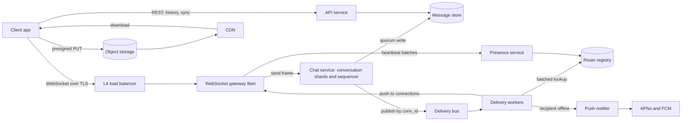

# 💬 Design a Chat and Messaging System (WhatsApp / Slack Style)

> **1:1 and group messaging for 500 M DAU with ~100 M concurrent WebSocket connections.** The hard parts are the connection tier, per-conversation ordering with at-least-once delivery, and multi-device sync. Follows the [45-minute framework](00_FRAMEWORK_AND_ESTIMATION.md); the estimation reuses its chat worked example.

---

## Table of Contents

1. [Requirements](#1-requirements)
2. [Estimation](#2-estimation)
3. [API](#3-api)
4. [Data Model](#4-data-model)
5. [High-Level Design](#5-high-level-design)
6. [Deep Dives](#6-deep-dives)
7. [Failure Modes and Scaling](#7-failure-modes-and-scaling)
8. [Observability, Rollout and Cost](#8-observability-rollout-and-cost)
9. [Alternatives and Trade-offs](#9-alternatives-and-trade-offs)
10. [Staff-Level Follow-up Questions](#10-staff-level-follow-up-questions)
11. [Common Mistakes](#11-common-mistakes)

---

## 1. Requirements

**Functional**

- Send and receive text messages in **1:1** and **group** conversations (groups up to 1,000 members).
- **Delivery receipts:** sent (server accepted), delivered (a device has it), read (cumulative).
- **Offline delivery:** messages for offline users are stored and delivered on reconnect; a push notification wakes the device.
- **Multi-device:** up to 5 devices per user, all converge to the same history and read state.
- **History:** scroll back through a conversation (cursor pagination); new devices can sync recent history.
- **Presence and typing indicators** (best effort).
- **Media** (images, video, files) sent as references to objects in object storage.

**Non-functional (numeric targets)**

| Property | Target |
|---|---|
| Send-to-delivery latency, recipient online, same region | p50 < 100 ms, p99 < 500 ms |
| Send path availability | 99.99% (~52 min/year) |
| Durability | A message acked to the sender is never lost (quorum-replicated before the ack) |
| Ordering | Total order **per conversation**; no global order |
| Delivery semantics | At-least-once to devices; client dedupes, so effectively-once display |
| Scale | 500 M DAU, 100 M concurrent connections, ~700k msgs/s peak |

**Explicit non-goals:** voice/video calls, full-text message search, bots/integrations platform, spam and content moderation pipelines, broadcast channels with 100k+ members (a different fan-out design), ads, billing.

---

## 2. Estimation

Assumptions: 500 M DAU, 40 messages/user/day, 100 B text payload, 20% of DAU online at peak, ~2.5 delivery targets per message (70% 1:1 with 1 recipient, 30% group with ~6 recipients: 0.7 × 1 + 0.3 × 6 = 2.5), 3x peak/average.

| Quantity | Arithmetic | Result |
|---|---|---|
| Messages/day | 500 M × 40 | **20 B** |
| Send rate | 20 B / 86,400 | ~**230k/s** avg, ~**700k/s** peak |
| Deliveries | 230k × 2.5 (peak 700k × 2.5) | ~575k/s avg, ~**1.75M/s** peak |
| Concurrent connections | 500 M × 20% | **100 M** |
| Gateway hosts | 100 M / 100k per host = 1,000 at saturation; run at 50% | **~2,000 hosts** |
| Heartbeats | 100 M / 30 s | ~3.3M frames/s fleet-wide (~3.3k/s per host) |
| Route churn | 100 M / ~3,600 s average session | ~28k connects/s + ~28k disconnects/s |
| Message store | 20 B × 100 B = 2 TB/day payload; ×2 for keys/metadata = 4 TB/day; ×3 replication | **12 TB/day**, ~**4.4 PB/year** |
| Media | 5% of messages × avg 200 KB = 1 B × 200 KB | **200 TB/day**, ~73 PB/year |
| Media bandwidth | 200 TB / 86,400 | ~2.3 GB/s (~18.5 Gbps) upload avg; download ~2.5x that |

**AZ loss check:** with 3 AZs and hosts at 50k connections (50% utilization), losing one AZ moves load to 50k × 1.5 = 75k per surviving host, still under the 100k cap. That is why the fleet runs at 50%.

**Decisions this implies**

- The **connection tier** is its own fleet (~2,000 hosts), separated from business logic; it is stateful per connection, stateless otherwise.
- **Media is 100x the text volume** (200 TB vs 2 TB/day): it never touches the chat path. Upload direct to object storage, send only a reference.
- Text storage at 4.4 PB/year needs a **horizontally partitioned store keyed by conversation**.
- ~1.75M deliveries/s peak means route lookups must be a sharded in-memory registry, batched per gateway.
- Receipts and presence can exceed message traffic, so they are **cursors and lazy subscriptions**. Push (~30% of deliveries, ~170k/s avg, ~500k/s peak) is the other fan-out to budget.

---

## 3. API

**Auth:** short-lived access token (JWT) in the `Authorization` header on connect and on REST; device registered with a `device_id`. The WebSocket carries typed JSON frames (production would likely use a binary encoding such as protobuf; JSON shown for readability).

### WebSocket: `GET wss://chat.example.com/v1/ws?device_id=d1&cursor=eyJ...`

Client to server:

```json
{ "t": "send", "client_msg_id": "01J9Z...", "conv_id": "c_42", "type": "text",
  "body": "lunch?", "reply_to_seq": null }
```

Server to client (ack, sent only after the quorum write; `client_msg_id` makes retries idempotent):

```json
{ "t": "ack", "client_msg_id": "01J9Z...", "msg_id": "m_8f2", "conv_id": "c_42",
  "seq": 10231, "ts": 1760000000123 }
```

Server to client (delivery):

```json
{ "t": "msg", "conv_id": "c_42", "seq": 10231, "msg_id": "m_8f2", "sender": "u_7",
  "type": "text", "body": "lunch?", "ts": 1760000000123 }
```

Receipts are **cumulative cursors**, not per-message events:

```json
{ "t": "receipt", "conv_id": "c_42", "kind": "read", "up_to_seq": 10231 }
```

Other frames: `typing` (ephemeral, never stored), `presence_sub` / `presence` (subscribe to visible contacts only), `ping`/`pong`, and `reconnect` (server asks the client to reconnect after a jittered delay, used for draining).

### REST

| Endpoint | Purpose | Notes |
|---|---|---|
| `POST /v1/conversations` | Create group | `Idempotency-Key` header; body has `member_ids`, `name` |
| `POST /v1/conversations/{id}/members` | Add/remove members | Writes a membership event into the conversation log |
| `GET /v1/conversations/{id}/messages?before_seq=10231&limit=50` | History | **Cursor = seq**, not offset; returns `next_before_seq` |
| `GET /v1/sync?cursor=<opaque>&limit=200` | Device catch-up | Returns changed conversations since the device cursor (Deep Dive 3) |
| `POST /v1/media/uploads` | Get presigned upload URL | Returns `upload_url`, `media_id`; client PUTs bytes direct to object storage |
| `POST /v1/devices/push-token` | Register APNs/FCM token | Upsert by `(user_id, device_id)` |


---

## 4. Data Model

**Access patterns drive the schema:** (1) append a message to a conversation and read the latest N; (2) range read by seq; (3) list a user's conversations ordered by recent activity; (4) get members of a conversation; (5) find which gateway holds a user's connections; (6) get a user's per-conversation read cursor.

**Store: wide-column, partitioned by conversation (Cassandra/ScyllaDB or DynamoDB style).** Known access patterns, huge write volume, no cross-conversation transactions, tunable quorum writes. A relational DB fits the *membership* data at small scale but not 700k writes/s of messages.

```text
messages            PK ((conv_id, bucket), seq DESC)       bucket = floor(seq / 10000)
  cols: msg_id, sender_id, client_msg_id, type, body, media_ref, created_at, edited_at, deleted

dedupe              PK (conv_id, sender_id, client_msg_id) -> seq        TTL 7 days

conv_members        PK (conv_id, user_id) -> role, joined_seq, left_seq
user_convs          PK (user_id, conv_id) -> last_seq, last_ts, last_read_seq, last_delivered_seq
                    (inbox: unread = last_seq - last_read_seq; sorted by last_ts via a secondary view)
user_events         PK (user_id, user_seq) -> event (membership, settings, read-state changes)
devices             PK (user_id, device_id) -> platform, push_token, last_seen, sync_cursor

route (Redis)       key route:{user_id}  hash device_id -> "gw17:conn9921"   TTL 90 s, refreshed by heartbeats
presence (Redis)    key pres:{user_id}   -> last_seen_ts                    TTL 60 s
```

**Why these choices**

- **Partition key `(conv_id, bucket)`:** all messages of a conversation are co-located and ordered by `seq`. The `bucket` caps a partition at 10,000 messages (~2 MB at ~200 B per row) so a busy group cannot create an unbounded partition. Bucket is derived from `seq`, so no lookup is needed.
- **`seq` is a per-conversation gapless integer** assigned by the conversation's sequencer (Deep Dive 2). It is the cursor for history, sync and receipts.
- **Message stored once per conversation, not once per recipient.** Group fan-out is a delivery concern, not a storage multiplier. Per-recipient state is only a cursor row in `user_convs`.
- **Receipts as two integers** (`last_delivered_seq`, `last_read_seq`) per user per conversation, instead of one row per message per recipient. For a 1,000-member group this is 1,000 cursor rows, not 1,000 rows per message.
- **Route registry in Redis** with TTL: routes are soft state; losing it only costs latency (fallback is push + sync).

---

## 5. High-Level Design



**Write path (send a message)**

1. Client sends a `send` frame with a `client_msg_id` over its WebSocket; the gateway authenticates (connection already authed), rate-limits per user, and forwards to the chat service shard that owns `conv_id`.
2. The shard checks `dedupe` for `(conv_id, sender, client_msg_id)`; if present, it re-acks the existing `seq` (idempotent retry).
3. The shard assigns `seq = last_seq + 1` (single writer per conversation), writes the message and dedupe row at **quorum**, then returns the `ack` to the sender's gateway. Only now is the message "sent".
4. The shard publishes a delivery task to the bus (partitioned by `conv_id` to preserve order), and updates `user_convs.last_seq` for members asynchronously.
5. Delivery workers look up member routes in the registry (one batched `MGET` per registry shard), group the targets by gateway, and send **one RPC per gateway** with the list of local connection ids.
6. Gateways write the frame to each connection. Devices reply with a `delivered` receipt (batched, cursor form), which updates `last_delivered_seq` and notifies the sender's connections.
7. For members with no route or a dead route, the worker enqueues a push (APNs/FCM) carrying only a wake-up hint, not the plaintext body when E2E is on.

**Read path**

1. **Online:** the message arrives via step 6 above; no read from the store.
2. **Reconnect/offline:** the device connects with its `cursor`; the API calls `user_convs` for conversations whose `last_seq` exceeds the device's per-conversation seq, then fetches the gap with `messages` range reads (`seq > device_seq`).
3. **History scroll:** `GET /messages?before_seq=` reads the `(conv_id, bucket)` partition(s) backwards.

---

## 6. Deep Dives

### Deep Dive 1: The gateway tier, routing and presence at 100 M connections

**Problem.** 100 M long-lived connections must be held cheaply, found quickly when a message arrives, and survive deploys and AZ loss without a reconnect storm that takes down the backend.

**Options for routing a message to the right connection**

| Option | How | Cost |
|---|---|---|
| A. Deterministic: hash `user_id` to a home gateway; clients must connect there | No registry; sender's service computes the target | Resize reshuffles users; one user's devices and hot users pin one host; LB must be hash-aware |
| B. Any gateway + **route registry** (Redis, TTL) | Gateway registers `user -> gw:conn` on connect; workers look it up | Extra lookup per delivery (~1.75M/s peak); registry must be sharded; entries can be stale |
| C. Per-user pub/sub topics; each gateway subscribes for its users | Broker routes | 100 M topics and subscription churn (~56k/s) is hard on any broker |

**Pick: B.** Messages are durable before delivery, so a stale or missing route only affects latency (fall back to push + sync on reconnect), never correctness. The registry is ~6.4 GB, so the issue is op rate: 1.75M lookups/s peak across a sharded Redis cluster, batched per shard, is routine (the framework puts a Redis node at up to ~1M ops/s with pipelining; I'd run many shards for headroom and failure isolation).

**Cost.** An extra hop and a soft-state dependency; registry loss triggers a burst of pushes and reconnect syncs. **Change my mind if** the registry shows tail-latency issues at peak; then option A with a gateway "home pool" per user group reduces lookups.

**Deploys and reconnect storms.** Never drop connections abruptly:

```text
drain(gateway):
  stop accepting new connections                # LB health check -> draining
  for each batch of 1% of conns every N seconds:
      send {"t":"reconnect","after_ms": random(0, 60000)}   # jittered
  hard-close remaining after deadline
client: on reconnect, exponential backoff with full jitter; cap at ~60 s
```

Arithmetic for an AZ loss: 33 M connections reconnecting spread over 5 min = 33 M / 300 s = **110k connects/s**, i.e. ~83/s per surviving host (1,333 hosts). Accepting connections is cheap; the real cost is the **sync read** each reconnect triggers (110k inbox reads/s). Mitigate with a cheap "nothing changed" check (compare device cursor to `user_events` head) before reading the inbox, and server-side admission control returning `retry_after`.

**Presence.** Naive push of every status change: 500 M users × 10 transitions/day × ~40 online contacts (200 contacts × 20% online) = 200 B notifications/day = **2.3M/s**, 10x the message rate for a nice-to-have. Instead:

- Gateways batch heartbeats and update `presence` TTL keys every ~30 s per user (not per frame).
- Clients **subscribe only to contacts currently visible** on screen (`presence_sub`), and the presence service pushes changes only to subscribers.
- "Last seen" is read lazily when a chat is opened. Online status degrades silently under load (first thing to shed).

### Deep Dive 2: Ordering, idempotency and delivery guarantees

**Problem.** Two people send at the same instant; a phone retries after a timeout; a device reconnects mid-stream. Everyone must see the same order, no duplicates, no gaps.

**Options**

| Option | Mechanism | Problem |
|---|---|---|
| A. Client timestamps | Sort by sender clock | Clock skew; users can forge order |
| B. Lamport/vector clocks | Causal order | Large metadata for groups; no total order for UI/read cursors |
| C. **Server-assigned per-conversation `seq`** by a single writer | Gapless integer per conversation | Needs single-writer ownership and failover handling |

**Pick: C.** Conversations are partitioned onto chat-service shards by consistent hashing; the owner holds a lease with an **epoch (fencing token)**. Every write includes the epoch so a stale owner is rejected by the store.

```text
on send(conv, sender, client_msg_id, body):
  if row := dedupe.get(conv, sender, client_msg_id): return ack(row.seq)       # idempotent retry
  seq := local_last_seq[conv] + 1
  insert messages (conv, bucket(seq), seq, ...) IF NOT EXISTS, epoch = my_epoch   # fenced; detects split-brain
  dedupe.put(conv, sender, client_msg_id, seq)
  local_last_seq[conv] = seq
  return ack(seq)                       # only after quorum write

on takeover(conv):                       # new owner after failure
  local_last_seq[conv] = max seq in latest bucket (quorum read)
```

`IF NOT EXISTS` costs extra round trips in Cassandra-like stores; if benchmarks show a plain quorum write guarded by the lease epoch leaves an acceptable split-brain window, use that instead.

**Delivery guarantees**

- **Sender to server:** retry with the same `client_msg_id` until acked; dedupe makes it idempotent.
- **Server to device:** at-least-once. The device persists `(conv_id, seq)` and dedupes. If it sees `seq` jump (10231 then 10234), it fetches the gap with a range read, which makes **lost fan-out harmless**: the store is the source of truth, the bus is an optimization.
- **Receipts:** a cumulative `up_to_seq` per user per conversation; idempotent and monotonic (`max()` merge), so reordering is safe. Delivered receipts are coalesced to ~1 per conversation per second.

**Cost.** Per-conversation throughput is capped by one writer (a very active group of 1,000 at ~50 msgs/s is far below what a shard sustains, ~10k+/s), and failover causes a brief per-conversation write pause while a new owner is elected. **Change my mind if** conversations exceed single-writer throughput (broadcast channels): then shard the log by sub-stream and give up strict total order, or use a log-per-channel system.

### Deep Dive 3: Multi-device sync, group fan-out and E2E encryption

**Problem.** A user has up to 5 devices that go offline independently. Each needs exactly the missing messages and consistent read state, and groups of up to 1,000 must not multiply storage or write cost. E2E encryption changes who can do what.

**Sync options**

| Option | How | Cost |
|---|---|---|
| A. Per-user mailbox: copy each message into every recipient's inbox | One cursor per user | Write amplification = recipients (1,000x for a big group); storage 2.5x average |
| B. **Per-conversation log + per-device cursors** | Device stores `seq` per conversation; `user_convs` says which conversations moved | Sync needs two reads (inbox, then ranges); no amplification |
| C. Hybrid: B for messages plus a small per-user `user_events` log for membership/read/settings | Single cursor for the low-volume events | Two cursors to manage |

**Pick: C.** Messages are stored once. A device sync: (1) read `user_events` after `device.event_cursor`; (2) read `user_convs` entries with `last_seq > device_seq[conv]` (ordered by `last_ts`, capped at 200 per page, with an opaque cursor); (3) fetch each conversation's gap, newest first, lazily for old chats. Read state is `max()`-merged across devices, so a read on the phone clears the badge on the laptop.

**Group fan-out.** The worker groups members by gateway, so a 1,000-member group touches only the gateways that actually host online members (typically far fewer than 1,000 hosts). Members without routes get push, **collapsed per conversation** (a "12 new messages" push, not 12 pushes) to cut the ~170k/s push average.

**E2E encryption at trade-off level.** Assume a Signal-style design: the server routes opaque ciphertext plus a plaintext envelope (`conv_id`, sender, `seq`, size, timestamp). Ordering, dedupe, receipts, offline queueing and push all keep working on the envelope.

| Aspect | Effect of E2E |
|---|---|
| Server-side search, spam/abuse classification, link previews | Lost server-side; need client-side search/indexing and user-report-based moderation |
| Multi-device | Sender encrypts per **device** (key bundles per device) or uses a group sender-key scheme; fan-out cost grows with devices, not just users |
| New device history | Server cannot hand over plaintext; needs device-to-device transfer or user-keyed encrypted backup |
| Group membership change | Key rotation on add/remove; heavier for large groups, and removed members must not get future keys |

**Pick for the interview:** design the server for an opaque payload from day one (cheap), and decide E2E as a product requirement with the cost above. **Change my mind if** compliance requires server-side retention/search (enterprise Slack-style): then transport encryption plus server-side storage, with per-tenant keys.

---

## 7. Failure Modes and Scaling

| Failure | Impact | Mitigation |
|---|---|---|
| Gateway host dies | ~50k-100k users disconnect | Clients reconnect with jittered backoff to another host; route entries expire in 90 s; messages are in the store so catch-up on reconnect |
| AZ lost | ~33 M reconnects | 50% headroom (75k/host after loss), jittered backoff, admission control with `retry_after`, "no-change" sync fast path |
| Route registry shard down | Deliveries to those users fall back to push/sync | Replica promotion; treat missing route as offline; messages not lost |
| Stale route (user moved) | Delivery RPC to a gateway that no longer has the connection | Gateway returns "not here"; worker deletes route and falls back to push |
| Chat service shard owner dies | Writes to its conversations pause during lease expiry (seconds) | Short leases, fencing epoch, new owner reads max `seq`; sender retries with the same `client_msg_id` |
| Push provider (APNs/FCM) throttling | Delayed notifications for offline users | Collapse keys, backoff, queue with TTL; app syncs when opened |

**Hot keys**

- **Hot conversation (big active group):** single-writer shard is fine to ~10k msgs/s; protect with per-conversation rate limits. Broadcast-scale channels are a non-goal and need a different (fan-out-on-read) design.

**Multi-region.** Give each conversation a **home region** (where it was created or where most members live). The sequencer and primary write live there; messages replicate asynchronously to other regions for local reads; users connect to the nearest gateways. Cost: a sender far from the home region pays the cross-region RTT on send (US-Europe ~80-100 ms, US-Asia ~150-250 ms per the framework table), which still fits the 500 ms p99 budget. Alternative: multi-leader with hybrid logical clocks, which removes the RTT but gives up gapless `seq` and complicates receipts. Re-home a conversation when most active members move; keep a region-failover runbook (promote replica, bump epoch).

---

## 8. Observability, Rollout and Cost

**SLIs and SLOs**

| SLI | SLO |
|---|---|
| Send-to-ack latency (server) | p99 < 300 ms |
| Send-to-delivery latency, online recipient | p50 < 100 ms, p99 < 500 ms |
| Send success rate | 99.99% (excluding client errors) |
| Message loss | 0; audited with per-conversation `seq` gap detection |
| Connection success rate | 99.9% within 3 attempts |
| Push delivery lag (offline) | p95 < 10 s |

**Alerts (what pages someone)**

- Connected users drop > 5% in 1 min; ack p99 > 500 ms for 5 min or send errors > 0.1%.
- **Any seq gap** found by the audit job (possible data loss); bus lag > 30 s; registry p99 > 20 ms.
- Push provider error spike; reconnect rate > 3x baseline.

**Rollout and migration**

- Protocol is versioned with capability negotiation in the connect handshake; the server supports N-1 clients indefinitely (mobile apps update slowly).
- Deploy gateways with draining (Deep Dive 1), canary 1% then 10% then 50%, watching reconnect rate and ack latency.
- Message store migration (e.g. new partitioning): dual write, backfill by conversation, verify with checksum per bucket, shadow read, cut over per cohort, clean up.

**Top cost drivers**

1. **Media storage and egress:** ~73 PB/year of new objects; mitigate with tiering, dedupe by content hash, transcoding to lower bitrates, TTL on forwarded/unviewed media.
2. **Message store:** 4.4 PB/year at RF=3; cold-tier after 1 year and compress.
3. **Gateway fleet:** ~2,000 hosts; connection density per host (memory per connection, TLS offload) is the lever.

---

## 9. Alternatives and Trade-offs

| Decision | Chosen | Alternative | Why / when to switch |
|---|---|---|---|
| Message store | Wide-column partitioned by conversation | Postgres sharded by conversation, Kafka as store | Wide-column handles write volume and range reads; Postgres fits smaller scale with transactions; Kafka is poor at random history reads and per-conversation topics do not scale |
| Routing | Route registry | Hash-based home gateway, per-user topics | Registry tolerates resize and multi-device; hash routing removes the lookup |
| Media | Presigned direct upload + CDN | Proxy through chat service | Media is 100x the bytes; proxying wastes the connection tier |
| Multi-region | Conversation home region | Multi-leader with HLC | Home region keeps gapless order; multi-leader removes cross-region send RTT |

---

## 10. Staff-Level Follow-up Questions

**1. How do you guarantee an acked message is never lost?**
The ack is sent only after a quorum write (2 of 3 replicas across AZs) of the message and its dedupe row. Everything after that (bus, route lookup, push) is a best-effort optimization because devices can always catch up from the store using `seq` cursors. A background audit scans for gaps in each conversation's `seq` and pages on any gap. Residual risk is correlated loss of 2 replicas before repair, mitigated with cross-AZ placement and backups.

**2. Why not use Kafka as the message store, with a topic per conversation?**
Millions of conversations cannot each be a topic; partitions are expensive and the metadata scales poorly. Kafka also does not serve "give me the 50 messages before seq N" efficiently, which history scroll needs. It is fine as the **delivery bus** (partitioned by `conv_id` hash) where order within a partition matters and replay is useful, with the wide-column store as the source of truth.

**3. How do you deploy the gateway fleet without a reconnect storm?**
Drain in small batches, instruct clients to reconnect after a random jitter, and roll through the fleet at a rate the backend can absorb (e.g. 1% of connections per minute). Cap the sync work per reconnect with the "no change" fast path, and keep admission control that returns `retry_after`. Size for it: at 100 M connections, a full-fleet restart at 1%/min takes ~100 minutes and ~1 M reconnects/min (~17k/s), well within accept capacity.

**4. How would you support a 1 M member channel?**
Per-member fan-out on write breaks (1 M deliveries per message). Switch to fan-out on read: members pull the channel log by `seq` and get a lightweight "new activity" signal through a batched or sampled notification channel. Receipts go away (aggregate counts only). This is a separate product tier, which is why I scoped it as a non-goal.

**5. How does a user switching to a new phone get history under E2E?**
The server cannot decrypt, so history must come from an old device transfer (QR-initiated, encrypted channel) or an encrypted backup the user holds the key to. Without either, only messages sent after registration are readable. That is a product trade-off (convenience vs. a server that cannot read content) and should be stated explicitly.

**6. Exactly-once delivery: possible?**
Not over an unreliable channel; the achievable property is at-least-once plus idempotent processing. The `client_msg_id` dedupes sends and `(conv_id, seq)` dedupes receives, which together give effectively-once display. Anything claiming exactly-once is hiding a dedupe key somewhere.

**7. How do you prevent notification spam when a user is active on a device?**
Delivery workers check the route registry: if any device of the user has a live connection and is foregrounded (reported in presence), skip push to the others or delay it by a few seconds and cancel on read receipt. Collapse keys merge multiple pushes per conversation. This cuts push volume and cost materially, since it is third-party-priced.


---

## 11. Common Mistakes

| Mistake | Why it hurts | Fix |
|---|---|---|
| Putting media bytes through the chat servers | 200 TB/day overwhelms the connection tier | Presigned upload to object storage; send references |
| Ordering by client or server timestamp | Skew and ties produce different orders per device | Per-conversation server `seq` |
| Per-recipient message copies for groups | N-fold write and storage amplification | Store once, per-user cursors |
| Ignoring reconnect storms | Backend collapses after a deploy/AZ loss | Jittered backoff, draining, headroom, admission control |
