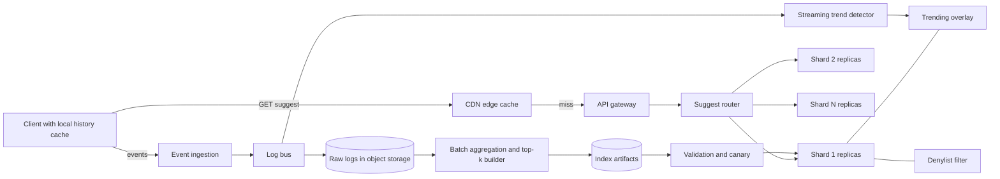

# ⌨️ Design Typeahead / Search Autocomplete Suggestions

> **Return the top 10 completions for a prefix in under 100 ms p99, for ~350k requests/s at peak.** The index is small enough to fit in memory, so the interesting problems are the offline top-k pipeline, freshness for trending queries, and keeping the latency budget with caches and shards. Follows the [45-minute framework](00_FRAMEWORK_AND_ESTIMATION.md).

---

## Table of Contents

1. [Requirements](#1-requirements)
2. [Estimation](#2-estimation)
3. [API](#3-api)
4. [Data Model](#4-data-model)
5. [High-Level Design](#5-high-level-design)
6. [Deep Dives](#6-deep-dives)
7. [Failure Modes and Scaling](#7-failure-modes-and-scaling)
8. [Observability, Rollout and Cost](#8-observability-rollout-and-cost)
9. [Alternatives and Trade-offs](#9-alternatives-and-trade-offs)
10. [Staff-Level Follow-up Questions](#10-staff-level-follow-up-questions)
11. [Common Mistakes](#11-common-mistakes)

---

## 1. Requirements

**Functional**

- Given a prefix (and locale), return up to **10 ranked query suggestions**, updated on every keystroke (after client debounce).
- Ranking is by popularity (decayed query frequency), with **trending queries** surfaced quickly.
- A **personalization hook**: a user's own recent queries can boost or add suggestions.
- **Abuse and offensive-content filtering**: blocked terms never appear, and removals take effect quickly.
- Multi-locale (language-specific indexes).

**Non-functional**

| Property | Target |
|---|---|
| Latency | **p99 < 100 ms** end to end (client request to response); origin compute p99 < 10 ms |
| Availability | 99.99%; the search box must never block on suggestions (fail open to "no suggestions") |
| Freshness | Base index <= 24 h old; trending queries visible within ~10 min |
| Consistency | Eventual; two users may briefly see different lists |
| Scale | 500 M DAU, ~350k req/s peak at the edge |
| Quality | Suggestion acceptance rate is the product metric (tracked, not a hard SLO) |

**Explicit non-goals:** spelling correction and fuzzy matching (hook only), mid-string/word-boundary matching, semantic or entity suggestions, the search results page itself, per-user model training, ads in suggestions.

---

## 2. Estimation

Assumptions: 500 M DAU; 5 searches/user/day; client debounce yields ~4 suggestion requests per search; peak = 3x average; average query 25 B, ~20 characters; 100 B per log event.

| Quantity | Arithmetic | Result |
|---|---|---|
| Searches/day | 500 M × 5 | **2.5 B** |
| Suggest requests/day | 2.5 B × 4 | **10 B** |
| Average QPS | 10 B / 86,400 | ~**116k/s** (~120k) |
| Peak QPS | 120k × 3 | ~**350k/s** |
| Edge/client cache hit | assume 60% overall (see below) | origin peak 350k × 0.4 = **~140k/s** |
| Response size | 10 suggestions × ~30 B + headers | ~1 KB |
| Edge bandwidth, peak | 350k × 1 KB | ~350 MB/s = **~2.8 Gbps** |
| Query log volume | 2.5 B events × 100 B | **250 GB/day** (~29k events/s avg); 30 days raw ≈ 7.5 TB |
| Distinct queries (90 d) | assumed ~1 B; ~80% seen < 3 times | ~**200 M servable** queries |
| Query dictionary | 200 M × (25 B text + 4 B score) | ~**6 GB** |
| Distinct prefixes | assumed ~3 × 200 M | ~**600 M** |
| Prefix table | 600 M × ~100 B (20 B key + 10 × 4 B query ids + ~40 B structure overhead) | ~**60 GB**; ~66 GB with dictionary |
| Replicated | 66 GB × 3 | ~200 GB; sharded 8 ways ≈ **8 GB per node** |
| Origin nodes | 140k / 10k per node = 14; +50% headroom ≈ 21; round to 8 shards × 3 replicas | **24 nodes**, ~5.8k req/s each |

**Why 60% cache hit is plausible:** prefixes of length 1-3 are a tiny key space (26³ = 17,576 for lowercase Latin; low hundreds of thousands across locales, digits and symbols) and are hit constantly, so they are cached at ~99%. Longer prefixes follow a Zipf curve: head queries repeat across users, the tail does not. Treat 60% as an assumption to validate with real logs.

**Decisions this implies**

- The whole index (~66 GB) **fits in RAM on one machine**. Sharding is justified by blast radius, build/load time and 10x growth, not by raw capacity; v1 can be full replication per node.
- Reads are ~100% of traffic and highly cacheable: **layered caching** (client, CDN, server) is the main latency and cost lever.
- Writes are offline: a **batch pipeline** builds immutable index snapshots; a small **streaming overlay** handles trending.
- The biggest cost driver is request count (10 B/day), so **client debounce and minimum prefix length** matter as much as server design.

---

## 3. API

**Auth:** anonymous suggestions are allowed (API key + per-IP rate limit); personalization requires a bearer token. Responses to anonymous requests are CDN-cacheable; personalized responses are `Cache-Control: private`.

### `GET /v1/suggest?q=how%20to&locale=en-US&limit=10`

```json
{
  "q": "how to",
  "suggestions": [
    { "text": "how to tie a tie", "kind": "query" },
    { "text": "how to screenshot on mac", "kind": "trending" },
    { "text": "how to boil eggs", "kind": "query" }
  ],
  "index_version": "2026-10-08T00",
  "cache_ttl_s": 300
}
```

- No cursor pagination: the result is bounded top-k (`limit` <= 10), and returning more is not a product requirement. State this explicitly; offset/cursor pagination is for unbounded lists.
- The query is normalized by the client **and** the server (lowercase, Unicode NFKC, trim, collapse whitespace) so the CDN cache key (`locale + normalized_q + index_major_version`) does not fragment.
- Scores are not exposed (scraping and manipulation incentives).

### `POST /v1/suggest/events` (batched client telemetry)

```json
{ "events": [ { "event_id": "01J9Z...", "type": "submit", "q": "how to tie a tie",
                "prefix_len_at_submit": 7, "ts": 1760000000000, "locale": "en-US" },
              { "event_id": "01J9Z...", "type": "accept", "q": "how to tie a tie", "rank": 0 } ] }
```

`event_id` makes ingestion idempotent (dedupe in the pipeline). Only submitted queries and accepted suggestions are logged, not every keystroke, which keeps log volume at 2.5 B/day instead of 10 B.

### Admin (internal)

| Endpoint | Purpose |
|---|---|
| `PUT /v1/admin/denylist` | Versioned, idempotent (`If-Match: <version>`) update of blocked terms/queries; triggers cache purge |
| `GET /v1/admin/index/versions` | List index builds with state `building / validated / canary / live` |
| `POST /v1/admin/index/{version}/promote` | Promote after validation; rollback is promote of the previous version |

---

## 4. Data Model

Typeahead has few "tables"; the serving index is a file artifact, not a database.

| Store | Contents | Why |
|---|---|---|
| Object storage (Parquet) | Raw query/accept logs partitioned by `dt/hour/locale` | Cheap, replayable, feeds batch jobs |
| Warehouse / lake table | `query_hourly(locale, query_norm, hour, cnt, uniq_users)` | Aggregation output; recomputable |
| Index artifact in object storage | `index/{version}/shard-{n}.idx` + `dict.bin` + manifest with checksums | Immutable; build once, load many; rollback = pointer change |
| Serving node memory | mmap'd snapshot: sorted keys to top-k id lists, plus dictionary | Lookup is O(len) hash/FST probe, no disk I/O on the hot path |
| Streaming overlay (in memory, per shard) | `trending(locale, query) -> trend_score` for ~100k queries | Small, rebuilt from a stream on restart |
| User history KV (Redis/Dynamo style) | `recent:{user_id} -> last 50 queries` | Personalization hook; optional, consented |
| Config store | Denylist (terms, regexes, query hashes) with version | Hot-reloaded; emergency kill switch |

```sql
-- hourly aggregate (warehouse)
SELECT locale, query_norm, date_trunc('hour', ts) AS hour,
       count(*) AS cnt, count(DISTINCT user_hash) AS uniq_users
FROM query_events
WHERE type = 'submit' AND ts >= :window_start
GROUP BY 1, 2, 3;
```

**Index layout.** Logically `prefix -> [query_id × K]` with `K_store = 20` ids ordered by score (we serve 10; the extra 10 absorb post-filter removals and personalization re-ranking). Physically: keys in an FST or sorted array with a hash index, values as 4-byte ids into the dictionary (200 M ids fit in 32 bits), scores quantized to 2 bytes in the dictionary. **Partition key = hash(normalized prefix)**, so any prefix lives on exactly one shard, balanced regardless of letter skew.

---

## 5. High-Level Design



**Read path (a keystroke)**

1. Client waits for a ~100-150 ms typing pause (debounce), skips prefixes shorter than 2 characters if the product allows it, and checks its in-memory LRU. A hit renders immediately.
2. On a miss, it sends `GET /suggest` to the CDN edge. The edge returns a cached response (TTL 300 s, keyed by locale + normalized prefix + index major version).
3. On an edge miss, the gateway authenticates/rate-limits and the router hashes the prefix to a shard, picks a healthy replica, and issues the request with a **hedged retry** to a second replica after ~20 ms.
4. The shard looks up the prefix in the mmap'd table, merges matching entries from the trending overlay, removes denylisted entries, optionally blends personal recents (<= 10 ms budget, skipped on timeout), and returns the top 10.
5. The response is cached at the edge and the client; the client may locally merge its own recent searches (no server cost).

**Write path (offline)**

1. Clients batch `submit`/`accept` events to ingestion, which dedupes by `event_id` and writes to the log bus, then to raw object storage.
2. Hourly: aggregate into `query_hourly`. Daily: compute decayed scores, apply quality thresholds and the offensive-content filter, generate top-K per prefix, partition by shard, write artifacts, validate, canary, then promote.
3. Continuously: the streaming job counts submits per query in 5-minute windows against a baseline and pushes spikes to the overlay of every shard (via a compacted topic).

---

## 6. Deep Dives

### Deep Dive 1: Index structure and the top-k build (trie vs prefix index)

**Problem.** For prefix "a" there are tens of millions of matching queries. We must return the best 10 in microseconds, so ranking cannot happen at request time.

**Options**

| Option | Lookup | Memory | Notes |
|---|---|---|---|
| A. Plain trie; DFS the subtree and rank at request | O(len + subtree) | Low | Short prefixes touch millions of nodes: unusable at p99 |
| B. Trie with **top-k cached at every node** | O(len) | Pointers dominate; ~2-3x more | Classic interview answer; pointer-heavy tries are cache-unfriendly in memory |
| C. **Flat prefix table `prefix -> top-k ids`**, keys in FST/sorted array, built offline | O(len) hash or FST probe | ~60 GB for our numbers | Immutable, mmap-friendly, trivial to shard and ship |
| D. Search engine edge n-gram index | O(len) + engine overhead | Large | Flexible (fuzzy, mid-string) but heavier, and top-k must still be ranked per query |

**Pick: C** (B logically, flattened physically). The build computes top-K per prefix with a bounded min-heap; naive emission is 200 M queries × ~25 prefixes = 5 B (prefix, query, score) pairs, ~200 GB of shuffle per daily run at ~40 B per pair. The bottom-up merge avoids most of it:

```text
# map: for each (locale, query, score): emit for every prefix p of query up to MAX_LEN=30
#      key = (shard(hash(p)), p), value = (score, query_id)
# reduce(p, values): keep heap of size K_store=20 by score; write p -> ids to shard file

# optimization (bottom-up): process queries sorted lexicographically
# top_k[p] = merge(top_k[children of p], queries equal to p), keep K
# each query contributes to one leaf; internal nodes merge children -> no 25x blow-up
```

**Scoring.** `score(q) = sum over hours h of cnt_h × 0.5^(age_h / half_life)` with a half-life of ~7 days for the base index. Apply thresholds before ranking: minimum count and minimum **distinct users** (also a privacy k-anonymity guard: a query typed by one person never becomes a suggestion).

**Cost.** Top-k is stale until the next build; K is baked in (changing K needs a rebuild); the table has ~3x redundant storage versus a raw query list. **Change my mind if** the index grows past a node's RAM comfortably (shard it; the key design already allows it), or if the product needs mid-string and fuzzy matching (then D, or a hybrid with an engine as a fallback tier).

### Deep Dive 2: Freshness vs cost, and trending queries

**Problem.** A daily rebuild misses a breaking-news query for up to 24 hours. Rebuilding hourly multiplies the 200 GB shuffle by 24 and the artifact distribution cost with it, for a gain that applies to a few thousand queries.

**Options**

| Option | Freshness | Cost |
|---|---|---|
| A. Rebuild the full index more often (hourly) | 1 h | ~24x compute and artifact push; churn of 66 GB artifacts |
| B. Stream every event into the live trie (online updates) | Seconds | Concurrent mutation, locking or copy-on-write, hard rollback, no immutability |
| C. **Daily immutable base + small streaming overlay** | ~5-10 min for trending | One extra merge at query time; two code paths |

**Pick: C.** Freshness is only valuable for the head of *change*, not the whole distribution. The streaming job maintains 5-minute tumbling counts: 29k events/s × 300 s ≈ 8.7 M events per window, small enough for exact in-memory counts (a count-min sketch only becomes necessary if distinct-key cardinality outgrows memory).

```text
every 5 min, for each query q with cnt_5m >= MIN_COUNT and uniq_users_5m >= MIN_USERS:
    baseline = ewma_rate_5m(q) from the base aggregates   # 0 for brand-new queries -> smoothed
    trend    = (cnt_5m + a) / (baseline + a)              # a = smoothing constant
    if trend >= THRESH and not denylisted(q): overlay[locale][q] = (trend, expires = now + 2h)

serve(prefix p):
    cands  = base_topk[p]  ∪  overlay_entries_with_prefix(p)    # overlay is a tiny trie, ~100k entries
    ranked = rerank(cands, blend(base_score, trend_boost))     # trending gets a bounded boost, not a takeover
    return top 10 after denylist filter
```

**Abuse resistance.** Trending is the most manipulable surface: a botnet submits one query 100k times. Defenses: count **distinct users/sessions**, not raw events; cap each user's contribution per window; require traffic from many regions/ASNs; hold new entries to the same offensive-content checks as the base (classifier + denylist); and give moderation a one-click kill switch that works within the cache TTL.

**Cost.** Two ranking paths to test, a stream job to operate, and an overlay to rebuild after node restarts (it replays the last 2 hours from a compacted topic). **Change my mind if** product needs sub-minute freshness (shorter windows, more overlay state) or the overlay stops fitting in a tiny structure (move to B for a hot subset).

### Deep Dive 3: Sharding the prefix space and meeting 100 ms with caches

**Problem.** Where does each prefix live, and how do we keep p99 < 100 ms including the network, with 350k req/s and hot short prefixes?

**Sharding options**

| Option | Balance | Problem |
|---|---|---|
| A. By first character (range) | Poor: "s", "c", "t" carry far more traffic than "x", "z" | Hot shards; needs manual splits |
| B. Range by prefix with load-based splits | Good after tuning | A directory/lookup layer; rebalancing is operational work |
| C. **hash(normalized prefix)**, build output partitioned by the same hash | Near uniform | No locality across a typing session (each keystroke may hit a different shard), which is acceptable because requests are independent point lookups |

**Pick: C.** Because the top-k of each prefix is self-contained, there is no cross-prefix query and thus no need for locality. The pipeline already emits one record per prefix, so partitioning is free. Because the index is **immutable and rebuilt daily**, resharding is just the next build with a new shard count; there is no live data migration. The router uses consistent hashing of the prefix to a shard and a replica list.

**Latency budget (p99 target 100 ms)**

| Hop | Budget |
|---|---|
| Client to edge RTT (mobile, assumed) | 30 ms |
| Edge cache lookup (hit ends here) | 3 ms |
| Edge to origin region RTT | 15 ms |
| Gateway auth + rate limit | 2 ms |
| Router + shard lookup | 2 ms |
| Overlay merge, filter, personalization | 3 ms |
| Serialize + response | 1 ms |
| **Sum** | **~56 ms** |
| Slack for queueing, GC and tail | ~44 ms |

**Caching layers (and what each saves)**

1. **Client in-memory LRU** keyed by prefix: backspace/retype is free. Optimization: if the response for "ab" was the complete set (fewer than K results), results for "abc" can be filtered locally.
2. **Browser/HTTP cache** (`max-age` 60-300 s): repeat searches the same day.
3. **CDN** (`s-maxage` 300 s, key includes `index_major_version`): absorbs short-prefix traffic nearly entirely, ~2.8 Gbps at peak.
4. **Server in-process LRU** for the hottest long prefixes (trending spikes) plus **single-flight** so one expiry does not stampede the shard.

**Tail control:** hedged requests after ~20 ms to a second replica (adds a few percent load but cuts p99), pre-warming a new snapshot (touch all pages) *before* the pointer swap so cold mmap faults never hit users, and load shedding that returns an empty list at the gateway before queues grow.

**Cost.** A router tier and shard map to operate; hedging adds ~5% load; CDN TTL bounds how fast a removal propagates. **Change my mind if** the index stays under ~100 GB and ops simplicity wins: use full replication per node and drop the router (one fewer hop, simpler failure model).

---

## 7. Failure Modes and Scaling

| Failure | Impact | Mitigation |
|---|---|---|
| Shard replica down | Capacity loss on that shard | 3 replicas, router health checks, hedged requests; N+1 headroom |
| Whole shard down | Suggestions for 1/8 of prefixes missing | Fail open (empty list for those prefixes), clients fall back to local history, multi-AZ replicas make this rare |
| Bad index build (size drop, garbage ranks, offensive entries) | Quality regression for everyone | Validation gates: size within ±5% of previous, overlap@10 vs previous, golden-query set, offense scan; canary one shard group; keep N-1 and roll back by pointer |
| Pipeline delayed or failed | Stale base index | Serve last good version; alert at index age > 36 h; overlay continues |
| Streaming overlay down | No trending | Base index only (graceful); alert on overlay lag |
| CDN outage or purge storm | Origin load rises to up to 350k/s (2.5x the 140k sizing) | Gateway load shedding, serve empty/short lists for long prefixes, client local history; keep origin autoscale headroom for the short-prefix surge |
| Offensive suggestion leaks | Brand/legal incident | Serve-time denylist with kill switch; purge by surrogate key; edge TTL (300 s) bounds worst case |
| Retry amplification from clients | Self-inflicted load | Cancel stale in-flight requests when typing continues; no retries on suggestion failure |

**Hot keys.** A viral event makes one prefix (and its extensions) very hot. Edge cache and in-process LRU absorb it; the sharding key is hash of the full prefix, so extensions spread across shards. Short prefixes ("a", "th") are always cached and never reach origin at significant rate.

**Scaling.** Origin QPS scales with cache miss rate × traffic; add replicas per shard for QPS and shards for index size. 10x index growth (more locales, longer tail) moves from 66 GB to ~660 GB: shard ~16-32 ways, same design.

**Multi-region.** The index is read-only and identical per locale: replicate artifacts to each region's object storage and let every region serve independently (no cross-region request path). Logs are shipped to one regional or global pipeline per locale; build once, distribute artifacts. Trending overlays are per region/locale, since trends are local. Regional failover is DNS/anycast; capacity of the surviving region needs headroom for the failed region's origin traffic (cache hit ratio rebuilds quickly for head prefixes).

---

## 8. Observability, Rollout and Cost

**SLIs and SLOs**

| SLI | SLO |
|---|---|
| Edge-observed latency (miss path) | p99 < 100 ms; origin compute p99 < 10 ms |
| Availability (non-5xx within 100 ms) | 99.99% |
| Cache hit ratio (edge) | >= 60% overall, >= 95% for prefixes <= 3 chars |
| Index freshness | Base age < 26 h; overlay lag < 10 min |
| Quality | Acceptance rate (accepts / sessions), keystrokes saved per search, zero-result rate; guard against regressions, not an SLO |
| Safety | Offensive-suggestion reports per million impressions; time to remove a reported suggestion < 15 min |

**Alerts that page:** origin p99 > 80 ms for 5 min; error rate > 0.1%; edge hit ratio drops > 10 points; index age > 36 h; overlay lag > 20 min; any validation gate bypassed; a denylist push not applied on all shards within 5 min.

**Rollout**

- Index changes: shadow-build, compare overlap@10 and size to prod, canary one shard group (e.g. 5% of traffic) with acceptance-rate guardrails, then ramp; rollback is a manifest pointer flip.
- Ranking changes (half-life, trend boost, personalization weight) go through **A/B tests** keyed by an experiment id in the request; the CDN key includes the experiment bucket for personalized/experimental arms only.
- Client changes (debounce, min length) roll out by flag; they change request volume more than any server tweak.
- Migration from a trie-per-node design to prefix table: build both from the same aggregates, dual-serve and compare, cut over by locale.

**Top cost drivers**

1. **Request volume** (10 B/day): edge request fees and egress dominate. Levers: debounce, minimum prefix length of 2, longer TTL for stable prefixes, response compression, client-side reuse. Cutting requests by 30% saves 3 B requests/day.
2. **Daily build compute:** ~200 GB shuffle per run per locale group; bottom-up merge and incremental aggregation cut it.
3. **Serving memory:** 24 nodes × ~8 GB data (plus OS/overhead); small relative to 1 and 2.
4. **Log storage:** 250 GB/day raw; keep raw 30 days, keep hourly aggregates longer, delete user-linked fields early (privacy).

---

## 9. Alternatives and Trade-offs

| Decision | Chosen | Alternative | Why / when to switch |
|---|---|---|---|
| Index | Flat prefix table with top-K, built offline | Trie with top-k at nodes; search engine | Same asymptotics as a top-k trie, immutable and mmap-friendly; engine if you need fuzzy or mid-string |
| Ranking input | Decayed counts + distinct users | Learned ranker with many features | Counts are cheap and explainable; learning-to-rank when you have personalization/context features and an experimentation platform |
| Freshness | Daily base + streaming overlay | Hourly full rebuild; online trie updates | Overlay buys freshness for a small set at low cost |
| Sharding | hash(prefix) | First-letter range; range with splits | Balanced with zero migration because the index is rebuilt |
| Replication | Shards × 3 replicas | Full copy per node | Full copy is simpler while the index is < ~100 GB |
| Personalization | Client-side merge of recents; server blend optional | Server-side per-user ranking | Client merge keeps responses CDN-cacheable and private; server blend costs a KV lookup and cache bypass |
| Caching | Client + CDN + server | Server only | CDN absorbs ~60% of traffic and short-prefix hot spots |
| Filtering | Build-time + serve-time denylist | Build-time only | Build-time alone cannot remove an entry within minutes |

---

## 10. Staff-Level Follow-up Questions

**1. Why not just use Elasticsearch/OpenSearch completion or edge n-grams?**
They work and are a good v0 at small scale. At 350k req/s with a 10 ms origin budget, we would pay for query parsing, scoring and cluster overhead for a problem that is a point lookup on precomputed data. The top-k per prefix is the same for everyone, so precomputing and caching it wins on cost and tail latency. I would pick an engine if the product needed fuzzy, mid-string or semantic matching.

**2. How do you support typos like "teh" for "the"?**
Out of scope for the prefix path; add a separate spelling-correction service that runs only when the prefix yields few or no results. Candidate generation uses edit-distance or phonetic keys against the dictionary, then ranks by query popularity. Keep it off the hot path (async or a fallback tier) because it costs more compute per request and has a separate latency budget.

**3. How does CJK or other no-space language support change the design?**
The prefix unit is a character (or normalized code point sequence) rather than a word, so the key space is much larger and prefix tables per locale are bigger. Normalization (NFKC, simplified/traditional folding) matters for cache keys. Input method editors fire composition events, so the client must debounce on committed composition, not each intermediate keystroke. The architecture stays the same: one index per locale.

**4. A suggestion must be removed within minutes (legal or safety). How?**
Add the term to the versioned denylist, which shards hot-reload within seconds and apply at serve time; purge the CDN by surrogate key or prefix pattern. The edge TTL (300 s) is the worst-case window for unpurged caches, so the purge path must be tested. The next build excludes the entry permanently, and an audit log records who removed it and when.

**5. How do you do personalization without ruining cacheability or privacy?**
Keep the cacheable public response and merge the user's recent queries on the client (no server cost, strongest privacy). For server-side personalization, use a separate `private` request or a header-keyed response with a strict time budget (skip on timeout), and store history only with consent, with expiry. Personalized variants are low hit rate, so use them selectively (logged-in, longer prefixes).

**6. How do you evaluate whether a ranking change is better?**
Offline: replay logged (prefix, final query) pairs and measure MRR or hit@10 for the top-10 list. Online: A/B test with acceptance rate, keystrokes saved per search and zero-result rate as metrics, with a guardrail on latency and offensive-content reports. Beware of the feedback loop: suggestions shown influence what gets searched, so keep a small exploration share and judge by long-run behavior.

**7. Traffic grows 10x. What breaks first?**
Edge request cost and origin QPS before memory. First levers: stricter debounce/min length, longer TTLs for stable prefixes, and more replicas. The index (66 GB to ~660 GB) then requires sharding to 16-32 shards and a larger daily shuffle, which the pipeline handles by adding workers because the work partitions by prefix.

**8. Why hash the prefix and not the first N characters, given a single typing session?**
Locality would help only if the server held per-session state, which it does not; each request is an independent point lookup. Hash of the full prefix gives uniform balance and avoids hot letters. The cost is that consecutive keystrokes hit different shards, which is irrelevant when the router is stateless and the connection to each shard is pooled.

---

## 11. Common Mistakes

| Mistake | Why it hurts | Fix |
|---|---|---|
| Ranking at request time (trie DFS) | Short prefixes touch millions of nodes | Precompute top-k per prefix offline |
| Updating the live trie on every query | Locking, no rollback, unbounded complexity | Immutable snapshots + small streaming overlay |
| Ignoring client behavior | 10 B requests/day is mostly avoidable | Debounce, min length, cancel stale requests, local cache |
| Sharding by first letter | Hot shards ("s", "c") | Hash of prefix; shard count changes with the next build |
| Sizing by capacity only | Misses that 66 GB fits on one node | Shard for blast radius, build time and growth; say so |
| No answer for takedowns | CDN TTL makes removals slow | Serve-time denylist, purge path, bounded TTL |
| Trusting raw counts | Bots can create suggestions | Distinct users, per-user caps, thresholds, review of new trending |
| Logging every keystroke or raw user ids | Cost and privacy | Log submits/accepts, hash user ids, k-anonymity threshold |
| Personalized responses in shared cache | Data leak and low hit rate | `private` responses or client-side merge |
| No failure story | Search box breaks when suggestions fail | Fail open, empty list, local fallback |
