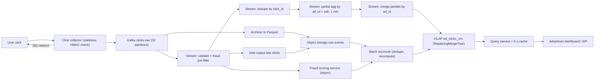

# 📈 Design: Ad Click Event Aggregation

> **1 B clicks/day in, per-ad per-minute counts out within ~1 minute, with counts that are provably right enough to bill on.** The hard parts are exactly-once-effective counting, event time versus processing time, and keeping a stream result and a batch result from disagreeing. Follows the [framework](00_FRAMEWORK_AND_ESTIMATION.md).

---

## Table of Contents

1. [Requirements](#1-requirements)
2. [Estimation](#2-estimation)
3. [API](#3-api)
4. [Data Model](#4-data-model)
5. [High-Level Design](#5-high-level-design)
6. [Deep Dives](#6-deep-dives)
7. [Failure Modes and Scaling](#7-failure-modes-and-scaling)
8. [Observability, Rollout and Cost](#8-observability-rollout-and-cost)
9. [Alternatives and Trade-offs](#9-alternatives-and-trade-offs)
10. [Staff-Level Follow-up Questions](#10-staff-level-follow-up-questions)
11. [Common Mistakes](#11-common-mistakes)

---

## 1. Requirements

**Functional**

- Ingest click events from ad-serving redirect endpoints (web and mobile).
- Return click counts per ad, per minute, for any time range; roll up to hour and day.
- Return top-N ads by clicks over a recent window (for example the last hour).
- Split counts into `raw`, `valid` (after fraud filtering) and `billable` (after batch finalization).
- Hook for fraud and bot filtering: a click can be flagged in-stream, and reclassified later.
- Replay: recompute any past interval from raw events.

**Non-functional (numeric targets)**

| Property | Target |
|---|---|
| Ingest | 1 B clicks/day, ~12k/s average, ~35k/s peak (3x) |
| Freshness | provisional count visible p99 < 15 s after the click; minute finalized p99 < 90 s after minute end |
| Query latency | p99 < 500 ms for a 24 h range of minute buckets for one ad |
| Click-path overhead | redirect adds p99 < 30 ms; a click is never dropped once the redirect is returned |
| Accuracy | stream vs batch divergence < 0.1% fleet-wide; billing numbers come from batch and are exact after dedupe |
| Availability | ingest 99.99%; query 99.9% |
| Durability | raw events retained 13 months in object storage; minute aggregates 90 days; hour/day rollups indefinitely |

**Explicit non-goals**: ad serving or auction, attribution (click to conversion), arbitrary multi-dimension ad hoc analytics (a separate rollup path, see follow-ups), advertiser billing and invoicing, the fraud ML models themselves.

---

## 2. Estimation

Assumptions: 1 B clicks/day; peak = 3x average; event 300 B in a compact JSON/protobuf envelope; Kafka replication factor 3, 7-day retention; 5 M distinct ads get at least one click per day, with ~40 distinct active minutes each.

- **Ingest**: average 1×10⁹ / 86,400 ≈ **11.6k/s ≈ 12k/s**; peak 12k × 3 ≈ **35k/s**. At 300 B that is 35k × 300 B ≈ **10.5 MB/s** peak: this is a correctness problem, not a throughput problem.
- **Kafka**: 1×10⁹ × 300 B = **300 GB/day**; RF 3, 7 days: 300 GB × 7 × 3 ≈ **6.3 TB**. Assume ~5k events/s per stream task with dedupe lookups: 35k / (5k × 0.5 headroom) = 14, so **32 partitions** (headroom for skew and fast replay).
- **Archive**: Parquet compresses ~5x versus JSON, so 300 GB / 5 = **60 GB/day**; 13 months ≈ 395 × 60 GB ≈ **24 TB**.
- **Dedupe state**: key `click_id` (16 B) plus overhead ≈ 64 B per entry. A 1 h window: 1×10⁹ / 24 ≈ 42M/hour average, peak 42M × 3 = 125M entries × 64 B ≈ **8 GB**. A 24 h window is ~1×10⁹ × 64 B ≈ 64 GB: feasible on disk-backed state but unnecessary, because batch dedupes without a window. We choose 1 h in-stream.
- **Aggregates**: 5 M ads × 40 active minutes = **200 M rows/day** (5 clicks per row on average, consistent with 1 B clicks). Row ≈ 50 B (ad_id 8, campaign_id 8, minute 4, counts 8, version 8, misc) so 200 M × 50 B = **10 GB/day**; 90 days ≈ **900 GB** uncompressed.
- **Reads**: 20k dashboards polling every 10 s = **2k QPS**, each reading ≤ 1,440 minute rows (24 h) for a few ads; a 5 s result cache cuts OLAP load further.

**Decisions this implies**

1. Ingest volume is small; spend the design budget on correctness (dedupe, event time, reconciliation), not on raw throughput.
2. Kafka as the durable buffer and replay source; 32 partitions keyed by `click_id` for even load.
3. A stateful stream processor with checkpointing for windows and dedupe; state is ~8 GB so RocksDB-style disk-backed state is comfortable.
4. An OLAP store for minute aggregates (hundreds of GB, 2k QPS, range scans), not the primary OLTP database.
5. Raw events always land in object storage; that makes batch recomputation (the source of truth for billing) cheap.

---

## 3. API

### Click event (collector input, also the Kafka message)

Clicks arrive via a redirect URL minted at impression time and signed with an HMAC, so a client cannot forge ad or campaign IDs.

```
GET https://c.example.com/r/{signed_token}
```

The token encodes `{click_id, impression_id, ad_id, campaign_id, advertiser_id, expiry}`. `click_id` is a UUIDv7 generated by the ad server at impression time, so retries, double-taps and proxy replays carry the **same** ID. The collector validates the HMAC, stamps trusted time, and emits:

```json
{
  "schema": 3,
  "click_id": "0198f2c4-7d1e-7a3b-9c11-5b0f2e8a4d10",
  "impression_id": "imp_8f31...",
  "ad_id": 918273645,
  "campaign_id": 55012,
  "advertiser_id": 7731,
  "event_time_ms": 1760000123456,
  "ingest_time_ms": 1760000123480,
  "collector": "us-east-1a-17",
  "ip_hash": "a91c...",
  "ua_class": "mobile_safari",
  "pre_flags": ["datacenter_ip"]
}
```

Response to the user: `302` to the advertiser landing URL. A repeated call with the same token returns the same `302`, and emits the same `click_id`, which is what makes dedupe possible.

`event_time_ms` is stamped by the **collector** (server clock, NTP-synced), not the device. Device clocks are untrustworthy, and we do not want lateness driven by wrong phones.

### Query API (advertiser-facing, OAuth2 bearer, scope `ads.read`, tenant taken from the token)

```
GET /v1/ads/{ad_id}/clicks?from=2026-10-08T10:00Z&to=2026-10-08T11:00Z&granularity=minute&quality=valid
```

```json
{
  "ad_id": 918273645,
  "granularity": "minute",
  "quality": "valid",
  "points": [
    {"t": "2026-10-08T10:00:00Z", "clicks": 41, "final": true,  "source": "stream"},
    {"t": "2026-10-08T10:01:00Z", "clicks": 37, "final": false, "source": "stream"}
  ],
  "next_cursor": null
}
```

`final: false` marks provisional minutes; `source` becomes `batch` after reconciliation.

```
GET /v1/advertisers/{id}/clicks?group_by=ad_id&from=...&to=...&limit=100&cursor=eyJhZCI6OTE4Mn0
GET /v1/ads/top?window=1h&n=100
```

- Cursor pagination is keyset on `(ad_id)` for the group-by listing and `(minute)` for series; offset pagination would rescan.
- Authorization: the advertiser in the token must own the ad; checked from a cached `ad_id -> advertiser_id` map, never from a client-supplied ID.

---

## 4. Data Model

**Access patterns**: (1) time series for one ad over a range; (2) group by ad for an advertiser over a range; (3) top-N over the last hour; (4) bulk recompute from raw.

### Raw log (source of truth)

Kafka topic `clicks.raw`, key = `click_id`, 32 partitions, 7-day retention. Mirrored to object storage as Parquet, partitioned `dt=YYYY-MM-DD/hour=HH`, immutable and append-only. **Partitioned by event hour, not arrival hour**, via a compaction step; otherwise a late click lands in the wrong partition.

### OLAP table (minute aggregates)

ClickHouse-style, shown as DDL:

```sql
CREATE TABLE ad_clicks_1m (
  ad_id         UInt64,
  minute        DateTime,
  campaign_id   UInt64,
  advertiser_id UInt64,
  raw_clicks    UInt32,
  valid_clicks  UInt32,
  version       UInt64        -- higher wins; batch writes set the top bit
) ENGINE = ReplacingMergeTree(version)
PARTITION BY toYYYYMMDD(minute)
ORDER BY (ad_id, minute);
```

- **Order key `(ad_id, minute)`**: pattern 1 is a contiguous range scan. Pattern 2 filters on `advertiser_id`; add a projection or a secondary rollup ordered by `(advertiser_id, minute, ad_id)` rather than slowing pattern 1.
- **Partition by day**: cheap TTL (`DROP PARTITION` after 90 days) and cheap rewrite of one day during reconciliation.
- **ReplacingMergeTree with `version`**: the sink always writes the *absolute* count of a window, so writing it twice is harmless and a correction is just a higher version. Reads use `argMax(valid_clicks, version) ... GROUP BY ad_id, minute` (or `FINAL` for small ranges) because merges are asynchronous.

**Why an OLAP column store**: 200 M rows/day appended, range scans and group-bys, almost no point updates, no transactions. A relational database would need constant upsert churn; a KV store (Cassandra/DynamoDB) answers pattern 1 but not pattern 2/3 without more tables. Druid or Pinot are equally valid; the argument is columnar + time-partitioned + upsert by key.

---

## 5. High-Level Design



### Write path

1. User clicks; the collector verifies the HMAC token, stamps `event_time_ms`, and publishes to Kafka with `acks=all` keyed by `click_id`. If Kafka is unavailable, it appends to a local disk spool and still returns the `302` (the redirect must not break); a drainer replays the spool.
2. The stream job reads `clicks.raw` with event-time semantics. Watermark = max event time seen minus 10 s; idle partitions are excluded after 30 s so they do not stall the watermark.
3. Validate and apply cheap fraud rules (datacenter IP, impossible user agent, per-IP burst rate); set `valid=false` rather than dropping, so raw counts stay complete.
4. Dedupe: `keyBy(click_id)`, keep a 1 h seen-set; emit only first occurrences.
5. Two-stage aggregation: `keyBy(ad_id, salt)` partial count per 1-minute tumbling window, then `keyBy(ad_id)` merge. Salting only matters for hot ads (deep dive 2).
6. Window emits early panes every 5 s (provisional) and a final pane when the watermark passes the minute end plus 10 s. Late events inside the 5-minute allowed lateness re-fire the window with a corrected count.
7. The sink upserts `(ad_id, minute, absolute_count, version)` into the OLAP. Offsets, state and sink progress commit via checkpoints.
8. In parallel, the archiver writes raw events to Parquet; events later than allowed lateness go to a late side output, also archived.

### Read path

1. Dashboard calls the Query API; the service authenticates and checks ad ownership.
2. It checks a 5 s result cache; on miss it queries the OLAP with `argMax(..., version)` over the requested minutes.
3. The response marks each minute `final` or provisional based on its age versus the watermark.
4. Top-N reads use a small precomputed result refreshed every few seconds rather than a scan.

---

## 6. Deep Dives

### 6.1 Exactly-once-effective counting

**Problem.** Duplicates arise at every layer: user double-click, client retry, collector retry after Kafka timeout, Kafka producer retry, consumer restart replaying from the last checkpoint, and the sink retrying a write. "Exactly once" end to end is not achievable across all of these as a primitive; we compose *at-least-once delivery* with *idempotence* so the effect is exactly-once.

**Options**

| Option | How | Weakness |
|---|---|---|
| A. Increment counters in OLAP | `UPDATE count = count + 1` per event | Any retry double-counts; no way to repair |
| B. Dedupe on a stable ID, write absolute window values | Stream dedupes by `click_id`; sink upserts the full count of a window | Needs stable ID and dedupe state; late duplicates beyond the window slip through (batch fixes) |
| C. Transactional two-phase commit stream to sink | Sink participates in the checkpoint | Couples to sink capabilities; blocks on slow sinks; still need dedupe for upstream duplicates |

**Pick: B**, plus the stream processor's own checkpointed exactly-once *state* (offsets and state commit atomically, so restarts do not double-apply within the job). Concretely:

```
on event e:
    if seen.contains(e.click_id):   drop                 # dedupe, TTL 1h
    seen.put(e.click_id)
    window = floor(e.event_time, 1min)
    partial[(e.ad_id, salt(e), window)] += 1

on window fire (early every 5s, final at watermark):
    sink.upsert(ad_id, window, absolute_count, version = pane_seq)   # idempotent
```

Because the sink value is the absolute count of a window and the key is `(ad_id, minute)`, replays and retried writes converge to the same row. A restart that replays from a checkpoint rebuilds the same count rather than adding to it.

**Cost.** ~8 GB dedupe state, one extra keyed shuffle, and the discipline that the click ID must be minted upstream and stable. Duplicates older than 1 h are not caught in-stream.

**What would change my mind.** If advertisers dispute counts because of stream-vs-batch drift above 0.1%, lengthen the dedupe window (24 h costs ~64 GB, still affordable) or push dedupe into the sink via the ID. If the sink offered cheap distinct counting (for example an HLL or a unique-key table), I would count distinct `click_id` there instead of keeping stream state. If no stable ID can be minted (third-party clicks), fall back to a composite key `(impression_id, ip_hash, 1s bucket)` and accept some over-dedupe.

### 6.2 Event time, watermarks, late data, and hot ads

**Problem.** The 10:01 bucket must count clicks that *happened* in 10:01, even if they reach the stream at 10:03 (spool drain, regional failover, network delay). Processing-time windows would make counts wrong after any incident. Separately, one viral ad can send a disproportionate share of traffic to one key.

**Options for lateness**

| Option | Behavior | Trade-off |
|---|---|---|
| Large watermark delay (60 s) | Few late events | Adds 60 s to every final result; violates the 1-minute target |
| Small delay (10 s) + early panes + allowed lateness + corrections | Fast provisional, correct eventually | Consumers see numbers change; sink must be upsert |
| Drop late events | Simple | Under-counts billing; unacceptable |

**Pick: small delay + corrections.** Watermark = max event time − 10 s. Early panes every 5 s give the dashboard a running value (target < 15 s). At watermark the pane is `final`. State is kept for 5 more minutes (allowed lateness); a late click re-fires the window with the new absolute count. Anything later goes to the late side output and is picked up by the hourly batch. Provisional minutes are labeled in the API, so no one reads them as final.

Watermark pitfalls to name: one slow or idle partition holds the watermark back (use idle detection); a replay or backfill produces huge event-time jumps (isolate backfills on a separate job, never through the live job); a clock-skewed collector stamps wrong times (NTP monitoring and clamp `event_time` to `[ingest − 1 h, ingest]`).

**Hot ads.** Keying the aggregation by `ad_id` means the busiest ad is limited by one task. Dedupe is already keyed by `click_id`, which is uniform. For aggregation:

```
# stage 1: spread a hot ad over N sub-keys
salt(e) = hash(e.click_id) % N(e.ad_id)      # N=1 for normal ads, 8-32 for hot ads
partial[(ad_id, salt, minute)] += 1
# stage 2: merge; one record per (ad_id, salt, minute) arrives, so fan-in is <= N
final[(ad_id, minute)] = sum over salts
```

`N(ad_id)` comes from a small broadcast config that a monitor updates when an ad's rate crosses a threshold (for example > 2k/s). Merging is safe because count is associative and commutative; this would not work for distinct counts without sketches.

**Cost.** Extra shuffle and up to one extra checkpoint interval of latency for hot ads; operational complexity of the hot-ad config. **Change my mind**: if the stream engine does local pre-aggregation (combiners) before the shuffle, the manual salt is unnecessary; if exact late-data accuracy is needed beyond 5 min with low latency, increase allowed lateness at the price of state size.

### 6.3 Lambda vs Kappa, and reconciliation

**Problem.** A stream job is fast but its result depends on windowing parameters, dedupe horizon and code version; a bug leaves wrong numbers with no way to inspect them. Billing needs an auditable number.

| Option | Description | Cost |
|---|---|---|
| Lambda | Separate batch (accurate, hours old) and speed layer (approximate, fresh); serving merges | Two code paths that must agree; merge logic at query time |
| Kappa | One stream job; reprocess by replaying the log | One code path; replay of 13 months from Kafka is impractical, so the log must live in object storage |
| Kappa + batch reconciliation (pick) | Stream is the single online path; a batch job re-derives the same table from raw archive and *overwrites* | Batch logic is a second implementation for dedupe/windowing, but it is simple SQL and used only for verification and correction |

**Pick: Kappa-style stream path plus a scheduled batch reconciliation**, not a query-time merge. The batch job:

```sql
-- hourly, for a closed hour H (event time), over raw Parquet
SELECT ad_id, toStartOfMinute(event_time) AS minute,
       count(*)                      AS raw_clicks,
       countIf(is_valid)             AS valid_clicks
FROM (
  SELECT click_id, any(ad_id) AS ad_id, min(event_time) AS event_time,
         min(is_valid) AS is_valid
  FROM clicks_raw WHERE dt = :day AND event_hour = :hour
  GROUP BY click_id                     -- exact dedupe, no time horizon
)
GROUP BY ad_id, minute;
```

Then diff against the OLAP: any `(ad, minute)` where counts differ is rewritten with a batch version (top bit set). The diff itself is a metric: fleet-wide mismatch rate is the health signal of the stream job. The daily snapshot after fraud reclassification is what billing consumes.

**Cost.** A second implementation of the counting semantics (must keep dedupe key, validity rules and minute alignment identical; use shared test vectors); raw archive storage (~24 TB) and a daily batch compute bill. **Change my mind**: if the stream job's mismatch stays < 0.01% for a long period and billing tolerates it, drop hourly reconciliation to daily; if requirements move to sub-second freshness, the OLAP upsert model becomes the bottleneck and I would revisit the serving store, not the reconciliation idea.

---

## 7. Failure Modes and Scaling

| Failure | Impact | Mitigation |
|---|---|---|
| Collector crash | In-flight clicks lost if not yet in Kafka | Stateless fleet; publish with `acks=all`; local spool when Kafka is down; replays are safe because `click_id` dedupes |
| Duplicate delivery (replay, retries) | Over-count | Dedupe by `click_id` (1 h) + absolute-value upsert + exact batch dedupe |
| Poison message / schema change | Job loops or crashes | Dead-letter topic; schema registry compatibility checks; skip-and-count after N retries |
| Watermark stall (idle partition) | Windows never finalize | Idle-source timeout 30 s; alert on watermark lag |
| Late flood after outage | Many corrections, sink write spike | Allowed lateness bounded to 5 min; the rest via batch; rate-limit sink writes |
| OLAP node or sink failure | Queries degraded or aggregates stale | Replicated shards, cache absorbs bursts; sink retries; Kafka retains 7 days so replay heals |
| Bug in counting logic | Wrong numbers shipped | Reconciliation diff alerts; fix, replay from archive, overwrite with batch version |
| Fraud service down | No flags | Fail open: count `raw`, mark `valid` provisional, reclassify in batch |
| Kafka broker/AZ loss | Ingest stalls or loses a replica | RF 3 across AZs, `min.insync.replicas=2`, `acks=all`; spool covers a total outage |
| Stream job crash | Counts stall; freshness SLO burns | Restore from checkpoint (state + offsets atomic); results converge because sink is idempotent |

**Hot keys.** Ads: two-stage salted aggregation (6.2). Advertisers: a very large advertiser dominating `advertiser_id` reads is handled by caching and by the advertiser-ordered rollup. Kafka partitions stay balanced because the key is `click_id`, not `ad_id`.

**Scaling.** At 10x (350k/s peak) Kafka (105 MB/s) and stream compute scale linearly by partitions (increase to 256, plan this because repartitioning a keyed topic breaks per-key assumptions; dedupe survives because it is keyed by `click_id` consistently). OLAP grows to ~2 TB for 90 days; add shards by `ad_id` hash.

**Multi-region.** Collectors run per region and write to local Kafka; a mirror replicates `clicks.raw` to one aggregation region that runs the single stream job and OLAP (one writer, no cross-region merge). Allowed lateness is sized above typical mirror lag, which is alerted on. Failover: a warm standby restores from replicated checkpoints and replays mirrored offsets; idempotent sink writes make overlap harmless. Under data-residency rules, run an independent pipeline per region and aggregate rollups.

---

## 8. Observability, Rollout and Cost

**SLIs and SLOs**

| SLI | SLO |
|---|---|
| Provisional freshness: now − latest event time visible in OLAP | p99 < 15 s |
| Final-minute latency: time from minute end to `final` | p99 < 90 s |
| Click path: redirect added latency | p99 < 30 ms |
| Query latency | p99 < 500 ms |
| Stream-vs-batch mismatch (|diff| / batch count, fleet) | < 0.1%, alert > 0.1%, page > 1% |
| Click durability: collector-received vs Kafka-written vs archived counts | equal within 0.01% after 1 h |

**Alerts that page**: consumer lag growing for 5 min (lag in seconds, not messages); watermark lag > 2 min; mismatch > 1%; collector spool non-empty > 10 min; checkpoint failures 3 in a row.

**Rollout path**

1. Shadow: run the new pipeline writing to a separate table; compare with the existing system daily.
2. Dual-run dashboards for a few advertisers; prove mismatch < 0.1%.
3. Switch dashboards to the new table; keep the old one for billing.
4. After two clean billing cycles, cut billing to the batch output of the new system; decommission the old.
5. Rollback is a flag on the query service plus replay: because the log and archive are immutable, any bad version of the stream job can be fixed by replay with no data loss.

**Cost drivers**: (1) stateful stream compute, the biggest recurring item; (2) OLAP cluster, small (hundreds of GB, 2k QPS), bounded by day partitions and 90-day TTL; (3) raw archive (~24 TB) and batch recompute, cheap relative to audit value; (4) Kafka is tiny at 10 MB/s, where retention and RF (6.3 TB) dominate.

---

## 9. Alternatives and Trade-offs

| Decision | Chosen | Alternative | Why / when to switch |
|---|---|---|---|
| Architecture | Kappa + batch reconcile | Lambda with query-time merge | Merge logic and two codepaths in the read path; switch if batch must serve reads |
| Dedupe | `click_id` seen-set 1 h + batch exact | Bloom filter | False positives silently drop billable clicks |
| Sink | Upsert absolute values | Increment counters | Increments cannot be repaired |
| Store | Columnar OLAP | Cassandra/DynamoDB counters | KV serves one access pattern; counters not idempotent |
| Window time | Event time, collector-stamped | Processing time | Wrong after any delay; billing disputes |
| Partition key | `click_id` then re-key | `ad_id` from the start | Hot ads cap throughput; `click_id` is uniform |

---

## 10. Staff-Level Follow-up Questions

**1. Why not just use Kafka transactions and call it exactly-once?**
Transactions give atomic produce-and-offset-commit within Kafka, which covers the stream-to-stream hops. They do not cover the user retrying a click, the collector double-publishing before the transaction begins, or writes to an external OLAP. So duplicates entering the log must be removed by `click_id`, and the sink must be idempotent. Say: "exactly-once processing plus idempotent effects", never "exactly-once end to end".

**2. A major advertiser says counts for yesterday changed. How do you explain it?**
Provisional minutes are labeled, and corrections within 5 minutes are expected. Changes the next day are the batch reconciliation superseding the stream (late clicks, fraud reclassification). I would expose `source` and `final`, keep a changelog of version bumps per `(ad, minute)`, and make billing use only the T+24 h snapshot, which is frozen. A well-defined "counts settle at T+24 h" contract is better than silence.

**3. How would you add "unique users who clicked per ad per hour"?**
Exact distinct is not mergeable and costs state proportional to users. Use HyperLogLog sketches per `(ad, window)` stored in the OLAP as aggregate state and merged at query time; accept ~1-2% error with standard precision, and label it approximate. If billing needs exact uniques, compute them only in batch from raw.

**4. The watermark is stuck. What do you do?**
First confirm which partition or source is behind (per-partition watermark metrics). If it is idle, idle-source detection should have unblocked it; if it is truly lagging, that is a collector or mirror problem upstream. Mitigations: manually mark the source idle, shift the job to a bounded-lateness policy, or let windows finalize and rely on corrections. Prevent recurrence with an alert on watermark lag, not just consumer lag.

**5. How do you handle a fraud wave discovered 6 hours later?**
Fraud scoring writes verdicts keyed by `click_id` (or by an IP/device cluster) to a table the batch job joins against. The reconcile job recomputes `valid_clicks` for the affected hours and writes batch versions, so dashboards and billing converge. Raw counts never change, which preserves auditability. Advertisers get credit by comparing the billable snapshot, not by deleting events.

**6. How would you rebalance if one ad doubles its traffic every hour?**
Hot-ad detection is a per-ad rate monitor that updates the broadcast salt table; the next window boundary starts using the larger `N`. Merge is associative, so changing `N` between windows is safe (never mid-window for the same `(ad, minute)`, or partials could be double-counted; apply on window boundaries). At the Kafka layer nothing changes because the key is `click_id`.

**7. What if you need to change the window from 1 minute to 10 seconds?**
Windows are derived from event time, so a new job can write `ad_clicks_10s` from the same Kafka/Parquet history. Backfill by running the job over the archive in batch mode, verify against the minute table (sum of six 10 s rows equals the minute row), then switch reads. Storage grows 6x for the same ad population, which usually argues for limiting 10 s retention to a day or two.

---

## 11. Common Mistakes

- Using processing time for windows, so any delay silently moves clicks to the wrong minute.
- Dropping suspected-fraud clicks in-stream instead of flagging them, which destroys auditability and cannot be undone.
- No reconciliation loop, so a bug in the stream job becomes the billing record.
