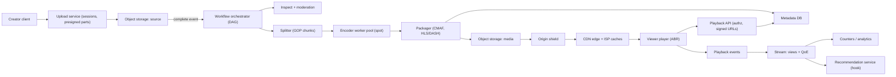

# 🎬 Design: Video Streaming Platform (YouTube / Netflix style)

> **Upload once, transcode into a ladder of bitrates and codecs, cut into segments, and let a CDN deliver ~125 Tbps of adaptive-bitrate video.** The architecture is dominated by two bills: egress and transcoding. Follows the [framework](00_FRAMEWORK_AND_ESTIMATION.md).

---

## Table of Contents

1. [Requirements](#1-requirements)
2. [Estimation](#2-estimation)
3. [API](#3-api)
4. [Data Model](#4-data-model)
5. [High-Level Design](#5-high-level-design)
6. [Deep Dives](#6-deep-dives)
7. [Failure Modes and Scaling](#7-failure-modes-and-scaling)
8. [Observability, Rollout and Cost](#8-observability-rollout-and-cost)
9. [Alternatives and Trade-offs](#9-alternatives-and-trade-offs)
10. [Staff-Level Follow-up Questions](#10-staff-level-follow-up-questions)
11. [Common Mistakes](#11-common-mistakes)

---

## 1. Requirements

**Functional**

- Creators upload video files (up to several GB, flaky networks), with resumable upload.
- The platform transcodes each upload into multiple resolutions and bitrates and codecs, and packages for HLS and DASH.
- Viewers play video with adaptive bitrate (ABR), seek, and resume watching.
- Metadata: title, description, visibility, thumbnails, captions; watch history.
- View counts (approximate, fraud-resistant) and a hook for recommendations (consume an API, not designed here).

**Non-functional (numeric targets)**

| Property | Target |
|---|---|
| Scale | 1 B hours watched/day, average 3 Mbps; ~720k hours uploaded/day (~500 h/min) |
| Playback start | time to first frame p95 < 2 s; rebuffer ratio < 0.5% of watch time |
| Upload to playable | p95 < 10 min for a 10-minute video (first rungs); full ladder < 1 h |
| Availability | playback 99.99%; upload 99.9% |
| Durability | source and renditions 11 nines (object store, erasure coded) |
| Cost | egress and transcoding tracked per watch-hour and per upload-hour |

**Explicit non-goals**: live streaming (different latency and packaging path), recommendation and ranking models, ads insertion, comments and social graph, DRM license server internals (only the hook), content moderation models (only the pipeline stage).

**Clarifying questions**: Is content mostly long-tail (YouTube) or mostly head (Netflix catalog)? That one answer decides whether to pre-encode everything or encode lazily. Is there a premium DRM tier? Do we own ISP-embedded caches? We assume user-generated content with a heavy long tail, and a CDN we partly operate.

---

## 2. Estimation

- **Egress** (matches the framework example): Bits/day = 10⁹ h × 3,600 s × 3×10⁶ bps = 1.08×10¹⁹ bits. ÷ 86,400 ≈ **1.25×10¹⁴ bps = 125 Tbps** average. Peak (evening, 2x) ≈ **250 Tbps**.
- Bytes/day = 1.08×10¹⁹ / 8 = 1.35×10¹⁸ B = **1.35 EB/day**.
- Cost sensitivity: assume a blended **$0.005/GB** delivered (a planning assumption, not a quote). 1.35×10⁹ GB × $0.005 = **$6.75M/day**. Each 1% bitrate saving is ~**$67k/day**. This is why codec efficiency matters.
- **Request rate** (4 s segments): Segments per viewer-hour = 3,600 / 4 = 900. Requests/day = 10⁹ × 900 = 9×10¹¹; ÷ 86,400 ≈ **10.4M segment requests/s** average, ~20M at peak.
- Cross-check: segment size = 3 Mbps × 4 s / 8 = 1.5 MB; 10.4M × 1.5 MB = 15.6 TB/s = 125 Tbps. ✓
- **Origin offload**: Edge/ISP cache hit ratio 95%: 125 × 0.05 = 6.25 Tbps misses go to regional/shield.
- Origin shield hit ratio 90%: 6.25 × 0.10 = **0.625 Tbps** (~78 GB/s) reach origin storage, i.e. 0.5% of total. In requests: 10.4M × 0.05 × 0.10 ≈ **52k object GETs/s** at origin.
- Without the shield, origin would see 6.25 Tbps. The shield is a 10x reduction on the origin.
- **Upload**: Assume 8 Mbps source average: 1 hour = 8×10⁶ × 3,600 / 8 = **3.6 GB/hour**. 720k h/day × 3.6 GB = **2.59 PB/day**, i.e. 2.59×10¹⁵ × 8 / 86,400 ≈ **240 Gbps** average ingest.
- Average upload = 10 minutes: 8 Mbps × 600 s / 8 = **600 MB**; with 8 MB chunks that is **75 chunks**. Uploads/s = 720k h × 6 / 86,400 = 4.32M uploads/day ÷ 86,400 = **50/s**.
- **Transcoding**: Ladder (H.264): 240p 0.3, 360p 0.7, 480p 1.2, 720p 2.5, 1080p 4.5 Mbps; sum = **9.2 Mbps**. Per content hour: 9.2×10⁶ × 3,600 / 8 = **4.14 GB**. ×720k h/day = **2.98 PB/day** of renditions, plus 2.59 PB source = **5.6 PB/day**, ≈ **2 EB/year** before a second codec. Object storage with erasure coding (~1.5x overhead, not 3x) and tiering/deletion of cold renditions is mandatory.
- Compute (assumption: ~4 core-hours to encode the full H.264 ladder for 1 content hour): 720k × 4 = 2.88M core-hours/day ÷ 24 = **120k cores** sustained, ~240k at 2x peak. AV1 can cost an order of magnitude more per hour, which is why it is applied selectively.
- Parallelism: split into 10 s GOP-aligned chunks: 3,600 / 10 = **360 chunks** × 5 renditions = **1,800 tasks**; 4 core-hours = 14,400 core-s / 1,800 = **8 core-s per task**. A one-hour video can complete in minutes if capacity exists.
- **Segment count and metadata**: 900 segments × 5 renditions = **4,500 objects per hour**; × 720k = 3.24×10⁹ objects/day (~37k PUT/s). Too many tiny objects: store **one CMAF fMP4 file per rendition** with an index and serve segments by byte range (deep dive 6.2).
- Metadata: 4.32M videos/day × 2 KB = **8.6 GB/day**; 5 years = 8.6 × 1,825 ≈ **15.7 TB**.
- View events: 10⁹ h × 6 views/h (10-minute average view) = 6×10⁹ views/day ÷ 86,400 ≈ **69k views/s**, peak ~210k/s.

**Decisions this implies**

1. Egress is the first-order cost; CDN with ISP caches plus an origin shield is the architecture, not an optimization.
2. Transcoding is a massively parallel batch workload: chunk, fan out on spot/preemptible capacity, use a DAG orchestrator with idempotent tasks.
3. Encode lazily by popularity: you cannot afford every codec and rung for every upload in a long-tail corpus.
4. Metadata (15.7 TB, small rows) fits a sharded relational or wide-column store; video bytes live only in object storage.
5. View counting is a stream-aggregation problem (see the [ad click design](05_AD_CLICK_AGGREGATION.md)), not a row update.

---

## 3. API

Auth: OAuth2 bearer for creators and viewers; playback URLs are short-lived signed URLs or cookies. All mutating calls accept an `Idempotency-Key`.

### Resumable upload

```
POST /v1/uploads
Idempotency-Key: 5d2c...
{ "filename": "trip.mov", "size_bytes": 629145600, "content_type": "video/quicktime",
  "sha256": "9f2b...", "chunk_size": 8388608 }
```
```json
{ "upload_id": "up_01J9...", "chunk_size": 8388608, "expires_at": "2026-10-15T00:00:00Z",
  "part_urls_endpoint": "/v1/uploads/up_01J9.../parts?from=0&limit=25" }
```

```
GET  /v1/uploads/{upload_id}/parts?from=0&limit=25   -> presigned URLs for part numbers 0..24, plus next_cursor
GET  /v1/uploads/{upload_id}                         -> { "received_parts": [0,1,2,5], "state": "UPLOADING" }
POST /v1/uploads/{upload_id}/complete                -> { "video_id": "vid_8Hk...", "state": "PROCESSING" }
```

Parts are PUT directly to object storage via presigned URLs, never through our API fleet. `complete` is idempotent: repeating it returns the same `video_id`.

### Video metadata and playback

```
POST   /v1/videos/{video_id}/publish    { "title": "...", "visibility": "public" }
PATCH  /v1/videos/{video_id}            { "title": "..." }   (If-Match: etag)
GET    /v1/videos/{video_id}            -> metadata + processing state
GET    /v1/videos/{video_id}/playback?device=ios&codecs=avc1,hvc1,av01
```
```json
{
  "video_id": "vid_8Hk...",
  "manifest": { "hls": "https://cdn.example.com/v/vid_8Hk/master.m3u8?exp=1760003600&sig=ab12",
                "dash": "https://cdn.example.com/v/vid_8Hk/manifest.mpd?exp=1760003600&sig=ab12" },
  "drm": null,
  "thumbnails_vtt": "https://cdn.example.com/v/vid_8Hk/thumbs.vtt?...",
  "resume_position_s": 312
}
```

Players also POST heartbeats (`/v1/playback/events`, every 10-30 s, batched, fire-and-forget) that feed resume position, view counting and QoE metrics; `GET /v1/users/me/history?limit=20&cursor=...` pages watch history newest first.

The playback endpoint authorizes (visibility, region, age), picks a CDN steering decision, and returns signed URLs. The signature covers the path prefix and expiry; segments are then served by the CDN with no call back to us.

---

## 4. Data Model

**Access patterns**: get video by ID (hot, read-mostly); list a creator's videos; watch history per user; resume position per `(user, video)`; counters per video; which renditions exist for a video.

### Metadata (relational, sharded by `video_id` hash)

| Table | Key | Notes |
|---|---|---|
| `videos` | `video_id` (ULID/snowflake) | `owner_id`, `title`, `visibility`, `state` (UPLOADING, PROCESSING, READY, FAILED), `duration_s`, `created_at`, `etag` |
| `renditions` | `(video_id, rendition_id)` | codec, resolution, bitrate, `object_key`, `size`, `state`, `packaged_at` |
| `uploads` | `upload_id` | `video_id`, `owner_id`, `part_size`, `expires_at`, `state`; received parts live in object-store multipart metadata |
| `videos_by_owner` | `(owner_id, created_at DESC, video_id)` | secondary index / separate table for creator listing |

Why relational and sharded: ~15.7 TB over five years is modest; the data has constraints (state machine, ownership), and updates are rare. A wide-column store also works; we choose the store the team can operate, with a read-through cache (95%+ hit) in front because `GET /videos/{id}` is the hottest metadata call.

### Watch state (wide-column or KV, partitioned by `user_id`)

`(user_id, video_id) -> {position_s, updated_at}` for resume, and `(user_id, ts DESC, video_id)` for history. Write rate is bounded by heartbeat downsampling: write position at most once per 30 s per session, and on pause/exit.

### Counters

Per-video counts are **not** a column updated per view. View events go through a stream pipeline (dedupe by `(session_id, video_id)`, 30 s watched threshold, bot filter) into a counter store with periodic flush. Redis/KV holds the display count (eventually consistent, minute-level); an OLAP table holds exact daily facts for creator analytics.

### Video bytes (object storage)

```
s3://source/{video_id}/original
s3://media/{video_id}/{codec}/{rendition}.mp4        # CMAF fMP4, one file per rendition
s3://media/{video_id}/{codec}/{rendition}.idx        # segment byte-range index
s3://media/{video_id}/master.m3u8, manifest.mpd      # generated, small
```

Immutable objects: re-encoding writes a new key prefix with a version, so CDN caches never see a mutated object under the same URL.

---

## 5. High-Level Design



### Write path (upload to playable)

1. Client calls `POST /uploads`; the upload service creates a session and a multipart upload in object storage.
2. Client PUTs 8 MB parts directly to storage using presigned URLs, in parallel, retrying only failed parts; after a drop it asks `GET /uploads/{id}` for received parts and resumes.
3. `complete` verifies part list and checksum, then publishes a `source.ready` event and flips the video to PROCESSING.
4. The orchestrator starts the DAG: probe the file (codec, duration, resolution), run moderation and audio extraction in parallel with chunking.
5. The splitter cuts the source into ~10 s GOP-aligned chunks. Encoder tasks (one per chunk per rendition) run on a worker pool, mostly preemptible instances; each task is idempotent and writes to a deterministic key.
6. When all chunks for a rendition finish, the packager concatenates them into a CMAF file plus index and generates HLS/DASH manifests.
7. Low rungs (for example 360p and 720p H.264) are produced first; the video is marked READY and playable as soon as a usable ladder exists. Higher rungs and other codecs are added later (6.1).
8. Metadata is updated and the `video.ready` event notifies search, notifications and recommendation indexing.

### Read path (play)

1. The player calls `GET /videos/{id}/playback`; the service authorizes and returns signed manifest URLs.
2. The player fetches the master manifest, estimates throughput, and starts at a conservative rendition to minimize startup time.
3. For each segment it requests `.../1080p/seg-0412.m4s` from the nearest edge or ISP cache.
4. Cache hit (~95%) is served locally. A miss goes to the regional tier and then the origin shield; the shield coalesces concurrent requests for the same object and fetches from object storage once.
5. The ABR logic (throughput and buffer based) switches renditions at segment boundaries; heartbeats go out asynchronously.

---

## 6. Deep Dives

### 6.1 The transcoding DAG: cost, latency and what to encode

**Problem.** 120k cores of sustained encoding for 720k upload-hours/day, with p95 time-to-playable under 10 minutes, retries on failure, and a cost that does not scale linearly with a long-tail library where most videos are watched rarely.

**Options**

| Option | Behavior | Weakness |
|---|---|---|
| A. Encode the full ladder and all codecs per upload, serially | Simple | Latency of hours for long videos; AV1/HEVC cost wasted on unwatched videos |
| B. Chunked parallel encode of a base ladder, then popularity-driven upgrades | Fast to playable; spend scales with watch time | More orchestration; chunk boundaries and rate control need care |
| C. Just-in-time transcode at first request | No storage for unwatched renditions | First-viewer latency; thundering herds; unpredictable compute at peak |

**Pick: B.** Stage 1 (every upload): chunked H.264 for 360p-720p, published as soon as done, usually minutes. Stage 2 (everything else, asynchronously at lower priority): the remaining rungs. Stage 3 (popularity-triggered): a more efficient codec (VP9/AV1/HEVC, device dependent) once a video exceeds a watch-hours threshold, because encode cost is paid once but egress savings accrue per view.

The economics, in one line: encode an extra codec if `egress_saved = watch_hours × bitrate_saving × cost_per_GB` exceeds `encode_cost`. With 125 Tbps of egress, a 30% bitrate reduction on the head of the catalog is worth far more than the CPU.

DAG sketch:

```
probe -> [moderate | extract_audio | split(10s GOP chunks)]
split -> for each rendition r, for each chunk c:  encode(r, c)      # fan-out 1,800 tasks per hour
encode(r, *) -> package(r)  -> publish_manifest -> mark_ready
priority: new upload base ladder > backfill > popularity upgrades
task key = hash(video_id, source_etag, rendition, chunk, encoder_version)   # idempotency
```

Mechanics that matter: tasks are idempotent and keyed by content and encoder version, so a retry after a preempted spot instance overwrites the same output; chunk boundaries align to keyframes so the packager can concatenate without re-encoding; rate control uses two-pass or constrained-CRF per chunk with a bitrate cap so ABR switching stays smooth; a **per-title ladder** (choose rungs from content complexity, for example a static slideshow needs far less than sports) reduces average bitrate at equal quality. Poison inputs (corrupt files) fail the DAG at probe time, not after hours of work.

**Cost.** An orchestrator with queues, priorities and retries (Temporal/Step Functions class), a complex scheduling policy, a fleet that tolerates preemption, and a quality-measurement step (a VMAF-type metric on samples) to prove per-title and codec choices.

**What would change my mind.** If the catalog is a small curated head (Netflix style), precompute everything including AV1 and spend heavily on per-title optimization; the long-tail argument vanishes. If compute is cheap relative to storage (idle capacity), JIT for the cold tail becomes attractive. If live is added, a separate low-latency pipeline is required; do not stretch this DAG.

### 6.2 Delivery: segmenting, CDN, origin shield, ISP caches

**Problem.** 10.4M requests/s and 125 Tbps must be served so that origin sees ~0.5% of traffic, and long-tail videos, which are cache-cold, must not melt the origin when a video suddenly goes viral.

**Segmenting.** Pick 4 s segments for a balance: shorter (2 s) lowers latency and speeds ABR reaction but raises request rate and manifest overhead; longer (6-10 s) cuts requests but slows bitrate adaptation and increases startup time. With CMAF fMP4, the same media files serve HLS and DASH, which avoids storing two copies. Storing one file per rendition plus an index (byte ranges) avoids 3.24×10⁹ tiny objects/day; an **origin packager** translates `seg-0412.m4s` into a range read. For hot videos it can write materialized segments, so edge fetches become plain GETs.

**Cache keys and TTLs**

- Segments are immutable and versioned in the path: TTL of months, `Cache-Control: public, immutable`. Key = path only (no signature in the key; the signature is validated at the edge but excluded from the key so users share cached objects).
- Master and media manifests: short TTL (a few seconds to minutes) only if they can change (late-added renditions); versioned URLs avoid purge entirely.
- Never include user-specific query parameters in the cache key.

**Options for tiering**

| Option | Behavior | Weakness |
|---|---|---|
| A. Single-tier CDN edge to origin | Simple | Every edge miss hits origin; a viral video gets N edge misses per segment |
| B. Edge + origin shield (regional mid-tier) | One shield fetch per object; request coalescing | Added latency on cold misses; shield is a bottleneck/SPOF if undersized |
| C. B + ISP-embedded caches with proactive fill | Popular content pre-positioned during off-peak; most traffic never leaves the ISP | Capital and operations with ISPs; fill logic and popularity prediction |

**Pick: C for head content, B for the rest.** The origin shield reduced origin from 6.25 Tbps to 0.625 Tbps in the estimate. ISP caches are filled off-peak from a popularity model (new releases, trending uploads), so peak-hour traffic is served from inside the ISP, cutting both our transit cost and the user's latency. Request coalescing at each tier ensures 10,000 simultaneous misses for one segment become one upstream request.

**Cost.** Egress dominates: $6.75M/day at the planning rate; every 1% from better codecs, per-title ladders, or higher cache hit ratios (and cheaper ISP-local delivery) is worth ~$67k/day. Shield and ISP hardware add fixed cost; pre-fill burns off-peak bandwidth.

**What would change my mind.** If traffic is a tiny fraction of that scale, a single commercial CDN and no shield is correct. If a single video accounts for a large share of one ISP's traffic (premiere), pre-position it explicitly and consider multicast-like fan-out within the CDN. If one CDN has regional outages, add multi-CDN steering at the playback API, trading simplicity and a split cache for resilience.

### 6.3 Resumable uploads of multi-GB files

**Problem.** A 600 MB average and multi-GB tail over mobile networks will fail mid-transfer; restarting from zero wastes user time and our bandwidth (240 Gbps average ingest). Uploads must not flow through the app tier, and a malicious or buggy client must not corrupt other users' data.

**Options**

| Option | Behavior | Weakness |
|---|---|---|
| A. Single PUT through the API | Simple | No resume, API tier carries 240 Gbps, timeouts |
| B. Resumable protocol via our servers (tus / Content-Range style) | Resume by offset | App fleet in the data path; sticky state; scales with bytes |
| C. Multipart direct to object storage via presigned part URLs, session state in our DB | Parallel parts, resume by part list, no bytes through us | Presigned URL management; per-part request cost; client complexity |

**Pick: C.** The session record holds `upload_id`, owner, size, part size and expiry. The client uploads parts concurrently (for example 4 at a time, 8 MB each), each with a content hash (`Content-MD5`/SHA-256 header) so storage rejects corrupted parts. On reconnect the client lists completed parts and uploads only the rest. `complete` supplies the ordered part list and whole-file checksum; the storage service assembles the object atomically, so a partially uploaded file is never visible as the source.

```
client:
  session = POST /uploads
  parts = ceil(size / chunk)                      # 600 MB / 8 MB = 75
  while missing(parts):
      urls = GET /uploads/{id}/parts?from=...     # presigned, 15 min expiry
      PUT each missing part (retry with backoff + jitter)
  POST /uploads/{id}/complete(etags[], sha256)    # idempotent
server on complete:
  verify ownership, expiry, part count, size, checksum
  mark video PROCESSING; publish source.ready
lifecycle rule: abort incomplete multipart uploads after 7 days
```

Abuse and safety: presigned URLs are scoped to one key and one part; per-user quotas on concurrent sessions and bytes; magic-byte and probe validation after upload, not just a MIME header; malware/moderation scan before publishing; orphaned multipart uploads cleaned by lifecycle rule so storage is not silently billed.

**Cost.** Per-part request fees (75 PUTs per average video; 50 uploads/s × 75 = 3,750 PUT/s average, which is small), a session table, and a more complex client SDK. Larger chunks reduce requests but increase re-upload on failure; 8 MB is a middle value, adaptive on poor networks.

**What would change my mind.** If most clients are browsers with no robust multipart SDK, tus over a thin upload edge is simpler. If we need content-hash dedupe (the same file uploaded twice, copyright match), insert a fingerprinting step on the source object, not in the upload path.

---

## 7. Failure Modes and Scaling

| Failure | Impact | Mitigation |
|---|---|---|
| Upload client disconnect | Wasted bytes, frustrated user | Part-level resume; list received parts; lifecycle cleanup |
| Encoder worker preempted | Task lost | Idempotent task keys; retry on another worker; checkpointless because tasks are ~8 core-s |
| Origin object store regional outage | Cold misses fail; cached content continues | Cross-region replication of media; shield fails over to a replica region; stale-while-error on the CDN |
| CDN provider/PoP outage | Regional playback fails | Multi-CDN or steering at playback API; ISP cache fallback to edge; players retry alternate base URLs |
| Viral video (cold cache storm) | Origin surge | Request coalescing at shield; pre-warm on trending signal; materialize segments for hot content |

**Hot keys.** A premiere is a hot object problem, not a hot row problem: handle with shield coalescing and pre-positioning in ISP caches. For view counters, shard the counter key into N sub-counters per hot video and sum on read. For metadata, a hot `video_id` is absorbed by the read-through cache.

**Scaling.** Egress scales by adding ISP/edge capacity, not origin. Transcoding scales by worker count; prioritize base ladders so a backlog hurts only upgrades. Metadata scales by `video_id` hash shards; creator listing uses a separate index. Object storage is effectively unbounded, but request rate prefixes and lifecycle policies need design.

**Multi-region.** Uploads go to the nearest region; source replicates asynchronously to the transcoding region(s). Media is replicated to at least two regions; the CDN decides which origin to use. Metadata is single-leader per shard with cross-region replicas (reads local, writes to the leader) since writes are rare and low-rate. Playback must survive losing the leader: cached metadata and issued signed URLs carry viewers through a failover.

---

## 8. Observability, Rollout and Cost

**SLIs and SLOs**

| SLI | SLO |
|---|---|
| Time to first frame (client-reported) | p95 < 2 s |
| Rebuffer ratio (stall time / watch time) | < 0.5% |
| Playback start failure rate | < 0.1% |
| Upload success rate (completed / started, excluding user cancel) | > 99% |
| Upload to playable p95 | < 10 min for a 10-minute video |
| CDN edge hit ratio / origin offload | > 95% edge, > 99.5% total |

**Alerts that page**: playback start failure rate spike by region/CDN/ISP; rebuffer ratio regression; origin egress above expected offload; transcode queue age for base ladders > 10 min; manifest validation failures; storage error rate. Client-side telemetry (QoE by device, ISP, CDN, rendition) is the primary signal, since server metrics do not see the last mile.

**Rollout path**

1. Start with one codec (H.264), a base ladder and a commercial CDN; add the origin shield when origin load justifies it.
2. Introduce chunked parallel encoding to cut time to playable; add moderation and thumbnails as DAG stages.
3. Add the second codec for the head of the catalog behind a popularity threshold, A/B compare delivered bitrate and rebuffer.
4. Add per-title ladders; validate with a perceptual quality metric before switching.
5. ISP caches and multi-CDN once egress cost justifies the operational overhead.

**Cost drivers (ranked)**

1. **Egress**: $6.75M/day at the planning rate. Levers: codec efficiency, per-title ladders, ISP caches, hit ratio, capping the top rung by device and screen size, and not auto-playing high bitrate on mobile.
2. **Transcoding**: ~120k sustained cores for the base ladder. Levers: spot capacity, chunked retries, lazy second codec, skipping rungs above source resolution, hardware encoders for the base ladder.
3. **Storage**: ~5.6 PB/day written, ~2 EB/year. Levers: erasure coding, deleting renditions with no views in N days (re-encode on demand from source), storage tiers for cold sources, lifecycle on abandoned uploads.

---

## 9. Alternatives and Trade-offs

| Decision | Chosen | Alternative | Why / when to switch |
|---|---|---|---|
| Streaming protocol | HLS + DASH from CMAF | One protocol only | CMAF shares media; HLS needed for Apple devices, DASH elsewhere |
| Storage layout | One file per rendition + index | One object per segment | Per-segment objects mean 3.24B objects/day; switch for hot titles |
| Transcoding trigger | Base ladder at upload, upgrades by popularity | Full encode always / JIT | Full encode for curated catalogs; JIT for very cold tails |
| Upload | Multipart direct to storage | Proxy through app | Proxy puts 240 Gbps in app tier |
| CDN | Edge + shield + ISP caches | Single commercial CDN | Switch when egress cost justifies owning caches |
| View counts | Stream pipeline, eventual | `UPDATE views = views + 1` | Row-hot, not idempotent, not fraud-aware |

---

## 10. Staff-Level Follow-up Questions

**1. Why chunked parallel encoding if it hurts compression efficiency a little?**
Independent chunks start with a keyframe and lose cross-chunk reference frames and rate-control context, so quality per bit is slightly worse than a single pass. The benefit is latency (hours to minutes), cheap retries on preemptible hardware, and elastic scaling. Mitigations are GOP-aligned chunks of 10 s or more and passing a target bitrate budget across chunks. For flagship content you can encode whole-file offline and accept the delay.

**2. How do you decide which videos get AV1?**
Use a break-even model: extra encode cost versus egress saved, where savings = watch hours × bitrate reduction × cost per GB, gated by the share of devices that decode AV1 (hardware vs software decode, battery cost). Trigger encode when a video crosses a trailing watch-hour threshold, and re-evaluate the threshold monthly as encoder prices and device support change. The ladder per codec is advertised in the manifest so the player picks what it supports.

**3. How do you keep a viral upload from taking down origin?**
Coalesce requests at each cache tier so N concurrent misses become one upstream fetch, keep the object store as the only thing the shield talks to (not an app tier), and pre-warm the shield and ISP caches when the trending signal or a creator-schedule fires. Materialize hot segments so they are plain object GETs. Add negative caching and a short stale-while-revalidate for manifests so a flapping origin does not propagate.

**4. A new upload must be playable in two minutes. How?**
Skip waiting for the whole ladder: publish after the first two rungs finish. Prioritize base-ladder tasks above everything else in the scheduler, over-provision a small warm pool of workers, and start encoding chunks as parts arrive rather than after `complete` (progressive ingest) if the container format allows it. Move moderation and thumbnails off the critical path unless policy requires pre-publish blocking.

**5. How would you implement the view count so it is both fast and trustworthy?**
Players send heartbeats; the stream job dedupes by session, counts a view after 30 s watched, drops flagged bot traffic and writes absolute counts per `(video, minute)` just as in the [ad click pipeline](05_AD_CLICK_AGGREGATION.md). The display count is eventually consistent and updated every minute or so; the official count (monetization, creator analytics) is finalized by batch with fraud reclassification. For a premiere with 1M concurrent viewers use sharded counters or sampling for the live display.

**6. What protects paid or private content?**
Authorization happens at the playback API, which issues signed, expiring URLs (or cookies) scoped to the video's path prefix; the CDN validates the signature at the edge, and the cache key excludes the signature so cacheability is retained. Premium content adds DRM: encrypted segments (common encryption) and a license server that checks entitlement, so a leaked URL does not leak playable bytes. Short expiries limit sharing but must exceed the longest expected playback session or be refreshed by the player.

**7. Egress is the biggest bill. What is the first thing you do to cut it?**
Measure bitrate delivered per device and rendition, because the largest wins are policy ones: cap the top rung by screen size, default lower on mobile data, and avoid pre-buffering far ahead (wasted bytes on abandoned videos). Then codec and per-title ladders, then cache hit ratio and ISP placement. Each of these is quantifiable: 1% of egress is ~$67k/day at our planning rate.

---

## 11. Common Mistakes

- Serving video from the application servers or directly from object storage; no CDN/shield thinking.
- Ignoring egress and transcoding as the cost drivers, and optimizing metadata queries instead.
- Encoding every codec and rung for every upload without a popularity argument.
- Storing every segment as its own object without computing the object count and request bill.
- Uploading through the API tier, or restarting a failed upload from zero.
- Updating a view counter row per view; no dedupe, no bot filtering, hot-row contention.
