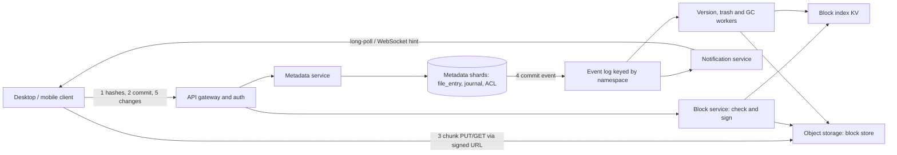

# 📁 Design a File Storage and Sync Service (Dropbox / Google Drive)

> **A content-addressed block store plus a strongly ordered per-namespace change journal.** Bytes are chunked, hashed, deduplicated and kept on object storage; metadata lives in a sharded relational store where every namespace has one totally ordered log; clients converge by replaying that log from a cursor. Follows the [framework](00_FRAMEWORK_AND_ESTIMATION.md).

## Table of Contents

1. [Requirements](#1-requirements)
2. [Estimation](#2-estimation)
3. [API](#3-api)
4. [Data Model](#4-data-model)
5. [High-Level Design](#5-high-level-design)
6. [Deep Dives](#6-deep-dives)
7. [Failure Modes and Scaling](#7-failure-modes-and-scaling)
8. [Observability, Rollout and Cost](#8-observability-rollout-and-cost)
9. [Alternatives and Trade-offs](#9-alternatives-and-trade-offs)
10. [Staff-Level Follow-up Questions](#10-staff-level-follow-up-questions)
11. [Common Mistakes](#11-common-mistakes)

## 1. Requirements

**Functional**

- Upload, download, rename, move, delete files and folders; files up to 50 GB.
- Multi-device sync: a change on one device appears on the user's other devices and on every member of a shared folder.
- Sharing: share a folder with users (viewer/editor) or via a link; permissions are inherited down the tree.
- Version history (30 days) and trash/restore.
- Offline edits on a device sync later, with deterministic conflict handling.

**Non-functional (numeric targets)**

| Property | Target |
|---|---|
| Durability of committed file content | 99.999999999% (11 nines); a committed file is never lost |
| Metadata availability | 99.95% (about 4.4 h/year) for commit and list |
| Change propagation (device A commit to device B notified) | p99 < 5 s while B is online |
| Metadata commit latency | p99 < 300 ms (excluding byte transfer) |
| Consistency | **Linearizable per namespace** (one total order of changes); eventual across namespaces |
| Bandwidth efficiency | Re-uploading an edited large file sends only the changed chunks |
| Scale | 100 M registered users, 30 M DAU, 500 PB logical data |

**Non-goals:** real-time collaborative editing (OT/CRDT documents), full-text search, virus scanning pipeline, content-based ML features, end-to-end encryption with zero-knowledge dedupe.

## 2. Estimation

Assumptions (state them aloud): 100 M users store 5 GB each on average; 30 M DAU make 20 file changes/day; average changed file is 2 MB; each change is pulled by 1.5 other devices; peak = 3.5x average; cross-user and cross-version dedupe plus client-side delta eliminate 60% of upload bytes and dedupe saves 30% of stored bytes.

**Metadata write rate**

- Changes/day = 30 M x 20 = **600 M**; / 86,400 = **~7k commits/s**, peak **~25k/s**.

**Bytes**

- Raw changed bytes/day = 600 M x 2 MB = **1.2 PB**, i.e. 1.2e15 / 86,400 = 13.9 GB/s = **~111 Gbps** raw.
- After delta and dedupe only 40% hits the wire: 0.48 PB/day = 5.6 GB/s = **~44 Gbps avg, ~155 Gbps peak** upload.
- Download upper bound = 1.2 PB x 1.5 devices = 1.8 PB/day = 20.8 GB/s = **~167 Gbps avg, ~580 Gbps peak**.

**Storage**

- Logical = 100 M x 5 GB = **500 PB**; after 30% dedupe = **350 PB unique**; with ~1.5x erasure-coding overhead = **~525 PB physical**.
- New unique data: 0.48 PB/day x 365 = **~175 PB/year**.
- Chunk count at an average stored chunk of 2 MB (small files are one small chunk; large files use 4 MB average): 350 PB / 2 MB = **~175 B chunks**.
- Block index row = 32 B hash + ~8 B location + ~10 B refcount/flags = ~50 B, so 175 B x 50 B = **~8.75 TB** (x3 replicas = 26 TB).

**Chunk traffic and metadata size**

- Hash checks: 1.2 PB / 2 MB = 6e8/day = **~7k/s, peak ~24k/s** (batched); chunk PUTs: 0.48 PB / 2 MB = 2.4e8/day = **~2.8k/s, peak ~10k/s**.
- Files: 100 M x 2,000 = **200 B file entries** (500 PB / 200 B = 2.5 MB average); at ~300 B/row incl. chunk manifest = **60 TB**.
- Versions kept 30 days: 600 M x 30 = 18 B x 300 B = **5.4 TB**.
- Change journal: 600 M/day x 200 B = 120 GB/day = **~44 TB/year** (retain 1 year).
- Total about **110 TB**; at ~1 TB per primary that is **~110 primaries, round to 128 physical shards**, mapped from **4,096 logical shards** (so resharding moves logical shards, not rows).

**Connections for notification**

- 20 M concurrent clients at peak / 100k per gateway = **200 hosts**, **~300 with 50% headroom**.
- Notification events: each commit notifies ~2 parties (1.5 devices + ~0.5 shared-folder members) = 1.2 B/day = **~14k/s, peak ~50k/s**.

**Decisions this implies**

1. **Bytes and metadata are separate planes.** Bytes (500 PB, hundreds of Gbps) go client to object storage via signed URLs, never through the metadata tier. Metadata (110 TB, 25k commits/s) is a sharded relational store.
2. **Dedupe and delta are worth the CPU:** they cut upload from 111 to 44 Gbps and stored bytes by 150 PB logical.
3. **Shard metadata by namespace**, because ordering and transactions are needed only within a namespace.
4. **Block index is a separate 8.75 TB hash-sharded KV store**, not a column of the metadata DB.
5. **A dedicated connection tier (~300 hosts)** for notifications; notifications are hints, correctness comes from cursors.

## 3. API

Auth: OAuth 2 bearer tokens, scopes `files.read`, `files.write`, `sharing`. Bytes move with short-lived (5 min) pre-signed URLs issued per request after an authorization check. All mutating calls accept `Idempotency-Key`. Client apps talk to a regional API; paths are relative to `/v1`.

**Check which chunks are missing (dedupe)**

```http
POST /blocks/check
{ "namespace_id": "ns_81", "hashes": ["sha256:9f2c...", "sha256:1ab7..."] }

200 { "missing": [{ "hash": "sha256:1ab7...", "upload_url": "https://blocks.example/u/...", "expires_in": 300 }] }
```

Presence in the response is not proof of access: the server only treats a hash as "known" for this commit, and later authorizes reads via the file manifest, not via the hash.

**Commit a file version** (the only call that changes the tree)

```http
POST /files/commit
Idempotency-Key: 6f1e0d3c-...
{
  "namespace_id": "ns_81",
  "path": "/Projects/spec.docx",
  "parent_rev": 17,                // rev the client edited; 0 for create
  "mode": "update",                // add | update | rename | move | delete
  "size": 5242880,
  "chunks": [ {"hash": "sha256:9f2c...", "len": 4194304},
              {"hash": "sha256:1ab7...", "len": 1048576} ],
  "client_mtime": "2026-10-08T09:14:02Z"
}

200 { "file_id": "f_77c", "rev": 18, "seq": 90412, "path": "/Projects/spec.docx" }
409 { "error": "conflict", "resolved_path": "/Projects/spec (conflicted copy - laptop - 2026-10-08).docx", "rev": 1, "seq": 90413 }
422 { "error": "missing_chunks", "hashes": ["sha256:1ab7..."] }
```

**Resumable upload of a large chunk set**: each chunk is its own PUT to its `upload_url`; a retry re-PUTs only chunks not yet present (`/blocks/check` again). Chunks are idempotent by content hash, so resume needs no server session state. For a single object over the storage multipart limit, the signed URL points at a multipart upload ID that the client resumes by listing uploaded parts.

**Pull changes** (cursor pagination, never offsets)

```http
GET /sync/changes?cursor=eyJucyI6eyJuc184MSI6OTA0MDB9fQ&limit=500

200 {
  "changes": [ {"ns":"ns_81","seq":90401,"op":"update","file_id":"f_77c","path":"/Projects/spec.docx","rev":18,
                "chunks":[{"hash":"sha256:9f2c...","len":4194304}, ...]} ],
  "cursor": "eyJucyI6...",          // opaque: map of namespace_id to last seq
  "has_more": false
}
410 { "error": "cursor_expired", "action": "full_snapshot" }   // older than journal retention
```

**Wait for changes (long-poll)**

```http
GET /sync/longpoll?cursor=eyJ...&timeout=90
200 { "changes": true }      // or { "changes": false } after timeout; client immediately re-polls
```

A WebSocket variant (`/sync/stream`) pushes `{"ns":"ns_81","head":90412}` hints. Either way the payload is a hint; the client then calls `/sync/changes`.

**Other endpoints:** `GET /files/{id}/manifest`, `GET /files/{id}/versions`, `POST /files/{id}/restore`, `POST /sharing/folders`, `POST /sharing/links`, `GET /sync/snapshot?ns=&cursor=` (paged listing plus head seq, for first sync or expired cursor).

## 4. Data Model

**Access patterns that drive storage:** (1) commit a change to one namespace atomically and in order; (2) read journal entries after seq N for a namespace; (3) resolve path or file_id to the current version; (4) list folder children; (5) "has this hash been stored?"; (6) which namespaces does user U have mounted.

**Metadata store: sharded relational (PostgreSQL or MySQL), shard key = `namespace_id`.** Reason: commit needs a multi-row transaction (journal + file row + head counter) and a row lock to serialize; all of it stays inside one shard. A rename of a folder with a million files is one row update because the tree is keyed by `file_id`/`parent_id`, not by path string.

```sql
-- all tables below live on the shard that owns namespace_id
CREATE TABLE namespace_head (
  namespace_id BIGINT PRIMARY KEY,
  head_seq     BIGINT NOT NULL DEFAULT 0          -- last committed journal seq
);

CREATE TABLE file_entry (
  namespace_id BIGINT NOT NULL,
  file_id      BIGINT NOT NULL,
  parent_id    BIGINT NOT NULL,                   -- 0 = namespace root
  name         TEXT   NOT NULL,
  is_dir       BOOLEAN NOT NULL,
  rev          BIGINT NOT NULL,                   -- per-file version counter
  size         BIGINT,
  manifest_id  BIGINT,                            -- current version's chunk list
  deleted_at   TIMESTAMPTZ,                       -- trash marker, NULL = live
  PRIMARY KEY (namespace_id, file_id)
);
CREATE UNIQUE INDEX uq_child ON file_entry (namespace_id, parent_id, lower(name))
  WHERE deleted_at IS NULL;                         -- folder listing + name uniqueness

CREATE TABLE journal (                              -- the sync source of truth
  namespace_id BIGINT NOT NULL,
  seq          BIGINT NOT NULL,                    -- gapless, assigned under the head row lock
  op           TEXT   NOT NULL,                    -- add|update|move|delete|restore|share
  file_id      BIGINT NOT NULL,
  rev          BIGINT,
  actor_id     BIGINT NOT NULL,
  device_id    TEXT,
  committed_at TIMESTAMPTZ NOT NULL DEFAULT now(),
  payload      JSONB NOT NULL,                     -- path, new parent, manifest ref
  PRIMARY KEY (namespace_id, seq)
);

-- file_version(namespace_id, file_id, rev, manifest_id, size, created_at): 30-day history
-- manifest(manifest_id, chunks BYTEA): immutable packed (hash32, len4) list

CREATE TABLE acl (
  namespace_id BIGINT, principal_id BIGINT, role TEXT,  -- viewer|editor|owner
  PRIMARY KEY (namespace_id, principal_id)
);
```

**User-side tables** (sharded by `user_id`): `mount(user_id, namespace_id, mount_path, role)`; a user's "home" is namespace #1 and each shared folder is another namespace mounted into their tree. A user cursor is the map `{namespace_id: last_seq}` over their mounts.

**Block index** (hash-partitioned KV, 8.75 TB): `hash (32 B) -> {storage_key, len, state, first_seen}`. The object-store key is the hash itself (`blocks/ab/cd/<hash>`), so the index is mostly an existence/GC aid.

**Block store:** object storage, objects are immutable, compressed then encrypted per-block with envelope keys. **Why not a filesystem or DB for bytes:** 350 PB of immutable blobs is exactly object storage's job (11-nines durability, erasure coding, no capacity planning).

**Why one namespace = one shard:** it makes "ordered journal + atomic tree change" a local transaction. The price is a per-namespace write ceiling (section 6.2).

## 5. High-Level Design



**Write path (client saves `spec.docx`)**

1. The client file watcher sees a change, runs content-defined chunking, and computes a SHA-256 per chunk.
2. `POST /blocks/check` with the hashes. The block service looks them up in the block index and returns signed upload URLs for only the missing ones.
3. The client PUTs missing chunks directly to object storage (parallel, resumable per chunk). The block service marks them `committed` after a verifying hash check (server recomputes or object-store checksum matches).
4. `POST /files/commit` with `parent_rev`. The metadata service opens one transaction on the namespace's shard: lock `namespace_head`, verify `parent_rev == file_entry.rev` and that all chunks exist, bump `head_seq`, insert journal row, update `file_entry`, insert `file_version`/`manifest`. Commit.
5. After commit, an outbox row/CDC feeds the event log keyed by `namespace_id`; the notification service pushes a hint to every connected client mounting that namespace.

**Read path (device B syncs)**

1. B is parked in `/sync/longpoll` with its cursor; the hint returns `changes: true`.
2. B calls `/sync/changes?cursor=...`, receiving journal entries after its last seq per namespace, in seq order.
3. For each entry B diffs the manifest against locally present chunks and downloads only missing chunks via signed URLs (delta sync).
4. B reassembles the file to a temp path, verifies the hash, atomically renames it, then persists the new cursor. The cursor is saved only after the apply succeeds, so a crash replays idempotently.

## 6. Deep Dives

### 6.1 Chunking: fixed-size vs content-defined

**Problem.** Dedupe and delta sync only work if an edit changes few chunks. Insert one byte at the start of a 100 MB file: with fixed 4 MB chunks every boundary shifts and all 25 chunks change (100 MB re-uploaded). The boundary must depend on content, not offset.

**Options**

| Option | Edit in the middle (overwrite) | Insert/delete shifts bytes | CPU | Notes |
|---|---|---|---|---|
| Fixed-size (4 MB) | 1 chunk changes | all following chunks change | trivial | Great for VM images, DB files, media (in-place edits, append-only) |
| Content-defined chunking (rolling hash) | 1-2 chunks | 1-2 chunks (boundaries resync) | a few ops/byte | Best for documents, source, archives; variable chunk sizes |

**Pick:** content-defined chunking with a gear/rolling hash, min 1 MB, target ~4 MB, max 8 MB; files under 1 MB are a single chunk; fall back to fixed 4 MB for known in-place-edit types (e.g. disk images) where CDC gives no gain.

```text
# boundary when the low 22 bits of the rolling hash are zero => ~4 MiB expected past min
h = 0; start = 0
for i, byte in enumerate(data):
    h = ((h << 1) + GEAR[byte]) & MASK64          # gear hash, O(1) per byte
    n = i - start + 1
    if n >= MIN and ((h & ((1 << 22) - 1)) == 0 or n >= MAX):
        emit_chunk(start, i + 1); start = i + 1; h = 0
emit_chunk(start, len(data))                        # tail
```

**Cost.** Chunk sizes vary (more manifest bytes: ~36 B per chunk, so a 50 GB file at 4 MB is ~12.5k chunks = 450 KB manifest, fine); chunker CPU on the client (benchmark on low-end laptops and throttle); min/max bounds reduce dedupe slightly. Chunk size is itself a trade-off: smaller chunks dedupe better but inflate index rows (175 B chunks at 2 MB; at 512 KB it would be 4x the index, ~35 TB) and per-request overhead.

**Change my mind if:** telemetry shows the workload is dominated by append-only or in-place binary formats (fixed wins on CPU with equal dedupe), or if the client CPU budget on mobile is a hard constraint (do CDC only on desktop, fixed on mobile).

### 6.2 Strongly consistent ordering of changes per namespace

**Problem.** Sync correctness needs: (a) every client sees the same total order of a namespace's changes; (b) a client that has read up to seq N never misses entry M < N that commits later. A naive database sequence or auto-increment breaks (b): transaction T1 gets seq 100 but commits after T2 (seq 101); a client reading `seq > 99` sees 101 first, advances its cursor to 101, and **never sees 100**.

**Options**

1. **DB sequence / autoincrement + `ORDER BY seq`.** Gaps and out-of-order visibility, so lost updates at the cursor. Rejected.
2. **Timestamp cursors.** Clock skew and equal timestamps; same visibility race. Rejected.
3. **Serialize on a per-namespace head row** and allocate `seq = head_seq + 1` inside the commit transaction. The row lock makes commit order equal seq order and makes the sequence gapless on the visible side: rolled-back transactions release their seq.

**Pick: option 3.**

```sql
BEGIN;
SELECT head_seq FROM namespace_head WHERE namespace_id = $1 FOR UPDATE;   -- serialization point
-- conflict check
SELECT rev FROM file_entry WHERE namespace_id=$1 AND file_id=$2;          -- == parent_rev ?
-- apply
INSERT INTO journal (namespace_id, seq, op, file_id, rev, actor_id, payload) VALUES ($1, $head+1, ...);
UPDATE file_entry SET rev = rev + 1, manifest_id = $m, size = $s WHERE namespace_id=$1 AND file_id=$2;
UPDATE namespace_head SET head_seq = $head + 1 WHERE namespace_id = $1;
COMMIT;
```

**Conflict handling inside the same transaction.** If `parent_rev` does not equal the current `rev`, another device committed first. The loser is **not rejected and not overwritten**: the server commits the incoming content as a new file `name (conflicted copy - <device> - <date>).ext` and returns 409 with the new path. No data is lost, every client sees the same two files because the decision is made once, in the serialized section. Other conflicts: edit vs delete resurrects the edited file; rename into own descendant is rejected by an ancestry check inside the transaction (a cycle would corrupt the tree); two creates of the same name become a conflicted copy via the unique index.

**Cost.** Per-namespace commit throughput is bounded by 1 / (transaction time). At ~5 ms per transaction that is ~200 commits/s per namespace (group commit and batched journal inserts raise it to ~1k/s). Typical personal namespaces see < 1/s, but a company-wide shared folder with 100k members can be hot (section 7). Cross-namespace operations (moving a file from a shared folder to a personal one) are two commits (add in destination, delete in source), ordered add-then-delete so a crash leaves a duplicate, never a loss.

**Change my mind if:** hot team namespaces routinely exceed ~500 commits/s: then partition large namespaces into sub-namespaces by top-level folder (each with its own journal), accepting that ordering across them is no longer total.

### 6.3 Cursor-based sync and change notification at scale

**Problem.** 20 M connected clients must learn about changes within seconds, but delivery must never be the thing correctness depends on. Pushing full change payloads over lossy connections invites missed/duplicate events.

**Options**

| Option | Pros | Cons |
|---|---|---|
| Long-poll (hold up to 90 s) | Works through proxies/firewalls, simple LB | One held request per client; reconnect churn |
| WebSocket / stream with hints | Lowest latency, lowest overhead | Sticky connection state, harder through some proxies |

**Pick:** long-poll as the baseline, WebSocket where available, **both carrying only "namespace N head moved" hints**. The authoritative data path is always `GET /sync/changes?cursor=`, an indexed range scan on `journal (namespace_id, seq)`. The cursor is a map `{ns: last_applied_seq}`.

Notification service: gateway hosts register `connection -> [namespaces]` in memory; commit events (keyed by `namespace_id`) go to the host set subscribed to that namespace via a pub/sub fan-out. A missed hint is repaired because the long-poll request itself compares the supplied cursor with `head_seq` on arrival (return immediately if behind) and every client does a catch-up pull on reconnect and at least every few minutes.

**Cost.** ~300 stateful gateway hosts; thundering herd after a gateway restart (200k+ clients reconnect: jittered backoff and connection draining); cursors force a journal retention policy (1 year; an older cursor gets 410 and a full snapshot rebuild). Journal compaction must keep tombstones long enough for cursors to observe deletes.

**Change my mind if:** most clients are mobile with push services (APNs/FCM-style): drop held connections for those and use push-as-hint, still pulling by cursor.

## 7. Failure Modes and Scaling

| Failure | Impact | Mitigation |
|---|---|---|

**Hot keys**

- **Hot block** (popular installer): object storage serves per-key reads; put a CDN in front of public-link GETs.
- **Hot namespace** (company root folder, 100k members): commit rate limited by head-row lock; mitigate with group commit, per-user rate limits, splitting by top-level folder, and a notification fan-out tree (gateway hosts subscribe once per namespace, not per user).

**Multi-region**

- Each namespace has a **home region** holding its writable metadata shard (strong ordering needs a single leader); other regions hold async replicas for reads and DR (RPO of seconds on region loss; RPO 0 within region via sync replica).

## 8. Observability, Rollout and Cost

**SLIs / SLOs**

| SLI | SLO |
|---|---|
| Commit success rate (non-4xx) | 99.95% monthly |
| Commit latency p99 | < 300 ms |
| End-to-end propagation (commit to hint delivered) p99 | < 5 s |
| Chunk durability: scrubber hash mismatch after repair | 0 |

**Page alerts:** commit error rate > 1% for 5 min; replication lag on any shard > 10 s; head-row lock wait p99 > 500 ms on a namespace; GC about to delete more than X% of blocks in a run (circuit breaker, human approval); scrubber finds an unrecoverable block; notification delivery lag p99 > 30 s.

**Rollout**

1. Ship the block store and chunk APIs first (dark: clients still use legacy whole-file upload); dual-write manifest and journal and verify 1% samples hash-equal.
2. Canary the cursor-pull protocol by cohort, keeping legacy polling as fallback.
3. Backfill existing files into chunked form lazily or offline; verify counts and hashes before deleting any legacy copy.
4. Cut over, keep the legacy read path for one release, then clean up. GC ships in report-only mode for weeks before it deletes anything.

**Cost drivers (illustrative unit prices, to be replaced with contract rates)**

1. **Storage:** 525 PB x $0.01/GB-month = 5.25e8 GB x $0.01 = **~$5.25 M/month**. Levers: dedupe already removes 150 PB logical (~225 PB physical, ~$2.25 M/month); move blocks untouched for 90+ days to an infrequent-access tier; cap version history at 30 days; compress blocks; aggressive GC of orphans and expired trash.
2. **Egress:** 1.8 PB/day = 54 PB/month = 5.4e7 GB x $0.02 = **~$1.1 M/month**. Levers: delta download (only missing chunks), CDN/peering, LAN sync between devices on the same network.

## 9. Alternatives and Trade-offs

| Decision | Chosen | Alternative | Why chosen / revisit when |
|---|---|---|---|
| Chunking | Content-defined, 1/4/8 MB | Fixed 4 MB | Better delta for inserts; revisit if CPU-constrained or in-place binaries dominate |
| Dedupe scope | Global within region | Per-user or per-team | ~30% storage savings; scoped is safer against side channels at lower savings |
| Metadata store | Sharded relational by namespace | Global distributed SQL / KV | Multi-row txn per namespace and cheap range scans; revisit if cross-namespace transactions dominate |
| Ordering | Head-row lock, gapless seq | DB sequence + watermark | Simple correct cursors; revisit above ~500 commits/s per namespace |
| Conflicts | Conflicted copy | Last-writer-wins / OT merge | Never loses data; OT only fits known document formats |
| Chunk deletion | Mark-and-sweep GC with grace | Live refcount | Refcount races cause data loss; costs storage lag |

## 10. Staff-Level Follow-up Questions

**1. How do you stop one user from learning that another user stored a particular file (dedupe side channel)?**
The attack: claim a hash you do not own and see that no upload is required, which reveals the file exists. Mitigations: never authorize a read by hash, only through a manifest in a namespace the caller can read; for the first claim of a hash by a namespace, require proof of possession (server picks random byte ranges of the chunk, client returns hashes of those ranges) before treating it as present; or restrict dedupe to within an account/team and accept less savings. State the trade-off: global dedupe saves ~30%, scoped dedupe maybe 10-15% (assumption to measure).

**2. A user deletes a 5 GB folder by mistake; how does restore work, and when are bytes freed?**
Delete is a journal entry plus `deleted_at` on `file_entry` (soft delete), so restore is a metadata commit that clears the tombstone and re-journals it; no bytes move. Bytes are freed only when GC proves no manifest (live, version, or trash) references a chunk, after the retention window (e.g. 30 days) plus a 7-day safety grace. Trash counts toward quota or not as a product choice; either way, retention is a cost lever (section 8).

**3. How would you support a 50 GB file on a flaky connection?**
Chunk-level resume: each chunk is PUT and verified independently by hash, so an interruption costs at most one chunk. The client persists its chunk plan locally and re-chunks only if mtime/size changed. The single commit with the full manifest happens at the end; nothing is visible before it.

**4. Two people rename the same folder differently at the same time. What happens?**
Both are `move/rename` ops on the same `file_id`; the head lock serializes them and the second carries a stale `parent_rev`. Folder rename conflicts have no content to preserve, so the policy is last committed wins, with the loser's client receiving a journal entry that overrides its local change; the UI shows a notification. This differs from file content conflicts where we always preserve both versions.

**5. How do you do the very first sync of an account with 2 M files, or after an expired cursor?**
Call `/sync/snapshot`, which pages a listing of the tree at a consistent `head_seq` (the snapshot records the head at start, listing reads the tree under a consistent read), then switch to `/sync/changes` from that seq. Changes committed during the listing are replayed from the journal and applied idempotently. Pages are keyed by `(parent_id, name)` cursors to keep each page an index range scan.

**6. What breaks first at 10x scale?**
Likely candidates: the egress/storage bill (cost scales linearly), the hot-namespace head row for large teams, and the connection tier (2,000+ gateway hosts, reconnect storms). Metadata scales horizontally via logical shards, and the block index is a hash-sharded KV so it scales out too. I would measure per-namespace commit rate distribution and gateway reconnect behavior before building anything.

**7. Why not use the filesystem path as the primary key?**
Renaming a directory with 1 M children would rewrite 1 M rows and journal 1 M events. Keyed by `file_id` with a `parent_id` pointer it is one row and one journal entry. The cost is path resolution by walking parents (cache or materialize ancestry) and a cycle check on move.

**8. How does sharing interact with sync?**
A shared folder is its own namespace with its own journal; each member mounts it into their tree. Permission checks run at commit and at signed-URL issuance, and URLs are short-lived so revocation takes effect within minutes. Revoking also removes the mount from the revoked user's cursor map.

## 11. Common Mistakes

- **Sending file bytes through the metadata/API servers.** At ~44 Gbps average upload this is the first thing that melts; use signed URLs to object storage.
- **Live reference counting for chunk deletion**, causing races between a new commit and a decrement; use mark-and-sweep with a grace period.

**Previous:** [Video Streaming](06_VIDEO_STREAMING.md) · **Next:** [Payment Ledger](08_PAYMENTS_LEDGER.md) · **Framework:** [00 Framework and Estimation](00_FRAMEWORK_AND_ESTIMATION.md)
