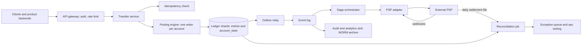

# 💳 Design a Payment / Wallet Ledger

> **An immutable double-entry ledger where balances are derived state, every write is idempotent, and every external call is assumed to have an unknown outcome until reconciled.** The hard parts are concurrency on accounts, cross-shard transfers, and PSP timeouts, not CRUD. Follows the [framework](00_FRAMEWORK_AND_ESTIMATION.md); related: [Distributed Transaction Patterns](../cs-interview/distributed-systems/DISTRIBUTED_TRANSACTION_PATTERNS.md) and the [Payment Processing LLD](../python-low-level-design/payment-processing-system/HIGH_LEVEL_DESIGN.md).

## Table of Contents

1. [Requirements](#1-requirements)
2. [Estimation](#2-estimation)
3. [API](#3-api)
4. [Data Model](#4-data-model)
5. [High-Level Design](#5-high-level-design)
6. [Deep Dives](#6-deep-dives)
7. [Failure Modes and Scaling](#7-failure-modes-and-scaling)
8. [Observability, Rollout and Cost](#8-observability-rollout-and-cost)
9. [Alternatives and Trade-offs](#9-alternatives-and-trade-offs)
10. [Staff-Level Follow-up Questions](#10-staff-level-follow-up-questions)
11. [Common Mistakes](#11-common-mistakes)

## 1. Requirements

**Functional**

- Wallet accounts holding balances in one or more currencies.
- Transfers between accounts (payer to merchant, with fee legs), top-ups from cards/bank via an external PSP, and payouts to bank accounts.
- Refunds and reversals; holds (authorizations) that reduce available balance before settlement.
- Query balance and paginated statement per account.
- Daily reconciliation against PSP settlement files; exception queue for mismatches.
- Full audit trail: who, what, why, when, for every balance change.

**Non-functional (numeric targets)**

| Property | Target |
|---|---|
| Correctness | Money is never created or destroyed: sum of all entries per transaction per currency = 0; no lost or duplicate effects under retries |
| Durability | Zero loss of acknowledged transactions (synchronous replication, RPO 0) |
| Write latency | p99 < 200 ms for a same-shard transfer; < 500 ms for cross-shard |
| Write latency | p99 < 200 ms same-shard transfer; < 500 ms cross-shard |
| Availability | 99.95% for transfers (about 4.4 h/year); balance reads 99.99% |
| Throughput | 580 tps average, 3k tps peak (derived below) |
| Retention | 7 years, immutable (jurisdiction-dependent; confirm with compliance) |
| Reconciliation | Unexplained exceptions < 0.01% of PSP-involved transactions, resolved within 2 business days |

**Non-goals:** card network internals and PCI card storage (we hold tokens only), fraud/risk scoring (we expose hooks), KYC/AML workflows, tax, general-purpose accounting (GL, invoicing), crypto.

## 2. Estimation

Assumptions: 50 M transactions/day; each posts on average **4 entries** (debit payer, credit merchant, fee debit, fee credit); peak = 5x average (payday, flash sale); 30% of transactions touch a PSP; an entry row is ~150 B of data and ~300 B with indexes.

**Throughput**

- 50 M / 86,400 = **~580 tx/s** average; peak 5x = **~2.9k, call it 3k tx/s**.
- Entries: 200 M/day / 86,400 = **~2.3k entries/s**, peak **~12k entries/s**.
- Row writes per transaction ~10 (4 entries, 4 account-balance updates, 1 transaction row, 1 idempotency row). Peak = 3k x 10 = **30k row writes/s**.
- A well-tuned primary does ~5-20k simple writes/s (framework). At ~10k/s per primary and 50% headroom (5k usable): 30k / 5k = **6 primaries; round to 8 physical shards**, mapped from **64 logical shards** for resharding.

**Storage**

- 200 M entries x 300 B = **60 GB/day**; x 365 = **21.9 TB/year**; 7 years = **~153 TB**.
- Online (hot) window of 13 months = 60 GB x 395 = **~24 TB**; older months move to compressed, write-once archive.

**Hot accounts**

- The platform's fee account receives one credit per transaction: 580/s average, **3k/s at peak**. A single row updated under a lock handles roughly 500-1,000 updates/s (1-2 ms lock hold). That is a guaranteed bottleneck, so it must be designed around (section 6.1).

**Reconciliation**

- 30% x 50 M = **15 M PSP-involved rows/day** x 150 B = **~2.25 GB settlement data/day**; a nightly batch join, no streaming needed.
- 0.01% exception target = **~1,500 exceptions/day** to triage.

**Decisions this implies**

1. **Append-only entries plus a derived balance row**, because the audit/immutability requirement and the money invariant are both satisfied by never updating entries.
2. **Multiple primaries are required eventually (8 at peak), but 580 tps average fits one primary.** v1 is a single synchronous-replica Postgres up to ~1k tps; shard by account only once measured.
3. **Almost every transfer is cross-shard** once sharded (with 8 shards, 7/8 of random pairs), so cross-shard atomicity is the common case, not an edge case.
4. **Hot credit-only accounts need a design** (sub-accounts), not a bigger machine.
5. **Reconciliation is a batch pipeline**, small data, high correctness stakes.

## 3. API

Auth: service-to-service OAuth 2 client credentials or mTLS; end-user calls come via the product backend, never directly. Scopes: `ledger.write`, `ledger.read`. Amounts are **integers in minor units** with an explicit ISO 4217 currency; never floats. Every mutating endpoint requires `Idempotency-Key` (client generated UUID, scoped to the caller).

**Create a transfer**

```http
POST /v1/transfers
Idempotency-Key: 2c8e1e0b-6a57-4d62-9c11-0f5d0f2a77aa
{
  "from_account": "acc_payer_9",
  "to_account":   "acc_merch_42",
  "amount": 12500, "currency": "USD",
  "fees": [ { "to_account": "acc_platform_fee", "amount": 375 } ],   // taken from payee
  "reference": "order_7731",
  "metadata": { "channel": "app", "actor": "user_9" }
}

201 { "transfer_id": "tr_01J...", "status": "POSTED", "entries": 4, "posted_at": "2026-10-08T09:14:02Z" }
202 { "transfer_id": "tr_01J...", "status": "PENDING" }               // cross-shard in flight; poll or webhook
200 (replay of same key + same body) -> original response, header Idempotent-Replayed: true
409 { "error": "idempotency_in_progress" }                           // first attempt still running
422 { "error": "idempotency_key_reused", "detail": "different request body" }
402 { "error": "insufficient_funds", "available": 4000 }
```

**Top-up from a card via PSP** (asynchronous)

```http
POST /v1/topups
Idempotency-Key: 91a6...
{ "account": "acc_payer_9", "amount": 5000, "currency": "USD", "payment_method_token": "pm_tok_123" }

202 { "topup_id": "tp_77", "status": "AUTHORIZING" }
```

States: `CREATED -> AUTHORIZING -> CAPTURED -> POSTED` or `FAILED` or `UNKNOWN` (outcome not yet determined). Wallet credit is posted only on confirmed capture.

**Other endpoints**

| Endpoint | Notes |
|---|---|
| `GET /v1/accounts/{id}/entries?cursor=&limit=100` | Cursor = per-account `account_seq`, strictly increasing: no offsets, no skips |
| `POST /v1/transfers/{id}/reverse` | Posts compensating entries; idempotent; reason code required |
| `POST /v1/holds` (+ `/capture`, `/release`) | Reserve available balance without moving money |
| `POST /v1/payouts` | Debits wallet into a `payout_in_transit` account, then PSP call |
| `GET /v1/accounts/{id}/balance` | `{ "ledger": 85000, "available": 80000, "as_of_seq": 5512, "currency":"USD" }`; `?consistent=true` reads the primary |

## 4. Data Model

**Access patterns:** (1) post a multi-entry transaction atomically; (2) check and update an account's balance under concurrency; (3) look up a transaction by idempotency key; (4) statement per account, newest first, by cursor; (5) reconciliation join by `external_ref`; (6) audit queries by actor/time.

**Store: relational (PostgreSQL), sharded by `account_id`.** Reason: ACID multi-row transactions, CHECK constraints (`balance >= 0`), unique constraints for idempotency and per-account sequencing, mature replication and backup. A KV store would force us to rebuild all four.

```sql
CREATE TABLE account (
  account_id      BIGINT PRIMARY KEY,
  owner_id        BIGINT NOT NULL,
  kind            TEXT   NOT NULL,         -- wallet | merchant | psp_clearing | fee | transit | fx_position
  currency        CHAR(3) NOT NULL,        -- one currency per account
  allow_negative  BOOLEAN NOT NULL DEFAULT false,
  status          TEXT NOT NULL,           -- active | frozen | closed
  parent_account  BIGINT                   -- set for hot-account sub-accounts
);

CREATE TABLE ledger_transaction (          -- one business event, immutable
  tx_id           UUID PRIMARY KEY,
  idempotency_key TEXT NOT NULL,
  caller_id       TEXT NOT NULL,
  request_hash    BYTEA NOT NULL,          -- detects same key, different body
  kind            TEXT NOT NULL,           -- transfer | topup | payout | reversal | fx
  external_ref    TEXT,                    -- PSP reference for reconciliation
  reverses_tx_id  UUID,
  created_at      TIMESTAMPTZ NOT NULL DEFAULT now(),
  metadata        JSONB,
  UNIQUE (caller_id, idempotency_key)
);

CREATE TABLE ledger_entry (                -- append-only: no UPDATE, no DELETE
  account_id   BIGINT NOT NULL,
  account_seq  BIGINT NOT NULL,            -- 1,2,3... per account, gapless
  tx_id        UUID   NOT NULL,
  amount       BIGINT NOT NULL,            -- signed minor units; credit +, debit -
  currency     CHAR(3) NOT NULL,
  balance_after BIGINT NOT NULL,
  prev_hash    BYTEA, entry_hash BYTEA NOT NULL,  -- per-account hash chain
  posted_at    TIMESTAMPTZ NOT NULL DEFAULT now(),
  PRIMARY KEY (account_id, account_seq)
);
CREATE INDEX ix_entry_tx ON ledger_entry (tx_id);

CREATE TABLE account_state (               -- DERIVED; can be rebuilt from entries
  account_id   BIGINT PRIMARY KEY,
  balance      BIGINT NOT NULL,
  held         BIGINT NOT NULL DEFAULT 0,
  last_seq     BIGINT NOT NULL,
  last_hash    BYTEA,
  CHECK (balance >= 0 OR /* allow_negative accounts enforced in code */ true)
);
```

Notes:

- **Sign convention:** wallet balances are credit-positive. Top-up of 5,000: `psp_clearing -5000`, `wallet +5000`. Invariant per transaction per currency: `SUM(amount) = 0`, enforced by the posting service and verified by a deferred constraint trigger and a nightly job.
- **Sharding:** `account_id` (hash to a logical shard). `ledger_transaction` is stored on the shard of the transaction's first (originating) account; an entry always lives on its own account's shard. Idempotency uniqueness is therefore enforced on the originating shard, so retries must route by the same key (route by the originating account, which is part of the request).
- **Outbox table** (`outbox(event_id, topic, payload, published_at)`) is written in the same transaction as the entries; a relay publishes it to the log.

## 5. High-Level Design



**Write path (same-shard transfer)**

1. Gateway authenticates the caller and passes the `Idempotency-Key`.
2. Transfer service opens one DB transaction on the originating shard: `INSERT ledger_transaction` with the unique `(caller_id, idempotency_key)`. A conflict means a retry: load and return the stored result (or 409 if still in progress).
3. Posting engine locks the affected `account_state` rows in a **fixed order (ascending account_id)** to avoid deadlocks, checks `balance - held >= amount` for debits, assigns `account_seq = last_seq + 1`, inserts the entries with `balance_after` and hash, updates `account_state`, writes the outbox row.
4. Commit (synchronously replicated). Respond 201.
5. Outbox relay publishes `transfer.posted`; downstream consumers (notifications, analytics, audit sink) dedupe on `event_id`.

**Write path (cross-shard transfer, saga with transit accounts)**

1. Originating shard A, one local transaction: debit payer, credit `transit_A` (check funds here), record transfer state `DEBITED`.
2. Saga orchestrator (driven by the outbox event) calls shard B: debit `transit_B`, credit payee, idempotency key = `transfer_id + "leg2"`. Record `CREDITED`.
3. On permanent failure of leg 2 (account closed): compensate on A by posting the reverse of leg 1 (`transit_A -> payer`). State `REVERSED`.
4. Mark `POSTED`. At rest, `transit_A + transit_B = 0` globally; any residual is in-flight money, monitored.

**Read path:** balance reads hit `account_state` (primary for `consistent=true`, replica otherwise with `as_of_seq`); statements range-scan `ledger_entry (account_id, account_seq)` by cursor. Money-affecting decisions (overdraft checks) never read from replicas.

## 6. Deep Dives

### 6.1 Concurrency control on accounts (and hot accounts)

**Problem.** Two concurrent debits of 80 against a balance of 100 must not both succeed, and 3k credits/s into one fee account must not serialize on one row.

**Options**

| Option | How | Pros | Cons |
|---|---|---|---|
| Pessimistic row lock | `SELECT ... FOR UPDATE` on `account_state`, ordered by account_id | Simple, correct, no retries | Lock held for whole transaction; contention on hot rows; deadlock if order not fixed |
| Optimistic version | `UPDATE account_state SET balance=balance-?, last_seq=last_seq+1 WHERE account_id=? AND last_seq=? AND balance>=?`; 0 rows updated means retry | Short lock window, natural fit with `PRIMARY KEY (account_id, account_seq)` | Retry storms under contention; app-level retry loop |
| Serialized per-account writer (actor / partitioned queue, one thread per account) | Route all ops for an account to one worker | No locks, batching of many ops into one DB txn, highest throughput per hot account | Needs routing layer and failover; latency from queueing |

**Pick:** pessimistic ordered locking (v1, simplest and fully correct), with the unique `(account_id, account_seq)` constraint as a backstop invariant that rejects any out-of-order writer, and **a serialized/batched writer only for accounts that measure hot.**

```sql
-- inside the posting transaction; lock in ascending account_id order
SELECT balance, held, last_seq FROM account_state
 WHERE account_id IN ($payer, $payee, $fee) ORDER BY account_id FOR UPDATE;
-- check: payer.balance - payer.held >= amount, else ROLLBACK -> 402
INSERT INTO ledger_entry (account_id, account_seq, tx_id, amount, currency, balance_after, ...)
VALUES ($payer, $payer_seq+1, $tx, -12500, 'USD', $payer_bal-12500, ...), (...);
UPDATE account_state SET balance = balance - 12500, last_seq = last_seq + 1 WHERE account_id = $payer;
```

**Hot credit-only accounts.** The key observation: **credits never need a balance check**, so they need not serialize on the balance. Pick for fee/merchant-aggregate accounts: **N sub-accounts** (e.g. 32) selected by `hash(tx_id) % 32`; each takes ~3,000 / 32 = **~94 credits/s at peak**, far below a row's ~500-1,000/s ceiling. The logical balance is `SUM` over sub-accounts (a cached sum refreshed asynchronously for display; exact when needed for payout, which is rare and can briefly lock). Alternative: pure append with no `account_state` update for the fee account and a periodic balance snapshot (`snapshot + SUM(entries since seq)`).

**Cost.** Ordered locks mean a long transaction holds locks across the network if the saga is inside it (so keep external calls out of DB transactions, always). Sub-accounts complicate statements (union across children) and "available balance" for the merchant. Optimistic retries need jitter and caps.

**Change my mind if:** measured p99 lock wait > 50 ms on non-hot accounts (go optimistic), or a single payer account is itself hot (an exchange, a marketplace payout account): move it to the serialized writer with batching, which can turn 1,000 ops into one transaction.

### 6.2 Exactly-once effect, saga with a PSP, and unknown outcomes

**Problem.** Networks give at-least-once delivery at best. A client retries a transfer; a consumer re-reads an event; the PSP call times out after our request left but before we saw a response. We must never double-post and never lose or mis-state money.

**Layered defense (exactly-once-effective = at-least-once delivery + idempotent effect)**

1. **API idempotency:** `UNIQUE (caller_id, idempotency_key)` inserted in the same transaction as the entries, so "key recorded" and "money moved" are atomic. Same key + different `request_hash` is 422.
2. **Consumers:** every event handler derives its ledger transaction id deterministically from the event (`tx_id = uuid5(event_id)`), so a redelivery violates the unique key and becomes a no-op; or keeps a `processed_event(event_id)` table in the same transaction.
3. **PSP calls:** send our stable `payment_id` as the PSP's idempotency key (where supported) so a retried call cannot double-charge.

**Unknown outcome (timeout after sending to the PSP).** The payment moves to `UNKNOWN`, **never** to `FAILED`. Rules:

```text
call_psp(payment):
    mark payment AUTHORIZING (persist BEFORE the call, with attempt id)
    try:   resp = psp.capture(idempotency_key=payment.id, ...)    # short timeout
    except Timeout/5xx/ConnectionReset:
        mark UNKNOWN; schedule inquiry with backoff (5s, 30s, 5m, 1h ...)
        return                                  # do NOT credit wallet, do NOT release funds yet
resolve_unknown(payment):                       # inquiry worker
    s = psp.get_by_merchant_reference(payment.id)
    CAPTURED -> post psp_clearing -> wallet; FAILED/NOT_FOUND(after window) -> mark FAILED
    still unknown after deadline -> leave UNKNOWN, ops queue; settlement file will decide
```

Asymmetric safety: for a **top-up**, unknown means "do not credit yet" (user waits, no loss to us). For a **payout** (money leaves us), the wallet was already debited into `payout_in_transit`; unknown means "do not re-send as a new payout" (could pay twice) and do not refund until the PSP confirms failure. Webhooks are deduped by PSP event id and applied through a **monotonic state machine** (`CREATED < AUTHORIZING < CAPTURED < POSTED`; terminal states never regress), so out-of-order or duplicate webhooks are harmless.

**Reconciliation as the backstop.** Daily settlement file (~15 M rows, 2.25 GB) is joined to ledger transactions on `external_ref`:

| Case | Meaning | Action |
|---|---|---|
| Matched, amounts equal | Normal | Mark reconciled; compare fee to expected |
| In PSP file, not in ledger | PSP captured, we think failed/unknown | Post the missing entries (or refund at PSP); alert |
| In ledger, not in PSP file | We think success, PSP disagrees | Hold or reverse; investigate within the PSP's cutoff window |
| Amount/currency mismatch | Partial capture, FX difference, fee change | Post adjusting transaction to a `fees`/`fx_diff` account; ops review |
| Duplicate in file | PSP double-charged | Refund via PSP; claim in dispute |

Corrections are always **new entries that reference the original** (`reverses_tx_id`), never updates. Also reconcile the bank statement against the PSP payout to close the loop (three-way: ledger, PSP, bank).

**Cost.** A UNKNOWN state means more states in every UI and support flow, inquiry workers with their own SLOs, and a permanent ops queue (~1,500 exceptions/day at target). Cross-shard sagas add latency (extra hop) and an in-flight transit balance that finance must understand.

**Change my mind if:** a single primary suffices (<= ~1k tps), in which case skip cross-shard sagas entirely and do every transfer as one local ACID transaction; or if the PSP provides reliable synchronous idempotent APIs and settlement within hours, shrinking the UNKNOWN window.

### 6.3 Immutability, audit, and multi-currency correctness

**Problem.** "Balances are derived" only holds if entries cannot be altered, and every mistake must be fixable without rewriting history; multi-currency must not leak or invent value through rounding.

**Immutability options:** (a) application convention only; (b) DB-enforced: revoke `UPDATE/DELETE` on `ledger_entry` from all roles, add a trigger that raises on mutation, and run migrations through a break-glass role; (c) cryptographic: per-account hash chain (`entry_hash = H(prev_hash || canonical(entry))`) plus a daily Merkle root of all entry hashes written to WORM storage and optionally an external timestamp. **Pick (b) + (c).** Auditors can verify any statement from the archive without trusting the live DB, and an alteration breaks the chain from that point on.

**Corrections:** errors are fixed by reversal + repost with `reason`, `approved_by`, `ticket_id`; two-person approval for manual adjustments above a threshold. **Derived-state repair:** `account_state` can always be rebuilt from entries; a nightly job recomputes a sample (and all accounts weekly) and alerts on any drift.

**Multi-currency.** One currency per account; entries carry currency; invariant is `SUM(amount) = 0` **per currency per transaction**. An FX conversion of 100.00 USD to EUR at 0.9200 is two linked transactions:

```text
tx1 (USD): user_usd -10000, fx_position_usd +10000
tx2 (EUR): fx_position_eur -9200, user_eur +9200      # rate and rate_id stored in metadata
```

The balances of `fx_position_*` accounts are the platform's currency exposure and the P&L source. Amounts are integer minor units with per-currency exponent (JPY 0, USD 2, KWD 3). Rounding mode is specified once per product (e.g. round-half-even on the credit side) and the sub-unit residual is posted to a `rounding` account so nothing vanishes.

**Cost.** Hash chains require per-account serialization (already needed) and canonical serialization discipline; archive/verification jobs; FX needs rate snapshots with expiry (a quote id, not "current rate") so retries reuse the same rate.

**Change my mind if:** regulators require a managed immutable ledger service or a specific attestation, or volumes make per-entry hashing a bottleneck (move to batch hashing per block of entries).

## 7. Failure Modes and Scaling

| Failure | Impact | Mitigation |
|---|---|---|
| Client retries after timeout | Double charge risk | Idempotency key unique in the posting transaction; replay returns original result |
| Shard primary fails | Its accounts cannot transact | Sync replica promotion (RPO 0, RTO < 1 min); other shards unaffected; clients retry with same key |
| Crash between saga legs | Money sits in `transit_A` | Saga state persisted on shard A; orchestrator resumes from `DEBITED`; alert if in-flight > 5 min |
| PSP timeout / outage | Top-ups and payouts stall | `UNKNOWN` state, inquiry with backoff, circuit breaker, fail over to secondary PSP for **new** attempts only |

**Scaling path** (hot keys: sub-accounts per 6.1; serialized batching writer for very large payers): (1) single primary + sync replica to ~1k tps; (2) read replicas for statements; (3) shard by `account_id` (8 physical, 64 logical) once peak write rows approach 5k/s per primary; (4) cold entries to archive. Cross-shard transfers get costlier with more shards; if most transfers are intra-merchant-cluster, consider co-locating accounts (shard by owner/tenant) so the common case stays local.

**Multi-region:** a ledger shard has **one writable home region** (money needs a single order). Region failover is a **controlled** promotion of the synchronous or near-synchronous replica, since an automatic split-brain double-spend is far worse than 10 minutes of downtime. Reads and statements can be served from regional replicas. Active-active would require partitioning accounts by region (each account's home) with cross-region transfers as sagas (RTT 80-250 ms), accepting higher latency for cross-region payments.

## 8. Observability, Rollout and Cost

**SLIs / SLOs**

| SLI | SLO |
|---|---|
| Transfer success rate (excluding insufficient funds / validation) | 99.95% |
| Same-shard transfer latency p99 | < 200 ms |
| Cross-shard saga completion | p99 < 2 s; 99.99% within 5 min |
| Ledger invariants (global sum per currency; per-tx sum) | exactly 0, checked hourly and nightly |
| `UNKNOWN` payments older than 24 h | < 0.01% of PSP transactions |

**Page-level alerts:** any invariant violation (immediately, with the posting kill-switch for the affected shard); transit account balance non-zero with no in-flight transfers; saga in-flight > 5 min; outbox lag > 30 s; replication lag > 5 s; settlement file missing by cutoff; hash chain verification failure; idempotency 422 spike (client bug); lock wait p99 spike.

**Rollout**

1. Shadow ledger: post entries in parallel with the legacy system **without** moving real balances; compare balances daily to zero difference.
2. Cut over one low-risk product/currency behind a kill-switch; ramp 1%, 10%, 50%; keep reconciliation on both paths.
3. Migrate historical balances as audited opening-balance entries, never by writing `account_state` directly; additive-only schema changes.
4. Shard only after load tests show the single-primary ceiling; game-day failover and a PSP outage before launch.

**Cost drivers**

1. **Database fleet:** 8 primaries + synchronous replicas + read replicas for ~24 TB hot data; levers: archive after 13 months, partition pruning, batch posting for hot accounts.
2. **PSP fees** (usually the largest line by far): per-transaction plus percentage; levers are routing logic, reducing failed-and-retried attempts, and fee reconciliation to catch overcharges.

## 9. Alternatives and Trade-offs

| Decision | Chosen | Alternative | Why chosen / revisit when |
|---|---|---|---|
| Model | Double-entry, append-only entries | Mutable balance + log | Audit and invariants for free |
| Concurrency | Ordered pessimistic locks; serialized writer for hot accounts | Optimistic version only | Correct and simple; go optimistic if lock waits hurt |
| Store | Sharded PostgreSQL | KV store / purpose-built ledger DB | Constraints and transactions; revisit if cross-shard share dominates |
| Cross-shard | Saga with transit accounts | 2PC / distributed SQL | No blocking coordinator; costs in-flight visibility. See [transaction patterns](../cs-interview/distributed-systems/DISTRIBUTED_TRANSACTION_PATTERNS.md) |
| Timeouts | `UNKNOWN` + inquiry + reconciliation | Retry blindly / mark failed | A failed-guess can lose or double money |

## 10. Staff-Level Follow-up Questions

**1. Why store balances at all if entries are the truth?**
Overdraft checks and balance reads need O(1) access; summing millions of entries per request is not viable. `account_state` is a cache that lives inside the same transaction as the entries, so it is never ahead of or behind them, and it carries `last_seq` and `last_hash` so it can be verified and rebuilt. The rule is that entries are authoritative and any drift is a Sev-1 to be repaired by replay, not by editing the balance.

**2. A payer double-clicks "Pay" and the mobile app also retries on a flaky network. How many charges happen?**
One, if the client reuses the same idempotency key for the same logical action (generated when the user taps, persisted across retries). Two different keys are two intents, which the ledger cannot distinguish; products add a second layer, such as a natural dedupe key (`order_id` unique per payee) or short-window duplicate detection, to guard against clients that regenerate keys. The key point is that dedupe by natural business key is a product rule layered on top of idempotency.

**3. Why not use two-phase commit across shards?**
2PC blocks participants while the coordinator is unavailable and holds locks across network round trips, so one slow shard stalls transfers on the others and availability multiplies down. A saga with a transit account keeps each leg a short local transaction, makes the in-flight state explicit and queryable, and compensates on failure. The price is that intermediate states are visible (money in transit), so product semantics and finance reporting must treat them correctly; at low volume where one primary suffices, avoid the problem entirely.

**4. How do you handle a hold that is never captured?**
A hold increases `held` in `account_state` with an expiry; available balance is `balance - held`. A sweeper releases expired holds idempotently. Capture converts a hold to entries for at most the held amount; more requires a new authorization. Holds are not money movement, so they create no postings until captured.

**5. How do you do a point-in-time balance for an audit ("balance of account X at 2026-03-31 23:59:59")?**
Find the last entry with `posted_at <= T` for the account (index on `account_id, posted_at` per partition or binary search on `account_seq`), and read its `balance_after`. Because entries are immutable and corrections are later entries, the answer for a past instant never changes, and a late correction appears as a later entry rather than a rewrite. For the archived period the same query runs against the write-once store.

**6. The PSP reports a settlement amount that is 30 cents lower than our expected amount for a batch. What do you do?**
Classify first: per-transaction fee differences, FX rate difference, chargebacks netted in the batch, or a missed transaction. The reconciliation engine matches line by line and attributes variances to categories; fee and FX differences post to `psp_fee_variance`/`fx_diff` with a reference to the settlement line, and unmatched residuals become exceptions for ops. We never force the total to match by plugging a number; the aim is that every cent is attributable to an entry.

**7. How would you move from a single Postgres to sharded without downtime?**
Add the logical shard map first (64 logical shards all on one physical host), route all access through it, then move logical shards one at a time: replicate, quiesce writes for that shard for a few seconds via a per-shard fence, verify `last_seq` and hash match, flip the map. Because each account's entries form a hash chain with a gapless sequence, verification of the copy is exact. Idempotency data moves with the originating-shard rows, and clients keep their keys.

**8. What guarantees do you give for event consumers?**
At-least-once, in per-account order (log partitioned by account_id), each event carrying `event_id` and `account_seq`. Consumers must be idempotent (e.g. `MERGE` on `event_id`). A gap in `account_seq` means a missed event and triggers a re-read from the ledger, which is the source of truth rather than the log.

## 11. Common Mistakes

- **Storing money as floats** or a single mutable `balance` column with no entries: no audit trail and no way to explain a discrepancy.
- **Making the idempotency check separate from the money movement** (Redis check, then DB write) so a crash between them double-posts or loses the key.
- **No reconciliation:** webhooks are not reliable; settlement files and bank statements are the only independent truth.
- **Treating a timeout as failure** and refunding or retrying with a new idempotency key; it may have succeeded.

**Previous:** [File Storage and Sync](07_FILE_STORAGE_AND_SYNC.md) · **Framework:** [00 Framework and Estimation](00_FRAMEWORK_AND_ESTIMATION.md)
