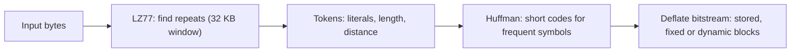
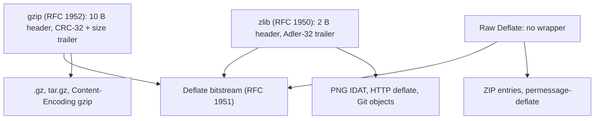
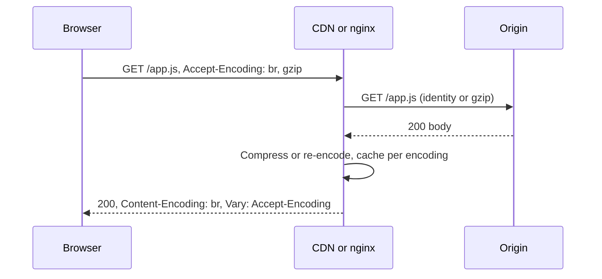
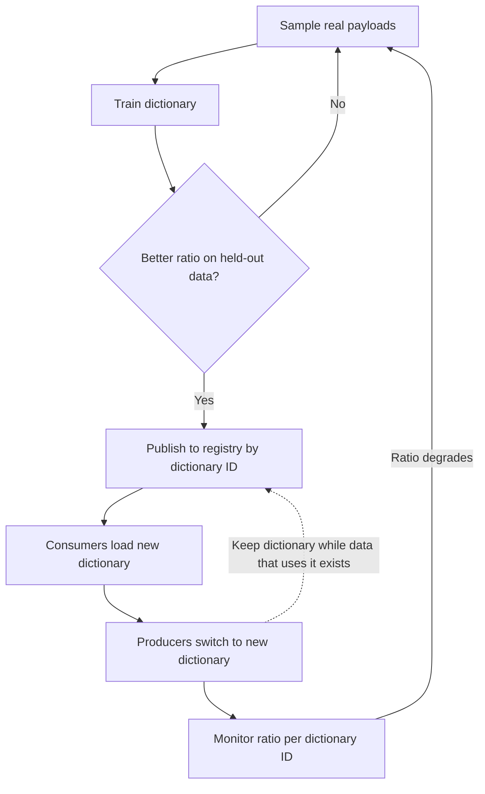
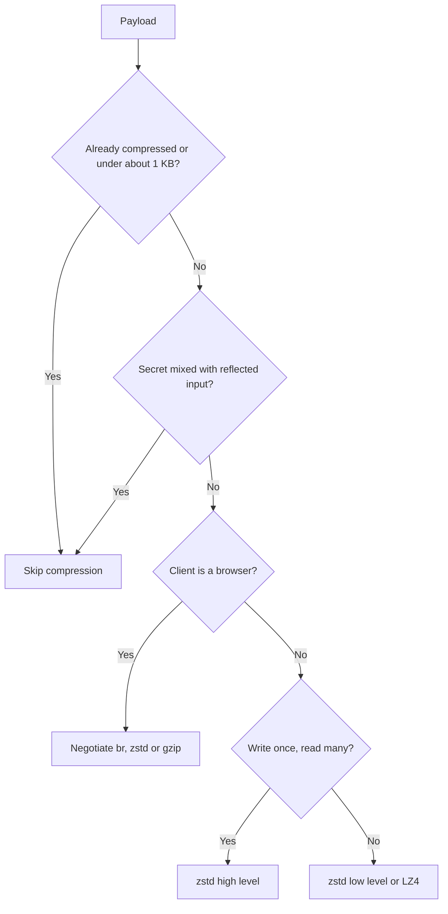

# 🗜️ Compression Algorithms — Staff-Level Interview Questions

> *10 questions covering Gzip, Deflate, Zstandard (zstd), Brotli, and the internals of lossless compression. Each answer leads with a 30-second version, then the mechanism, then trade-offs and what the interviewer probes next.*

!!! info "State of play (October 2026)"
    - **HTTP:** `br` (Brotli, RFC 7932) is supported by every current browser. **`zstd`** (RFC 8878, with HTTP window limits in RFC 9659) shipped in Chrome 123 (March 2024) and Firefox 126 (May 2024). Safari added it in the 26.x line, tied to the OS version, so check caniuse for your audience. Always keep `gzip` as the fallback.
    - **Compression Dictionary Transport (RFC 9842, September 2025)** lets a previously fetched resource act as the dictionary for later responses (`dcb` = Brotli + dictionary, `dcz` = zstd + dictionary). Chromium-based browsers support it (since Chrome 130). Other engines don't yet.
    - **Benchmarks:** numbers on this page are either illustrative or measured once on a laptop (stated where so). Ratios and speeds depend heavily on the data and the CPU. Always measure on your own payloads.

---

## Table of Contents

1. [LZ77 & Huffman Coding Internals](#1-lz77-huffman-coding-internals)
2. [Deflate vs Gzip: The Difference Is the Wrapper](#2-deflate-vs-gzip-the-difference-is-the-wrapper)
3. [Zstandard: Finite-State-Entropy & Dictionary Compression](#3-zstandard-finite-state-entropy-dictionary-compression)
4. [Brotli: Why It Won for Web Assets](#4-brotli-why-it-won-for-web-assets)
5. [Content-Encoding vs Transfer-Encoding](#5-content-encoding-vs-transfer-encoding)
6. [Compression Level Trade-offs: Speed vs Ratio](#6-compression-level-trade-offs-speed-vs-ratio)
7. [Dictionary Compression: Training Domain-Specific Dictionaries](#7-dictionary-compression-training-domain-specific-dictionaries)
8. [Streaming Compression vs Block Compression](#8-streaming-compression-vs-block-compression)
9. [Compression in HTTP/2 & HTTP/3: HPACK, QPACK, and Beyond](#9-compression-in-http2-http3-hpack-qpack-and-beyond)
10. [Production Compression Strategy: When to Compress, What to Skip](#10-production-compression-strategy-when-to-compress-what-to-skip)

---

## 1. LZ77 & Huffman Coding Internals

**Q:** "Walk through the internals of Deflate compression — the algorithm behind gzip and zlib. How do LZ77 and Huffman coding work together to achieve compression? What determines the compression ratio ceiling for a given input?"

**What They're Really Testing:** Whether you can separate **modelling** (finding redundancy: LZ77 matches) from **entropy coding** (spending fewer bits on common symbols: Huffman), and reason about what limits the ratio.

!!! tip "30-second answer"
    Deflate (RFC 1951) runs two stages. **LZ77** scans the input and replaces repeated strings with back-references (length 3–258, distance up to 32 KB) to earlier data. **Huffman coding** then encodes the resulting stream of literals, lengths and distances with variable-length prefix codes, so frequent symbols get short codes. The ratio is bounded by how predictable the data is under the compressor's *model*. Deflate's model is weak: a 32 KB window and order-0 Huffman codes with whole-bit code lengths. That's why zstd, Brotli and xz beat it. Random or already-compressed data can't be compressed at all.

### Answer

**Stage 1: LZ77 (find repeats):**

```
Input:  A B A B A B A B C
Output: lit(A) lit(B) match(len=6, dist=2) lit(C)

The match copies 6 bytes starting 2 bytes back. It overlaps its own output,
which is how LZ77 encodes runs cheaply ("ABABAB...").
The encoder keeps a hash table of recent 3-byte prefixes to find match candidates.
Higher levels search longer hash chains and try "lazy" matching
(check whether starting the match one byte later gives a longer one).
That's what makes level 9 slower than level 1.
```

**Stage 2: Huffman (code the tokens):**

```
Deflate uses two canonical Huffman codes per block:
  - literal/length alphabet (0–285): 256 byte values, end-of-block, 29 length codes
  - distance alphabet (0–29)
Length/distance codes carry "extra bits" for the exact value.
Blocks are: stored (raw), fixed Huffman (predefined tables, good for tiny inputs),
or dynamic Huffman (tables built from this block's frequencies and sent compactly
in the block header).
Each code length is a whole number of bits (max 15), so a symbol with probability
0.9 still costs ≥1 bit, where the information content is 0.15 bits.
That's the inefficiency ANS/arithmetic coding removes (Q3).
```

**What sets the ceiling:**

- **Entropy is relative to a model.** Order-0 entropy of English letters is about 4.1 bits/char (ratio ~2:1). But English is far more predictable from context: strong context-mixing compressors get close to 1–2 bits/char. Deflate typically gets around 3:1 on English text because LZ77 captures repeated words and phrases, but its 32 KB window and simple coding leave a lot on the table.
- **Data properties:** repetitive data (logs, JSON with repeated keys, HTML) compresses very well. Random bytes, encrypted data and already-compressed data (JPEG, MP4, ZIP) won't compress, and you only pay the format overhead.
- **Window:** a repeat further back than 32 KB is invisible to Deflate. zstd and Brotli use megabyte-scale windows.
- **Small inputs:** too little history to find matches, plus fixed headers and table overhead, so a 50-byte input can get *bigger*. That's the motivation for dictionaries (Q7).

**Diagram: the two Deflate stages, modelling then entropy coding.**



### 🔍 Staff-Level Evaluation

| Criterion | What I'm Looking For |
|-----------|----------------------|
| **Two-stage understanding** | LZ77 = modelling repeats, Huffman = entropy coding. Can explain how each one contributes. |
| **Entropy, correctly** | Entropy depends on the model. Doesn't quote order-0 entropy as "the limit". |
| **Window limitation** | Deflate's 32 KB window vs MB-scale windows in zstd/Brotli |
| **Small-input penalty** | Why tiny inputs can grow, and how dictionaries fix it |

**What they probe next:** "Why is decompression so much faster than compression?" The decoder just follows instructions (copy literal, copy match). The encoder has to *search* for matches. "Why not arithmetic coding in Deflate?" Patents and speed in 1990s CPUs. ANS later gave arithmetic-coding efficiency at Huffman-like speed.

---

## 2. Deflate vs Gzip: The Difference Is the Wrapper

**Q:** "A colleague says 'we use gzip compression.' You ask: 'Deflate level 6 with gzip wrapper, or raw Deflate?' They look confused. Explain the difference between Deflate, gzip, and zlib. When would you use each?"

**What They're Really Testing:** Whether you can separate the compressed bitstream (Deflate) from the container formats around it (gzip, zlib) and the library (zlib).

!!! tip "30-second answer"
    **Deflate** (RFC 1951) is the raw compressed bitstream, with no header or checksum. **gzip** (RFC 1952) wraps Deflate with a 10-byte header (magic `1f 8b`, flags, mtime, OS) and an 8-byte trailer (CRC-32 + uncompressed size mod 2³²). **zlib format** (RFC 1950) wraps Deflate with a 2-byte header and an Adler-32 trailer, 6 bytes in all. gzip and zlib are **siblings**, both wrapping Deflate. And **zlib** is also the name of the C library that produces all three. HTTP `Content-Encoding: gzip` means the gzip format. HTTP `deflate` officially means the **zlib** format, but some old servers sent raw Deflate, so avoid `deflate` in HTTP.

### Answer

```
                    ┌──────────────────────────────┐
                    │  Deflate bitstream (RFC 1951) │  ← the compressed data itself
                    └──────────────────────────────┘
                       ▲                         ▲
          wrapped by   │                         │  wrapped by
┌──────────────────────┴─────────┐   ┌───────────┴──────────────────────┐
│ gzip format (RFC 1952)         │   │ zlib format (RFC 1950)           │
│ 10 B header: 1f 8b, CM=8, FLG, │   │ 2 B header: CMF, FLG             │
│   MTIME(4), XFL, OS            │   │ (optional preset-dictionary ID)  │
│ optional: name, comment, extra │   │ Deflate data                     │
│ Deflate data                   │   │ 4 B Adler-32                     │
│ 8 B trailer: CRC-32, ISIZE     │   │ = 6 B overhead                   │
│ = 18 B minimum overhead        │   │                                  │
└────────────────────────────────┘   └──────────────────────────────────┘
```

| Format | Where you meet it | Notes |
|---|---|---|
| Raw Deflate | ZIP entries (method 8), WebSocket permessage-deflate, custom protocols | Smallest. You supply integrity checks yourself. |
| gzip | `.gz` files, `tar.gz`, HTTP `Content-Encoding: gzip` | Several gzip **members** can be concatenated, and `gunzip` decodes them all (used by BGZF/pigz, see Q8) |
| zlib | PNG `IDAT` data, HTTP `deflate`, many in-app uses (Git objects) | Supports a preset dictionary (`FDICT`) |

**Checksums:** CRC-32 (gzip) detects burst errors well and has hardware acceleration on modern CPUs. Adler-32 (zlib) is cheaper in software but weak on very short inputs. Neither is cryptographic, so use a MAC or signature if tampering matters.

**Libraries:** zlib (reference), **zlib-ng** (modernised, SIMD, a drop-in replacement now used by many distros and runtimes), and **libdeflate** (fastest whole-buffer Deflate, no streaming). Same format, very different speed. Swapping the library is often the cheapest win.

**Protocol history:** TLS-level compression (Deflate) was removed in TLS 1.3 after the CRIME attack. See Q9 for why compression and secrets don't mix.

**Diagram: gzip and zlib are sibling wrappers around the same Deflate bitstream.**



### 🔍 Staff-Level Evaluation

| Criterion | What I'm Looking For |
|-----------|----------------------|
| **Deflate ≠ gzip** | Deflate = bitstream. gzip and zlib = sibling containers. zlib = also a library. |
| **HTTP deflate confusion** | `deflate` should mean the zlib format, raw Deflate was sent in practice, so prefer gzip |
| **Overhead** | 18 B (gzip) vs 6 B (zlib) vs 0 (raw). Relevant only for tiny payloads. |
| **Checksums** | CRC-32 vs Adler-32, neither is integrity against attackers |

**What they probe next:** "Why is my `.tar.gz` slow to decompress?" Single-threaded inflate. Use pigz (parallel compression), or switch to zstd. "Why does the same file gzip to different bytes on two machines?" Timestamps and names in the header, or different library versions. Use `gzip -n` for reproducible builds.

---

## 3. Zstandard: Finite-State-Entropy & Dictionary Compression

**Q:** "Facebook replaced zlib/gzip with Zstandard (zstd) in many production services. Walk through zstd's architecture. What makes Finite State Entropy different from Huffman coding? How does zstd's dictionary compression work?"

**What They're Really Testing:** Whether you understand what zstd modernised (bigger windows, a better match finder, repeat offsets, ANS-based entropy coding, a huge level range, dictionaries) and why that adds up to "zlib-or-better ratio at several times the speed".

!!! tip "30-second answer"
    zstd (Yann Collet at Facebook, 2016; RFC 8878) keeps the LZ + entropy-coding structure, but improves every part. It has MB-scale windows (up to 2 GB in `--long` mode) and match finders from simple hashing up to optimal parsing (levels `--fast=N` through 22). It tracks three **repeat offsets**, so recurring structures are cheap. For entropy coding it uses **Huffman for literals** and **FSE (tabled ANS)** for the match/literal-length/offset codes. ANS can spend **fractional bits** per symbol, so skewed distributions cost less than with Huffman's whole bits, while decoding stays table-driven and fast. **Dictionaries** pre-load the window and entropy tables with content typical of your data, which is what makes small messages compressible.

### Answer

```
Frame (magic 28 b5 2f fd, header: window size, optional dict ID, content size, checksum flag)
  └─ Blocks (≤128 KB each). A block contains:
       Literals section:  raw bytes not covered by matches → Huffman coded (4 streams for parallel decode)
       Sequences section: (literal_length, match_length, offset) triples → FSE coded
       Offsets may be "repcodes" = reuse one of the last 3 offsets (cheap for tabular data)
```

**FSE (tabled ANS) vs Huffman:**

| | Huffman | FSE / tANS |
|---|---|---|
| Cost per symbol | Whole bits (≥1 bit even for p = 0.95) | Fractional bits: close to the entropy, −log₂(p) |
| Decoding | Table lookup on the next bits (modern decoders are table-driven, not bit-by-bit tree walks) | State machine: `state → (symbol, nbBits, nextStateBase)` table lookup, read nbBits |
| Where it wins | Literals with fairly flat distributions | Highly skewed codes (match lengths, offsets) |

ANS (Jarek Duda) was the breakthrough: arithmetic-coding efficiency at Huffman-like decode speed. zstd uses both, each where it fits.

**Speed and ratio, published reference** (the zstd README benchmark: Silesia corpus, one core of a desktop CPU, approximate):

| Codec | Ratio | Compress | Decompress |
|---|---|---|---|
| zstd -1 | ~2.9 | ~500 MB/s | ~1.5 GB/s |
| zlib -1 | ~2.7 | ~100 MB/s | ~400 MB/s |
| brotli -0 | ~2.7 | ~400 MB/s | ~450 MB/s |
| lz4 | ~2.1 | ~700 MB/s | ~4 GB/s |

The higher zstd levels trade compression speed for ratio, while **decompression speed stays roughly constant across levels**. That's why "compress once at level 19, decompress millions of times" is a valid pattern. The default level is 3. Multithreaded compression: `zstd -T0`.

**Dictionaries:** a dictionary is (a) raw content, typically the substrings that recur across samples, which the encoder can reference as if it were earlier data, plus (b) pre-built entropy tables. Train with `zstd --train samples/ -o dict` (default max size ~110 KB) or with the library. Each frame records the **dictionary ID**, so the decoder can pick the right one. Details and a measured example are in Q7.

### 🔍 Staff-Level Evaluation

| Criterion | What I'm Looking For |
|-----------|----------------------|
| **FSE/ANS understanding** | Fractional bits vs whole-bit Huffman codes. Knows zstd uses *both*. |
| **Architecture** | Frames/blocks, literals vs sequences, repeat offsets, window size |
| **Level range** | Negative "fast" levels to 22. Decompression speed is roughly level-independent. |
| **Dictionary mechanism** | Content + tables, dictionary ID in the frame |

**What they probe next:** "Memory cost of `--long=31`?" The decoder must allocate the window (up to 2 GB), and decoders refuse windows above 128 MB unless explicitly allowed. That's why HTTP caps zstd windows (RFC 9659: 8 MB). "Where is zstd used?" Kafka, Linux kernel/btrfs, package managers (Arch, Fedora RPMs), Parquet, ClickHouse, RocksDB.

---

## 4. Brotli: Why It Won for Web Assets

**Q:** "Google introduced Brotli as a gzip replacement for HTTP content. What made Brotli better for web assets specifically? Why didn't it replace gzip for file archives? Walk through Brotli's architecture."

**What They're Really Testing:** Whether you know Brotli's specific advantages (built-in web dictionary, context modelling, bigger window) and its main cost (slow compression at high quality).

!!! tip "30-second answer"
    Brotli (RFC 7932) is LZ77 + Huffman like Deflate, but with a window up to 16 MB, **context modelling** (the literal Huffman code is chosen based on the previous bytes, so text after `<` uses a different code than text after a space), and a **built-in ~120 KB static dictionary** of common words and HTML/CSS/JS fragments with transforms. That dictionary is why it shines on *small and medium web text*, typically **15–25% smaller than gzip** for HTML/CSS/JS at high quality. The cost: quality 10–11 compresses very slowly. So the pattern is **pre-compress static assets at q11 at build time, and use q4–6 for dynamic responses**. It never took over archives because zstd and xz are better general-purpose codecs, and Brotli's edge is web text.

### Answer

**Architecture:**

```
Window: 2^lgwin − 16 bytes, lgwin 10–24 (≈1 KB – 16 MB). CLI default lgwin 22 (≈4 MB).
        A "large window" extension exists but isn't used for HTTP.
Commands: (insert literals, copy match) with distance codes that favour
          recently used distances (like zstd's repcodes)
Entropy: Huffman (prefix) codes, but many of them:
  - block types split the stream into regions with different statistics
  - context map: for literals, the "context" (derived from the previous 2 bytes:
    UTF-8 lead byte, punctuation, etc.) selects which Huffman table to use
Static dictionary: ~122 KB built into every decoder: ~13k words/fragments
  (English and several other languages, HTML/CSS/JS tokens) × 121 transforms
  (capitalise, add suffix/prefix such as " the ", "ing", etc.).
  A dictionary reference costs a few bits to a few bytes. Its big value is for
  content too small to have built up its own history.
```

**Measured once** (a 10 MB synthetic JSON file, Homebrew CLI tools on an Apple-silicon laptop; illustrative only):

| Codec | Ratio | Wall time |
|---|---|---|
| gzip -6 | 8.2 | 0.06 s |
| brotli -q 4 | 8.1 | 0.04 s |
| brotli -q 6 | 8.8 | 0.07 s |
| brotli -q 11 | 11.4 | **9.6 s** |
| zstd -19 | 11.0 | 2.4 s |

Note the cliff at q11, which is fine at build time and terrible per request. Decompression speed for Brotli is in the same league as gzip. It's neither dramatically faster nor slower.

**Why not archives:** zstd gives similar ratios with much faster compression and faster decompression, plus seekable/long-range modes and multithreading. xz/LZMA wins on maximum ratio. The static dictionary is web-text tuned, so it does little for binaries. There's no file metadata in the format either, and tooling is less universal.

**Quality guidance:**

| Use | Quality | Why |
|---|---|---|
| Dynamic HTML/JSON at the edge or origin | 4–6 | Better than gzip -6 at similar CPU |
| Static JS/CSS/fonts-as-text pre-compressed in CI | 11 | One-time cost, every user benefits |
| Highly dynamic, CPU-bound servers | 1–3 or gzip/zstd | Keep CPU per request low |

### 🔍 Staff-Level Evaluation

| Criterion | What I'm Looking For |
|-----------|----------------------|
| **Static dictionary** | What it contains and why it helps small text most |
| **Context modelling** | Literal coding conditioned on the previous bytes |
| **CDN deployment** | Pre-compress at q11, dynamic at q4–6 |
| **Honest comparison** | Brotli vs zstd: Brotli wins on small web text, zstd on general and fast workloads |

**What they probe next:** "Brotli or zstd for your API?" Brotli has universal browser support. zstd is faster at similar ratios and is now in all major engines, so negotiate both and measure. "Shared dictionaries?" RFC 9842 `dcb`/`dcz` use the previous version of a JS bundle as the dictionary for the new one, so deltas shrink dramatically.

---

## 5. Content-Encoding vs Transfer-Encoding

**Q:** "In HTTP, what's the difference between Content-Encoding and Transfer-Encoding? Why does HTTP/2 forbid Transfer-Encoding? How does this affect how you configure compression on a reverse proxy like nginx?"

**What They're Really Testing:** Whether you know that Content-Encoding is a property of the **representation** (end-to-end, cacheable, needs `Vary`), while Transfer-Encoding is a **hop-by-hop** framing concern, and what that means for proxies and CDNs.

!!! tip "30-second answer"
    **Content-Encoding** (`gzip`, `br`, `zstd`) transforms the representation itself. It's chosen via `Accept-Encoding`, cached as a separate variant (`Vary: Accept-Encoding`), and ETags should differ per encoding. **Transfer-Encoding** is per-connection message framing in HTTP/1.1, in practice only `chunked`. HTTP/2 and HTTP/3 have their own framing (DATA frames), so `Transfer-Encoding` is forbidden there. Compression in HTTP is therefore always Content-Encoding. For nginx: compress at one layer (origin *or* proxy/CDN, not both), set `Vary`, don't compress tiny or already-compressed responses, and remember `gzip_proxied` controls whether nginx compresses responses to requests that came through another proxy.

### Answer

| | Content-Encoding | Transfer-Encoding |
|---|---|---|
| Scope | End-to-end property of the representation | One hop (connection) |
| Negotiated by | `Accept-Encoding` | `TE` request header (hop-by-hop, HTTP/1.1) |
| Values in practice | `gzip`, `br`, `zstd`, `dcb`/`dcz` | `chunked` (gzip in TE is defined but basically unsupported) |
| Caching | Separate cache variant per encoding (`Vary`) | Invisible to caches |
| HTTP/2, HTTP/3 | Same | **Forbidden** (RFC 9113 §8.2.2). Framing replaces `chunked`. |

"End-to-end" doesn't mean intermediaries never touch it. A CDN can and often does **decompress and re-encode**, e.g. fetch gzip from origin and serve Brotli or zstd to browsers. `Cache-Control: no-transform` asks them not to.

**Security note (BREACH):** compressing a response that contains both a **secret** (CSRF token, PII) and **attacker-reflected input** leaks the secret through response-size changes, even over TLS. Mitigations: don't reflect input next to secrets, mask tokens per response (random XOR), or disable compression on those endpoints.

**nginx:**

```nginx
gzip on;
gzip_comp_level 5;
gzip_min_length 1024;          # skip tiny bodies
gzip_types text/css application/javascript application/json image/svg+xml;  # text/html is always included
gzip_vary on;                  # Vary: Accept-Encoding
gzip_proxied any;              # default "off" = don't compress when the request has a Via header (i.e. came via a proxy/CDN)

# Brotli/zstd need third-party modules (ngx_brotli, zstd-nginx-module) or a CDN that does it
brotli on;
brotli_comp_level 5;
brotli_types text/css application/javascript application/json image/svg+xml;

location /api/ {
    proxy_pass http://app;
    # Optional: ask upstream for identity so nginx is the single place that compresses
    # (and can inspect/modify the body). Costs bandwidth between nginx and the app.
    proxy_set_header Accept-Encoding "";
}
```

**Diagram: Content-Encoding negotiation through a CDN or proxy.**



### 🔍 Staff-Level Evaluation

| Criterion | What I'm Looking For |
|-----------|----------------------|
| **End-to-end vs hop-by-hop** | Representation vs framing, and `TE` vs `Transfer-Encoding` |
| **HTTP/2 framing** | DATA frames replace chunked. TE forbidden. |
| **Caching** | `Vary: Accept-Encoding`, per-encoding ETags, CDN re-encoding |
| **Security** | BREACH conditions and mitigations |
| **Nginx config** | Single compression layer, `gzip_proxied`, `min_length`, types |

**What they probe next:** "Why did a CDN serve gzip to a client that asked for identity?" A missing `Vary` header poisoned the cache. "Range requests on compressed content?" Ranges apply to the *encoded* bytes, which is one reason large downloads are usually served uncompressed or pre-compressed as files.

---

## 6. Compression Level Trade-offs: Speed vs Ratio

**Q:** "Your API serves 50KB JSON responses. You currently compress with gzip level 6. You want to reduce p99 latency. Walk me through the dynamic compression decision: should you use a lower level, switch to zstd, pre-compress, or use Brotli? What's the breakeven point?"

**What They're Really Testing:** Whether you reason with the real latency model (round trips and TCP congestion window, not just bandwidth), measure CPU cost, and know when pre-compression or caching applies.

!!! tip "30-second answer"
    For a 50 KB JSON response, compression **CPU time is tiny**: tens to hundreds of microseconds at gzip -6 / zstd -3 / brotli 4–5 on a modern core. The latency win comes from **fewer round trips**. A new connection's congestion window (~10 packets ≈ 14 KB) means 50 KB takes about 3 RTT-bounded flights, while a ~7 KB compressed body fits in one. On a 100 ms mobile RTT that's ~200 ms saved. So gzip -6 is unlikely to *be* your p99 problem. Measure first. Then switch to zstd -3 or brotli 4–5 for better ratio per CPU-microsecond, never use gzip -9 / brotli 11 / zstd 19 on dynamic responses, and pre-compress or cache anything that's served repeatedly.

### Answer

**Measured once** (a 50 KB synthetic JSON API response, Python 3.14 zlib and python-zstandard 0.25 on an Apple-silicon laptop; illustrative only):

| Codec | Ratio | Compress | Decompress |
|---|---|---|---|
| gzip -1 | 5.7 | 0.05 ms | 0.02 ms |
| gzip -6 | 7.5 | 0.20 ms | 0.02 ms |
| gzip -9 | 7.8 | 0.88 ms | 0.02 ms |
| zstd -1 | 7.2 | 0.03 ms | 0.02 ms |
| zstd -3 | 7.1 | 0.04 ms | 0.02 ms |
| zstd -10 | 8.5 | 0.38 ms | 0.01 ms |
| zstd -19 | 9.2 | 11 ms | 0.01 ms |

Repetitive JSON compresses far better than "3:1". The point is the shape: lower levels cost microseconds, the top levels cost milliseconds per response.

**The latency model:**

```
T_response ≈ server_time + compress + RTT × flights(size, cwnd) + size/bandwidth + decompress

New TCP connection (initcwnd 10 × ~1.4 KB ≈ 14 KB, doubling each RTT):
  50 KB uncompressed → flights of 14 + 28 + (8) KB → ~3 RTTs
   7 KB compressed   → 1 flight                     → ~1 RTT
  At 100 ms RTT: ~200 ms saved, vs ~0.2 ms spent compressing.
Warm connection (cwnd already large) or a fast LAN: the saving shrinks to
  size/bandwidth, e.g. 43 KB at 1 Gb/s ≈ 0.35 ms, about the same as the CPU cost.
  Service-to-service on a LAN is where "don't compress" can genuinely win.
```

**Decision list:**

1. **Measure where p99 comes from** (server time vs transfer). Compression is rarely the culprit at 50 KB.
2. **Pick encodings by negotiation:** `zstd` → `br` → `gzip`, honouring `q=` values.
3. **Dynamic levels:** zstd 1–3, brotli 4–5, gzip 4–6. Never the max levels per request.
4. **Static or cacheable responses:** compress **once**. Pre-compress at build (`.br`/`.gz`/`.zst` next to the file, served with `brotli_static`/`gzip_static`), or let the CDN cache each encoded variant.
5. **Throughput-bound servers:** at 50k req/s, 0.2 ms each is 10 CPU-seconds per second (10 cores). That's where zstd's speed per ratio matters most.

**Correct `Accept-Encoding` negotiation (q-values matter):**

```python
def choose_encoding(accept_encoding: str, supported=("zstd", "br", "gzip")) -> str:
    """Return the best encoding we support that the client accepts (q > 0), else 'identity'."""
    prefs = {}
    for part in accept_encoding.split(","):
        token, _, params = part.strip().partition(";")
        token = token.strip().lower()
        q = 1.0
        if params.strip().startswith("q="):
            try:
                q = float(params.strip()[2:])
            except ValueError:
                q = 0.0
        if token:
            prefs[token] = q
    candidates = [(prefs.get(enc, prefs.get("*", 0.0)), -i, enc) for i, enc in enumerate(supported)]
    q, _, enc = max(candidates)
    return enc if q > 0 else "identity"

assert choose_encoding("gzip, deflate, br, zstd") == "zstd"
assert choose_encoding("gzip;q=1.0, br;q=0.5") == "gzip"
assert choose_encoding("zstd;q=0, br") == "br"
assert choose_encoding("") == "identity"
```

Caching compressed output only pays when the same body is served repeatedly. Key it by resource identity and version (URL + ETag + encoding), not by hashing each freshly generated body.

### 🔍 Staff-Level Evaluation

| Criterion | What I'm Looking For |
|-----------|----------------------|
| **Latency model** | Round trips and congestion window, not just bandwidth division |
| **Measurement** | Profiles before switching codecs. Knows the CPU cost is µs at 50 KB. |
| **Level selection** | Low/mid levels for dynamic, max levels only for build-time |
| **Pre-compression / caching** | Compress once for repeatable content, keyed correctly |

**What they probe next:** "Does compression help on HTTP/3?" Same Content-Encoding logic; QUIC also has slow start. "What about streaming responses (SSE, NDJSON)?" Flush the compressor per event, or latency stalls while the compressor buffers.

---

## 7. Dictionary Compression: Training Domain-Specific Dictionaries

**Q:** "You have a Kafka topic with 10B messages/day, each a 200-byte Avro record. gzip gives 1.5:1 compression on each record, but you need 5:1+ to reduce storage costs. Walk through how you'd train and deploy a zstd dictionary for this workload. What are the operational challenges?"

**What They're Really Testing:** Whether you first question the premise (Kafka compresses **batches**, not records), then know how to train, evaluate, version and roll out dictionaries if they're still needed.

!!! tip "30-second answer"
    First check the premise. Kafka compresses **record batches**, not individual records. With `compression.type=zstd`, sensible `linger.ms` and `batch.size`, many similar 200-byte records compress together and often reach high ratios with **no dictionary at all**. Kafka has no dictionary support in its protocol. Dictionaries matter when you must compress **each record independently** (point lookups in a KV store, per-message storage, tiny batches on low-traffic partitions). Then: train on real held-out samples, store dictionaries in a registry by **dictionary ID** (zstd writes it into each frame), roll out to consumers before producers, never delete a dictionary while data that uses it exists, and retrain when the schema drifts.

### Answer

**Step 0: fix it the cheap way.** Check `batch-size-avg` and `compression-rate-avg` on the producer. Raising `linger.ms` from 5 to 20–50 ms and `batch.size` to 128–256 KB, and moving from gzip to zstd, is a config change. Since Kafka 3.8, the level is tunable with `compression.zstd.level` (KIP-390).

**If you really need per-record compression, train and evaluate (runnable, python-zstandard):**

```python
import zstandard as zstd

samples = load_real_payloads(n=20_000)           # bytes; all partitions and schema versions, PII-reviewed
holdout = load_real_payloads(n=2_000)            # never evaluate on training data

d = zstd.train_dictionary(16 * 1024, samples)    # try 4–110 KB and measure; bigger isn't always better
plain = zstd.ZstdCompressor(level=3)
with_dict = zstd.ZstdCompressor(level=3, dict_data=d)

raw = sum(map(len, holdout))
print("no dict  :", raw / sum(len(plain.compress(r)) for r in holdout))
print("with dict:", raw / sum(len(with_dict.compress(r)) for r in holdout))

frame = with_dict.compress(holdout[0])
assert zstd.get_frame_parameters(frame).dict_id == d.dict_id()   # the ID travels in the frame
assert zstd.ZstdDecompressor(dict_data=d).decompress(frame) == holdout[0]
```

On a synthetic set of ~170-byte JSON order records, this measured **1.15:1 without a dictionary and 3.5:1 with a 16 KB dictionary**. Real payloads vary, so the evaluation step is the point. CLI equivalent: `zstd --train -r samples/ --maxdict=16384 -o orders.dict`.

**Operational design:**

| Concern | Approach |
|---|---|
| **Distribution** | A dictionary registry (object storage or config service) keyed by dictionary ID. Consumers fetch unknown IDs on demand and cache them. |
| **Rollout order** | Publish the new dictionary → all consumers can load it → then producers switch. Same rule as schema evolution: readers first. |
| **Retention** | A dictionary must outlive all data compressed with it. For Kafka, that means topic retention, compacted topics (forever!) and any downstream copies (S3 sinks). |
| **Staleness** | Track the ratio per dictionary ID in metrics. Retrain when it degrades (new fields, new enum values). |
| **Bad samples** | Skewed or unrepresentative samples (one tenant, one partition, test data, a spike of identical errors) produce a dictionary that fits nobody. Sample broadly, and evaluate on held-out data before rollout. |
| **Memory/CPU** | Digest the dictionary once (`ZstdCompressionDict` reused, or `CDict`/`DDict` in C) rather than per message. Each digested dictionary costs memory proportional to its size and level. |
| **Encryption** | Compress before encrypting. Ciphertext is incompressible. |

**When not to bother:** payloads dominated by high-entropy fields (UUIDs, hashes, random IDs, already-compressed blobs), batches that already compress well, or no way to coordinate producers and consumers. `zstd --long` doesn't help here: long-distance matching finds repeats far apart *within one large input*. It does nothing for independent 200-byte records.

**Diagram: safe rollout of a trained zstd dictionary.**



### 🔍 Staff-Level Evaluation

| Criterion | What I'm Looking For |
|-----------|----------------------|
| **Premise check** | Knows Kafka compresses batches, and tries config tuning first |
| **Training pipeline** | Representative samples, held-out evaluation, size sweep |
| **Versioning** | Dictionary ID in frames, registry, readers-first rollout, retention ≥ data |
| **When to skip** | High-entropy payloads, large batches, no deployment coordination |

**What they probe next:** "Where are dictionaries used at scale?" Per-message compression in RocksDB (`compression_opts.max_dict_bytes` per SST file), web Compression Dictionary Transport, and messaging systems with tiny messages. "Can you use Avro's schema knowledge instead?" Yes: columnar encoding (Parquet) in the sink often beats any row-level dictionary.

---

## 8. Streaming Compression vs Block Compression

**Q:** "You need to compress a 50GB log file on a machine with 4GB RAM. Explain why block compression is necessary. How do gzip streaming mode, zstd block mode, and brotli's mode handle this differently? How would you design a compression format for queryable compressed logs?"

**What They're Really Testing:** Whether you spot that memory isn't the issue (streaming compressors use bounded memory), and that independent blocks are really about **random access, parallelism and failure isolation**.

!!! tip "30-second answer"
    Memory isn't the constraint. gzip, zstd and Brotli all **stream** with memory bounded by their window and buffers (KB to tens of MB), so `zstd < 50GB.log > out.zst` works fine in 4 GB. What a single stream lacks is **random access** (to read hour 17 you must decompress hours 0–16), **parallel decompression**, and **isolation** (corruption can break the rest of the stream). For queryable logs, compress in **independent blocks** (separate frames or members), each covering a known key/time range, and keep an **index** (offset, size, min/max timestamp) in a footer. Query by pruning blocks with the index and decompressing only the ones that match. That's how Parquet, ORC, ClickHouse, BGZF and the zstd seekable format work.

### Answer

| | Single stream | Independent blocks |
|---|---|---|
| Memory | Bounded by window (gzip 32 KB, zstd MBs, brotli ≤16 MB) | Bounded by block size |
| Ratio | Best (history spans everything within the window) | Slightly worse (each block starts cold; smaller blocks → worse) |
| Random access | No, must decode from the start | Yes, seek to a block |
| Parallel decode | No | Yes, one block per core |
| Corruption | Can lose everything after the bad byte | Lose one block |

**How each codec does it:**

- **gzip:** one stream per member. Concatenated members are valid gzip, and `pigz` parallelises *compression*. **BGZF** (genomics, `bgzip`) is gzip members of ≤64 KB plus an index, which gives seekable, standard-compatible files. (`--rsyncable` is something else: it resets the compressor at content-defined points so small input changes cause small output changes, for rsync/dedup. It's not an index.)
- **zstd:** a file may contain many independent **frames**. `zstd -T0` speeds up *compression* with threads but produces one frame whose blocks depend on earlier data. The **seekable format** (in zstd's contrib) adds a seek table of frames. Blocks inside a frame are not independently decodable.
- **Brotli:** a single stream with no seek support. Split into independent streams yourself, at the cost of losing cross-block history. It's rarely the right choice for logs.

**A minimal queryable format (tested):**

```python
import json
import struct
import zstandard as zstd

BLOCK_TARGET = 256 * 1024                      # uncompressed bytes per block
ENTRY = struct.Struct("<QIqq")                 # offset, compressed size, ts_min, ts_max
FOOTER = struct.Struct("<QI4s")                # index offset, block count, magic
MAGIC = b"BLK1"

def write_log(path: str, records: list[dict]) -> None:
    """NDJSON records → independent zstd frames + footer index (Parquet-style)."""
    cctx = zstd.ZstdCompressor(level=3)
    index, buf, ts, size = [], [], [], 0
    with open(path, "wb") as f:
        def flush():
            if buf:
                frame = cctx.compress(b"".join(buf))
                index.append((f.tell(), len(frame), min(ts), max(ts)))
                f.write(frame)
                buf.clear(); ts.clear()
        for r in records:
            line = json.dumps(r, separators=(",", ":")).encode() + b"\n"
            buf.append(line); ts.append(r["ts"]); size += len(line)
            if size >= BLOCK_TARGET:
                flush(); size = 0
        flush()
        index_offset = f.tell()
        for e in index:
            f.write(ENTRY.pack(*e))
        f.write(FOOTER.pack(index_offset, len(index), MAGIC))

def query(path: str, ts_start: int, ts_end: int) -> list[dict]:
    """Decompress only blocks whose [ts_min, ts_max] overlaps the query range."""
    dctx, out = zstd.ZstdDecompressor(), []
    with open(path, "rb") as f:
        f.seek(-FOOTER.size, 2)
        index_offset, n, magic = FOOTER.unpack(f.read(FOOTER.size))
        assert magic == MAGIC, "not a block log"
        f.seek(index_offset)
        entries = [ENTRY.unpack(f.read(ENTRY.size)) for _ in range(n)]
        for offset, size, lo, hi in entries:
            if hi < ts_start or lo > ts_end:
                continue                                  # pruned without decompressing
            f.seek(offset)
            for line in dctx.decompress(f.read(size)).splitlines():
                r = json.loads(line)
                if ts_start <= r["ts"] <= ts_end:
                    out.append(r)
    return out
```

Production refinements: blocks sorted or partitioned by time so the min/max ranges don't overlap; per-block bloom filters on high-cardinality fields (trace ID); columnar layout within blocks (much better ratio, since similar values sit together); a checksum per block; and a write-ahead "open" block for live appends. Or skip building your own: Parquet with zstd plus a table format, or ClickHouse/Loki, already do this.

### 🔍 Staff-Level Evaluation

| Criterion | What I'm Looking For |
|-----------|----------------------|
| **Premise check** | Streaming compressors don't need RAM proportional to the file |
| **Stream vs block** | Random access, parallelism and isolation vs ratio |
| **Codec specifics** | BGZF/multi-member gzip, zstd frames and the seekable format, `-T0` ≠ independent blocks, rsyncable ≠ seekable |
| **Format design** | Footer index, pruning, block size trade-off, columnar layout |

**What they probe next:** "Block size?" Small blocks mean better selectivity and worse ratio. 64 KB–1 MB is typical, and object storage favours larger reads. "How do you parallelise decompression of a single huge `.gz`?" Generally you can't (pugz-style tricks aside), which is a reason to choose a block format up front.

---

## 9. Compression in HTTP/2 & HTTP/3: HPACK, QPACK, and Beyond

**Q:** "HTTP/2 introduced HPACK header compression, and HTTP/3 uses QPACK. How do they differ from gzip/brotli body compression? Why couldn't HTTP/2 reuse gzip for headers? Design a compression scheme for a custom binary protocol that needs to handle both headers and bodies."

**What They're Really Testing:** Whether you understand compression side-channels (CRIME/BREACH) and how HPACK/QPACK are designed around them, plus QPACK's head-of-line blocking trade-off.

!!! tip "30-second answer"
    SPDY compressed headers with Deflate over a shared context. **CRIME** (2012) showed that an attacker who can inject text into requests can recover a cookie byte by byte from changes in compressed size, because Deflate matches *partial* strings. **HPACK** (RFC 7541) avoids partial matching: it only references **whole header fields** in a static table (61 entries) or a per-connection dynamic table, and it Huffman-codes literals with a **fixed** code. An attacker can learn at most "this exact field was sent before", and sensitive fields can be sent as **never-indexed** literals. **QPACK** (RFC 9204) adapts this to QUIC's out-of-order streams: dynamic-table inserts go on a separate encoder stream, each header block declares the **Required Insert Count** it depends on, and the encoder can avoid referencing unacknowledged entries so it doesn't block streams.

### Answer

**Body vs header compression risk:**

- **Body compression (gzip/br/zstd):** vulnerable to **BREACH** when a response contains a secret *and* attacker-influenced input in the same compression context (Q5). The mitigation is in application design, not in the codec.
- **Headers:** cookies and authorization tokens are present on *every* request, alongside attacker-influenced fields (the URL path). That's the worst case for generic compression, hence a purpose-built scheme.

**HPACK (HTTP/2):**

```
Static table (1-indexed, 61 entries), e.g.
   1 :authority        2 :method GET      3 :method POST
   4 :path /           5 :path /index.html
   6 :scheme http      7 :scheme https    8 :status 200 ...
  59 vary              60 via             61 www-authenticate
Dynamic table: per connection, per direction, FIFO, size ≤ SETTINGS_HEADER_TABLE_SIZE (default 4096 B).
  The ENCODER (whoever is sending: client for requests, server for responses) decides what to insert.

Representations:
  Indexed field            1xxxxxxx  e.g. :method GET = 0x82, :scheme https = 0x87
  Literal + indexing       01xxxxxx  (add to the dynamic table)
  Literal without indexing 0000xxxx
  Literal never indexed    0001xxxx  (intermediaries must not index it either: use for cookies/tokens)
  String literals optionally Huffman-coded with a FIXED code from the RFC (not adaptive)
Typical effect: repeated headers on later requests shrink to a few bytes each.
```

**QPACK (HTTP/3):**

```
Problem: HPACK assumes in-order processing. Over QUIC, request stream 5 can arrive before stream 3,
whose header block inserted the entry stream 5 references.

QPACK:
  Encoder stream (unidirectional): table insertions
  Decoder stream (unidirectional): acknowledgements, stream cancellations
  Each header block starts with Required Insert Count (how many inserts it needs)
  A decoder that hasn't seen that many inserts BLOCKS the stream, up to
  SETTINGS_QPACK_BLOCKED_STREAMS. An encoder can stay at 0 risk by only referencing
  acknowledged entries (slightly worse compression, no head-of-line blocking).
Static table: 99 entries, 0-indexed, chosen from real traffic
  (e.g. content-type: application/json, x-content-type-options: nosniff).
```

**Custom binary protocol design:**

1. **Headers:** whole-field static and dynamic tables (HPACK-style), per connection and direction, with never-indexed literals for secrets. Mirror evictions deterministically on the decoder side.
2. **Bodies:** zstd with a trained dictionary (Q7) negotiated at connection setup by dictionary ID. Skip compression below a size threshold.
3. **Security:** never compress secrets in the same context as attacker-controlled data. Pad or bucket sizes if the size channel matters.
4. **Ordering:** if the transport can reorder (QUIC, multiple TCP connections), either reference only acknowledged table state, or carry the table version in each message.

```python
from collections import OrderedDict

STATIC = [(b"type", b"request"), (b"type", b"response"), (b"version", b"1"),
          (b"content-type", b"application/json"), (b"content-type", b"application/protobuf")]
SENSITIVE = {b"authorization", b"cookie"}

def varint(n: int) -> bytes:                      # LEB128, so indexes aren't capped at 127
    out = bytearray()
    while True:
        b, n = n & 0x7F, n >> 7
        out.append(b | (0x80 if n else 0))
        if not n:
            return bytes(out)

class HeaderEncoder:
    """Whole-field static + dynamic table; one per connection and direction.
    Exact matches only (no substring matching), so a size side channel reveals at most
    'this exact field was sent before'. Sensitive fields are never indexed."""
    def __init__(self, max_entries: int = 256):
        self.dynamic: OrderedDict[tuple, int] = OrderedDict()
        self.next_id = 0
        self.max_entries = max_entries

    def encode(self, headers: list[tuple[bytes, bytes]]) -> bytes:
        out = bytearray()
        for field in headers:
            if field in STATIC:
                out += b"\x01" + varint(STATIC.index(field))
            elif field in self.dynamic:
                out += b"\x02" + varint(self.dynamic[field])
            else:
                name, value = field
                indexed = name not in SENSITIVE
                out += (b"\x03" if indexed else b"\x04") + varint(len(name)) + name + varint(len(value)) + value
                if indexed:
                    self.dynamic[field] = self.next_id
                    self.next_id += 1
                    if len(self.dynamic) > self.max_entries:
                        self.dynamic.popitem(last=False)   # FIFO eviction; the decoder mirrors it
        return bytes(out)
```

### 🔍 Staff-Level Evaluation

| Criterion | What I'm Looking For |
|-----------|----------------------|
| **CRIME/BREACH awareness** | Partial-match compression + secret + attacker input = leak. Applies to bodies too. |
| **HPACK design** | Whole-field indexing, fixed Huffman code, never-indexed literals, encoder-controlled table |
| **HPACK vs QPACK** | Encoder/decoder streams, Required Insert Count, blocked-streams trade-off |
| **Protocol design** | Splits headers and bodies, handles secrets and reordering |

**What they probe next:** "Why is the HPACK dynamic table size a DoS concern?" Memory per connection is attacker-influenced. Bound it, and the decoder advertises the limit. "Does gRPC compress?" Per-message compression (gzip/zstd) is negotiated separately from HPACK headers.

---

## 10. Production Compression Strategy: When to Compress, What to Skip

**Q:** "As a Staff Engineer, design a company-wide compression strategy. What gets compressed, at what level, with what algorithm? Consider: API responses, static assets, log files, database backups, Kafka messages, and inter-datacenter replication traffic."

**What They're Really Testing:** Whether you can match codecs to workloads by their real constraints (who decompresses, how often, CPU vs bandwidth vs storage cost) and set defaults teams can follow without thinking.

!!! tip "30-second answer"
    Default to **zstd** for anything you control at both ends (logs, backups, Kafka, internal RPC, inter-DC), at low levels for hot paths and high levels for write-once/read-many data. Use **Brotli/zstd with gzip fallback** for browsers: pre-compressed at build for static assets, mid levels for dynamic responses. Use **LZ4** where CPU per byte must be near zero (storage engines, WAL). **Skip** already-compressed media and tiny payloads. Inter-DC and cross-AZ bandwidth is usually *expensive*, so compression there pays off. Write it down as a paved-road default with measurements, not a per-team debate.

### Answer

| Workload | Default | Level | Why |
|---|---|---|---|
| Browser API responses | zstd / br / gzip negotiated | zstd 3, br 4–5, gzip 5 | Universal fallback. Low CPU per request. |
| Static assets | Pre-compressed `.br` (+ `.zst`, `.gz`) | br 11, zstd 19 | One-time build cost |
| Internal RPC (gRPC) | zstd or none | 1–3 | Often skip on the same LAN/AZ. Compress cross-AZ/region. |
| Kafka | `compression.type=zstd` | `compression.zstd.level=3` (default) | Batch compression. Biggest win is good batching. |
| Logs (hot, shipping) | zstd | 1–3 | Agent CPU matters |
| Logs (archive) | zstd in blocks/Parquet | 9–19 | Written once, scanned rarely, queryable |
| DB backups | zstd multithreaded | 3–10 | Fast restore matters as much as size |
| Inter-DC replication | zstd | 1–3 | Inter-region egress is costly, CPU is cheaper |
| Storage engine pages/WAL | LZ4 or zstd low | default | Latency-critical, often per page |
| JPEG/PNG/MP4/WOFF2/ZIP | none | — | Already compressed |
| Encrypted data | compress **before** encrypting | — | Ciphertext doesn't compress |

**Configuration snippets:**

```properties
# Kafka producer (compression.zstd.level since Kafka 3.8, KIP-390)
compression.type=zstd
compression.zstd.level=3
linger.ms=20
batch.size=262144
```

```bash
# PostgreSQL 16+: custom-format dump with zstd (plain --compress=6 means gzip level 6)
pg_dump --format=custom --compress=zstd:6 --file=db.dump mydb
# Parallel dump requires directory format
pg_dump --format=directory --jobs=8 --compress=zstd:3 --file=/backups/db-$(date +%F) mydb

# Generic: multithreaded zstd on a stream
tar -cf - /data | zstd -T0 -6 -o data-$(date +%F).tar.zst
```

```
# logrotate with zstd
/var/log/app/*.log {
    daily
    compress
    compresscmd /usr/bin/zstd
    compressoptions -3
    compressext .zst
    uncompresscmd /usr/bin/unzstd
    delaycompress
}
```

**When NOT to compress:**

1. **Tiny payloads:** below about 1 KB, the gains are bytes, the overhead is fixed, and it all fits in one packet anyway (`gzip_min_length`).
2. **Already-compressed formats:** you burn CPU for ~0–2% (detect by content type or magic bytes).
3. **Same-host or same-rack traffic** where CPU is the bottleneck and bandwidth is free. Measure it.
4. **Secrets mixed with reflected input** in one compressed response (BREACH, Q5).
5. **Data you need to randomly access** but would put in one giant stream. Use a block format (Q8).

**CDN pattern:** origin serves pre-compressed static files with `Vary: Accept-Encoding` and long `Cache-Control` for fingerprinted URLs. The CDN caches each encoding variant, and many CDNs will also compress or re-encode dynamic responses (Brotli/zstd) at the edge, so the origin can send gzip or identity. Check that the CDN cache key includes the normalised encoding.

**Make it a platform default:** shared library or sidecar defaults, dashboards for `bytes_out` before and after, CPU cost per GB, and a rollback switch. The hard part at staff level is the **rollout and measurement**, not choosing the codec.

**Diagram: deciding whether and how to compress a payload.**



### 🔍 Staff-Level Evaluation

| Criterion | What I'm Looking For |
|-----------|----------------------|
| **System-level thinking** | One coherent default policy with documented exceptions |
| **Per-workload reasoning** | Who decompresses, how often, and which resource is scarce (CPU, egress, storage) |
| **Cost modelling** | Egress/cross-AZ cost vs CPU. Restore time for backups. |
| **Just-right compression** | Max levels only for write-once data. Skips tiny and already-compressed payloads. |

**What they probe next:** "How would you prove the strategy saved money?" Compare egress and storage bills against the added CPU before and after a staged rollout. "Hardware offload?" Intel QAT and DPUs can offload Deflate/zstd for very high-throughput gateways.

---

> *These 10 questions cover compression from algorithm internals to production deployment at scale.*
