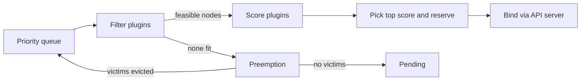
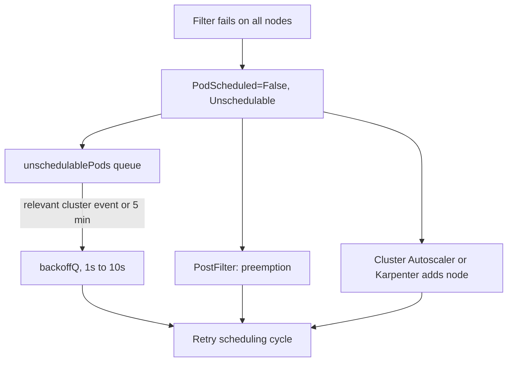
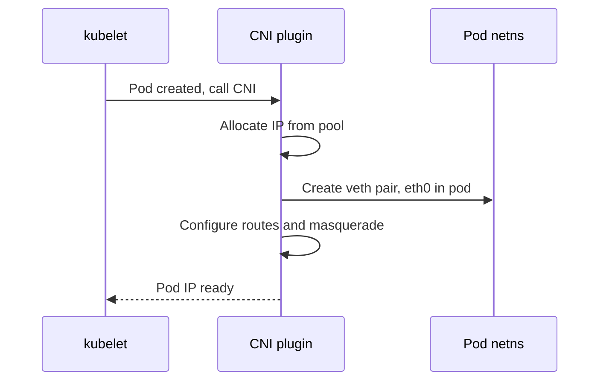
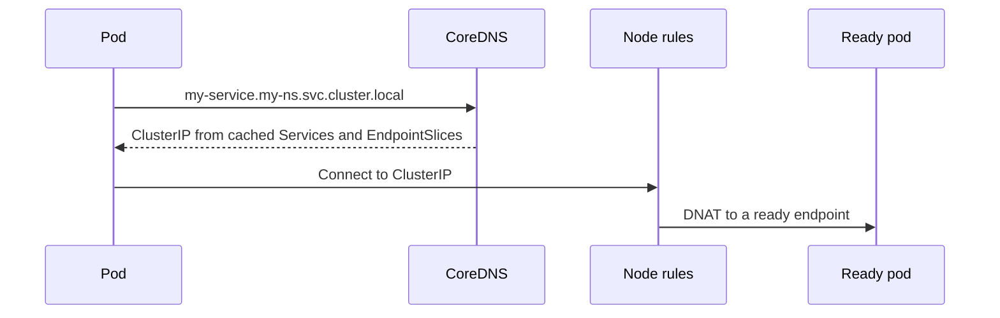

# ☸️ Kubernetes — Staff-Level Interview Questions

> *6 questions covering Kubernetes scheduler, networking, RBAC, storage, controllers, and production operations — every question expects principal engineer-level depth.*

> **Prerequisites:** This file assumes familiarity with container fundamentals (namespaces, cgroups, images) covered in [`../docker/INTERVIEW_QUESTIONS.md`](../docker/INTERVIEW_QUESTIONS.md).
>
> For deeper dives into pod lifecycle, monitoring, production control, and versioning, see:
> - [`POD_LIFECYCLE_AND_MONITORING.md`](./POD_LIFECYCLE_AND_MONITORING.md) — 15 sections on pod internals, probes, QoS, monitoring stack (kubelet/cAdvisor/metrics-server/kube-state-metrics), Prometheus operator, KEDA, logging, events, Grafana dashboards, alerting runbooks, eBPF (Hubble/Pixie)
> - [`PRODUCTION_CONTROL.md`](./PRODUCTION_CONTROL.md) — 12 sections on GitOps (ArgoCD/Flux), admission controllers (Kyverno/OPA), deployment strategies (Blue-Green/Canary/A-B), progressive delivery (Flagger/Argo Rollouts), multi-tenancy, service mesh (Istio/Linkerd), network policies, Cluster API, CNI deep-dive (Calico/Cilium/Flannel), descheduler, storage/DR
> - [`VERSIONING_MULTI_CONTAINER.md`](./VERSIONING_MULTI_CONTAINER.md) — API versioning, database migrations, container image versioning, rollback strategies

---

## Table of Contents

1. [Kubernetes Scheduler: Binding & Node Selection](#1-kubernetes-scheduler-binding-node-selection)
2. [Kubernetes Networking: CNI, Services, DNS](#2-kubernetes-networking-cni-services-dns)
3. [Kubernetes Security: RBAC, PSP, Pod Identity](#3-kubernetes-security-rbac-psp-pod-identity)
4. [Storage: CSI, Persistent Volumes, StatefulSets](#4-storage-csi-persistent-volumes-statefulsets)
5. [Controllers: ReplicaSet, Deployment, Operator](#5-controllers-replicaset-deployment-operator)
6. [Production: Autoscaling, Rolling Updates, Chaos](#6-production-autoscaling-rolling-updates-chaos)

---

## 1. Kubernetes Scheduler: Binding & Node Selection

**Q:** "You have 1000 pods to schedule on 50 nodes. Walk through the Kubernetes scheduler algorithm. How does it filter, score, and bind pods to nodes? What happens when a pod can't be scheduled due to resource constraints?"

**What They're Really Testing:** Whether you understand the Kubernetes scheduling framework — the predicate/priority pipeline (now Filter/Score plugins) and binding.

### Answer

!!! tip "30-second answer"
    The scheduler takes one pod at a time off a priority queue, **filters** nodes that can't run it (resources, taints, affinity, ports, volumes), **scores** the survivors with weighted plugins, picks the highest, reserves the resources in its cache and **binds** asynchronously through the API server. The scheduler only ever compares the pod's **requests** against node **allocatable** minus other pods' requests; it never looks at real usage. If nothing fits, it tries **preemption** of lower-priority pods; otherwise the pod stays `Pending` and the Cluster Autoscaler or Karpenter reacts to it.

*Diagram: how one pod moves from the scheduling queue to a bound node.*



**Scheduling Pipeline (scheduling framework, extension points in order):**

```
Scheduling cycle (one pod at a time, serial):

1. Queue (activeQ → backoffQ → unschedulablePods)
   - Ordered by pod priority (PriorityClass), then creation time
   - Gang / all-or-nothing scheduling is NOT default behaviour: use Kueue, Volcano or the
     coscheduling plugin. A native Workload API for gang scheduling is alpha since v1.35.

2. PreFilter + Filter (formerly "predicates"):
   Feasible-node search. In big clusters the scheduler stops after finding enough feasible
   nodes (percentageOfNodesToScore, adaptive, minimum 100 nodes), so with 50 nodes it checks all.

   Filter plugins (current names):
   - NodeResourcesFit:   sum of requests (CPU, memory, extended resources) ≤ allocatable
   - NodeName:           spec.nodeName matches
   - NodePorts:          requested hostPort not in use
   - NodeAffinity:       nodeSelector + requiredDuringScheduling... terms
   - TaintToleration:    pod tolerates all NoSchedule/NoExecute taints
   - VolumeBinding / VolumeZone / NodeVolumeLimits: PVCs bindable in this zone, attach limits
   - NodeUnschedulable:  node is cordoned
   - PodTopologySpread, InterPodAffinity: hard spread/affinity rules
   - DynamicResources:   DRA ResourceClaims (GPUs etc.) can be allocated (GA in v1.34)

   Result: 50 → 12 feasible nodes

3. PreScore + Score (formerly "priorities"):
   Each plugin returns 0-100 per node; final score = Σ (plugin score × plugin weight)

   Score plugins (examples):
   - NodeResourcesFit:  LeastAllocated (default, spreads) | MostAllocated (bin-packs)
                        | RequestedToCapacityRatio
   - NodeResourcesBalancedAllocation: balance CPU vs memory usage on the node
   - ImageLocality:     image already cached on node
   - InterPodAffinity, NodeAffinity (preferred terms), PodTopologySpread (ScheduleAnyway)
   - TaintToleration:   fewer PreferNoSchedule taints scores higher

   Highest score wins (ties broken randomly).

4. Reserve → Permit → (binding cycle, async) PreBind → Bind → PostBind
   - Reserve: assume the pod on the node in the scheduler's cache so the next pod
     sees those resources as used
   - PreBind: e.g. provision/bind PVCs (WaitForFirstConsumer volumes)
   - Bind: POST pods/<name>/binding to the API server (the API server persists to etcd;
     the scheduler never talks to etcd)
   - kubelet on that node sees the pod via its watch → pulls image → starts containers
```

**Advanced Scheduling:**

```yaml
# Pod Topology Spread Constraints
# Ensure pods are spread across zones/nodes:
spec:
  topologySpreadConstraints:
  - maxSkew: 1                    # Max 1 pod difference between zones
    topologyKey: topology.kubernetes.io/zone
    whenUnsatisfiable: DoNotSchedule  # or ScheduleAnyway (soft: only affects scoring)
    labelSelector:
      matchLabels:
        app: my-app
    matchLabelKeys: ["pod-template-hash"]  # compute skew per ReplicaSet revision, so a
                                           # rollout's new pods are spread on their own
  # Spread is only checked at scheduling time. Scale-down and node loss can leave pods
  # skewed; the descheduler's RemovePodsViolatingTopologySpreadConstraint fixes that.

# Pod Disruption Budget
# Ensure minimum availability during voluntary disruptions:
apiVersion: policy/v1
kind: PodDisruptionBudget
metadata:
  name: my-app-pdb
spec:
  minAvailable: 3                 # At least 3 pods must be available
  selector:
    matchLabels:
      app: my-app

# Node Affinity (advanced)
spec:
  affinity:
    nodeAffinity:
      requiredDuringSchedulingIgnoredDuringExecution:
        nodeSelectorTerms:
        - matchExpressions:
          - key: topology.kubernetes.io/zone
            operator: In
            values:
            - us-east-1a
            - us-east-1b      # Only schedule to these zones
      preferredDuringSchedulingIgnoredDuringExecution:
      - weight: 80
        preference:
          matchExpressions:
          - key: node.kubernetes.io/instance-type
            operator: In
            values:
            - c5.4xlarge       # Prefer this instance type (weight=80)
```

*Diagram: what happens to a pod that fails filtering.*



**Unschedulable Pod Handling:**

```
When a pod can't be scheduled:

1. Failed Filtering:
   - Pod condition PodScheduled=False, reason Unschedulable; event
     "0/50 nodes are available: 25 Insufficient cpu, 25 node(s) had untolerated taint ..."
   - Pod moves to unschedulablePods. It is retried when a relevant cluster event happens
     (node added, pod deleted, PVC bound; filtered by plugin "queueing hints"),
     or at the latest after 5 minutes (podMaxInUnschedulablePodsDuration)
   - Retries go through backoffQ: exponential, 1s initial → 10s max by default

2. Reasons:
   - Insufficient requests headroom (CPU/memory/GPU), even if nodes look idle
   - Taints that no toleration matches
   - nodeSelector / required affinity matches no node
   - PVC unbound, or volume pinned to another zone
   - hostPort conflicts, hard topology spread or anti-affinity unsatisfiable

3. Escalation paths:
   a. Preemption (PostFilter): evict lower-priority pods to make room
   b. Node autoscaling: Cluster Autoscaler or Karpenter sees the Pending pod and adds a node
   c. Fix the spec: requests too high, missing toleration, wrong zone affinity
   (The descheduler does not help Pending pods; it rebalances already-running ones.)

# Priority-based preemption:
# 1. Find nodes where evicting lower-priority pods would make the pod fit
# 2. Choose victims: lowest priority first, minimising PDB violations (best effort, PDBs
#    can still be violated if there is no other choice)
# 3. Set pod.status.nominatedNodeName, delete victims (they get their graceful termination)
# 4. Pod is scheduled on a later cycle once resources free up
#    (preemptionPolicy: Never opts a pod out of preempting others)
```

**What they probe next:** "Why is a pod Pending on a node that shows 20% CPU usage?" (requests, not usage); "How do you bin-pack for cost?" (MostAllocated scoring plus Karpenter consolidation); "How do you schedule GPU pods?" (extended resources or DRA `ResourceClaim`s, taints on GPU nodes); "What about a 64-pod training job that needs all pods at once?" (gang scheduling via Kueue/Volcano).

### 🔍 Staff-Level Evaluation

| Criterion | What I'm Looking For |
|-----------|----------------------|
| **Filter/Score pipeline** | Understands the two-phase filtering and scoring across ALL nodes |
| **Topology spread** | Knows maxSkew and topologyKey for zonal distribution |
| **Unschedulable handling** | Explains backoff, eviction, cluster autoscaler as escalation paths |
| **Priority/preemption** | Understands how higher-priority pods can preempt lower-priority pods |

---

## 2. Kubernetes Networking: CNI, Services, DNS

**Q:** "A pod in namespace-a cannot reach a Service in namespace-b. All pods have IPs, but the DNS resolution fails. Walk through the Kubernetes networking model: how do pods get IPs, how does Service DNS work, and how does kube-proxy handle traffic?"

**What They're Really Testing:** Whether you understand the complete Kubernetes networking stack — CNI plugin, Service abstraction, kube-proxy modes, and CoreDNS resolution.

### Answer

!!! tip "30-second answer"
    The CNI plugin gives each pod a routable IP; a Service is a stable virtual IP whose backends come from **EndpointSlices**; kube-proxy (or Cilium's eBPF replacement) programs every node to DNAT the virtual IP to a ready pod; CoreDNS answers `<svc>.<ns>.svc.cluster.local` from its API watch. For "DNS fails across namespaces" check, in order: is the name namespace-qualified (`svc.other-ns`)? Can the pod reach kube-dns on UDP **and** TCP 53 (a default-deny egress NetworkPolicy is the classic culprit)? Are CoreDNS pods healthy and not throttled? Does the target Service have ready endpoints?

**Kubernetes Networking Model (the rules every CNI must satisfy):**

```
1. Every pod gets its own IP, and pods can reach every other pod without NAT
2. Agents on a node (kubelet, system daemons) can reach all pods on that node
3. Services give a stable virtual IP / DNS name in front of a changing set of pods
   (exposed outside via NodePort, LoadBalancer, Ingress or Gateway API)

Networking implementations (CNI plugins):
  - Calico: BGP routing or VXLAN/IP-in-IP overlay, NetworkPolicy, optional eBPF dataplane
  - Cilium: eBPF dataplane, can replace kube-proxy, WireGuard/IPsec encryption, Hubble
  - Flannel: simple VXLAN overlay, no NetworkPolicy enforcement on its own
  - AWS VPC CNI: pods get real VPC IPs from ENIs (watch IP exhaustion / max pods per node)
  (Weave Net is unmaintained since Weaveworks shut down in 2024; don't pick it for new clusters.)
```

**CNI Plugin Lifecycle:**

```
1. Pod creation → kubelet calls CNI plugin
2. CNI plugin allocates IP from pool
3. CNI plugin creates veth pair:
   - One end: eth0 inside pod (container namespace)
   - Other end: vethXXXX on host
4. CNI plugin configures routing:
   - Default gateway (bridge or overlay)
   - IP masquerade (pod → external world)

Example (Calico with VXLAN):
  Pod IP: 10.2.3.4/24
  Host interface: veth-abc123
  VXLAN tunnel: traffic goes host → VXLAN → destination host
  IP-in-IP: traffic goes host → IPIP tunnel → destination host
```

*Diagram: the kubelet-to-CNI sequence that gives a pod its IP and network path.*



**Service Types (Abstraction):**

```yaml
# ClusterIP (default): virtual IP, internal only
apiVersion: v1
kind: Service
metadata:
  name: my-service
spec:
  type: ClusterIP
  selector:
    app: my-app
  ports:
  - port: 80
    targetPort: 8080

# NodePort: external access via node IP + port
spec:
  type: NodePort
  ports:
  - port: 80
    nodePort: 30080      # Access via node-ip:30080

# LoadBalancer: cloud provider's LB (often NodePort + LB)
spec:
  type: LoadBalancer
  # Cloud provider creates LB → points to NodePort on all nodes

# Headless Service (no virtual IP, direct pod DNS):
spec:
  clusterIP: None         # No load balancing!
  # DNS returns all pod IPs (A/AAAA records)
  # Used by StatefulSets (each pod gets DNS name)
```

*Diagram: how a pod name lookup becomes a connection to a ready backend.*



**kube-proxy Modes:**

```
kube-proxy watches Services + EndpointSlices and programs each node's kernel.
(The old Endpoints API is deprecated since v1.33; EndpointSlices are the source of truth.)

1. userspace: REMOVED in v1.26. Only mention it as history.

2. iptables (still the default on Linux):
   - Per Service: a KUBE-SVC chain; per backend: a KUBE-SEP chain with DNAT
   - Backend chosen by "statistic --mode random --probability" rules
   - Rule count grows with services × endpoints; first-packet lookup is a linear walk
     and full-table rewrites get slow at tens of thousands of endpoints

   iptables -t nat -L KUBE-SERVICES
   # KUBE-SVC-XXXXX  tcp -- 0.0.0.0/0 10.96.0.1 tcp dpt:443
   # → KUBE-SEP-XXXXX (probability 0.333 / 0.5 / 1.0 across 3 backends)

3. nftables (GA in v1.33, the recommended Linux mode today):
   - Uses nftables maps/sets: lookups are O(1)-ish and updates are incremental
   - Fixes iptables' scaling problems without IPVS's feature gaps

4. IPVS: DEPRECATED in v1.35 (KEP-5495); logs a warning, will be removed later.
   Was popular for hash-based O(1) lookups and rr/lc/sh algorithms, but lags on
   features and has no active maintainers. Migrate IPVS clusters to nftables.

5. No kube-proxy: Cilium (and Calico eBPF) implement Services in eBPF at the socket/TC layer.
```

**CoreDNS & DNS Resolution:**

```yaml
# Pod DNS resolution:
# my-service.my-namespace.svc.cluster.local

# Resolution flow:
pod → /etc/resolv.conf → CoreDNS (answers from its in-memory cache of Services and
EndpointSlices, kept fresh by a watch; it does NOT call the API per query) → ClusterIP

# /etc/resolv.conf inside pod:
search my-namespace.svc.cluster.local svc.cluster.local cluster.local
nameserver 10.96.0.10     # kube-dns Service ClusterIP
options ndots:5            # names with < 5 dots try every search domain first

# Why cross-namespace resolution fails:
# "my-service" expands only to my-service.<own-ns>.svc.cluster.local
# Fix: "my-service.other-ns" (expanded via the svc.cluster.local search entry)
#      or the full FQDN "my-service.other-ns.svc.cluster.local."
# ndots:5 cost: "api.stripe.com" (2 dots) first tries 3 search domains → extra lookups.
# Use a trailing dot, or lower ndots via pod dnsConfig, for external-heavy apps.

# Other common causes of "DNS fails":
# - Default-deny egress NetworkPolicy without an allow rule to kube-dns on UDP+TCP 53
# - CoreDNS CPU-throttled or OOMKilled; conntrack races on UDP (use NodeLocal DNSCache)
# - Headless Service with no ready pods returns no A records; a ClusterIP Service with no
#   ready endpoints still resolves, but connections are rejected or time out

# CoreDNS configuration (ConfigMap):
apiVersion: v1
kind: ConfigMap
metadata:
  name: coredns
  namespace: kube-system
data:
  Corefile: |
    .:53 {
        errors
        health
        kubernetes cluster.local in-addr.arpa ip6.arpa {
          pods insecure
          fallthrough in-addr.arpa ip6.arpa
          ttl 30
        }
        prometheus :9153
        forward . /etc/resolv.conf
        cache 30
        reload
    }
```

### 🔍 Staff-Level Evaluation

| Criterion | What I'm Looking For |
|-----------|----------------------|
| **CNI model** | Understands veth pair, IP allocation, and overlay vs direct routing |
| **kube-proxy modes** | Compares iptables vs nftables (scalability), knows IPVS is deprecated (v1.35) and eBPF can replace kube-proxy |
| **Service types** | Knows ClusterIP, NodePort, LoadBalancer, Headless differences |
| **DNS resolution** | Explains search domains, ndots, and why cross-namespace needs FQDN |

---

## 3. Kubernetes Security: RBAC, PSP, Pod Identity

**Q:** "Design a multi-tenant Kubernetes cluster where Team A and Team B have namespaces team-a and team-b. Team A should only manage their own resources. Team B has read access to Team A's services. How do you implement this with RBAC?"

**What They're Really Testing:** Whether you understand Kubernetes RBAC — the Role/ClusterRole/ServiceAccount/Binding model, and how to implement least-privilege security.

### Answer

**RBAC Model:**

```
Subject (who): ServiceAccount, User, Group
    │
    ├─→ RoleBinding (namespaced) or ClusterRoleBinding (cluster-wide)
    │
    ▼
Role/ClusterRole (what):
  apiGroups: apps, networking.k8s.io, batch, etc.
  resources: pods, deployments, services, configmaps, secrets, etc.
  verbs: get, list, watch, create, update, patch, delete
```

**Multi-Tenant RBAC Implementation:**

```yaml
# Role for Team A (full access to team-a namespace):
apiVersion: rbac.authorization.k8s.io/v1
kind: Role
metadata:
  namespace: team-a
  name: team-a-full-access
rules:
- apiGroups: ["", "apps", "batch", "networking.k8s.io"]
  resources: ["pods", "deployments", "services", "configmaps", "secrets",
              "ingresses", "horizontalpodautoscalers", "jobs", "cronjobs"]
  verbs: ["get", "list", "watch", "create", "update", "patch", "delete"]
- apiGroups: ["autoscaling"]
  resources: ["horizontalpodautoscalers"]
  verbs: ["get", "list", "watch", "create", "update", "patch", "delete"]
- apiGroups: [""]
  resources: ["events", "pods/log"]
  verbs: ["get", "list", "watch"]    # Read-only diagnostics
# Deliberately NOT granted: pods/exec. Exec is a write (the verb is "create") and gives a
# shell with the pod's ServiceAccount token, so treat it like admin access.
# Also note: "list"/"watch" on secrets returns full secret contents, not just names.

---
# RoleBinding: Bind Role to Team A's ServiceAccount
apiVersion: rbac.authorization.k8s.io/v1
kind: RoleBinding
metadata:
  namespace: team-a
  name: team-a-binding
subjects:
- kind: ServiceAccount
  name: team-a-sa
  namespace: team-a
roleRef:
  kind: Role
  name: team-a-full-access
  apiGroup: rbac.authorization.k8s.io
```

**Cross-Namespace Access (Team B reads Team A):**

```yaml
# Role for Team B (read-only access to team-a namespace):
apiVersion: rbac.authorization.k8s.io/v1
kind: Role
metadata:
  namespace: team-a              # Team B can read team-a resources
  name: team-b-read-access
rules:
- apiGroups: ["", "apps"]
  resources: ["pods", "services", "deployments", "endpoints"]
  verbs: ["get", "list", "watch"]

---
apiVersion: rbac.authorization.k8s.io/v1
kind: RoleBinding
metadata:
  namespace: team-a
  name: team-b-read-binding
subjects:
- kind: ServiceAccount
  name: team-b-sa
  namespace: team-b                # Team B's SA in team-b namespace
roleRef:
  kind: Role
  name: team-b-read-access
  apiGroup: rbac.authorization.k8s.io
```

In real clusters humans are bound as **Groups** from your OIDC provider (`kind: Group, name: team-a-devs`), and ServiceAccounts are reserved for workloads and CI. For many namespaces, prefer reusing the built-in `admin`/`edit`/`view` ClusterRoles through namespaced RoleBindings over copying Roles. RBAC is additive only: there are no deny rules. Watch for privilege escalation through `create pods` (a pod can mount any Secret or ServiceAccount in its namespace), `escalate`/`bind` on roles, and `impersonate`.

**Pod Security Standards (Pod Security Admission — PSA, replacing PSP):**

```yaml
# PodSecurityPolicy was deprecated in 1.21 and REMOVED in 1.25 (policy/v1beta1 is gone).
# Replacement: Pod Security Admission, a built-in admission plugin (GA in 1.25, no webhook)
# enforcing the three Pod Security Standards per namespace via labels.
# For anything finer-grained (allowed registries, required labels) add Kyverno/Gatekeeper
# or built-in ValidatingAdmissionPolicy (CEL, GA in 1.30).

# Namespace-level enforcement:
apiVersion: v1
kind: Namespace
metadata:
  name: team-a
  labels:
    pod-security.kubernetes.io/enforce: restricted  # Reject violating pods
    pod-security.kubernetes.io/audit: baseline      # Log violations
    pod-security.kubernetes.io/warn: baseline        # Warn on violations

# Levels:
# privileged:    No restrictions (CNI, CSI node plugins, other system DaemonSets)
# baseline:      Blocks known escalations: privileged, hostNetwork/hostPID, hostPath, added caps
# restricted:    Baseline + hardening best practice

# restricted requires:
# - runAsNonRoot: true
# - seccompProfile.type: RuntimeDefault or Localhost
# - capabilities: drop ["ALL"], may add back only NET_BIND_SERVICE
# - allowPrivilegeEscalation: false
# - only safe volume types (configMap, secret, emptyDir, PVC, projected, ...)
# readOnlyRootFilesystem is good practice but NOT required by restricted.

# Rollout tip: label with warn/audit first, check `kubectl label --dry-run=server` output,
# then flip enforce. Enforce only checks pods; warn/audit also check workload templates.
```

**ServiceAccount & Pod Identity:**

```yaml
# Each pod gets a ServiceAccount identity
apiVersion: v1
kind: ServiceAccount
metadata:
  name: my-app-sa
  namespace: team-a
automountServiceAccountToken: false  # Opt in per pod only if the app calls the API

---
# When mounted: /var/run/secrets/kubernetes.io/serviceaccount/token
# It is a projected, bound token (TokenRequest API): audience-scoped, bound to the pod,
# expires (1h by default, kubelet rotates it). Since 1.24 Kubernetes no longer auto-creates
# long-lived Secret-based tokens for ServiceAccounts.

# Workload identity to cloud IAM (the token is exchanged via OIDC federation):
# AWS:     IRSA (annotation below) or the newer EKS Pod Identity (association, no annotation)
# GKE:     Workload Identity Federation for GKE
# Azure:   Microsoft Entra Workload ID (AAD Pod Identity is deprecated)

# AWS IRSA example:
apiVersion: v1
kind: ServiceAccount
metadata:
  name: my-app-sa
  namespace: team-a
  annotations:
    eks.amazonaws.com/role-arn: arn:aws:iam::123456789012:role/my-app-role
```

### 🔍 Staff-Level Evaluation

| Criterion | What I'm Looking For |
|-----------|----------------------|
| **RBAC model** | Understands Role vs ClusterRole, Binding vs ClusterRoleBinding |
| **Least privilege** | Grants minimum verbs/resources per role |
| **PSA over PSP** | Knows PodSecurityPolicy was removed in 1.25 and Pod Security Admission (plus Kyverno/Gatekeeper/ValidatingAdmissionPolicy) replaces it |
| **ServiceAccount identity** | Understands pod identity via tokens for cloud IAM integration |

---

## 4. Storage: CSI, Persistent Volumes, StatefulSets

**Q:** "Design a stateful application (e.g., PostgreSQL) on Kubernetes. How do PV/PVC bindings work? How does the Container Storage Interface (CSI) provision volumes? How do StatefulSets guarantee stable storage for each pod?"

**What They're Really Testing:** Whether you understand the Kubernetes storage model — dynamic provisioning via CSI, PV/PVC lifecycle, and StatefulSet ordering guarantees.

### Answer

**PV/PVC Binding Lifecycle:**

```
1. User creates PVC (PersistentVolumeClaim):
   apiVersion: v1
   kind: PersistentVolumeClaim
   spec:
     storageClassName: premium-ssd
     accessModes: [ReadWriteOnce]
     resources:
       requests:
         storage: 100Gi

2. Kubernetes finds or provisions PV (PersistentVolume):
   - If matching PV exists (static provisioning): bind PVC to PV
   - If StorageClass has provisioner (dynamic): CSI plugin creates PV
   
3. PVC becomes Bound → pod can use it:
   spec:
     volumes:
     - name: data
       persistentVolumeClaim:
         claimName: my-pvc

4. Pod runs on node → kubelet mounts volume:
   - Attach: external-attacher → ControllerPublishVolume (e.g. EBS AttachVolume)
   - NodeStageVolume: format (first use) + mount to a global staging path
   - NodePublishVolume: bind-mount into the pod's volume directory

5. Pod deleted → PVC still exists → data persists!
6. PVC deleted → PV handled per reclaimPolicy: Delete (default for dynamic PVs, backing
   disk deleted too) or Retain (PV becomes Released, data kept for manual recovery)

Zonal disks (EBS, PD): use volumeBindingMode: WaitForFirstConsumer so the volume is created
in the zone where the pod is scheduled. With Immediate binding the disk can land in a zone
the pod can never be scheduled to, leaving it Pending.
```

**CSI (Container Storage Interface):**

```
CSI plugin architecture:
  Controller Plugin (Deployment, with sidecars external-provisioner/attacher/
  snapshotter/resizer that watch Kubernetes objects and call the driver over gRPC):
    - CreateVolume, DeleteVolume
    - ControllerPublishVolume, ControllerUnpublishVolume (attach/detach)
    - CreateSnapshot, DeleteSnapshot, ControllerExpandVolume
  
  Node Plugin (DaemonSet):
    - NodeStageVolume (mount device, format)
    - NodePublishVolume (bind mount to pod)
    - NodeGetVolumeStats

  Identity Plugin:
    - GetPluginInfo
    - Probe (health check)

Example: EBS CSI Driver flow:
  1. Create PVC with storageClassName: ebs-sc
  2. CSI Controller.CreateVolume → EC2.CreateVolume (100Gi gp3)
  3. Pod scheduled to EC2 instance
  4. CSI Controller.ControllerPublishVolume → EC2.AttachVolume (VolumeAttachment object)
  5. CSI Node.NodeStageVolume → mkfs (first use) + mount to staging dir
  6. CSI Node.NodePublishVolume → bind-mount into /var/lib/kubelet/pods/<uid>/volumes/...
  7. Pod sees the volume at mount path
```

**StatefulSet Storage Guarantee:**

```yaml
# StatefulSet: stable network identity + stable storage

apiVersion: apps/v1
kind: StatefulSet
metadata:
  name: postgres
spec:
  serviceName: postgres          # Headless Service (for DNS)
  replicas: 3
  selector:
    matchLabels:
      app: postgres
  template:
    metadata:
      labels:
        app: postgres            # must match spec.selector
    spec:
      containers:
      - name: postgres
        image: postgres:17
        volumeMounts:
        - name: data
          mountPath: /var/lib/postgresql/data
  volumeClaimTemplates:          # Each replica gets its OWN PVC
  - metadata:
      name: data
    spec:
      storageClassName: premium-ssd
      accessModes: [ReadWriteOnce]
      resources:
        requests:
          storage: 100Gi

# PVC naming: <volume-claim-template-name>-<statefulset-name>-<ordinal>
# Pod postgres-0 → PVC data-postgres-0 → PV (bound automatically)
# Pod postgres-1 → PVC data-postgres-1 → PV (different volume!)
# Pod postgres-2 → PVC data-postgres-2 → PV

# Storage guarantees:
# 1. Each pod gets UNIQUE, STABLE PVC (not shared!)
# 2. If pod-0 dies and reschedules: reuses PVC data-postgres-0 (same data!)
# 3. If pod-1 is deleted: PVC survives (data preserved)
# 4. To delete everything: delete StatefulSet, then delete PVCs manually

# By default PVCs are kept on scale-down and on StatefulSet deletion (safe default).
# persistentVolumeClaimRetentionPolicy (GA in 1.32) changes that:
#   persistentVolumeClaimRetentionPolicy:
#     whenDeleted: Retain   # or Delete
#     whenScaled: Delete    # delete data-postgres-2 when scaling 3 → 2
# Ordering: pods are created 0,1,2 and removed 2,1,0 (podManagementPolicy: OrderedReady);
# a StatefulSet does not do replication or failover for you: that is the operator's job.
```

**Storage Best Practices:**

```yaml
# Retain policy for critical data:
apiVersion: storage.k8s.io/v1
kind: StorageClass
metadata:
  name: premium-ssd-retain
provisioner: ebs.csi.aws.com
reclaimPolicy: Retain          # Default: Delete
volumeBindingMode: WaitForFirstConsumer
allowVolumeExpansion: true

---
# Retain: PV persists after PVC deleted (manual cleanup)
# Delete: PV and underlying storage are removed

# Volume Snapshot & Clone:
apiVersion: snapshot.storage.k8s.io/v1
kind: VolumeSnapshot
metadata:
  name: postgres-snapshot-pre-upgrade
spec:
  volumeSnapshotClassName: ebs-snapshot-class
  source:
    persistentVolumeClaimName: data-postgres-0

# Ephemeral volumes (for scratch space):
spec:
  volumes:
  - name: scratch
    ephemeral:
      volumeClaimTemplate:
        spec:
          storageClassName: premium-ssd
          accessModes: [ReadWriteOnce]
          resources:
            requests:
              storage: 10Gi
# PVC is created with the pod and deleted with it (generic ephemeral volume)
```

### 🔍 Staff-Level Evaluation

| Criterion | What I'm Looking For |
|-----------|----------------------|
| **PV/PVC lifecycle** | Understands dynamic provisioning, binding, mounting, deletion |
| **CSI architecture** | Knows Controller (in/out-of-tree) vs Node (DaemonSet) plugins |
| **StatefulSet storage** | Explains volumeClaimTemplates → stable PVC per ordinal |
| **Retain vs Delete** | Knows reclaim policy implications for data persistence |

---

## 5. Controllers: ReplicaSet, Deployment, Operator

**Q:** "Walk through what happens when you run 'kubectl apply -f deployment.yaml' with replicas=5. How does the Deployment controller interact with ReplicaSet? How would you build a Kubernetes Operator using the operator-sdk?"

**What They're Really Testing:** Whether you understand Kubernetes control loops — how controllers watch, reconcile, and converge desired state.

### Answer

**Deployment → ReplicaSet → Pod Chain:**

```
kubectl apply -f deployment.yaml (replicas: 5)

1. Deployment Controller (kube-controller-manager):
   - Watches: Deployments, ReplicaSets, Pods
   - Apply event: deployment my-app CREATED/UPDATED
   - Creates ReplicaSet with matching pod template hash

2. ReplicaSet Controller:
   - Watches: ReplicaSets, Pods
   - Detects: ReplicaSet.my-app-6b8d9f7c9 with replicas=5, but 0 pods running
   - Creates 5 pod objects (parallel creation, not sequential)
   - Pod template: from the ReplicaSet spec (hash 6b8d9f7c9)

3. Scheduler:
   - Watches: unscheduled Pods
   - Schedules each pod to a node

4. kubelet:
   - Watches: pods scheduled to its node
   - Creates containers through the CRI (gRPC) to containerd or CRI-O, mounts
     volumes (CSI), sets up networking (CNI via the runtime)
   - Reports pod status back to API server
   (dockershim was removed in 1.24, so Docker Engine is no longer a runtime option
    without cri-dockerd; Docker-built images still run fine, they're just OCI images.
    v1.35 was the last release to support containerd 1.x: v1.36+ needs containerd 2.x.)

Reflection:
  Deployment → 1 ReplicaSet → 5 Pods
  ├── my-app-6b8d9f7c9-abcde
  ├── my-app-6b8d9f7c9-bcdef
  ├── my-app-6b8d9f7c9-cdefg
  ├── my-app-6b8d9f7c9-defgh
  └── my-app-6b8d9f7c9-efghi
```

**Rolling Update Mechanics:**

```yaml
# Initial state:
Deployment: my-app, replicas: 5
ReplicaSet v1: my-app-6b8d9f7c9 (5 pods, all ready)

# User updates image from v1 to v2:
kubectl set image deployment/my-app my-container=my-app:v2

# Deployment controller:
# 1. Creates ReplicaSet v2: my-app-9f8e7d6c5 (replicas: 0)
# 2. Scales UP v2 by 1 → scales DOWN v1 by 1
# 3. Waits for v2 pod to become Ready
# 4. Repeat: scale up v2 by 1, scale down v1 by 1
# 5. Eventually: v2 has 5 replicas, v1 has 0

Rolling update parameters:
spec:
  replicas: 5
  strategy:
    type: RollingUpdate
    rollingUpdate:
      maxSurge: 1          # Max 1 extra pod during update (5+1=6 total)
      maxUnavailable: 0     # Min 5 pods always available (0 unavailable)

# Defaults if omitted: maxSurge 25%, maxUnavailable 25%.
# With maxUnavailable: 0 the controller never drops below 5 READY pods.
# That is necessary but not sufficient for zero downtime. You also need:
#  - a readiness probe that is honest (otherwise "Ready" means "process started")
#  - graceful shutdown: preStop delay + SIGTERM handling, because endpoint removal
#    and SIGTERM happen in parallel (see POD_LIFECYCLE_AND_MONITORING.md §3)
#  - a PDB so node drains during the rollout don't take extra pods down
#  - backward-compatible changes (old and new versions serve side by side)
# progressDeadlineSeconds (default 600) marks a stuck rollout as failed; it does NOT
# roll back automatically: `kubectl rollout undo` or Argo Rollouts/Flagger do that.
```

**Kubernetes Operator Pattern:**

```yaml
# Operator = Controller + Custom Resource Definition (CRD)
# Extends Kubernetes API with application-specific logic

# Example: PostgreSQL Operator (Crunchy Data, Zalando, CloudNativePG)

# Custom Resource:
apiVersion: postgresql.example.com/v1
kind: PostgreSQLCluster
metadata:
  name: my-cluster
spec:
  instances: 3                   # Number of PostgreSQL replicas
  version: 16
  storage:
    size: 100Gi
    storageClass: premium-ssd
  backup:
    schedule: "0 2 * * *"       # Daily backup at 2 AM
    retention: 30                # Keep 30 backups

# Operator Controller:
# 1. Watches: PostgreSQLCluster CRs
# 2. Reconcile:
#    - Create StatefulSet (3 pods, headless service)
#    - Configure streaming replication (primary → replicas)
#    - Set up automated backups (CronJob for pg_dump)
#    - Handle failover (detect primary failure, promote replica)
#    - Handle scaling (add/remove replicas with re-replication)

# Operator SDK tools:
# - kubebuilder (Go, most popular)
# - operator-sdk (Ansible, Helm, Go)
# - Kopf (Python)
```

**Custom Controller Code Pattern:**

```go
// Reconcile is level-triggered: it is called with only a key (namespace/name), must be
// idempotent, and recomputes everything from current state each time.
func (r *MyAppReconciler) Reconcile(ctx context.Context, req ctrl.Request) (ctrl.Result, error) {
    // 1. Fetch the custom resource (from the informer cache)
    var app myappv1.MyApp
    if err := r.Get(ctx, req.NamespacedName, &app); err != nil {
        return ctrl.Result{}, client.IgnoreNotFound(err) // deleted: owned objects are GC'd
    }

    // 2+3+4. Observe, compute desired, converge. CreateOrUpdate does Get → mutate →
    // Create or Update, carrying resourceVersion so concurrent writers get a 409 Conflict
    // instead of silently overwriting each other.
    deploy := &appsv1.Deployment{ObjectMeta: metav1.ObjectMeta{
        Name: app.Name, Namespace: app.Namespace}}
    _, err := controllerutil.CreateOrUpdate(ctx, r.Client, deploy, func() error {
        mutateDeployment(deploy, &app) // set replicas, template, labels from app.Spec
        // OwnerReference → garbage collection on delete, and Owns() watches re-trigger us
        return controllerutil.SetControllerReference(&app, deploy, r.Scheme)
    })
    if err != nil {
        return ctrl.Result{}, err // returned errors are requeued with rate-limited backoff
    }

    // 5. Report observed state in status (a separate subresource)
    app.Status.ReadyReplicas = deploy.Status.ReadyReplicas
    app.Status.ObservedGeneration = app.Generation
    if err := r.Status().Update(ctx, &app); err != nil {
        return ctrl.Result{}, err
    }

    // 6. No timed requeue needed: watches on MyApp and owned Deployments trigger us.
    // Use RequeueAfter only when polling something outside the cluster.
    return ctrl.Result{}, nil
}
```

### 🔍 Staff-Level Evaluation

| Criterion | What I'm Looking For |
|-----------|----------------------|
| **Controller reconciliation** | Understands current vs desired state, informer-based watches |
| **Rolling update mechanics** | Can explain maxSurge/maxUnavailable and zero-downtime guarantee |
| **Operator pattern** | Knows CRD + controller = operator, with kubebuilder/operator-sdk |
| **Reconcile loop** | Can write a basic reconcile function: get, observe, compute, apply |

---

## 6. Production: Autoscaling, Rolling Updates, Chaos

**Q:** "Your Kubernetes deployment handles variable traffic — 100 requests/s during off-peak and 10K requests/s during peak. Design autoscaling, rolling updates, and chaos engineering for this system. How does HPA work? How do you test resilience?"

**What They're Really Testing:** Whether you understand Kubernetes production patterns — HPA/VPA, pod disruption budgets, readiness probes, and chaos engineering with Litmus/ChaosMesh.

### Answer

!!! tip "30-second answer"
    Scale pods on a metric that leads load (RPS, queue depth, or CPU for CPU-bound services) with HPA, scale nodes with Cluster Autoscaler or Karpenter, and right-size requests with VPA in recommendation mode. HPA computes `desired = ceil(current × currentMetric / target)` every 15s, ignores changes within a 10% tolerance, takes the **max** across metrics, and is smoothed by `behavior` (stabilization windows, rate policies). Peak readiness depends on how fast a new pod becomes Ready plus node provisioning time, so keep headroom (target ~60-70%) or schedule pre-scaling for known peaks. Prove it with load tests and chaos experiments that respect PDBs.

**Horizontal Pod Autoscaler (HPA):**

```yaml
apiVersion: autoscaling/v2
kind: HorizontalPodAutoscaler
metadata:
  name: my-app-hpa
spec:
  scaleTargetRef:
    apiVersion: apps/v1
    kind: Deployment
    name: my-app
  minReplicas: 3
  maxReplicas: 20
  metrics:
  - type: Resource
    resource:
      name: cpu
      target:
        type: Utilization
        averageUtilization: 70    # Target 70% CPU utilization
  # Memory is rarely a good HPA signal: JVM/Go runtimes don't give memory back,
  # so adding pods doesn't lower per-pod usage and the HPA never scales down.
  - type: Pods                   # needs a custom metrics adapter (prometheus-adapter / KEDA)
    pods:
      metric:
        name: requests_per_second
      target:
        type: AverageValue
        averageValue: 500        # Target 500 RPS per pod
  behavior:
    scaleDown:
      stabilizationWindowSeconds: 300  # Wait 5 min before scaling down
      policies:
      - type: Percent
        value: 10                    # Max 10% pods removed per minute
        periodSeconds: 60
    scaleUp:
      stabilizationWindowSeconds: 0   # Scale up immediately
      policies:
      - type: Percent
        value: 100                   # Double pods per minute
        periodSeconds: 60

# Notes:
# - Defaults if behavior is omitted: scale-down uses a 300s stabilization window
#   (acts on the highest recommendation of the last 5 min); scale-up has no window and
#   may add max(100% of current, 4 pods) every 15s
# - Utilization is a % of REQUESTS, so pods without CPU requests can't use CPU targets
# - Not-yet-ready pods and pods missing metrics are treated conservatively
#   (assumed 0% on scale-up, 100% on scale-down) to avoid flapping
# - minReplicas: 0 (scale to zero) is beta and on by default since v1.37, only with
#   Object/External metrics; before that it needed KEDA
```

**VPA (Vertical Pod Autoscaler):**

```yaml
# VPA: adjust CPU/Memory requests based on actual usage
# Use when: workloads that can't easily horizontal scale

apiVersion: autoscaling.k8s.io/v1
kind: VerticalPodAutoscaler
metadata:
  name: my-app-vpa
spec:
  targetRef:
    apiVersion: "apps/v1"
    kind: Deployment
    name: my-app
  updatePolicy:
    updateMode: "InPlaceOrRecreate"  # resize running pods in place, evict only if needed
    # Other modes: "Off" (recommend only, the safe start), "Initial" (only at pod creation),
    #              "Recreate" (evict to apply), "InPlace" (never evict)
    # "Auto" is deprecated since VPA 1.5 (it behaved like Recreate).
    # In-place resize relies on Kubernetes in-place pod resize (GA in v1.35).
  resourcePolicy:
    containerPolicies:
    - containerName: '*'
      minAllowed:
        cpu: 100m
        memory: 128Mi
      maxAllowed:
        cpu: 4
        memory: 4Gi
      controlledResources: ["cpu", "memory"]

# Don't let VPA and HPA act on the same metric (both on CPU fight each other:
# VPA raises requests → utilization % drops → HPA scales in). Common combo: HPA on
# RPS/queue depth, VPA on memory; or VPA in "Off" mode feeding request sizing reviews.
```

**Production Readiness:**

```yaml
# Pod specifications for production:

apiVersion: v1
kind: Pod
metadata:
  name: my-app
spec:
  containers:
  - name: my-app
    image: registry.example.com/my-app:1.4.2
    resources:
      requests:              # What the scheduler reserves; basis for HPA utilization %
        cpu: 500m
        memory: 512Mi
      limits:                # Enforced by the kernel via cgroups
        cpu: 2               # CPU over limit → throttled (many teams omit CPU limits)
        memory: 2Gi          # memory over limit → OOMKilled
    
    # Startup probe: for slow-starting containers (e.g., JVM).
    # Liveness and readiness don't run until it succeeds.
    startupProbe:
      httpGet:
        path: /healthz
        port: 8080
      periodSeconds: 5
      failureThreshold: 30    # 30 × 5 = 150s max startup time
    
    # Readiness probe: is this pod ready to serve traffic?
    readinessProbe:
      httpGet:
        path: /ready
        port: 8080
      periodSeconds: 10
    
    # Liveness probe: restart the CONTAINER if it's wedged (deadlock).
    # Never check dependencies (DB, downstream APIs) here: a DB blip would restart every pod.
    livenessProbe:
      httpGet:
        path: /live
        port: 8080
      periodSeconds: 30
      failureThreshold: 3

    # Graceful shutdown: endpoints removal and SIGTERM happen in parallel, so delay
    # SIGTERM until kube-proxy/LBs stop routing new requests to this pod.
    lifecycle:
      preStop:
        sleep:
          seconds: 10          # native sleep action (GA in v1.34), no shell needed in image
  # preStop time counts against terminationGracePeriodSeconds (default 30s); then SIGKILL
  terminationGracePeriodSeconds: 45
```

**Chaos Engineering (Litmus/ChaosMesh):**

```yaml
# LitmusChaos: inject failures to test resilience

# Example: pod-kill chaos experiment
apiVersion: litmuschaos.io/v1alpha1
kind: ChaosEngine
metadata:
  name: pod-kill-chaos
spec:
  appinfo:
    appns: default
    applabel: app=my-app
    appkind: deployment
  chaosServiceAccount: litmus-sa
  experiments:
  - name: pod-delete
    spec:
      components:
        env:
        - name: TOTAL_CHAOS_DURATION
          value: '60'          # Kill pods for 60 seconds
        - name: CHAOS_INTERVAL
          value: '10'          # Kill every 10 seconds
        - name: FORCE
          value: 'true'        # SIGKILL instead of SIGTERM
        - name: PODS_AFFECTED_PERC
          value: '30'          # Kill 30% of pods

# What to test:
# 1. Pod failure: Pod deleted → HPA/ReplicaSet replaces → no impact?
# 2. Network latency: pod-to-pod delay → retry logic works?
# 3. Node failure: cordon/drain node → pods reschedule?
# 4. DNS failure: CoreDNS down → fallback DNS works?
# 5. API server flapping: rate limiting → controller retries?
```

**Cluster Autoscaler:**

```yaml
# Cluster Autoscaler: add/remove NODES when pods can't schedule

# Config (AWS EKS). On AWS many teams now use Karpenter instead: it provisions
# right-sized instances directly (no node groups) and consolidates underused nodes.
deployment:
  command:
  - ./cluster-autoscaler
  - --node-group-auto-discovery=asg:tag=k8s.io/cluster-autoscaler/enabled
  - --scale-down-delay-after-add=10m       # Wait 10 min after scale up
  - --scale-down-delay-after-delete=10s    # Wait after a node deletion before the next
  - --scale-down-unneeded-time=10m          # 10 min idle before scale down
  - --max-node-provision-time=15m           # Max 15 min for new node
  - --balance-similar-node-groups=true      # Balance across AZs

# Node group definition (Terraform):
resource "aws_autoscaling_group" "workers" {
  min_size         = 3
  max_size         = 20      # Cluster autoscaler will scale within this
  
  tag {
    key                 = "k8s.io/cluster-autoscaler/enabled"
    value               = "true"
    propagate_at_launch = true
  }
}
```

### 🔍 Staff-Level Evaluation

| Criterion | What I'm Looking For |
|-----------|----------------------|
| **HPA tuning** | Sets stabilization windows, scale-up/down policies, multiple metrics |
| **Probes** | Differentiates startup (slow boot) vs readiness (traffic) vs liveness (deadlock only, no dependency checks) |
| **VPA/HPA interplay** | Knows not to run both on the same metric; knows VPA modes and in-place resize |
| **Chaos engineering** | Uses Litmus or ChaosMesh for controlled failure injection |
| **Cluster autoscaler** | Understands node-level autoscaling as complement to HPA (pod-level) |

---

> *These 6 questions cover the core Kubernetes fundamentals — scheduler, networking, security, storage, controllers, and production operations. For deeper dives into pod lifecycle, monitoring, production control, and versioning, see the companion files listed at the top of this document.*
