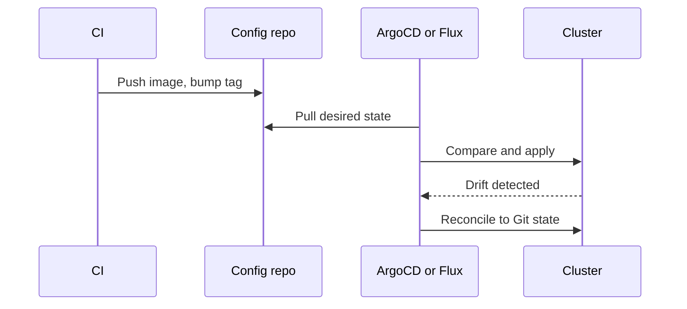
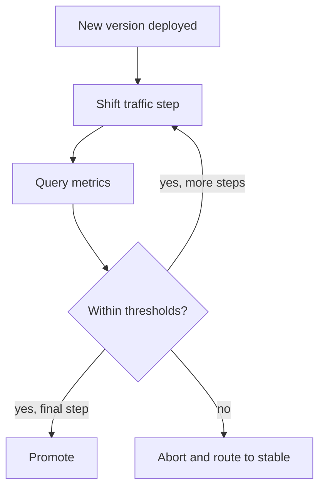
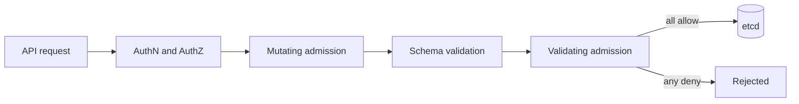
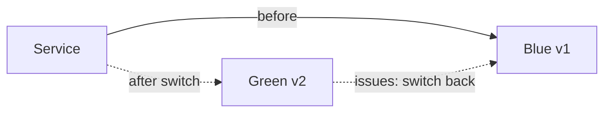

# 🚀 Kubernetes Production Control — Staff-Level Deep Dive

> *Deep-dive into production control patterns for Kubernetes: GitOps, admission controllers, deployment strategies, multi-tenancy, service mesh, and cluster governance — every section expects principal engineer-level depth with real production patterns.*

> **Prerequisites:** This file builds on the foundational Kubernetes content in [`INTERVIEW_QUESTIONS.md`](./INTERVIEW_QUESTIONS.md) (scheduler, networking, RBAC, storage, controllers), [`POD_LIFECYCLE_AND_MONITORING.md`](./POD_LIFECYCLE_AND_MONITORING.md) (pod lifecycle, probes, monitoring, eBPF), and Docker fundamentals in [`../docker/INTERVIEW_QUESTIONS.md`](../docker/INTERVIEW_QUESTIONS.md) (container runtime, namespaces, cgroups, images).
>
> **Storage deep-dive** in [Section 12](#12-storage-csi-volume-snapshots-backup-strategies) extends the PV/PVC/CSI/StatefulSet foundations from `INTERVIEW_QUESTIONS.md` Q4.

---

## Table of Contents

1. [GitOps: ArgoCD & Flux](#1-gitops-argocd-flux)
2. [Admission Controllers: Webhooks, OPA/Gatekeeper, Kyverno](#2-admission-controllers-webhooks-opagatekeeper-kyverno)
3. [Deployment Strategies: Rolling, Blue-Green, Canary, A/B](#3-deployment-strategies-rolling-blue-green-canary-ab)
4. [Progressive Delivery: Flagger & Argo Rollouts](#4-progressive-delivery-flagger-argo-rollouts)
5. [Multi-Tenancy: Namespaces, Resource Quotas, Network Policies](#5-multi-tenancy-namespaces-resource-quotas-network-policies)
6. [Service Mesh: Istio, Linkerd & mTLS](#6-service-mesh-istio-linkerd-mtls)
7. [Network Policies: Micro-Segmentation](#7-network-policies-micro-segmentation)
8. [Cluster API & Multi-Cluster Management](#8-cluster-api-multi-cluster-management)
9. [Pod Security: Kyverno Policies for Production](#9-pod-security-kyverno-policies-for-production)
10. [CNI Deep Dive: Calico, Cilium, Flannel](#10-cni-deep-dive-calico-cilium-flannel)
11. [Descheduler & Cluster Autoscaler](#11-descheduler-cluster-autoscaler)
12. [Storage: CSI, Volume Snapshots, Backup Strategies](#12-storage-csi-volume-snapshots-backup-strategies)

---

## 1. GitOps: ArgoCD & Flux

**Q:** "Your team deploys to 5 Kubernetes clusters (dev, staging, prod-us, prod-eu, prod-apac) with 200 microservices. How do you ensure declarative, auditable, and automated deployments? Design a GitOps workflow using ArgoCD or Flux."

**What They're Really Testing:** Whether you understand GitOps principles — Git as the single source of truth, automated drift detection and reconciliation, and pull-based deployment for security.

### Answer

!!! tip "30-second answer"
    Keep desired state for every cluster in Git (a config repo separate from app code), let an in-cluster agent (Argo CD or Flux) pull and continuously reconcile it, and have CI only build, test, push an image and open or commit a change that bumps the image tag. Use one ApplicationSet (or a Flux Kustomization per cluster) to stamp the 200 services onto 5 clusters with per-environment overlays, promote by merging changes from env to env, and roll back with `git revert`. Trade-offs: Git becomes the bottleneck (concurrent tag-bump commits, repo size), secrets need SOPS/Sealed Secrets/External Secrets, and emergencies must also go through Git or self-heal will undo them.

**GitOps Principles:**

```
1. Declarative: Entire system described in Git (manifests, Helm, Kustomize)
2. Versioned: Every change is a Git commit (full audit trail)
3. Pull-based: Agent in cluster pulls desired state from Git (no cluster credentials in CI!)
4. Reconciled: Agent continuously compares cluster state vs Git state
5. Automated: Drift detected and corrected automatically
```

*Diagram: CI stays credential-free while an in-cluster agent pulls and reconciles.*



**GitOps Architecture:**

```
┌─────────────────────────────────────────────────────────────┐
│                        Git Repository                        │
│  ┌─────────────────────────────────────────────┐           │
│  │ apps/                                        │           │
│  │ ├── payment-service/                        │           │
│  │ │   ├── base/        (Helm chart or Kustomize)│          │
│  │ │   ├── overlays/                           │           │
│  │ │   │   ├── dev/                            │           │
│  │ │   │   ├── staging/                        │           │
│  │ │   │   └── prod/                           │           │
│  │ ├── user-service/                           │           │
│  │ └── ...                                     │           │
│  │                                             │           │
│  │ clusters/                                   │           │
│  │ ├── prod-us/ (ArgoCD ApplicationSet)        │           │
│  │ ├── prod-eu/                                │           │
│  │ └── ...                                     │           │
│  └─────────────────────────────────────────────┘           │
└─────────────────────────┬───────────────────────────────────┘
                          │ Pull
                          ▼
┌─────────────────────────────────────────────────────────────┐
│                        ArgoCD Operator                      │
│                                                              │
│  ┌──────────┐  ┌──────────┐  ┌──────────┐  ┌──────────┐   │
│  │ Cluster  │  │ Cluster  │  │ Cluster  │  │ Cluster  │   │
│  │ prod-us  │  │ prod-eu  │  │ prod-apac│  │ staging  │   │
│  │          │  │          │  │          │  │          │   │
│  │ ArgoCD   │  │ ArgoCD   │  │ ArgoCD   │  │ ArgoCD   │   │
│  │ Apps     │  │ Apps     │  │ Apps     │  │ Apps     │   │
│  └──────────┘  └──────────┘  └──────────┘  └──────────┘   │
└─────────────────────────────────────────────────────────────┘
                          │
                          ▼
┌─────────────────────────────────────────────────────────────┐
│                     CI Pipeline (GitHub Actions)             │
│  Build → Test → Push image → Update Git (k8s manifest)     │
│  Git commit → ArgoCD detects change → syncs to cluster      │
│  (No kubectl apply in CI! Cluster credentials never leave   │
│   the cluster.)                                             │
└─────────────────────────────────────────────────────────────┘
```

**ArgoCD Application:**

```yaml
apiVersion: argoproj.io/v1alpha1
kind: Application
metadata:
  name: payment-service
  namespace: argocd
spec:
  project: production                  # Logical grouping of applications
  source:
    repoURL: https://github.com/company/k8s-manifests
    targetRevision: main               # Branch to follow
    path: apps/payment-service/overlays/prod   # Kustomize overlay (auto-detected)
    # For a Helm chart instead: path: charts/payment-service + helm.valueFiles
    # Image tag is pinned in the overlay (kustomization.yaml images:), bumped by CI
  destination:
    server: https://kubernetes.default.svc
    namespace: prod-payment
  syncPolicy:
    automated:
      prune: true                      # Remove resources not in Git
      selfHeal: true                    # Auto-fix manual changes (drift)
      allowEmpty: false
    syncOptions:
    - CreateNamespace=true             # Auto-create namespace
    - PruneLast=true                    # Prune after sync (safer)
    - ApplyOutOfSyncOnly=true          # Only apply out-of-sync resources
    - ServerSideApply=true             # avoids the 256KB last-applied annotation limit
    retry:                             # (lives under syncPolicy)
      limit: 5
      backoff:
        duration: 5s
        factor: 2
        maxDuration: 3m
```

**ArgoCD ApplicationSet (Multi-Cluster):**

```yaml
# ApplicationSet: deploy the same app to multiple clusters/environments
apiVersion: argoproj.io/v1alpha1
kind: ApplicationSet
metadata:
  name: payment-service
  namespace: argocd
spec:
  generators:
  - clusters:                            # From cluster secrets in argocd
      selector:
        matchLabels:
          environment: prod
  template:
    metadata:
      name: 'payment-service-{{name}}'   # {{name}} = cluster name
      labels:
        app: payment-service
        environment: '{{metadata.labels.environment}}'
    spec:
      project: production
      source:
        repoURL: https://github.com/company/k8s-manifests
        targetRevision: main
        path: 'apps/payment-service/overlays/{{metadata.labels.environment}}'
      destination:
        server: '{{server}}'            # From cluster secret
        namespace: prod-payment
      syncPolicy:
        automated:
          prune: true
          selfHeal: true
```

**GitOps CI/CD Pipeline:**

```yaml
# GitHub Actions workflow (CI only — no cluster credentials!)
name: Build and Deploy (GitOps)

on:
  push:
    branches: [main]
    paths:
    - 'apps/payment-service/**'

jobs:
  test:
    runs-on: ubuntu-latest
    steps:
    - uses: actions/checkout@v4
    - run: make test

  build-and-push:
    needs: test
    runs-on: ubuntu-latest
    steps:
    - uses: actions/checkout@v4
    - name: Login to registry
      uses: docker/login-action@v3
      with:
        registry: registry.example.com
        username: ${{ secrets.REGISTRY_USER }}
        password: ${{ secrets.REGISTRY_PASSWORD }}

    - name: Build and push
      uses: docker/build-push-action@v6
      with:
        push: true
        tags: registry.example.com/payment-service:${{ github.sha }}

  update-manifest:
    needs: build-and-push
    runs-on: ubuntu-latest
    steps:
    - name: Checkout k8s manifests repo
      uses: actions/checkout@v4
      with:
        repository: company/k8s-manifests   # Separate repo!
        token: ${{ secrets.MANIFESTS_TOKEN }}
        ref: main

    - name: Update image tag
      run: |
        cd apps/payment-service/overlays/prod
        kustomize edit set image \
          payment-service=registry.example.com/payment-service:${{ github.sha }}

    - name: Commit and push
      run: |
        git config user.name "CI Bot"
        git config user.email "ci@example.com"
        git add .
        git commit -m "Update payment-service to ${{ github.sha }}"
        git pull --rebase && git push   # many services bump tags concurrently
    # ArgoCD detects the Git change and auto-syncs!
    # For prod, open a PR instead of pushing to main: the merge is the approval gate.
    # Alternatives to CI commits: Argo CD Image Updater / Flux image automation
    # watch the registry and write the new tag back to Git themselves.
```

**Flux v2 (Alternative to ArgoCD):**

```yaml
# Flux uses GitRepository and Kustomization resources
apiVersion: source.toolkit.fluxcd.io/v1
kind: GitRepository
metadata:
  name: flux-system
  namespace: flux-system
spec:
  interval: 1m                           # Check Git every 1 minute
  url: https://github.com/company/k8s-manifests
  ref:
    branch: main
  secretRef:
    name: flux-repo-auth

---
apiVersion: kustomize.toolkit.fluxcd.io/v1
kind: Kustomization
metadata:
  name: apps
  namespace: flux-system
spec:
  interval: 10m                          # Sync every 10 minutes
  sourceRef:
    kind: GitRepository
    name: flux-system
  path: ./apps/production
  prune: true                            # Remove resources not in Git
  wait: false
  healthChecks:
  - apiVersion: apps/v1
    kind: Deployment
    name: payment-service
    namespace: prod-payment
  postBuild:
    substitute:
      environment: prod
      cluster_region: us-east-1
```

**ArgoCD vs Flux:**

```yaml
Feature               | ArgoCD                    | Flux v2
----------------------|---------------------------|---------------------------
UI                    | Rich web UI + CLI          | CLI only (but good)
Multi-cluster         | Built-in (ApplicationSet) | Via Kustomization per cluster
SSO/RBAC              | Built-in (Dex, Keycloak)  | Kubernetes RBAC
Configuration tool    | Any (Helm, Kustomize, YAML)| Any (Helm, Kustomize, YAML)
Sync strategies       | Manual, automated, phased | Automated with health checks
Image updates         | ArgoCD Image Updater      | Flux Image Automation
Rollback              | Via UI, CLI, or Git revert| Git revert (automatic)
Secret management     | External (Sealed Secrets,  | External (SOPS, Sealed Secrets,
                      | External Secrets)          | External Secrets)
Learning curve        | Moderate                  | Steeper (CRD-based)
Governance            | CNCF graduated            | CNCF graduated (continues after
                      |                           | Weaveworks shut down in 2024)

# Recommendation:
# ArgoCD: When you need a UI, central multi-cluster management, team self-service
# Flux: When you want lightweight per-cluster agents, composable controllers,
#       Kubernetes-RBAC-only access, no central control plane to secure
```

*Diagram: the automated canary analysis loop used by Flagger and Argo Rollouts.*



### 🔍 Staff-Level Evaluation

| Criterion | What I'm Looking For |
|-----------|----------------------|
| **Pull vs push** | Understands GitOps uses pull (agent in cluster) not push (CI with kubectl) |
| **Drift detection** | Explains continuous reconciliation: Git is source of truth, cluster converges |
| **Multi-cluster** | Uses ApplicationSet or Flux Kustomization per cluster |
| **CI vs CD separation** | CI builds images, Git commit triggers CD; no cluster creds in CI |

---

## 2. Admission Controllers: Webhooks, OPA/Gatekeeper, Kyverno

**Q:** "Your security team requires that all pods must have resource limits, specific labels, and must not use the `latest` image tag. How do you enforce these policies without modifying every deployment? Design an admission control strategy using Kyverno or OPA/Gatekeeper."

**What They're Really Testing:** Whether you understand Kubernetes admission controllers — how mutating and validating webhooks intercept API requests — and can design policy-as-code enforcement.

### Answer

**Admission Controller Flow:**

```
API Request (kubectl apply, API call)
        │
        ▼
┌─────────────────────────────────────────────┐
│        Authentication & Authorization         │
│  (Who is this? Can they do this?)            │
└──────────────────┬──────────────────────────┘
                   │
                   ▼
┌─────────────────────────────────────────────┐
│  Mutating admission                          │
│  built-in plugins (LimitRanger, default SA,  │
│  ...), MutatingAdmissionPolicy (CEL), then   │
│  mutating webhooks                           │
│  (Modify the resource BEFORE validation)     │
│  Examples:                                   │
│  - Inject sidecar (Istio, Linkerd)           │
│  - Add default resource limits               │
│  - Add labels/annotations                    │
│  - Set securityContext defaults              │
└──────────────────┬──────────────────────────┘
                   │
                   ▼
   (object schema validation happens here)
                   │
                   ▼
┌─────────────────────────────────────────────┐
│  Validating admission                        │
│  built-in plugins (PodSecurity,              │
│  ResourceQuota, ...), ValidatingAdmission-   │
│  Policy (CEL, GA 1.30, in-process, no        │
│  webhook to run), then validating webhooks   │
│  (run in parallel; any deny rejects)         │
│  Examples:                                   │
│  - Check image registry is allowed           │
│  - Verify resource limits are set            │
│  - Ensure required labels exist              │
└──────────────────┬──────────────────────────┘
                   │
                   ▼
┌─────────────────────────────────────────────┐
│              Object Storage (etcd)           │
└─────────────────────────────────────────────┘
```

*Diagram: where mutating and validating admission sit in an API request.*



**Kyverno (Kubernetes-Native Policy Engine):**

```yaml
# Kyverno: policies as Kubernetes resources (no new language!)
# Mutate, validate, generate and verifyImages rules.
# Policies on Pods are auto-generated for Deployments, StatefulSets, Jobs, etc.,
# so violations are reported on the workload, not only on its pods.
# (Newer Kyverno releases also offer CEL-based ValidatingPolicy/MutatingPolicy types
#  aligned with Kubernetes' built-in admission policies; ClusterPolicy below still works.)

# ── 1. MUTATING: Add default resource requests/limits if not set ──
# (A namespace LimitRange does the same natively; Kyverno helps when you need
#  logic, e.g. different defaults per label.)
apiVersion: kyverno.io/v1
kind: ClusterPolicy
metadata:
  name: add-resource-limits
spec:
  rules:
  - name: add-default-limits
    match:
      any:
      - resources:
          kinds:
          - Pod
    mutate:
      patchStrategicMerge:
        spec:
          containers:
          - (name): "*"                    # Match ALL containers
            resources:
              limits:
                +(cpu): "500m"             # + means: add if not present
                +(memory): "512Mi"
              requests:
                +(cpu): "100m"
                +(memory): "256Mi"

---
# ── 2. VALIDATING: Require specific labels ──
apiVersion: kyverno.io/v1
kind: ClusterPolicy
metadata:
  name: require-labels
spec:
  rules:
  - name: check-team-label
    match:
      any:
      - resources:
          kinds:
          - Pod
          - Deployment
          - Service
    validate:
      failureAction: Audit                  # start in Audit, flip to Enforce later
                                            # (per-rule field; the spec-level
                                            #  validationFailureAction is deprecated)
      message: "Label 'team' is required for all resources"
      pattern:
        metadata:
          labels:
            team: "?*"                      # Must exist and not be empty

---
# ── 3. VALIDATING: Block latest image tag ──
apiVersion: kyverno.io/v1
kind: ClusterPolicy
metadata:
  name: block-latest-tag
spec:
  rules:
  - name: require-explicit-non-latest-tag
    match:
      any:
      - resources:
          kinds:
          - Pod
    validate:
      failureAction: Enforce
      message: "Images must have an explicit tag other than 'latest'"
      pattern:
        spec:
          containers:
          - image: "*:* & !*:latest"        # "nginx" (implicit latest) also fails
          =(initContainers):
          - image: "*:* & !*:latest"

---
# ── 4. GENERATE: Create NetworkPolicy for every namespace ──
apiVersion: kyverno.io/v1
kind: ClusterPolicy
metadata:
  name: generate-networkpolicy
spec:
  rules:
  - name: default-deny-ingress
    match:
      any:
      - resources:
          kinds:
          - Namespace
    generate:
      apiVersion: networking.k8s.io/v1
      kind: NetworkPolicy
      name: default-deny-ingress
      namespace: "{{ request.object.metadata.name }}"
      synchronize: true                     # Keep in sync (recreate if deleted)
      data:
        spec:
          podSelector: {}
          policyTypes:
          - Ingress
```

**OPA/Gatekeeper (Rego-Based Policies):**

```yaml
# OPA/Gatekeeper: uses Rego policy language (more powerful, steeper learning curve)

apiVersion: templates.gatekeeper.sh/v1
kind: ConstraintTemplate
metadata:
  name: k8srequiredlabels
spec:
  crd:
    spec:
      names:
        kind: K8sRequiredLabels
      validation:
        openAPIV3Schema:
          type: object
          properties:
            labels:
              type: array
              items:
                type: string
  targets:
  - target: admission.k8s.gatekeeper.sh
    rego: |
      package k8srequiredlabels

      violation[{"msg": msg}] {
        provided := {label | input.review.object.metadata.labels[label]}
        required := {label | label := input.parameters.labels[_]}
        missing := required - provided
        count(missing) > 0
        msg := sprintf("Required labels missing: %v", [missing])
      }

---
# Constraint instance (uses the template)
apiVersion: constraints.gatekeeper.sh/v1beta1
kind: K8sRequiredLabels
metadata:
  name: require-team-label
spec:
  match:
    kinds:
    - apiGroups: [""]
      kinds: ["Pod", "Service"]
    - apiGroups: ["apps"]
      kinds: ["Deployment"]
    namespaces:
    - "production"
    - "staging"
  parameters:
    labels:
    - "team"
    - "owner"
    - "environment"

---
# ── Block privileged containers ──
apiVersion: templates.gatekeeper.sh/v1
kind: ConstraintTemplate
metadata:
  name: k8spspprivilegedcontainer
spec:
  crd:
    spec:
      names:
        kind: K8sPSPPrivilegedContainer
  targets:
  - target: admission.k8s.gatekeeper.sh
    rego: |
      package k8spspprivilegedcontainer

      violation[{"msg": msg}] {
        c := input.review.object.spec.containers[_]
        c.securityContext.privileged
        msg := sprintf("Privileged container %v is not allowed", [c.name])
      }

      violation[{"msg": msg}] {
        input.review.object.spec.containers[_].securityContext.capabilities.add[_] == "SYS_ADMIN"
        msg := "CAP_SYS_ADMIN is not allowed"
      }
# Real policies must also check initContainers and ephemeralContainers.
# The `rego:` field uses Rego v0 syntax; OPA 1.0 defaults to v1 syntax
# (`violation contains {...} if {...}`), which Gatekeeper accepts via its `code:` field.
# For checks this simple, built-in ValidatingAdmissionPolicy (CEL) avoids running a
# webhook at all; PSA "baseline" already blocks both cases.
```

**Kyverno vs OPA/Gatekeeper:**

```yaml
Feature               | Kyverno                      | OPA/Gatekeeper
----------------------|------------------------------|------------------------------
Policy language       | YAML (Kubernetes-native)     | Rego (new language to learn)
Learning curve        | Low (looks like K8s resources)| High (Rego is different)
Built-in functions    | Rich: image verification,     | Rich: custom Rego logic
                      | auto-gen NetworkPolicy,       |
                      | variable substitution         |
Mutation              | Built-in (mutate rules)      | Requires mutating webhook +
                      |                              | custom Rego logic
Generate resources    | Built-in (generate rules)    | Not natively supported
Performance           | Good (native Go)             | Good (Rego is compiled to bytecode)
Validation            | Patterns, deny conditions    | Full Rego policy
Community             | Nirmata, growing fast        | CNCF graduated, large
Use case              | K8s-specific policies        | General-purpose policy engine
                      |                              | (also covers Terraform, K8s, etc.)

# Recommendation:
# Kyverno: Simpler, K8s-native policies (most teams)
# OPA: Already invested in Rego, need cross-platform policies (K8s + Terraform + Envoy)
```

**Validating Webhook (Manual Implementation):**

```yaml
# For custom validation logic (when Kyverno/OPA is too much overhead)

apiVersion: v1
kind: Service
metadata:
  name: pod-validator
  namespace: admission
spec:
  selector:
    app: pod-validator
  ports:
  - port: 443
    targetPort: 8443

---
apiVersion: apps/v1
kind: Deployment
metadata:
  name: pod-validator
  namespace: admission
spec:
  replicas: 2
  selector:
    matchLabels:
      app: pod-validator
  template:
    metadata:
      labels:
        app: pod-validator
    spec:
      containers:
      - name: webhook
        image: registry.example.com/pod-validator:1.0
        args:
        - --tls-cert=/certs/tls.crt
        - --tls-key=/certs/tls.key
        ports:
        - containerPort: 8443
        volumeMounts:
        - name: certs
          mountPath: /certs
          readOnly: true
      volumes:
      - name: certs
        secret:
          secretName: webhook-certs

---
apiVersion: admissionregistration.k8s.io/v1
kind: ValidatingWebhookConfiguration
metadata:
  name: pod-validator
webhooks:
- name: pod-validator.admission.example.com
  rules:
  - operations: ["CREATE", "UPDATE"]
    apiGroups: [""]
    apiVersions: ["v1"]
    resources: ["pods"]
  clientConfig:
    service:
      name: pod-validator
      namespace: admission
      path: /validate
    caBundle: <base64-encoded-CA-cert>
  admissionReviewVersions: ["v1"]
  sideEffects: None
  timeoutSeconds: 5
  failurePolicy: Fail                     # If webhook is down, reject requests
  # Or: Ignore (allow requests if webhook is down — risk but availability)
  namespaceSelector:                      # never gate the namespaces the webhook needs
    matchExpressions:                     # to recover itself (kube-system, admission)
    - key: kubernetes.io/metadata.name
      operator: NotIn
      values: ["kube-system", "admission"]
# Failure mode to name in interviews: a Fail-closed webhook whose pods are down
# blocks creating ALL pods, including its own replacements → cluster-wide outage.
# Mitigate: exclude system namespaces, 2+ replicas with a PDB, short timeouts,
# alert on apiserver_admission_webhook_rejection_count / latency.
```

### 🔍 Staff-Level Evaluation

| Criterion | What I'm Looking For |
|-----------|----------------------|
| **Mutating vs Validating** | Understands the order: mutate first, then validate |
| **Kyverno vs OPA** | Can recommend based on team skills and policy complexity |
| **Webhook failure policy** | Knows Fail (block if webhook down) vs Ignore (allow if down) trade-offs |
| **Audit mode** | Uses audit mode before Enforce to prevent breaking existing workloads |

---

## 3. Deployment Strategies: Rolling, Blue-Green, Canary, A/B

**Q:** "Design a deployment strategy for a payment processing service that must have zero downtime, canary testing with 5% traffic, and instant rollback within 10 seconds if errors spike. Compare RollingUpdate, Blue-Green, Canary, and A/B testing deployments."

**What They're Really Testing:** Whether you understand the deployment strategy trade-offs — speed vs safety, cost vs simplicity, and how to implement each with Kubernetes primitives (Deployments, Services, Ingress).

### Answer

!!! tip "30-second answer"
    A plain RollingUpdate can't do "5% of traffic" (its split is a pod ratio) and can't roll back in 10 seconds (rollback is another rolling update). For a payment service use a **canary with weighted routing** in a mesh or Gateway API `HTTPRoute`, with automated analysis (Argo Rollouts or Flagger). Rollback is then a routing change: set the canary's weight to 0 in seconds while stable pods keep running. Blue-green also gives instant rollback, at 2× capacity. Underneath any strategy: honest readiness probes, graceful shutdown, backward-compatible schema and API changes (both versions serve at once), and idempotent payment operations so client retries during a switch don't double-charge.

**Strategy Comparison:**

```yaml
Strategy        | Downtime | Rollback Speed | Cost       | Traffic Control | Complexity
----------------|----------|----------------|------------|-----------------|-----------
Recreate        | Yes      | Slow           | Low        | None            | Minimal
RollingUpdate   | No       | Medium         | Low        | At pod level    | Low
Blue-Green      | No       | Instant        | High (2×)  | At service      | Medium
Canary          | No       | Fast           | Medium     | % based         | High
A/B Testing     | No       | Fast           | Medium     | Header based    | High

# Recreate: Kill all old, create all new (downtime!)
# RollingUpdate: Incrementally replace pods (no downtime)
# Blue-Green: Two full environments, switch traffic instantly
# Canary: Gradual % traffic shift with rollback
# A/B: Traffic routing by header/cookie (for testing features)
```

*Diagram: blue-green switch via the Service selector.*



**Blue-Green Deployment:**

```yaml
# Blue = current (v1), Green = new (v2)
# Two identical deployments, service points to one at a time

# Step 1: Deploy green (alongside blue)
apiVersion: apps/v1
kind: Deployment
metadata:
  name: payment-service-green
  labels:
    app: payment-service
    version: green                       # Identifies this as green
spec:
  replicas: 5
  selector:
    matchLabels:
      app: payment-service
      version: green
  template:
    metadata:
      labels:
        app: payment-service
        version: green
    spec:
      containers:
      - name: app
        image: registry.example.com/payment-service:v2.0.0
        readinessProbe:
          httpGet:
            path: /health/ready
            port: 8080

---
# Service points to BLUE (current production)
apiVersion: v1
kind: Service
metadata:
  name: payment-service
spec:
  selector:
    app: payment-service
    version: blue                        # Currently blue
  ports:
  - port: 8080

# Step 2: Verify green is healthy
# kubectl get pods -l version=green
# kubectl exec -it payment-service-green-abc -- curl localhost:8080/health

# Step 3: Switch traffic to green (instant!)
kubectl patch service payment-service -p '{"spec":{"selector":{"version":"green"}}}'

# Step 4: Monitor for 10-15 minutes
# If issues: switch back to blue (instant rollback)
# kubectl patch service payment-service -p '{"spec":{"selector":{"version":"blue"}}}'

# Step 5: Scale down blue
# kubectl scale deployment payment-service-blue --replicas=0

# Pros: Instant switch, instant rollback, easy to understand
# Cons: 2× resource cost during deployment, requires full environment
```

**Gateway API Canary (preferred for new setups):**

The Ingress API only standardises host/path routing, so weights and header matches live in controller-specific annotations. **Gateway API** (GA since v1.0, current v1.5) makes them first-class, portable fields, and is the Kubernetes community's recommended successor to Ingress. The Ingress API itself (`networking.k8s.io/v1`) is GA and frozen, not removed.

```yaml
apiVersion: gateway.networking.k8s.io/v1
kind: HTTPRoute
metadata:
  name: payment-service
  namespace: prod
spec:
  parentRefs:
  - name: public-gateway              # Gateway owned by the platform team
    namespace: gateway-infra
  hostnames: ["api.example.com"]
  rules:
  - matches:                          # A/B or internal testing: header → canary only
    - path: {type: PathPrefix, value: /api/payments}
      headers:
      - name: x-canary
        value: "true"
    backendRefs:
    - name: payment-service-canary
      port: 8080
  - matches:
    - path: {type: PathPrefix, value: /api/payments}
    backendRefs:                      # weighted split for everyone else
    - name: payment-service-stable
      port: 8080
      weight: 95
    - name: payment-service-canary
      port: 8080
      weight: 5                       # rollback = set to 0 (seconds, no pod churn)
```

**Ingress-Based Canary (legacy: Ingress-NGINX annotations):**

!!! warning "Ingress-NGINX is retired"
    The community `kubernetes/ingress-nginx` controller was retired in **March 2026**: no further releases, bug fixes or security patches (announced by Kubernetes SIG Network and the Security Response Committee in November 2025). Clusters still running it should migrate to a Gateway API implementation (the `ingress2gateway` tool converts manifests) or to another maintained Ingress controller. The annotations below are shown because many existing clusters and interview questions still use them. This does not affect F5's separately maintained NGINX Ingress Controller.

```yaml
# Canary using Ingress-NGINX annotations (controller-specific, not portable)
# Route % of traffic to canary version based on weight

apiVersion: networking.k8s.io/v1
kind: Ingress
metadata:
  name: payment-service
  annotations:
    nginx.ingress.kubernetes.io/canary: "true"
    nginx.ingress.kubernetes.io/canary-weight: "5"     # 5% traffic to canary
    nginx.ingress.kubernetes.io/canary-by-header: "x-canary"  # header wins over weight
    # nginx.ingress.kubernetes.io/canary-by-cookie: "canary_test"
spec:
  ingressClassName: nginx
  rules:
  - host: api.example.com
    http:
      paths:
      - path: /api/payments
        pathType: Prefix
        backend:
          service:
            name: payment-service-canary
            port:
              number: 8080

---
# Primary ingress (the remaining 95% goes to stable)
apiVersion: networking.k8s.io/v1
kind: Ingress
metadata:
  name: payment-service-stable
spec:
  ingressClassName: nginx
  rules:
  - host: api.example.com
    http:
      paths:
      - path: /api/payments
        pathType: Prefix
        backend:
          service:
            name: payment-service-stable
            port:
              number: 8080
```

**A/B Testing with Header Routing:**

```yaml
# A/B testing: route specific users to new version based on header/cookie
# Not about gradual rollout — about testing behavior differences

# Nginx Ingress canary by header:
# nginx.ingress.kubernetes.io/canary-by-header: "x-ab-test"
# nginx.ingress.kubernetes.io/canary-by-header-value: "v2"

# Client sends: x-ab-test: v2 → request goes to canary
# Client sends: anything else → request goes to stable

# For more sophisticated A/B with support for multiple experiments:

apiVersion: networking.istio.io/v1
kind: VirtualService
metadata:
  name: payment-service
spec:
  hosts:
  - payment-service
  http:
  - match:
    - headers:                              # A/B test group A
        x-ab-test:
          exact: "new-checkout-flow"
    route:
    - destination:
        host: payment-service
        subset: v2          # New checkout flow version
  - route:                                  # Everyone else
    - destination:
        host: payment-service
        subset: v1          # Current version

# A/B best practices:
# 1. Run experiments for statistically significant duration (1-2 weeks)
# 2. Track both business metrics (conversion) and technical metrics (latency, errors)
# 3. Use feature flags for simple feature toggles (LaunchDarkly, Flagsmith)
# 4. A/B = behavioral experiment, Canary = risk mitigation
```

### 🔍 Staff-Level Evaluation

| Criterion | What I'm Looking For |
|-----------|----------------------|
| **Strategy trade-offs** | Can compare Blue-Green (instant rollback, 2× cost) vs Canary (gradual, cheaper) |
| **Rollback speed** | Understands Blue-Green rollback is instant (service label change) |
| **Canary weight progression** | Knows to progressively increase: 1%→5%→10%→25%→50%→100% |
| **A/B vs Canary** | Distinguishes header-based routing (A/B) from weight-based (canary) |

---

## 4. Progressive Delivery: Flagger & Argo Rollouts

**Q:** "Manual canary deployments are error-prone — engineers forget to monitor and rollback takes too long. Design an automated progressive delivery pipeline using Flagger or Argo Rollouts that automatically promotes or rolls back based on metrics."

**What They're Really Testing:** Whether you understand automated canary analysis — how Flagger/Argo Rollouts shift traffic, collect metrics, analyze health, and automatically promote or rollback.

### Answer

**Flagger Automated Canary:**

```yaml
# Flagger: automated canary deployments with metric analysis
# Routing providers: Istio, Linkerd, Gateway API, Contour, Gloo, Traefik, Kuma, APISIX,
#   NGINX, or plain Kubernetes Services (blue-green only)
# Metrics: Prometheus, Datadog, New Relic, CloudWatch, Graphite, ... via MetricTemplate

apiVersion: flagger.app/v1beta1
kind: Canary
metadata:
  name: payment-service
  namespace: prod
spec:
  # Target deployment (the thing being deployed)
  targetRef:
    apiVersion: apps/v1
    kind: Deployment
    name: payment-service

  # Service mesh or ingress
  service:
    port: 8080
    targetPort: 8080
    gateways:                             # For Istio
    - istio-system/public-gateway
    hosts:
    - api.example.com
    trafficPolicy:                         # mTLS settings
      tls:
        mode: ISTIO_MUTUAL
    retries:
      attempts: 3
      perTryTimeout: 1s
    headers:
      request:
        add:
          x-canary: "true"                # Mark requests for tracking

  # Canary analysis settings
  analysis:
    interval: 30s                          # Check metrics every 30 seconds
    threshold: 5                           # Roll back after 5 FAILED checks (a count,
                                           # not an error-rate %)
    maxWeight: 50                          # Max 50% traffic to canary
    stepWeight: 5                          # +5% per passing interval
    # Progression: 5% → 10% → ... → 50% (10 steps ≈ 5 min), then promote.
    # (`iterations` is only for blue-green / A-B analysis, not weighted canaries.)

    metrics:
    - name: request-success-rate           # Built-in metric (from the mesh/ingress)
      thresholdRange:
        min: 99                            # ≥ 99% non-5xx
      interval: 1m                         # Evaluate over 1-minute window
    - name: request-duration               # Built-in metric
      thresholdRange:
        max: 500                           # p99 ≤ 500ms
      interval: 1m
    - name: db-connections                 # Custom metric via MetricTemplate
      templateRef:                         # (provider: prometheus, datadog, ...)
        name: database-connections
      thresholdRange:
        max: 50
      interval: 1m

    webhooks:                              # Webhooks GATE the rollout: non-2xx = failed check
    - name: load-test                      # Generate traffic so metrics are meaningful
      type: rollout
      url: http://flagger-loadtester.prod/
      timeout: 5s
      metadata:
        cmd: "hey -z 2m -q 10 -host api.example.com http://gateway:80/api/payments"

    alerts:                                # Notifications go through AlertProviders,
    - name: on-call-slack                  # not webhooks
      severity: error
      providerRef:
        name: slack
        namespace: flagger
```

**Flagger Canary Lifecycle:**

```
0. Bootstrap (once): Flagger copies the Deployment to payment-service-primary,
   creates the -primary/-canary Services and routing, and scales your Deployment
   (now "the canary") to 0
1. User updates the Deployment (new image tag), e.g. via GitOps
2. Flagger detects the pod-template change
3. Flagger scales the canary up (HPA-aware) and waits for it to be ready
4. Traffic shift: 5% to canary
5. Analysis iteration 1:
   - Check: request-success-rate ≥ 99%
   - Check: request-duration p99 < 500ms
   - Check: custom metrics (database connections)
   - If ALL pass: continue to next step
6. Traffic shift: 10% to canary
7. ... repeat until maxWeight (50%)
8. At maxWeight with healthy checks:
   - Promote: copy the canary's spec to the primary Deployment, which rolls out
   - Route 100% back to primary, scale canary to 0
9. If failed checks reach `threshold`:
   - Auto-rollback: 100% to primary, canary scaled to 0
   - Alert via the configured AlertProvider (Slack, Teams, PagerDuty...)
   - Your Git still says "new version": fix forward or revert the commit
```

**Argo Rollouts (Alternative to Flagger):**

```yaml
# Argo Rollouts: a Deployment replacement (Rollout CRD) with canary/blue-green steps
# Traffic routers: Istio, Linkerd/SMI, ALB, NGINX, Traefik, APISIX, Gateway API (plugin)...
# WITHOUT a traffic router, setWeight is approximated by the replica ratio
# (10% of 5 replicas = 1 pod) — fine for low-risk services, not for "exactly 5%".
# Also supports: Blue-Green, Canary, and Experiment (A/B) strategies

apiVersion: argoproj.io/v1alpha1
kind: Rollout
metadata:
  name: payment-service
spec:
  replicas: 5
  revisionHistoryLimit: 3
  selector:
    matchLabels:
      app: payment-service
  template:
    metadata:
      labels:
        app: payment-service
    spec:
      containers:
      - name: app
        image: registry.example.com/payment-service:v2.0.0
        ports:
        - containerPort: 8080

  strategy:
    canary:
      maxSurge: 1
      maxUnavailable: 0
      steps:
      - setWeight: 10                       # Start at 10% traffic
      - pause:
          duration: 2m                      # Wait 2 minutes
      - setWeight: 25
      - pause:
          duration: 5m
      - setWeight: 50
      - pause:
          duration: 5m
      - setWeight: 75
      - pause:
          duration: 2m
      # After last step → auto-promote to 100%

      analysis:
        templates:
        - templateName: success-rate        # Reference an AnalysisTemplate
        - templateName: latency-check
        startingStep: 1                     # Start analysis after step 1

---
apiVersion: argoproj.io/v1alpha1
kind: AnalysisTemplate
metadata:
  name: success-rate
spec:
  metrics:
  - name: success-rate
    interval: 30s
    successCondition: result[0] >= 0.99     # 99%+ success
    failureLimit: 3                          # 3 failures = rollback
    provider:
      prometheus:
        address: http://prometheus.monitoring:9090
        # Real templates take args (e.g. the canary's pod-template-hash) and filter on
        # them; a namespace-wide ratio dilutes a bad canary with healthy stable traffic.
        query: |
          sum(rate(
            http_requests_total{namespace="prod", status!~"5.."}[2m]
          )) /
          sum(rate(
            http_requests_total{namespace="prod"}[2m]
          ))

  - name: latency
    interval: 30s
    successCondition: result[0] <= 0.5       # p99 < 500ms
    failureLimit: 3
    provider:
      prometheus:
        address: http://prometheus.monitoring:9090
        query: |
          histogram_quantile(0.99,
            sum(rate(
              http_request_duration_seconds_bucket{namespace="prod"}[2m]
            )) by (le)
          )
```

**Manual Approval Gates (Argo Rollouts + Argo Workflows):**

```yaml
apiVersion: argoproj.io/v1alpha1
kind: Rollout
metadata:
  name: payment-service
spec:
  strategy:
    canary:
      steps:
      - setWeight: 10
      - pause: {}                              # Wait for manual approval
      - setWeight: 25
      - pause: {duration: 10m}                 # Wait 10 minutes
      - setWeight: 50
      - pause: {}                              # Wait for manual approval
      - setWeight: 75
      - pause: {duration: 10m}
      # After last step → promote

# Manual promotion:
kubectl argo rollouts promote payment-service
# Manual rollback:
kubectl argo rollouts abort payment-service
```

**Flagger vs Argo Rollouts:**

```yaml
Feature               | Flagger                      | Argo Rollouts
----------------------|------------------------------|------------------------------
Traffic routing       | Mesh, Gateway API or ingress | Optional; mesh, ingress or
                      | (or K8s Services: blue-green)| Gateway API (plugin) for exact %
Analysis              | Built-in metric templates    | AnalysisTemplate CRD
Gating                | Webhooks (load test, confirm)| Manual pause/promote steps
Blue-Green            | Yes                          | Yes
Canary                | Yes (weight-based)           | Yes (weight-based, mirroring)
A/B testing           | Via Istio                    | Via Istio plugin
Workload object       | Keeps your Deployment        | Replaces it with a Rollout
Integration           | Prometheus, Datadog, NewRelic| Prometheus, Datadog, custom
GitOps                | ArgoCD compatible            | ArgoCD native (same project)

# Recommendation:
# Flagger: Service-mesh environment, simple canary, built-in metrics
# Argo Rollouts: Need manual gates, no service mesh, already use ArgoCD
```

### 🔍 Staff-Level Evaluation

| Criterion | What I'm Looking For |
|-----------|----------------------|
| **Automated analysis** | Understands metrics-driven promotion: check health at each step before proceeding |
| **Auto-rollback** | Knows that failed metric check → immediate rollback to primary |
| **Traffic progression** | Can design step progression: 5%→10%→25%→50% (or similar) with appropriate pauses |
| **Load testing** | Understands the need for synthetic load during canary to generate meaningful metrics |

---

## 5. Multi-Tenancy: Namespaces, Resource Quotas, Network Policies

**Q:** "Design a multi-tenant Kubernetes cluster serving 5 teams with 10-50 microservices each. Teams must be isolated (can't access each other's resources), have fair resource allocation, and operate independently. How do you implement this with native Kubernetes primitives?"

**What They're Really Testing:** Whether you understand Kubernetes multi-tenancy — using namespaces, ResourceQuotas, LimitRanges, NetworkPolicies, and RBAC to provide strong isolation between teams running workloads on a shared cluster.

### Answer

!!! tip "30-second answer"
    Namespaces per team and environment, stamped out from a template (or Capsule / Hierarchical Namespaces): RBAC bound to IdP groups using the built-in `admin`/`edit` roles, a ResourceQuota plus LimitRange per namespace, default-deny NetworkPolicies with explicit allows for DNS, ingress and monitoring, and Pod Security Admission `restricted`. That is **soft** multi-tenancy for trusted internal teams: tenants still share the kernel, nodes, the API server and CRDs. For untrusted tenants add sandboxed runtimes (gVisor/Kata via RuntimeClass), dedicated node pools (taints plus a policy that forces tolerations), API Priority and Fairness, virtual clusters (vCluster), or separate clusters.

**Multi-Tenancy Architecture:**

```
┌─────────────────────────────────────────────────────────────┐
│                     Shared Cluster                           │
│                                                              │
│  ┌─────────────────┐  ┌─────────────────┐  ┌──────────────┐│
│  │  Team A (prod)   │  │  Team B (prod)  │  │  System      ││
│  │                  │  │                  │  │              ││
│  │  namespace:      │  │  namespace:      │  │  ns:         ││
│  │  team-a-prod     │  │  team-b-prod     │  │  kube-system ││
│  │                  │  │                  │  │  monitoring  ││
│  │  Resources:      │  │  Resources:      │  │  ingress-    ││
│  │  20 CPU, 40GB   │  │  30 CPU, 60GB   │  │  nginx       ││
│  │                  │  │                  │  │              ││
│  │  NetworkPolicy:  │  │  NetworkPolicy:  │  │              ││
│  │  deny all except │  │  deny all except │  │              ││
│  │  team-a ingress  │  │  team-b ingress  │  │              ││
│  └─────────────────┘  └─────────────────┘  └──────────────┘│
│                                                              │
│  ┌─────────────────┐  ┌─────────────────┐                   │
│  │  Team A (staging)│  │  Team B (staging)│                   │
│  │  ns: team-a-stg  │  │  ns: team-b-stg  │                   │
│  │  Resources:      │  │  Resources:      │                   │
│  │  10 CPU, 20GB   │  │  15 CPU, 30GB   │                   │
│  └─────────────────┘  └─────────────────┘                   │
└─────────────────────────────────────────────────────────────┘
```

**Namespace Provisioning:**

```yaml
# Each team gets namespaces: team-{name}-prod, team-{name}-staging, team-{name}-dev

apiVersion: v1
kind: Namespace
metadata:
  name: team-payment-prod
  labels:
    name: team-payment-prod
    team: payment
    environment: prod
    pod-security.kubernetes.io/enforce: restricted   # Pod Security Standards
---
apiVersion: v1
kind: Namespace
metadata:
  name: team-payment-staging
  labels:
    name: team-payment-staging
    team: payment
    environment: staging
    pod-security.kubernetes.io/enforce: baseline      # Less strict for staging
```

**Resource Quota:**

```yaml
apiVersion: v1
kind: ResourceQuota
metadata:
  name: team-quota
  namespace: team-payment-prod
spec:
  hard:
    # Compute
    requests.cpu: 20
    requests.memory: 40Gi
    limits.cpu: 40
    limits.memory: 80Gi

    # Storage
    requests.storage: 500Gi
    persistentvolumeclaims: 10

    # Ephemeral storage
    requests.ephemeral-storage: 100Gi
    limits.ephemeral-storage: 200Gi

    # Object counts
    pods: 50
    services: 20
    services.loadbalancers: 2      # each LB costs money
    configmaps: 30
    secrets: 30
    count/deployments.apps: 20     # count/<resource>.<group> for non-core objects
    count/statefulsets.apps: 5
    count/ingresses.networking.k8s.io: 5
    count/jobs.batch: 20
# Once requests.cpu/memory are in a quota, pods WITHOUT requests are rejected,
# which is why every quota'd namespace also needs a LimitRange with defaults.

---
# Scoped quotas are separate objects: e.g. cap how much of the high PriorityClass
# a team may use, so nobody marks everything "critical". (Scopes only support
# pod-level resources like cpu/memory/pods, so they can't share an object with the
# object counts above.)
apiVersion: v1
kind: ResourceQuota
metadata:
  name: team-critical-quota
  namespace: team-payment-prod
spec:
  hard:
    requests.cpu: 8
    pods: 10
  scopeSelector:
    matchExpressions:
    - operator: In
      scopeName: PriorityClass
      values:
      - production-critical
```

**LimitRange (Namespace Defaults):**

```yaml
apiVersion: v1
kind: LimitRange
metadata:
  name: team-limits
  namespace: team-payment-prod
spec:
  limits:
  - type: Container
    default:                                  # Default limits (if not specified)
      cpu: 500m
      memory: 512Mi
    defaultRequest:                           # Default requests (if not specified)
      cpu: 100m
      memory: 256Mi
    max:                                      # Hard max per container
      cpu: 4
      memory: 8Gi
    min:                                      # Hard min per container
      cpu: 50m
      memory: 64Mi
  - type: PersistentVolumeClaim
    max:
      storage: 100Gi
    min:
      storage: 1Gi
```

**Network Policy for Namespace Isolation:**

Every tenant namespace gets the default-deny, DNS, ingress-controller and monitoring policies from [Section 7](#7-network-policies-micro-segmentation) (generate them at namespace creation, e.g. with the Kyverno generate rule in [Section 2](#2-admission-controllers-webhooks-opagatekeeper-kyverno)). The tenancy-specific piece is "same namespace only":

```yaml
# Pods may talk to pods in their own namespace; anything cross-tenant needs an
# explicit policy on the receiving side.
apiVersion: networking.k8s.io/v1
kind: NetworkPolicy
metadata:
  name: allow-within-namespace
  namespace: team-payment-prod
spec:
  podSelector: {}                           # All pods
  policyTypes: ["Ingress", "Egress"]
  ingress:
  - from:
    - podSelector: {}                       # any pod in THIS namespace
  egress:
  - to:
    - podSelector: {}
```

**RBAC per Team:**

```yaml
# Don't hand-roll a wildcard Role: resources ["*"] in the core group includes
# resourcequotas and limitranges, so the team could delete its own quota.
# The built-in "admin" ClusterRole (bound per namespace) covers workloads, RBAC
# within the namespace and exec, but only READ on ResourceQuota/LimitRange.
apiVersion: rbac.authorization.k8s.io/v1
kind: RoleBinding
metadata:
  namespace: team-payment-prod
  name: team-payment-admins
subjects:
- kind: Group                               # group from your OIDC identity provider
  name: team-payment-engineers
  apiGroup: rbac.authorization.k8s.io
roleRef:
  kind: ClusterRole                         # cluster-wide definition,
  name: admin                               # namespaced grant via RoleBinding
  apiGroup: rbac.authorization.k8s.io
# In prod, many orgs bind "edit" or "view" to humans and let only GitOps write.

---
# ClusterRole: read-only across all namespaces (for SREs)
apiVersion: rbac.authorization.k8s.io/v1
kind: ClusterRole
metadata:
  name: read-only-global
rules:
- apiGroups: [""]
  resources: ["pods", "services", "endpoints", "events", "nodes"]
  verbs: ["get", "list", "watch"]
```

**Multi-Tenancy Tools:**

```yaml
# For more advanced multi-tenancy, consider:

# 1. Capsule (projectcapsule.dev)
# Multi-tenant operator that creates Tenant CRD
# Each tenant gets: namespaces, resource quotas, network policies, RBAC
apiVersion: capsule.clastix.io/v1beta2
kind: Tenant
metadata:
  name: payment-team
spec:
  owners:
  - kind: User
    name: alice
  - kind: Group
    name: payment-engineers
  namespaceQuota: 3                         # Max 3 namespaces
  namespacesMetadata:
    labels:
      team: payment
      environment: prod
  resourceQuotas:
    scope: Tenant
    items:
    - hard:
        limits.cpu: 40
        limits.memory: 80Gi
        pods: 50
  networkPolicies:
    items:                                  # Enforce base policies
    - spec:
        ingress:
        - from:
          - namespaceSelector:
              matchLabels:
                capsule.clastix.io/tenant: payment-team
  limitRanges:
    items:                                  # Enforce default limits
    - spec:
        limits:
        - default:
            cpu: 500m

# 2. vCluster (virtual clusters)
# Each team gets its own API server + datastore running as pods in a host namespace;
# a syncer copies pods down to the host cluster to actually run.
# Teams get cluster-admin-like freedom (own CRDs, operators, RBAC) without
# touching the host API. Trade-off: one extra control plane per tenant (CPU/memory,
# upgrades), and pods still share host nodes and kernels.

# 3. Hard isolation options for untrusted tenants:
# - RuntimeClass with gVisor or Kata Containers (sandboxed kernel / microVM)
# - Dedicated node pools per tenant (taints + admission policy that injects tolerations)
# - API Priority and Fairness (FlowSchemas) so one tenant can't starve the API server
# - Separate clusters (strongest; highest cost and operational overhead)
```

### 🔍 Staff-Level Evaluation

| Criterion | What I'm Looking For |
|-----------|----------------------|
| **Namespace isolation** | Uses NetworkPolicy + ResourceQuota + LimitRange + RBAC as layered controls |
| **Resource allocation** | Sets hard quotas per namespace with LimitRange defaults |
| **Network isolation** | Default deny, then selective allow for ingress, DNS, monitoring |
| **Tools awareness** | Knows about Capsule (namespace-based multi-tenancy) and vCluster (virtual clusters) |
| **Soft vs hard tenancy** | Knows namespaces share kernel, nodes and API server; picks sandboxed runtimes, node pools or separate clusters for untrusted tenants |

---

## 6. Service Mesh: Istio, Linkerd & mTLS

**Q:** "Your 50-microservice platform needs mutual TLS (mTLS) between all services, detailed traffic metrics, canary deployments, and circuit breaking — all without modifying application code. Compare Istio and Linkerd. How do they implement mTLS? What's the overhead?"

**What They're Really Testing:** Whether you understand service mesh architecture — sidecar proxies, mTLS certificate rotation, and the control plane vs data plane separation — and can compare Istio (Envoy-based, feature-rich) vs Linkerd (Rust-based, simpler).

### Answer

!!! tip "30-second answer"
    A mesh puts a proxy in every traffic path: a sidecar per pod, or with **Istio ambient mode** (GA since Istio 1.24) a per-node `ztunnel` for L4 mTLS plus optional per-namespace `waypoint` proxies for L7. The control plane (istiod, or Linkerd's destination/identity) acts as a CA: it issues short-lived SPIFFE X.509 certificates per ServiceAccount and pushes routing config. Proxies do mTLS, retries, timeouts, outlier ejection and weighted routing, and emit golden-signal metrics without code changes. Istio offers more features (L7 authorization, fault injection, Wasm, ambient); Linkerd is simpler with a lighter Rust proxy. The costs are per-pod proxy memory and CPU, an extra hop of latency (usually around a millisecond, measure it), and a critical control plane to run and upgrade.

**Service Mesh Architecture:**

```
┌─────────────────────────────────────────────────────────────┐
│                     Service Mesh Control Plane                │
│                                                              │
│  Istio: istiod (single binary since 1.5: config/xDS, CA,    │
│         injector; the old Pilot/Citadel/Galley/Mixer split   │
│         is gone)                                             │
│  Linkerd: destination (discovery/policy), identity (CA),     │
│           proxy-injector                                     │
└──────────┬──────────┬──────────┬──────────┬──────────────────┘
           │          │          │          │
      ┌────▼────┐┌────▼────┐┌────▼────┐┌────▼────┐
      │ Service ││ Service ││ Service ││ Service │
      │   A     ││   B     ││   C     ││   D     │
      │  ┌───┐  ││  ┌───┐  ││  ┌───┐  ││  ┌───┐  │
      │  │Envoy│ ││  │Envoy│ ││  │Envoy│ ││  │Envoy│ │
      │  │/link│ ││  │/link│ ││  │/link│ ││  │/link│ │
      │  │erd-p│ ││  │erd-p│ ││  │erd-p│ ││  │erd-p│ │
      │  │roxy │ ││  │roxy │ ││  │roxy │ ││  │roxy │ │
      │  └───┘  ││  └───┘  ││  └───┘  ││  └───┘  │
      └─────────┘└─────────┘└─────────┘└─────────┘
           │          │          │          │
           │  ALL TRAFFIC FLOWS THROUGH PROXIES  │
           └──────────┴──────────┴──────────┘
                mTLS (encrypted, authenticated)
```

**Istio Implementation:**

```yaml
# Istio installs an Envoy sidecar proxy alongside each pod
# All inbound/outbound traffic goes through Envoy

# Auto-injection of sidecar (namespace-level):
apiVersion: v1
kind: Namespace
metadata:
  name: prod
  labels:
    istio-injection: enabled                # Inject Envoy sidecar to ALL new pods
    # Ambient mode instead: istio.io/dataplane-mode: ambient (no sidecars, no restarts)

---
# mTLS configuration (enforce mTLS for all services in namespace):
apiVersion: security.istio.io/v1
kind: PeerAuthentication
metadata:
  name: default
  namespace: prod
spec:
  mtls:
    mode: STRICT                            # STRICT = mTLS required
    # PERMISSIVE = accept both TLS and plaintext (migration mode)
    # DISABLE = no mTLS

---
# Who may call whom (L7, identity-based; NetworkPolicy can't express this):
apiVersion: security.istio.io/v1
kind: AuthorizationPolicy
metadata:
  name: payment-allow-checkout
  namespace: prod
spec:
  selector:
    matchLabels:
      app: payment-service
  action: ALLOW
  rules:
  - from:
    - source:
        principals: ["cluster.local/ns/prod/sa/checkout"]
    to:
    - operation:
        methods: ["POST"]
        paths: ["/api/*/payments"]

---
# Istio VirtualService (traffic routing):
apiVersion: networking.istio.io/v1
kind: VirtualService
metadata:
  name: payment-service
spec:
  hosts:
  - payment-service
  http:
  - match:
    - uri:
        prefix: /api/v2/payments
    route:
    - destination:
        host: payment-service
        subset: v2                          # Route to v2 for /api/v2/*
  - route:
    - destination:
        host: payment-service
        subset: v1                          # Everything else goes to v1

---
# Subsets + circuit breaker. Keep ONE DestinationRule per host: Istio only merges
# multiple DRs for the same host in limited cases, so split rules silently conflict.
apiVersion: networking.istio.io/v1
kind: DestinationRule
metadata:
  name: payment-service
spec:
  host: payment-service
  subsets:
  - name: v1
    labels:
      version: v1
  - name: v2
    labels:
      version: v2
  trafficPolicy:
    connectionPool:
      tcp:
        maxConnections: 100                 # Max 100 concurrent connections
      http:
        http1MaxPendingRequests: 10
        maxRequestsPerConnection: 10
    outlierDetection:                       # Circuit breaker
      consecutive5xxErrors: 5               # 5 consecutive errors
      interval: 30s
      baseEjectionTime: 30s
      maxEjectionPercent: 50                # Eject max 50% of replicas

# Istio mTLS certificate rotation:
# istiod is the CA (or plugs into an external CA such as cert-manager/Vault)
# The istio-agent in each sidecar (ztunnel in ambient) creates a key, sends a CSR
# authenticated with the pod's ServiceAccount token, and serves the cert to Envoy over SDS
# Identity (SAN): spiffe://cluster.local/ns/prod/sa/payment-service
# Default workload cert lifetime 24h, rotated automatically well before expiry;
# no pod restarts and no app involvement
```

**Linkerd Implementation:**

```yaml
# Linkerd uses a purpose-built Rust micro-proxy (linkerd2-proxy) instead of Envoy:
# smaller memory footprint and fewer knobs.
# Note: since 2024 the Linkerd project publishes only edge releases; stable releases
# come from vendors (Buoyant Enterprise for Linkerd).

# Install:
linkerd install --crds | kubectl apply -f -
linkerd install | kubectl apply -f -
linkerd inject deployment.yaml | kubectl apply -f -

# Auto-injection:
apiVersion: v1
kind: Namespace
metadata:
  name: prod
  annotations:
    linkerd.io/inject: enabled              # Inject linkerd-proxy sidecar

# mTLS (enabled by default — no config needed!):
# Linkerd automatically enables mTLS for ALL injected pods
# Proxy certs are short-lived (24h) and rotated automatically; YOU must rotate the
# trust anchor and issuer certificate (often via cert-manager) or the mesh breaks
# when they expire.
# Identity: spiffe://cluster.local/ns/prod/sa/payment-service (SPIFFE-style)

# Traffic split (canary): Linkerd uses Gateway API HTTPRoute (SMI TrafficSplit is
# from the archived SMI project and no longer the recommended path)
---
apiVersion: gateway.networking.k8s.io/v1
kind: HTTPRoute
metadata:
  name: payment-service-split
  namespace: prod
spec:
  parentRefs:
  - name: payment-service                   # attach to the Service ("mesh" route)
    kind: Service
    group: ""
    port: 8080
  rules:
  - backendRefs:
    - name: payment-service-v1
      port: 8080
      weight: 90                            # 90% to v1
    - name: payment-service-v2
      port: 8080
      weight: 10                            # 10% to v2

# Observability (Linkerd Viz):
# linkerd viz install
# linkerd viz dashboard                     # Web UI
# linkerd viz stat deploy                   # CLI metrics
# linkerd viz top deploy                    # Top endpoints by latency

# Metrics per service (auto-generated, no config needed):
# request_total, request_duration, tcp_open_connections
# All zero-instrumentation — from sidecar proxy
```

**Istio vs Linkerd:**

```yaml
Feature               | Istio                       | Linkerd
----------------------|-----------------------------|---------------------------
Data plane            | Envoy sidecars, or ambient  | linkerd2-proxy sidecars (Rust)
                      | (ztunnel + waypoints)       |
Per-proxy footprint   | Larger; grows with mesh     | Smaller, fewer features
                      | config size (scope it with  |
                      | the Sidecar resource)       |
mTLS                  | PERMISSIVE by default;      | On by default for meshed pods
                      | set STRICT                  |
Traffic routing       | VirtualService/DR or        | Gateway API HTTPRoute
                      | Gateway API                 |
Circuit breaking      | Yes (outlierDetection,      | Yes (failure accrual via
                      | connection pools)           | Service annotations)
Retries/timeouts      | Yes                         | Yes
Fault injection       | Yes                         | Limited
Extensibility         | Wasm plugins, EnvoyFilter   | No
Authorization policy  | AuthorizationPolicy (L4/L7) | Server/AuthorizationPolicy CRDs
Multi-cluster         | Yes                         | Yes (linkerd-multicluster)
Ingress               | Istio gateways / Gateway API| Bring your own ingress
Learning curve        | Steep                       | Gentle
Project               | CNCF graduated              | CNCF graduated; stable builds
                      |                             | vendor-provided
# Overhead numbers vary a lot by version, payload and config. Benchmark your own
# traffic instead of quoting vendor figures.

# When to choose Istio:
# - Need advanced traffic management (A/B testing, fault injection)
# - Need authorization policies (who can call whom)
# - Multi-cluster mesh
# - Already have Envoy experience

# When to choose Linkerd:
# - Simplicity is priority (mTLS + observability out of the box)
# - Resource-constrained clusters (lower overhead)
# - Teams want "it just works" without configuration
# - Focus on mTLS and observability (not traffic management)
```

**Service Mesh Overhead Considerations:**

```yaml
# Where the overhead comes from:
# - Two extra proxy hops per call (client-side and server-side sidecar)
# - TLS: handshakes are amortised by connection reuse; per-request crypto is cheap
# - Proxy memory: Envoy holds config for every service it may talk to, so in big
#   meshes restrict it (Istio Sidecar resource / discovery selectors)
# - Per-pod requests add up: 1,000 pods × 100Mi = ~100Gi of cluster memory
#
# Mitigation:
# - Set proxy REQUESTS from measured usage. Be careful with CPU limits on proxies:
#   a throttled proxy adds latency to every request through it
# - Ambient mode (Istio) removes per-pod sidecars for L4-only workloads
# - Size per-proxy resources via annotations, e.g.:
#   sidecar.istio.io/proxyCPU: "100m", sidecar.istio.io/proxyMemory: "128Mi"
#
# Measure: p50/p99 latency and CPU with and without the mesh under real load.

# When NOT to use service mesh:
# - Batch/offline workloads (no benefit)
# - Very latency-sensitive (HFT, real-time video)
# - Small clusters (< 10 services)
# - Already using application-level mTLS
```

### 🔍 Staff-Level Evaluation

| Criterion | What I'm Looking For |
|-----------|----------------------|
| **mTLS mechanics** | Understands SPIFFE identities, certificate rotation, and mTLS handshake |
| **Istio vs Linkerd** | Can compare proxy overhead, feature set, and operational complexity |
| **Sidecar injection** | Knows mutating webhook injects proxy, traffic redirected via iptables (init container or Istio CNI); knows ambient mode and native sidecars fix startup/shutdown ordering |
| **Overhead awareness** | Understands the CPU, memory, and latency costs of adding a service mesh |

---

## 7. Network Policies: Micro-Segmentation

**Q:** "Your security team wants zero-trust networking — every pod-to-pod connection must be explicitly allowed. Design a network policy strategy for a 3-tier application (web → API → database). How do you implement default deny, then selectively allow traffic?"

**What They're Really Testing:** Whether you understand Kubernetes NetworkPolicy as the foundation for micro-segmentation — pod selectors, namespace selectors, IP blocks, and egress/ingress rules.

### Answer

**Zero-Trust Network Policy Design:**

```
Default posture: DENY ALL (no traffic allowed)

Allow rules:
┌────────────┐     :80      ┌────────────┐     :5432     ┌────────────┐
│  Web Tier  │──────────────►│  API Tier  │──────────────►│  DB Tier   │
│            │               │            │               │            │
│  Ingress:  │               │  Ingress:  │               │  Ingress:  │
│  - Ingress │               │  - Web:80  │               │  - API:5432│
│  controller│               │  - Web:443 │               │            │
│            │               │            │               │  Egress:   │
│  Egress:   │               │  Egress:   │               │  - none    │
│  - API:80  │               │  - DB:5432 │               │            │
│  - DNS:53  │               │  - Redis   │               │            │
│            │               │  - DNS:53  │               │            │
└────────────┘               └────────────┘               └────────────┘
```

**Default Deny Policies:**

```yaml
# Default deny ALL ingress (apply to every namespace)
apiVersion: networking.k8s.io/v1
kind: NetworkPolicy
metadata:
  name: default-deny-ingress
  namespace: prod
spec:
  podSelector: {}                           # ALL pods in namespace
  policyTypes:
  - Ingress

---
# Default deny ALL egress (apply to every namespace)
apiVersion: networking.k8s.io/v1
kind: NetworkPolicy
metadata:
  name: default-deny-egress
  namespace: prod
spec:
  podSelector: {}
  policyTypes:
  - Egress
```

**Tier-Specific Policies:**

```yaml
# ── WEB TIER ──

# Allow Ingress controller to route to web tier
apiVersion: networking.k8s.io/v1
kind: NetworkPolicy
metadata:
  name: web-allow-ingress
  namespace: prod
spec:
  podSelector:
    matchLabels:
      tier: web
  ingress:
  - from:
    - namespaceSelector:
        matchLabels:
          kubernetes.io/metadata.name: gateway-infra   # Gateway/Ingress controller namespace
    ports:
    - port: 8080
    - port: 8443

---
# Allow web tier to call API tier
apiVersion: networking.k8s.io/v1
kind: NetworkPolicy
metadata:
  name: web-egress-to-api
  namespace: prod
spec:
  podSelector:
    matchLabels:
      tier: web
  egress:
  - to:
    - podSelector:
        matchLabels:
          tier: api
    ports:
    - port: 8080

---
# ── API TIER ──

# Allow web tier to call API
apiVersion: networking.k8s.io/v1
kind: NetworkPolicy
metadata:
  name: api-allow-from-web
  namespace: prod
spec:
  podSelector:
    matchLabels:
      tier: api
  ingress:
  - from:
    - podSelector:
        matchLabels:
          tier: web
    ports:
    - port: 8080

---
# Allow API to call database
apiVersion: networking.k8s.io/v1
kind: NetworkPolicy
metadata:
  name: api-egress-to-db
  namespace: prod
spec:
  podSelector:
    matchLabels:
      tier: api
  egress:
  - to:
    - podSelector:
        matchLabels:
          tier: database
    ports:
    - port: 5432

---
# ── DATABASE TIER ──

# Allow only API tier to connect to database
apiVersion: networking.k8s.io/v1
kind: NetworkPolicy
metadata:
  name: db-allow-from-api
  namespace: prod
spec:
  podSelector:
    matchLabels:
      tier: database
  ingress:
  - from:
    - podSelector:
        matchLabels:
          tier: api
    ports:
    - port: 5432              # PostgreSQL
```

**Cross-Namespace Policies:**

```yaml
# Service in namespace "prod-payment" needs to reach DB in "prod-db"
apiVersion: networking.k8s.io/v1
kind: NetworkPolicy
metadata:
  name: db-allow-from-payment
  namespace: prod-db
spec:
  podSelector:
    matchLabels:
      app: postgres
  ingress:
  - from:
    - namespaceSelector:
        matchLabels:
          kubernetes.io/metadata.name: prod-payment
      podSelector:
        matchLabels:
          app: payment-service
    ports:
    - port: 5432
```

**Monitoring Service with IP Block:**

```yaml
# Allow monitoring to scrape from a specific IP range (e.g., Prometheus)
apiVersion: networking.k8s.io/v1
kind: NetworkPolicy
metadata:
  name: allow-monitoring-scrape
  namespace: prod
spec:
  podSelector:
    matchLabels:
      app: payment-service
  ingress:
  - from:
    - ipBlock:                              # ipBlock is meant for traffic from OUTSIDE the
        cidr: 10.0.0.0/16                   # cluster (e.g. a VPC range with an external
        except:                             # scraper). Pod IPs are ephemeral, and source IPs
        - 10.0.1.0/24                       # may be SNATed, so select pods by labels instead.
    - namespaceSelector:
        matchLabels:
          kubernetes.io/metadata.name: monitoring
    ports:
    - port: 8080
```

**Network Policy Best Practices:**

```yaml
# 1. Observe before you enforce
# - Map real flows first (Hubble, Calico flow logs, VPC flow logs) and generate
#   allow rules from them
# - Cilium policy audit mode (agent setting policy-audit-mode, or per endpoint)
#   evaluates policies and logs "would be denied" verdicts without dropping traffic
# - Kubernetes NetworkPolicy itself has no dry-run/audit mode

# 2. Layer cluster-wide guardrails above team policies:
# - Calico tiers / GlobalNetworkPolicy, CiliumClusterwideNetworkPolicy, or the
#   upstream AdminNetworkPolicy / BaselineAdminNetworkPolicy CRDs (SIG Network
#   network-policy-api, still alpha) which namespace admins can't override
# - Platform: base policies (deny all, allow monitoring, allow DNS)
# - Team: team-specific policies (allow service-to-service)
# Remember NetworkPolicies are additive allow-lists: there is no "deny" rule in the
# core API, and a pod selected by any policy is default-deny for that direction.

# 3. Allow DNS (CoreDNS) for service discovery — REQUIRED!
apiVersion: networking.k8s.io/v1
kind: NetworkPolicy
metadata:
  name: allow-dns
  namespace: prod
spec:
  podSelector: {}
  policyTypes:
  - Egress
  egress:
  - to:
    - namespaceSelector:
        matchLabels:
          kubernetes.io/metadata.name: kube-system
      podSelector:
        matchLabels:
          k8s-app: kube-dns
    ports:
    - port: 53
      protocol: UDP
    - port: 53
      protocol: TCP

# 4. Visualise and validate: the Cilium network policy editor (editor.networkpolicy.io),
#    connectivity test suites (e.g. cyclonus), and flow logs showing actual drops.

# 5. Test policies:
kubectl run test-$RANDOM --rm -it --image=nicolaka/netshoot -- /bin/bash
# Inside: curl -v http://payment-service:8080/health
# Should be BLOCKED if no policy allows it
```

**CNI Network Policy Support:**

```yaml
CNI Plugin    | NetworkPolicy Support | Network Policy Features
--------------|-----------------------|--------------------------
Calico        | Full                  | GlobalNetworkPolicy, policy tiers, DNS policy
Cilium        | Full                  | CiliumNetworkPolicy (L7), HTTP-aware, Kafka-aware
Flannel       | None                  | No policy support (pair with Calico = "Canal")
Weave Net     | Full (unmaintained)   | Project abandoned after Weaveworks shut down (2024)
Antrea        | Full                  | Standard + Antrea-native policies
Kube-router   | Full                  | iptables/IPVS-based policies
OVN-Kubernetes| Full                  | Standard policies, ACL-based

# For strict zero-trust: Calico or Cilium are recommended
# For simple deployments: standard K8s NetworkPolicy is enough
```

### 🔍 Staff-Level Evaluation

| Criterion | What I'm Looking For |
|-----------|----------------------|
| **Default deny** | Knows to start with deny-all ingress+egress before allowing specific traffic |
| **Micro-segmentation** | Designs tier-by-tier: ingress → web → api → db with minimum necessary ports |
| **Cross-namespace** | Uses namespaceSelector + podSelector for cross-namespace policies |
| **DNS requirement** | Remembers to allow DNS (CoreDNS) — a common gotcha |

---

## 8. Cluster API & Multi-Cluster Management

**Q:** "Your organization is growing from 3 to 50 Kubernetes clusters across multiple cloud providers and regions. How do you manage cluster lifecycle declaratively? Design a Cluster API strategy for provisioning, upgrading, and operating clusters at scale."

**What They're Really Testing:** Whether you understand Cluster API as a Kubernetes-native way to manage cluster lifecycle — provisioning, upgrading, and operating clusters using Kubernetes-style resources.

### Answer

**Cluster API Architecture:**

```
┌─────────────────────────────────────────────────────────────┐
│                    Management Cluster                        │
│                                                              │
│  Cluster API controllers:                                    │
│  - Cluster (the cluster itself)                              │
│  - MachineDeployment (worker node groups)                   │
│  - Machine (individual nodes)                                │
│  - KubeadmControlPlane (control plane nodes)                 │
│  - ClusterResourceSet (addons: CNI, CSI, CCM)               │
│                                                              │
│  ┌──────────────────────────────────────────────────────┐   │
│  │ Cluster: prod-us-east-1                              │   │
│  │ KubeadmControlPlane: 3 control plane nodes           │   │
│  │ MachineDeployment: 5 worker nodes (m5.large)         │   │
│  │ ClusterResourceSet: Cilium, AWS EBS CSI, CoreDNS     │   │
│  └──────────────────────────────────────────────────────┘   │
│                                                              │
│  Provider: AWS Cluster API Provider (CAPA)                   │
│  - Creates: VPC, subnets, security groups, IAM, EC2, ELB    │
└─────────────────────────────────────────────────────────────┘
                            │
                            ▼
┌─────────────────────────────────────────────────────────────┐
│                  Workload Cluster (prod-us-east-1)            │
│                                                              │
│  3 Control Plane Nodes (t3.large, multi-AZ)                 │
│  5 Worker Nodes (m5.large, multi-AZ)                        │
│                                                              │
│  Pre-installed: Cilium (CNI), AWS EBS CSI (storage),        │
│                CoreDNS, metrics-server, ArgoCD               │
└─────────────────────────────────────────────────────────────┘
```

**Cluster API Resources:**

```yaml
apiVersion: cluster.x-k8s.io/v1beta1
kind: Cluster
metadata:
  name: prod-us-east-1
  namespace: clusters
spec:
  clusterNetwork:
    services:
      cidrBlocks: ["10.96.0.0/12"]
    pods:
      cidrBlocks: ["10.32.0.0/12"]
    serviceDomain: cluster.local
  infrastructureRef:
    apiVersion: infrastructure.cluster.x-k8s.io/v1beta2
    kind: AWSCluster
    name: prod-us-east-1
  controlPlaneRef:
    apiVersion: controlplane.cluster.x-k8s.io/v1beta1
    kind: KubeadmControlPlane
    name: prod-us-east-1-cp

---
# AWS infrastructure (VPC, subnets, etc.)
apiVersion: infrastructure.cluster.x-k8s.io/v1beta2
kind: AWSCluster
metadata:
  name: prod-us-east-1
  namespace: clusters
spec:
  region: us-east-1
  sshKeyName: default
  bastion:
    enabled: true
  network:
    vpc:
      cidrBlock: 10.0.0.0/16
    subnets:
    - availabilityZone: us-east-1a
      cidrBlock: 10.0.1.0/24
      isPublic: true
    - availabilityZone: us-east-1b
      cidrBlock: 10.0.2.0/24
      isPublic: true

---
# Control plane (3 nodes)
apiVersion: controlplane.cluster.x-k8s.io/v1beta1
kind: KubeadmControlPlane
metadata:
  name: prod-us-east-1-cp
  namespace: clusters
spec:
  replicas: 3
  version: v1.36.4               # illustrative patch version
  machineTemplate:
    infrastructureRef:
      apiVersion: infrastructure.cluster.x-k8s.io/v1beta2
      kind: AWSMachineTemplate
      name: prod-us-east-1-cp-template
  kubeadmConfigSpec:
    # In-tree cloud providers were removed (v1.31): nodes run with
    # cloud-provider=external and the AWS cloud-controller-manager runs as an addon.
    initConfiguration:
      nodeRegistration:
        kubeletExtraArgs:
          cloud-provider: external
    joinConfiguration:
      nodeRegistration:
        kubeletExtraArgs:
          cloud-provider: external

---
# Worker nodes
apiVersion: cluster.x-k8s.io/v1beta1
kind: MachineDeployment
metadata:
  name: prod-us-east-1-workers
  namespace: clusters
spec:
  clusterName: prod-us-east-1
  replicas: 5
  template:
    spec:
      clusterName: prod-us-east-1
      version: v1.36.4
      bootstrap:
        configRef:
          apiVersion: bootstrap.cluster.x-k8s.io/v1beta1
          kind: KubeadmConfigTemplate
          name: prod-us-east-1-workers-template
      infrastructureRef:
        apiVersion: infrastructure.cluster.x-k8s.io/v1beta2
        kind: AWSMachineTemplate
        name: prod-us-east-1-workers-template

---
# Addons to install in the workload cluster
apiVersion: addons.cluster.x-k8s.io/v1beta1
kind: ClusterResourceSet
metadata:
  name: prod-us-east-1-addons
  namespace: clusters
spec:
  clusterSelector:
    matchLabels:
      cluster: prod-us-east-1
  resources:
  - kind: ConfigMap
    name: cilium-install
  - kind: ConfigMap
    name: aws-cloud-controller-manager
  - kind: ConfigMap
    name: aws-ebs-csi-driver
  strategy: ApplyOnce                               # Install once, not on every sync
# (kubeadm installs CoreDNS and kube-proxy itself.) ClusterResourceSet is fine for
# bootstrapping the CNI/CCM; for addons with a lifecycle, register the new cluster
# with Argo CD/Flux, or use the Cluster API Add-on Provider for Helm (CAAPH).
```

**Cluster Upgrades with Cluster API:**

```yaml
# To upgrade a cluster from v1.36.x to v1.37.x (one MINOR version at a time;
# kubeadm can't skip minors; control plane first, then workers; workers may lag
# the control plane by up to 3 minors):

# 1. Update control plane version
apiVersion: controlplane.cluster.x-k8s.io/v1beta1
kind: KubeadmControlPlane
metadata:
  name: prod-us-east-1-cp
spec:
  version: v1.37.1           # Update from v1.36.4
  replicas: 3
  rolloutStrategy:
    rollingUpdate:
      maxSurge: 1            # 1 = add a new node before removing an old one (0 or 1 only)

---
# Cluster API rolls control plane:
# 1. Create a new machine with v1.37.1, join it to etcd, wait for healthy
# 2. Remove one old machine (etcd member removed first, so quorum holds)
# 3. Repeat until all 3 are replaced
# Before upgrading: check removed APIs used by your manifests (kubent, pluto,
# apiserver_requested_deprecated_apis metric) and addon compatibility.

# 2. Update worker node version
apiVersion: cluster.x-k8s.io/v1beta1
kind: MachineDeployment
metadata:
  name: prod-us-east-1-workers
spec:
  template:
    spec:
      version: v1.37.1       # Update from v1.36.4
  strategy:
    rollingUpdate:
      maxSurge: 2             # 2 new nodes at a time
      maxUnavailable: 0       # Keep all workers available

# Cluster API creates a new Machine (v1.37.1), waits for it to be ready, then
# drains (respecting PDBs) and deletes an old one → rolling replacement of nodes.
# Immutable infrastructure: nodes are replaced, never upgraded in place.
# Note: Cluster API v1.11+ also serves v1beta2 versions of these APIs; v1beta1 still works.
```

**Multi-Cluster Management Tools:**

```yaml
Tool              | Purpose                  | Key Feature
------------------|--------------------------|---------------------------
Cluster API       | Cluster lifecycle        | Declarative cluster CRDs, multi-cloud
Karmada           | Application scheduling   | Multi-cluster app deployment
Fleet (Rancher)   | Multi-cluster management | GitOps for multi-cluster
ArgoCD            | App deployment           | ApplicationSet for multi-cluster
Istio multi-cluster| Service mesh             | Cross-cluster service discovery
Submariner        | Network connectivity     | Cross-cluster pod-to-pod networking

# Karmada example (multi-cluster app deployment):
apiVersion: policy.karmada.io/v1alpha1
kind: PropagationPolicy
metadata:
  name: payment-service-propagation
spec:
  resourceSelectors:
  - apiVersion: apps/v1
    kind: Deployment
    name: payment-service
  placement:
    clusterAffinity:
      clusterNames:
      - prod-us-east
      - prod-eu-west
      - prod-apac
    replicaScheduling:
      replicaSchedulingType: Divided         # split spec.replicas across clusters
      replicaDivisionPreference: Weighted
      weightPreference:
        staticWeightList:                    # equal weights → 15 replicas = 5/5/5
        - targetCluster:
            clusterNames: [prod-us-east]
          weight: 1
        - targetCluster:
            clusterNames: [prod-eu-west]
          weight: 1
        - targetCluster:
            clusterNames: [prod-apac]
          weight: 1
```

### 🔍 Staff-Level Evaluation

| Criterion | What I'm Looking For |
|-----------|----------------------|
| **Cluster API model** | Understands CRDs for clusters, machines, control planes — Kubernetes all the way down |
| **Cluster upgrades** | Explains rolling updates for control plane + worker nodes with zero downtime |
| **Multi-cloud** | Knows Cluster API has providers for AWS, Azure, GCP, vSphere, etc. |
| **Addon management** | Uses ClusterResourceSet to install CNI, CSI, CoreDNS during cluster creation |

---

## 9. Pod Security: Kyverno Policies for Production

**Q:** "Your platform team manages 20 namespaces across 5 teams. You need to enforce: (a) all pods have resource limits, (b) no privileged containers, (c) no latest image tag, (d) specific labels required, (e) root filesystem is read-only. Design a Kyverno policy set for this."

**What They're Really Testing:** Whether you understand how to use Kyverno's mutate, validate, and generate capabilities to enforce production security standards without blocking developers unnecessarily.

### Answer

!!! tip "30-second answer"
    Mutate safe defaults, validate the rest, and roll out in Audit before Enforce. (a) Resource limits: a namespace LimitRange or a Kyverno mutate rule adds defaults, then a validate rule requires them. (b) No privileged containers: Kyverno's built-in `podSecurity` subrule (or Pod Security Admission `baseline`/`restricted`). (c) No `latest`: a pattern requiring an explicit tag or digest. (d) Labels: a pattern on workload metadata. (e) Read-only root filesystem: validate, don't mutate, because forcing it silently breaks apps that write to disk; teams add `emptyDir` mounts for scratch paths. Report violations through PolicyReports, grant time-boxed PolicyExceptions, and test policies in CI with the `kyverno test` CLI.

**Kyverno Policy Set for Production:**

Policies for (a) default limits, (c) no `latest` tag, (d) required labels and per-namespace default-deny NetworkPolicy generation are in [Section 2](#2-admission-controllers-webhooks-opagatekeeper-kyverno); they apply unchanged here. The additions for this question:

```yaml
# ── (b) VALIDATE: Pod Security Standards via Kyverno's built-in podSecurity subrule ──
# Same checks as Pod Security Admission, but with Kyverno's Audit mode, PolicyReports
# and fine-grained exclusions. Covers privileged, privilege escalation, capabilities,
# hostPath/hostNetwork, runAsNonRoot, seccomp, for ALL container types.
apiVersion: kyverno.io/v1
kind: ClusterPolicy
metadata:
  name: pod-security-restricted
spec:
  background: true                           # also report on existing resources
  rules:
  - name: restricted
    match:
      any:
      - resources:
          kinds:
          - Pod
    validate:
      failureAction: Enforce
      podSecurity:
        level: restricted
        version: latest

---
# ── (e) VALIDATE: read-only root filesystem (not part of any PSS level) ──
apiVersion: kyverno.io/v1
kind: ClusterPolicy
metadata:
  name: require-ro-rootfs
spec:
  background: true
  rules:
  - name: validate-readOnlyRootFilesystem
    match:
      any:
      - resources:
          kinds:
          - Pod
    validate:
      failureAction: Audit                   # Enforce once teams have added emptyDirs
      message: "Root filesystem must be read-only; mount an emptyDir for scratch paths"
      pattern:
        spec:
          containers:
          - securityContext:
              readOnlyRootFilesystem: true

---
# ── MUTATE: fill in secure defaults ONLY where unset (+() = add if absent) ──
# Gets most workloads compliant without manifest changes. Don't force runAsUser or
# readOnlyRootFilesystem: those depend on the image and would break it silently.
apiVersion: kyverno.io/v1
kind: ClusterPolicy
metadata:
  name: add-security-context-defaults
spec:
  rules:
  - name: pod-and-container-defaults
    match:
      any:
      - resources:
          kinds:
          - Pod
    mutate:
      patchStrategicMerge:
        spec:
          securityContext:
            +(seccompProfile):
              type: RuntimeDefault
          containers:
          - (name): "*"
            securityContext:
              +(allowPrivilegeEscalation): false
              +(capabilities):
                drop: ["ALL"]

# Namespace-level guardrails (ResourceQuota, LimitRange, default-deny NetworkPolicy)
# are best GENERATED when a namespace is created (Kyverno generate rules, Capsule,
# or your namespace-provisioning pipeline) rather than validated afterwards.
```

**Kyverno Policy Testing Strategy:**

```yaml
# Testing approach:
# 1. Start in Audit mode (validate.failureAction: Audit)
#    - Reports policy violations in PolicyReport CRD
#    - Doesn't block anything
# 2. Review PolicyReport for false positives
# 3. Add exceptions for known valid cases
# 4. Switch to Enforce mode

# View policy reports:
kubectl get policyreports -A
kubectl describe policyreport -n prod polr-ns-prod

# Example exception (Kyverno PolicyException; must be enabled in Kyverno's config,
# and usually restricted to a namespace the platform team controls):
apiVersion: kyverno.io/v2
kind: PolicyException
metadata:
  name: allow-node-agents
  namespace: kyverno-exceptions
spec:
  exceptions:
  - policyName: pod-security-restricted
    ruleNames:
    - restricted
  - policyName: require-ro-rootfs
    ruleNames:
    - validate-readOnlyRootFilesystem
  match:
    any:
    - resources:
        kinds:
        - Pod
        namespaces:
        - monitoring
        names:
        - node-exporter-*                   # needs hostPID/hostNetwork/hostPath
# (Istio's istio-init container needs NET_ADMIN/NET_RAW, which restricted forbids;
#  the Istio CNI plugin or ambient mode removes that need.)

# Background scanning (for existing resources):
# Kyverno scans existing resources and reports violations
# in PolicyReport CRDs — doesn't modify existing resources
```

### 🔍 Staff-Level Evaluation

| Criterion | What I'm Looking For |
|-----------|----------------------|
| **Mutate before validate** | Mutates (adds defaults) before validating (blocks violations) |
| **Audit-first approach** | Starts in Audit mode to discover existing violations safely |
| **PolicyException** | Knows how to exempt legitimate cases (sidecars, system components) |
| **Comprehensive coverage** | Covers: resources, security, images, labels, networking, storage |
| **Policy as code** | Tests policies in CI (`kyverno test`, `kyverno apply` against manifests) before they reach the cluster |

---

## 10. CNI Deep Dive: Calico, Cilium, Flannel

**Q:** "Design a Kubernetes networking architecture for a cluster with 500 nodes across 3 availability zones. Compare Calico (BGP), Cilium (eBPF), and Flannel (VXLAN) for this use case. How does each handle pod-to-pod networking across zones?"

**What They're Really Testing:** Whether you understand CNI plugin architecture — overlay vs routing-based networking, BGP vs eBPF data planes, and how each choice impacts performance, security, and operations.

### Answer

**CNI Comparison:**

```yaml
Feature               | Calico                    | Cilium                  | Flannel
----------------------|---------------------------|-------------------------|-----------------------
Data plane            | iptables (default),       | eBPF                    | Linux bridge + VXLAN
                      | nftables or eBPF          |                         | (or host-gw)
Routing               | BGP (no overlay) or       | Native routing or       | Overlay (VXLAN)
                      | VXLAN/IP-in-IP overlay    | VXLAN/Geneve overlay    |
Overlay cost          | None with BGP; VXLAN adds | Same trade-off          | ~50B header per packet,
                      | ~50B/packet + MTU care    |                         | lower MTU
NetworkPolicy         | Full (L3-L4) + Calico     | Full (L3-L4) + L7 (HTTP,| None (pair with Calico)
                      | policies, tiers           | gRPC, Kafka, DNS/FQDN)  |
Encryption            | WireGuard                 | IPsec / WireGuard       | WireGuard backend
kube-proxy replacement| Yes (eBPF mode)           | Yes                     | No
Service mesh          | No                        | Yes (per-node Envoy     | No
                      |                           | for L7, no sidecars)    |
Observability         | Flow logs                 | Hubble                  | Minimal
Complexity            | Medium                    | Higher (kernel deps)    | Low

# Recommendation:
# Calico: mature, flexible routing (BGP on-prem), strong policy model
# Cilium: eBPF-native, L7/FQDN policy, Hubble, kube-proxy replacement
#         (also the dataplane of GKE Dataplane V2 and "Azure CNI powered by Cilium")
# Flannel: simple overlay, no policy, labs and small clusters
# On managed clouds the default is often the provider's CNI (AWS VPC CNI gives pods
# real VPC IPs), with Calico or Cilium added for policy.
```

**Calico BGP Mode (No Overlay):**

```yaml
# Calico with BGP routing: pods get routable IPs, no encapsulation
# Traffic flows: pod → host → router → destination host → pod
# Uses BGP to advertise pod CIDRs to the network

# ┌─────────┐      BGP       ┌─────────┐
# │ Node 1  │◄══════════════►│ Node 2  │
# │ Pod CIDR│                │ Pod CIDR│
# │ 10.1.1.0/24             │ 10.1.2.0/24
# │         │                │         │
# │  ┌───┐  │                │  ┌───┐  │
# │  │Pod│  │─ ─ ─ ─ ─ ─ ─►│  │Pod│  │
# │  │A  │  │   Direct      │  │B  │  │
# │  └───┘  │   (no encap)  │  └───┘  │
# └─────────┘                └─────────┘

# Data path:
# 1. Pod A (10.1.1.5) sends to Pod B (10.1.2.10)
# 2. Calico routes out of node 1's interface (no encapsulation)
# 3. Upstream router has route: 10.1.2.0/24 → Node 2's IP (via BGP)
# 4. Packet arrives at Node 2, routes to Pod B
# Latency: near line-rate (no encapsulation overhead)

# Calico BGP configuration:
apiVersion: crd.projectcalico.org/v1
kind: BGPConfiguration
metadata:
  name: default
spec:
  logSeverityScreen: Info
  nodeToNodeMeshEnabled: true              # Full mesh: fine for small clusters
  # Full mesh = N² BGP sessions; beyond ~100 nodes use route reflectors (RR)
  # nodeToNodeMeshEnabled: false
  # Route reflector: reduces BGP peering from N² to N

---
# BGP peer with route reflector for larger clusters:
apiVersion: crd.projectcalico.org/v1
kind: BGPPeer
metadata:
  name: route-reflector
spec:
  peerIP: 10.0.0.100                       # Route reflector IP
  asNumber: 64512
  nodeSelector: all()                       # All nodes peer with RR

# Cross-AZ traffic:
# BGP ensures each node knows the pod CIDR of every other node
# Cross-AZ traffic goes through the underlying network: no encapsulation cost, but the
# AZ hop itself adds latency and, on clouds, per-GB transfer charges.
# Public clouds generally won't accept your BGP routes in the VPC, so there Calico
# runs VXLAN (often "CrossSubnet": encapsulate only between subnets/AZs).
# To keep traffic zone-local, use Service trafficDistribution: PreferClose
# (GA in v1.33) or topology-aware routing, not NetworkPolicy.
```

**Cilium eBPF Mode:**

```yaml
# Cilium uses eBPF (extended Berkeley Packet Filter) programs
# Programs run in the kernel, not in user space
# Zero-copy packet processing, programmable data plane

# Cilium eBPF features:
# - Direct routing: no iptables, no overlay
# - NetworkPolicy at L7 (HTTP, gRPC, Kafka)
# - Transparent encryption (IPsec, WireGuard)
# - Hubble: deep network observability
# - Service mesh without sidecars (kube-proxy replacement)

apiVersion: cilium.io/v2
kind: CiliumNetworkPolicy
metadata:
  name: allow-http-to-api
  namespace: prod
spec:
  endpointSelector:
    matchLabels:
      app: api
  ingress:
  - fromEndpoints:
    - matchLabels:
        app: web
    toPorts:
    - ports:
      - port: "8080"
        protocol: TCP
      rules:
        http:
        - method: "GET"
          path: "/api/v1/orders"
        - method: "POST"
          path: "/api/v1/payments"

# Cluster-level features are Helm values / CLI, not CRDs:
#   cilium install --set kubeProxyReplacement=true      # Services in eBPF, no kube-proxy
#   cilium install --set encryption.enabled=true --set encryption.type=wireguard
#   cilium clustermesh enable && cilium clustermesh connect --destination-context <ctx>
#     # Cluster Mesh: pod-to-pod and global Services across clusters
#     # (requires non-overlapping pod CIDRs and unique cluster IDs)
#
# Performance: eBPF avoids long iptables chains, so Service lookup cost stays flat as
# Services grow. Raw throughput differences between modern CNIs are usually small;
# benchmark with your kernel, MTU and NICs rather than quoting marketing numbers.
```

**Flannel VXLAN Mode (Simple Overlay):**

```yaml
# Flannel: simplest CNI, VXLAN overlay
# Each node gets a /24 subnet from the cluster CIDR
# Traffic is encapsulated in VXLAN (UDP port 8472)

# ┌─────────┐    VXLAN     ┌─────────┐
# │ Node 1  │◄═══tunnel══►│ Node 2  │
# │ Pod CIDR│  UDP 8472   │ Pod CIDR│
# │ 10.1.1.0/24           │ 10.1.2.0/24
# │         │              │         │
# │  ┌───┐  │  ┌────────┐ │  ┌───┐  │
# │  │Pod│  │  │VXLAN   │ │  │Pod│  │
# │  │A  │──┼─►│encap   ├─┼─►│B  │  │
# │  └───┘  │  │+50 B   │ │  └───┘  │
# └─────────┘  └────────┘ └─────────┘

# Data path (VXLAN):
# 1. Pod A sends to Pod B
# 2. Flannel wraps packet in VXLAN header (UDP 8472)
# 3. Outer packet: src=Node1_IP, dst=Node2_IP
# 4. Node 2 receives, strips VXLAN header
# 5. Routes to Pod B
# Overhead: ~50 bytes per packet (~3% for 1500 MTU)

# Flannel backend types:
# - vxlan: default, UDP encapsulation, works everywhere
# - host-gw: direct routing (no overlay), nodes must share an L2 segment
# - wireguard: encrypted overlay

# Flannel configuration is a ConfigMap (net-conf.json), not a CRD:
#   {"Network": "10.244.0.0/16", "Backend": {"Type": "vxlan"}}
# Simplest installation:
kubectl apply -f https://github.com/flannel-io/flannel/releases/latest/download/kube-flannel.yml

# Pro: Dead simple to install and operate
# Con: No NetworkPolicy support
# Con: Encapsulation overhead and reduced MTU
# Con: Few features beyond connectivity (no L7, limited observability)
```

**CNI Selection Decision Tree:**

```
Do you need NetworkPolicy?
├── YES → Do you need L7 policies (HTTP, gRPC)?
│   ├── YES → Cilium (eBPF-based L7-aware policies)
│   └── NO  → Calico (L3-L4 policies, BGP routing)
│
├── NO → Do you have < 200 nodes?
│   ├── YES → Flannel (simplest, good enough)
│   └── NO  → Calico (VXLAN mode, better scaling)
│
└── Do you need multi-cluster networking?
    ├── YES → Cilium (Cluster Mesh)
    └── NO  → Calico (BGP, mature, stable)

Rough guide (verify with your own benchmarks):
Policy features:  Cilium (L7, FQDN) ≈ Calico (tiers, global policy) > Flannel (none)
Simplicity:       Flannel > Calico (VXLAN) > Cilium > Calico (BGP, needs network team)
```

### 🔍 Staff-Level Evaluation

| Criterion | What I'm Looking For |
|-----------|----------------------|
| **BGP vs Overlay** | Understands BGP (no overhead, needs network config) vs VXLAN (overhead, works anywhere) |
| **eBPF advantages** | Knows eBPF provides L7 policy, Hubble observability, kube-proxy replacement |
| **CNI trade-offs** | Can recommend based on: size, policy needs, performance requirements, operational complexity |
| **Cross-AZ networking** | Understands AZ-aware routing and how each CNI handles multi-AZ traffic |

---

## 11. Descheduler & Cluster Autoscaler

**Q:** "Your cluster has 50 nodes. Over time, pods become unevenly distributed — some nodes are 90% utilized, others 20%. How do you rebalance pods without manual intervention? Design a descheduler strategy. How does it work with cluster autoscaler?"

**What They're Really Testing:** Whether you understand Kubernetes descheduler as a tool for rebalancing pods across nodes, and how it complements the cluster autoscaler for efficient resource utilization.

### Answer

!!! tip "30-second answer"
    The scheduler only places pods once, so skew builds up as nodes come and go. The **descheduler** periodically **evicts** pods (through the Eviction API, honouring PDBs) that violate a policy, and the scheduler re-places them. Pick the plugin for the goal: **LowNodeUtilization** drains *over*-utilised nodes into under-utilised ones (balance), and **HighNodeUtilization** empties *under*-utilised nodes so Cluster Autoscaler can remove them (bin-packing, cost). Both measure **requests**, not live usage, by default. Guard it with eviction limits, a priority threshold and PDBs, and use it alongside the autoscaler, which already removes nodes below its utilisation threshold. On AWS, Karpenter's consolidation often replaces both jobs.

**Descheduler Policy (v1alpha2: profiles + plugins):**

```yaml
# Descheduler: evicts pods that violate scheduling goals; the scheduler re-places them.
# Runs as a CronJob or Deployment (Helm chart); it is NOT a scheduler.
# Install:
#   helm repo add descheduler https://kubernetes-sigs.github.io/descheduler/
#   helm install descheduler descheduler/descheduler -f values.yaml
#   (schedule, e.g. "*/10 * * * *", is a Helm value, not part of the policy)

apiVersion: "descheduler/v1alpha2"
kind: "DeschedulerPolicy"
maxNoOfPodsToEvictPerNode: 5             # blast-radius limits
maxNoOfPodsToEvictPerNamespace: 10
nodeSelector: "node-role.kubernetes.io/worker="   # only rebalance worker nodes
profiles:
- name: rebalance
  pluginConfig:
  - name: DefaultEvictor                 # decides what is evictable at all
    args:
      evictLocalStoragePods: false       # don't lose emptyDir data
      ignorePvcPods: true
      priorityThreshold:
        value: 100000                    # never evict pods at/above this priority
      nodeFit: true                      # only evict if the pod fits somewhere else
  - name: LowNodeUtilization
    args:
      thresholds:                        # below ALL of these = underutilised (target)
        cpu: 20
        memory: 20
        pods: 20
      targetThresholds:                  # above ANY of these = overutilised (source)
        cpu: 60
        memory: 60
        pods: 60
      evictableNamespaces:
        exclude: ["kube-system", "monitoring"]
  - name: RemovePodsViolatingTopologySpreadConstraint
    args:
      constraints: ["DoNotSchedule", "ScheduleAnyway"]  # include soft constraints
  - name: RemovePodsViolatingNodeAffinity
    args:
      nodeAffinityType: ["requiredDuringSchedulingIgnoredDuringExecution"]
  - name: RemovePodsHavingTooManyRestarts
    args:
      podRestartThreshold: 100
      includingInitContainers: true
  plugins:
    balance:                             # extension point for balancing plugins
      enabled:
      - LowNodeUtilization
      - RemovePodsViolatingTopologySpreadConstraint
      - RemoveDuplicates                 # replicas of one owner stacked on one node
    deschedule:                          # per-pod checks
      enabled:
      - RemovePodsViolatingNodeAffinity
      - RemovePodsViolatingInterPodAntiAffinity
      - RemovePodsHavingTooManyRestarts

# Alternative goal: cost (bin-packing) instead of balance.
# HighNodeUtilization evicts pods from UNDER-utilised nodes so they consolidate and
# empty nodes can be removed by the autoscaler. Pair it with the scheduler's
# MostAllocated scoring, or pods just land back on the same empty-ish nodes.
#  - name: HighNodeUtilization
#    args:
#      thresholds: {cpu: 40, memory: 40}  # nodes below these are drained

# What the DefaultEvictor never evicts: DaemonSet pods, mirror/static pods,
# pods without an owner (they'd be lost), system-critical pods, and anything whose
# eviction a PDB refuses.
```

**Cluster Autoscaler with Descheduler:**

```yaml
# Cluster Autoscaler: adds/removes NODES when pods can't schedule
# Descheduler: rebalances PODS across existing nodes
# Together: efficient resource utilization + automatic scaling

# ┌─────────────────────────────────────────────────────────────┐
# │ Cluster Autoscaler + Descheduler Interaction                 │
# │                                                              │
# │ 1. Traffic spike → HPA adds pods → some Pending              │
# │ 2. Cluster Autoscaler: adds 3 nodes                          │
# │ 3. Traffic drops → HPA removes pods → nodes half-empty       │
# │ 4. CA by itself drains nodes whose requests are below        │
# │    --scale-down-utilization-threshold IF their pods fit      │
# │    elsewhere (respecting PDBs)                               │
# │ 5. Descheduler (HighNodeUtilization) helps when CA can't     │
# │    find such a node, e.g. after topology spread left every   │
# │    node partially used                                       │
# │ 6. Pods re-scheduled → empty nodes → CA scales down          │
# │                                                              │
# │ Watch out: LowNodeUtilization (balance) and CA scale-down    │
# │ (pack) pull in opposite directions; pick one goal per pool   │
# └─────────────────────────────────────────────────────────────┘

# Cluster Autoscaler configuration (AWS):
apiVersion: apps/v1
kind: Deployment
metadata:
  name: cluster-autoscaler
  namespace: kube-system
spec:
  replicas: 1                           # Only one should be active
  selector:
    matchLabels:
      app: cluster-autoscaler
  template:
    metadata:
      labels:
        app: cluster-autoscaler
    spec:
      priorityClassName: system-cluster-critical
      serviceAccountName: cluster-autoscaler     # IRSA / Pod Identity for ASG permissions
      containers:
      - image: registry.k8s.io/autoscaling/cluster-autoscaler:v1.36.0  # match your cluster's minor version
        name: cluster-autoscaler
        command:
        - ./cluster-autoscaler
        - --cloud-provider=aws
        - --node-group-auto-discovery=asg:tag=k8s.io/cluster-autoscaler/enabled
        - --scale-down-delay-after-add=10m    # Wait 10m after scale-up
        - --scale-down-delay-after-delete=10s
        - --scale-down-delay-after-failure=3m
        - --scale-down-unneeded-time=10m      # Node idle for 10m → scale down
        - --scale-down-utilization-threshold=0.5  # 50% utilization threshold
        - --max-node-provision-time=15m       # Max 15m for node creation
        - --balance-similar-node-groups=true  # Balance across AZs
        - --skip-nodes-with-system-pods=false
        - --skip-nodes-with-local-storage=false
        resources:
          requests:
            cpu: 100m
            memory: 300Mi
          limits:
            cpu: 500m
            memory: 1Gi

# Pods that block CA scale-down (common "why won't my cluster shrink?" answers):
# - PDB with disruptionsAllowed = 0
# - Pods with local storage (unless --skip-nodes-with-local-storage=false)
# - Pods not backed by a controller, or annotated
#   cluster-autoscaler.kubernetes.io/safe-to-evict: "false"
# - kube-system pods without a PDB (unless --skip-nodes-with-system-pods=false)
#
# Karpenter (AWS, Azure) replaces node groups: it launches right-sized instances
# straight from pending pods' requirements and continuously consolidates
# (delete or replace underused nodes), covering much of the descheduler's cost role.
```

**Descheduler Monitoring:**

```yaml
# Descheduler metrics (Prometheus, names vary by version; check /metrics):
# descheduler_pods_evicted{result="success|error", strategy=..., namespace=..., node=...}

# Alert on excessive evictions:
- alert: DeschedulerHighEvictionRate
  expr: |
    sum(increase(descheduler_pods_evicted{result="success"}[15m])) > 50
  for: 5m
  labels:
    severity: warning
  annotations:
    summary: "Descheduler evicted {{ $value }} pods in 15m"
    description: "High eviction rate may indicate scheduling issues"

# Logs: descheduler logs show eviction decisions
# "Evicted pod: payment-service-abc from node: node-1 (reason: LowNodeUtilization)"
```

### 🔍 Staff-Level Evaluation

| Criterion | What I'm Looking For |
|-----------|----------------------|
| **Descheduler vs Scheduler** | Understands scheduler assigns pods initially; descheduler rebalances after placement |
| **Eviction safety** | Knows about priority thresholds, PDBs, and max eviction limits to prevent disruption |
| **CA + Descheduler** | Explains how descheduler consolidates, CA scales down empty nodes |
| **Strategy selection** | LowNodeUtilization for balance, HighNodeUtilization for bin-packing, TopologySpread for AZ distribution; knows both use requests, not live usage |

---

## 12. Storage: CSI, Volume Snapshots, Backup Strategies

**Q:** "Design a storage strategy for stateful workloads on Kubernetes — databases, message queues, and file storage. How does CSI provisioning work? How do you back up and restore persistent volumes? How do you handle disaster recovery across regions?"

**What They're Really Testing:** Whether you understand the Kubernetes storage ecosystem — CSI drivers, volume snapshots, backup tools (Velero), and disaster recovery patterns for stateful workloads.

### Answer

**CSI Driver Architecture:**

```
CSI (Container Storage Interface):
Standard interface between Kubernetes and storage providers

                        ┌──────────────────┐
                        │  Kubernetes API   │
                        └────────┬─────────┘
                                 │
               ┌─────────────────┼─────────────────┐
               ▼                 ▼                  ▼
┌──────────────────────┐ ┌──────────────────┐ ┌─────────────────┐
│  CSI Controller      │ │  CSI Node         │ │  CSI Identity   │
│  (Deployment)        │ │  (DaemonSet)      │ │  (all components)│
│                      │ │                   │ │                   │
│  CreateVolume        │ │  NodeStageVolume  │ │  GetPluginInfo   │
│  DeleteVolume        │ │  NodePublishVolume│ │  Probe            │
│  CreateSnapshot      │ │  NodeUnpublish    │ │                   │
│  ControllerPublish   │ │  NodeGetVolumeStats│ │                   │
└──────────────────────┘ └──────────────────┘ └─────────────────┘
```

**CSI StorageClass Examples:**

```yaml
# AWS EBS (gp3 — general purpose SSD)
apiVersion: storage.k8s.io/v1
kind: StorageClass
metadata:
  name: gp3
provisioner: ebs.csi.aws.com
volumeBindingMode: WaitForFirstConsumer   # Wait for pod to schedule before creating volume
parameters:
  type: gp3
  iops: "3000"                            # Baseline 3000 IOPS
  throughput: "125"                       # 125 MB/s
  encrypted: "true"
  csi.storage.k8s.io/fstype: ext4
allowVolumeExpansion: true                # Can resize PVC later

---
# AWS EBS (io2 — high performance, for databases)
apiVersion: storage.k8s.io/v1
kind: StorageClass
metadata:
  name: io2
provisioner: ebs.csi.aws.com
volumeBindingMode: WaitForFirstConsumer
parameters:
  type: io2
  iops: "16000"                           # provisioned IOPS (throughput is gp3-only)
  encrypted: "true"
allowVolumeExpansion: true

---
# GCP Persistent Disk (pd-ssd)
apiVersion: storage.k8s.io/v1
kind: StorageClass
metadata:
  name: pd-ssd
provisioner: pd.csi.storage.gke.io
volumeBindingMode: WaitForFirstConsumer
parameters:
  type: pd-ssd
  replication-type: none                  # Regional: regional-pd
allowVolumeExpansion: true

---
# Azure Disk (Premium SSD)
apiVersion: storage.k8s.io/v1
kind: StorageClass
metadata:
  name: azure-premium
provisioner: disk.csi.azure.com
volumeBindingMode: WaitForFirstConsumer
parameters:
  skuname: Premium_LRS
  cachingMode: ReadOnly
allowVolumeExpansion: true

---
# NFS (shared filesystem)
apiVersion: storage.k8s.io/v1
kind: StorageClass
metadata:
  name: nfs
provisioner: nfs.csi.k8s.io
parameters:
  server: nfs-server.internal
  share: /exported/path
  mountPermissions: "0777"
```

**Volume Snapshots & Clone:**

```yaml
# VolumeSnapshot: point-in-time snapshot of a PVC
# Requires: VolumeSnapshotClass (CSI driver must support it)

# VolumeSnapshotClass:
apiVersion: snapshot.storage.k8s.io/v1
kind: VolumeSnapshotClass
metadata:
  name: ebs-snapshots
driver: ebs.csi.aws.com
deletionPolicy: Delete                    # Delete snapshot when VolumeSnapshot is deleted
# Or: Retain (keep snapshot even if VolumeSnapshot resource is deleted)
parameters:
  tags: "environment=prod,backup=daily"

---
# Create a snapshot:
apiVersion: snapshot.storage.k8s.io/v1
kind: VolumeSnapshot
metadata:
  name: postgres-pre-upgrade-snapshot
  namespace: prod
spec:
  volumeSnapshotClassName: ebs-snapshots
  source:
    persistentVolumeClaimName: data-postgres-0   # PVC to snapshot

---
# Restore from snapshot (create new PVC from snapshot):
apiVersion: v1
kind: PersistentVolumeClaim
metadata:
  name: postgres-restored
  namespace: prod
spec:
  storageClassName: gp3
  dataSource:
    name: postgres-pre-upgrade-snapshot
    kind: VolumeSnapshot
    apiGroup: snapshot.storage.k8s.io
  accessModes:
  - ReadWriteOnce
  resources:
    requests:
      storage: 100Gi

---
# Volume clone: copy a PVC without a snapshot (same namespace, same CSI driver,
# driver must support cloning)
apiVersion: v1
kind: PersistentVolumeClaim
metadata:
  name: postgres-clone
  namespace: prod
spec:
  storageClassName: gp3
  dataSource:
    name: data-postgres-0
    kind: PersistentVolumeClaim
  accessModes:
  - ReadWriteOnce
  resources:
    requests:
      storage: 100Gi
```

**Velero (Backup & Disaster Recovery):**

```yaml
# Velero: backup and restore Kubernetes resources + PV snapshots

# Install (CSI snapshot support is built into Velero core since 1.14, so the old
# --features=EnableCSI flag is no longer needed):
velero install \
  --provider aws \
  --bucket velero-backups \
  --backup-location-config region=us-east-1 \
  --snapshot-location-config region=us-east-1 \
  --plugins velero/velero-plugin-for-aws:<version matching your Velero release> \
  --use-volume-snapshots=true

# Schedule daily backups at 2 AM, kept 30 days:
velero schedule create daily-backup \
  --schedule="0 2 * * *" \
  --ttl=720h \
  --include-namespaces=prod,staging \
  --exclude-resources=events,events.events.k8s.io
# Snapshots live in the same region as the volume. For regional DR, copy them
# (EBS snapshot copy / AWS Backup) or use Velero's file-system / data-mover backups,
# which upload volume data to the object store.

# On-demand backup:
velero backup create pre-deploy-backup \
  --include-namespaces=prod-payment \
  --ttl=48h

# Restore:
velero restore create --from-backup pre-deploy-backup \
  --namespace-mappings prod-payment:prod-payment-restored

# Disaster Recovery: multi-region backup
# Backup in us-east-1 → restore in us-west-2:
# 1. Replicate the bucket (S3 CRR) and the volume data (see above) to us-west-2
# 2. Point Velero in us-west-2 at it as a read-only BackupStorageLocation
# 3. Restore:
velero restore create --from-backup daily-backup-20240115 \
  --namespace-mappings prod:prod-dr

# Velero backup contents:
# backup-<name>/
# ├── resources/         # Kubernetes object YAMLs
# │   ├── pods/
# │   │   └── ...
# │   └── deployments/
# ├── volumes/           # PV snapshots (CSI or native)
# │   └── snapshot-xxxx/
# └── velero-backup.json # Backup metadata
```

**Database Backup Strategies on Kubernetes:**

```yaml
# Strategy 1: Velero CSI Snapshots (crash-consistent)
# A snapshot is like pulling the power cord. PostgreSQL/MySQL recover from that
# via WAL/redo replay, PROVIDED data and WAL are on the same volume (or all
# volumes are snapshotted atomically). Fine as a baseline; no PITR.

# Strategy 2: Pre/Post Hooks (freeze writes for a consistent multi-volume snapshot)
# Note: the old pg_start_backup()/pg_stop_backup() hook trick doesn't work: they are
# SQL functions (renamed pg_backup_start/stop in PG 15, which also removed the
# exclusive mode), and non-exclusive mode needs ONE session open across the whole
# backup, which separate exec hooks can't provide. Freeze the filesystem instead:
apiVersion: velero.io/v1
kind: Backup
metadata:
  name: postgres-backup
spec:
  includedNamespaces:
  - prod-postgres
  hooks:
    resources:
    - name: postgres-hook
      includedNamespaces:
      - prod-postgres
      pre:
      - exec:
          container: fsfreeze              # small sidecar with CAP_SYS_ADMIN
          command: ["/sbin/fsfreeze", "--freeze", "/var/lib/postgresql/data"]
          onError: Fail
          timeout: 30s
      post:
      - exec:
          container: fsfreeze
          command: ["/sbin/fsfreeze", "--unfreeze", "/var/lib/postgresql/data"]
          onError: Continue

---
# Strategy 3: Application-level backup (pg_dump / WAL archiving)
# For point-in-time recovery
apiVersion: batch/v1
kind: CronJob
metadata:
  name: postgres-backup
  namespace: prod-postgres
spec:
  schedule: "0 2 * * *"
  jobTemplate:
    spec:
      template:
        spec:
          restartPolicy: OnFailure
          containers:
          - name: backup
            image: registry.example.com/pg-backup:17   # postgres client + aws CLI
            command:
            - sh
            - -c
            - |
              set -o pipefail
              pg_dump -Fc -h postgres -U "$PGUSER" mydb \
                | aws s3 cp - "s3://backups/postgres/$(date +%Y/%m/%d)/mydb.dump"
            env:                                      # libpq reads PGUSER/PGPASSWORD;
            - name: PGUSER                            # keeps the password out of argv
              valueFrom:
                secretKeyRef:
                  name: postgres-credentials
                  key: username
            - name: PGPASSWORD
              valueFrom:
                secretKeyRef:
                  name: postgres-credentials
                  key: password
# pg_dump is a logical, consistent snapshot of one DB. RPO = time since last dump,
# and restore of a large DB takes hours. Good as a portable second copy.

# Strategy 4: Base backups + WAL archiving (continuous backup, point-in-time recovery)
# The production answer for Postgres on Kubernetes: an operator such as CloudNativePG
# (Barman Cloud) or tools like WAL-G/pgBackRest ship base backups and every WAL segment
# to object storage. RPO ≈ seconds-minutes, restore to any timestamp.
# CloudNativePG declares it on the Cluster resource, e.g.:
#   spec.backup.barmanObjectStore.destinationPath: s3://backups/pg
#   plus a ScheduledBackup for base backups
```

**StatefulSet Disaster Recovery:**

```yaml
# Disaster recovery for StatefulSets (e.g., PostgreSQL, Kafka, Cassandra)

# Approach: Backup + Restore with proper data consistency

# Test restore regularly (most important step!):
# 1. Restore backup to a different namespace
# 2. Verify data integrity
# 3. Validate application connectivity

# Recovery Time Objective (RTO) strategies:
# 
# Always state RTO (time to recover) AND RPO (data you can lose) separately.
#
# RTO < 1 minute: Active-Passive (cross-region replication)
#   - Primary cluster + standby cluster in different region
#   - Continuous replication
#   - Failover: switch DNS to standby
#   - Cost: 2× infrastructure
#
# RTO < 15 minutes: Velero + volume snapshots
#   - Automated backups (nightly or more often)
#   - Volume snapshots (EBS snapshots)
#   - Restore: a volume from an EBS snapshot is usable in minutes, but blocks load
#     lazily from S3 on first read (slow until warmed) unless Fast Snapshot Restore
#   - Data loss (RPO): up to the backup interval
#
# RTO < 1 hour: Database native backup (pg_dump, mysqldump)
#   - Scheduled dump to S3
#   - Restore: download dump, restore to new instance
#   - No infrastructure dependency (works across regions/providers)
```

### 🔍 Staff-Level Evaluation

| Criterion | What I'm Looking For |
|-----------|----------------------|
| **CSI architecture** | Understands controller (create/delete) vs node (mount/unmount) plugins |
| **Volume snapshot** | Knows VolumeSnapshotClass → VolumeSnapshot → PVC restore flow |
| **Application-consistent backup** | Knows snapshots are crash-consistent, when fsfreeze hooks are needed, and that PITR needs base backups + WAL archiving (e.g. CloudNativePG) |
| **Disaster recovery** | Can design RTO-based backup strategies: active-passive, snapshots, or dump/restore |

---

> *All 12 sections cover the full depth of Kubernetes production control — from GitOps and admission controllers to service mesh, multi-tenancy, CNI networking, storage, and disaster recovery — with production-ready configurations, policy patterns, and operational best practices.*
