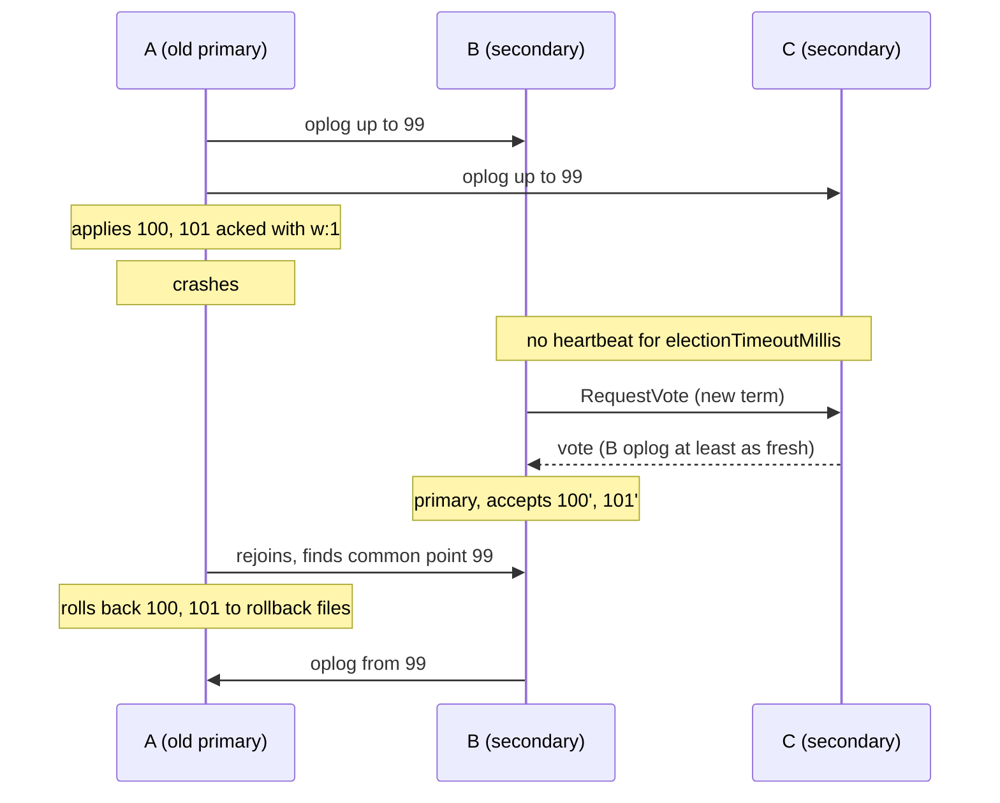
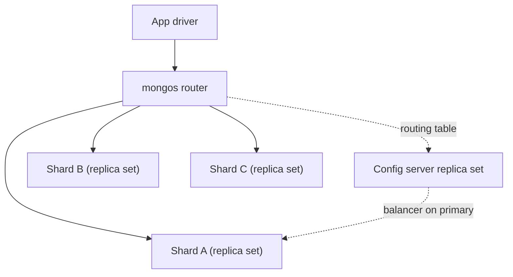
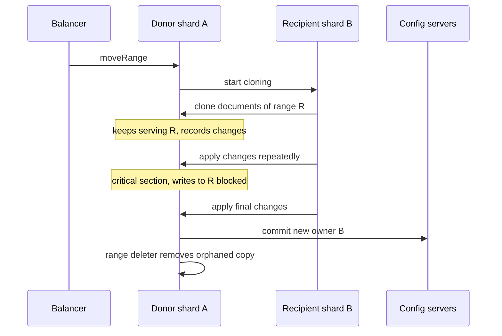
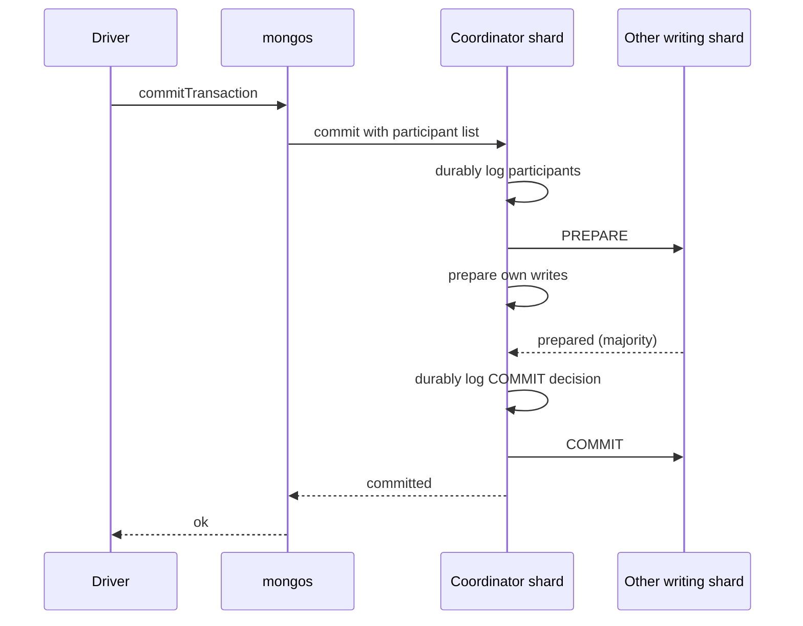

# 🍃 MongoDB — Staff-Level Interview Questions

> *6 questions covering MongoDB internals, document model, replica sets, sharding, aggregation, and transactions. Each answer leads with a 30-second version, then the mechanism, then failure modes and what the interviewer probes next.*

!!! info "Version baseline (October 2026)"
    Answers target **MongoDB 8.0** (GA October 2024) and **8.2**, the self-managed releases most teams run. Changes that interviewers now expect you to know:

    - **Default write concern** has been `w: "majority"` since **5.0** (not `w: 1`).
    - **Sharding:** since **6.0** the balancer works on data size and there's no auto-splitting. Default range ("chunk") size is **128 MB**. **7.0** added `analyzeShardKey`. **8.0** added `moveCollection`, `unshardCollection`, much faster `reshardCollection` and **config shards** (the config server replica set can also hold data).
    - **Aggregation spills to disk by default** since 6.0 (`allowDiskUseByDefault: true`).
    - **8.0** brought broad performance work, Queryable Encryption range queries and persistent `setQuerySettings`. **8.2** added `$search` / `$vectorSearch` to Community and Enterprise as a public preview.
    - **MongoDB 9.0** is rolling out (Atlas first). Check its release notes. Notable changes include a default per-operation memory limit and a new time-series storage format.

---

## Table of Contents

1. [Document Model & WiredTiger Storage Engine](#1-document-model-wiredtiger-storage-engine)
2. [Replica Sets: Election, Rollback, Write Concern](#2-replica-sets-election-rollback-write-concern)
3. [Sharding: Architecture, Balancer, Chunk Splitting](#3-sharding-architecture-balancer-chunk-splitting)
4. [Indexing: Compound, Multikey, Text, Geospatial](#4-indexing-compound-multikey-text-geospatial)
5. [Aggregation Pipeline: Optimization & Memory](#5-aggregation-pipeline-optimization-memory)
6. [Transactions: Multi-Document ACID in MongoDB 4.0+](#6-transactions-multi-document-acid-in-mongodb-40)

---

## 1. Document Model & WiredTiger Storage Engine

**Q:** "MongoDB stores documents in BSON format. Explain how BSON differs from JSON, how documents are stored on disk by WiredTiger, and why MongoDB's document model can lead to higher write throughput than a relational database for certain workloads."

**What They're Really Testing:** Whether you understand BSON's design goals, WiredTiger's cache, journal and checkpoint model, and when the document model actually helps (and when it hurts).

!!! tip "30-second answer"
    BSON is a binary, **typed**, **length-prefixed** encoding. It's designed for fast traversal (skip a field without parsing it) and rich types (int32/int64/decimal128/date/ObjectId/binary), not for compactness. Field names repeat in every document, so BSON is often *larger* than JSON. WiredTiger keeps each collection and each index as a separate B-tree. Writes go to an MVCC in-memory cache plus a write-ahead **journal**, and **checkpoints** (every 60 s) flush a consistent snapshot to disk. The document model wins on writes when an aggregate that would span several tables is stored as **one document**: one atomic write, one B-tree update, no joins. It loses when documents grow without bound or many writers contend on one document.

### Answer

**BSON vs JSON:**

```
JSON: {"age": 30, "name": "Alice", "active": true}
BSON: total length (int32) then elements, then a 0x00 terminator:
  \x10 age\x00 \x1E\x00\x00\x00                  (type 0x10 = int32, value 30)
  \x02 name\x00 \x06\x00\x00\x00 Alice\x00       (type 0x02 = string, length-prefixed)
  \x08 active\x00 \x01                           (type 0x08 = boolean)

Types: double, string, document, array, binary, ObjectId, bool, date (int64 ms),
       null, regex, int32, timestamp, int64, decimal128, min/max key
```

| | JSON | BSON |
|---|---|---|
| Purpose | Human-readable interchange | Fast machine traversal and in-place typed values |
| Numbers | One "number" type (precision is up to the parser) | int32, int64, double, decimal128 |
| Size | Compact for small docs | Often similar or larger: length prefixes, terminators, repeated field names. Smaller for ObjectIds (12 bytes vs 24 hex chars) and binary. |
| Skip a field | Must parse it | Jump using its length prefix |

Practical consequence: short field names matter at billions of documents, although block compression recovers much of the cost on disk. It doesn't help in the cache.

**WiredTiger:**

```
Per collection: a B-tree keyed by an internal RecordId → BSON document
Per index:      a separate B-tree (prefix-compressed keys) → RecordId
               (clustered collections, 5.3+, key the collection by _id instead)

Write path:
  1. Update applied in the WiredTiger cache as a new version on the record's
     update chain (MVCC: readers keep seeing their snapshot, no read locks)
  2. Operation appended to the journal (WAL). Group-committed to disk every
     100 ms (storage.journal.commitIntervalMs), or immediately for j:true writes
  3. Every 60 s a checkpoint writes a consistent on-disk snapshot. Recovery =
     last checkpoint + journal replay
  Concurrency: document-level, optimistic. Two writers to the same document →
  one gets a WriteConflict and is retried internally (outside transactions).

Cache: default max(50% × (RAM − 1 GB), 256 MB). The rest of RAM is used by
the OS file cache, which holds COMPRESSED blocks.
Eviction pressure (dirty cache > ~20%) makes application threads help with
eviction, which shows up as latency spikes.

Block compression: snappy (default for collections), zstd (4.2+, better ratio
at modest CPU, a common production choice), zlib, none.
Indexes use prefix compression. Ratios depend on the data, so measure.
```

**When the document model helps and hurts:**

| Helps | Hurts |
|---|---|
| Order + line items + shipping in one document → one atomic write, read with one lookup | **Unbounded arrays** (comments, events): the document grows, rewrites get bigger, the 16 MB limit looms, and multikey indexes bloat |
| No joins on the hot read path | Data needed by many aggregates gets duplicated, and updating every copy is your problem |
| Schema flexibility for heterogeneous entities | **Hot documents** (a global counter) serialize writers |
| Single-document writes are always atomic, no transaction needed | Cross-document invariants still need transactions or careful modelling |

Rule of thumb: model for your access patterns. Embed what's read together and bounded. Reference what's unbounded or shared. Use patterns like **bucketing** (or time-series collections) for event streams.

### 🔍 Staff-Level Evaluation

| Criterion | What I'm Looking For |
|-----------|----------------------|
| **BSON design** | Typed + traversable. Doesn't claim it's smaller than JSON by default. |
| **WiredTiger** | MVCC cache, journal group commit, checkpoints, separate index B-trees |
| **Compression** | snappy vs zstd vs zlib as a CPU/ratio trade-off, cache holds uncompressed data |
| **Document model** | Wins and anti-patterns (unbounded arrays, hot documents, 16 MB limit) |

**What they probe next:** "What happens when the working set exceeds the cache?" Reads hit the OS cache or disk, and eviction pressure shows up as tail latency. Watch `wiredTiger.cache` metrics such as `bytes currently in the cache` and the dirty percentage. "Why might a schema with 300 fields per document be slow?" Finding a field means a linear scan through the BSON, and documents get large.

---

## 2. Replica Sets: Election, Rollback, Write Concern

**Q:** "Your MongoDB replica set has 3 members. The primary goes down for 10 seconds. Walk through the election, failover, and what happens to writes that were acknowledged before the crash. How do you prevent rollbacks?"

**What They're Really Testing:** Whether you understand the Raft-like election protocol (pv1), what makes a write "majority-committed", rollback, and the matching read and write concerns.

!!! tip "30-second answer"
    Secondaries pull the oplog from the primary. If they don't hear from it for `electionTimeoutMillis` (10 s), an eligible secondary calls an election for a new **term**. Voters only vote for a candidate whose oplog is at least as up to date as theirs, so the winner has every majority-committed write. Typical failover is about 10-12 s. Writes the old primary accepted but **hadn't replicated to a majority** are **rolled back** when it rejoins (saved to rollback files). `w: "majority"` (the default since 5.0) prevents losing acknowledged writes. `readConcern: "majority"` prevents *reading* data that can still roll back. Retryable writes let drivers re-send the in-flight write after failover.

### Answer

**Topology and oplog:**

```
rs0:  A (primary)  ──oplog pull──>  B (secondary)
                   ──oplog pull──>  C (secondary)

Oplog: local.oplog.rs, a capped collection of idempotent operations.
  Default size (WiredTiger): 5% of free disk, min 990 MB, max 50 GB.
  oplogMinRetentionHours (4.4+) keeps entries for at least N hours.
  Oplog window = how long a secondary can be down and still catch up without
  a full initial sync. Size it for your longest maintenance window and lag spike.
```

**Failover timeline (primary A dies hard):**

```
t=0     A accepts writes and replicates. Heartbeats run every 2 s.
t=0.5   A loses power.
t≈10.5  B and C haven't heard from A for electionTimeoutMillis (10 s).
        B (say, with the freshest oplog) increments the term and asks for votes.
        C grants its vote only if B's last applied optime ≥ C's own
        (and C hasn't voted in this term). Higher-priority members can later
        call a "priority takeover" election.
t≈11    B wins with 2/3 votes, runs a short catch-up phase, then accepts writes.
        Drivers discover the new primary through server monitoring.
        With retryable writes (default in modern drivers), the in-flight write
        is retried once on B.
```

**Rollback:**

```
A had applied writes 100 and 101 and acknowledged them with w:1, but B and C only
had up to 99 when A died.
B becomes primary and accepts new writes 100', 101', ...
A comes back → finds the common point (99) with B's oplog → rolls back to its last
stable (majority-committed) timestamp and re-syncs from there.
The rolled-back documents are written to <dbpath>/rollback/<db.collection>/...
for manual reconciliation. They're NOT automatically re-applied.
```

**Prevention, and the concerns that go with it:**

| Setting | Effect |
|---|---|
| `w: "majority"` (default since 5.0) | Acked only after a majority has the write. Any electable new primary must have it, because voters refuse a staler candidate. **Majority-acked writes never roll back.** |
| `j: true` / `writeConcernMajorityJournalDefault: true` (default) | Majority members must have the write **journaled**, not just in memory |
| `wtimeout` | Bounds how long the client waits. The write is **not** undone on timeout: it may still commit. |
| `readConcern: "majority"` | Returns only majority-committed data, so you never read something that later rolls back |
| `readConcern: "linearizable"` | Also confirms the primary is still primary at read time. Slow. Single-document reads only. |
| Causally consistent sessions | Read-your-own-writes even when reading from secondaries |

```javascript
db.payments.insertOne(
  { _id: 1, amount: 100 },
  { writeConcern: { w: "majority", wtimeout: 5000 } }
);
```

**Topology gotchas:**

- An **arbiter** in a PSA set means that with one data node down, a majority of *data-bearing* nodes can't acknowledge `w: "majority"`. Writes block, and the cache fills because the majority commit point can't advance. Prefer three data-bearing members.
- Members across 3 AZs/regions so any single failure leaves a majority.
- Hidden or delayed members for analytics and "oops" recovery. They're priority 0 and can't become primary.

*Failover and rollback: a w:1 write the secondaries never received is rolled back; w:majority writes survive.*



### 🔍 Staff-Level Evaluation

| Criterion | What I'm Looking For |
|-----------|----------------------|
| **Election** | Terms, vote freshness check, 10 s timeout, priority takeover |
| **Rollback cause** | Writes not on a majority at failover. Rollback files. |
| **Write/read concern pairing** | `w: majority` prevents losing acked writes. `readConcern majority` prevents reading rolled-back data. |
| **Defaults** | Knows the default is majority since 5.0, and the PSA-with-arbiter exception |
| **Oplog sizing** | Oplog window vs maintenance and lag |

**What they probe next:** "Why can a `wtimeout` error still mean the write happened?" The timeout only stops the client waiting. "How do you reduce failover time?" Lower `electionTimeoutMillis` and accept more false elections on flaky networks, and make sure drivers' `serverSelectionTimeoutMS` and retry settings line up.

---

## 3. Sharding: Architecture, Balancer, Chunk Splitting

**Q:** "Your MongoDB cluster has 10TB of data. Queries are getting slow because the working set doesn't fit in memory. Design a sharded cluster. How does the balancer distribute chunks? How do you choose a shard key? What happens during a chunk migration?"

**What They're Really Testing:** Whether you understand mongos routing, config servers, the modern (6.0+) balancer, and above all shard key selection, the decision you can now change but shouldn't have to.

!!! tip "30-second answer"
    Clients connect to **mongos** routers, which use routing metadata from the **config server replica set** to send each query to the shards owning the relevant key ranges. Each **shard is a replica set**. Pick a shard key with **high cardinality**, **low frequency** (no hot values), **non-monotonic** writes, and that **appears in your common queries** so they're targeted rather than scatter-gather. Since 6.0 the balancer moves ranges when the **data size** difference between shards exceeds about 3× the range size (default 128 MB). There's no auto-splitting. Migrations clone documents while the donor keeps serving, then take a short critical section to commit ownership. If you got the key wrong: `reshardCollection` (5.0+, much faster in 8.0).

### Answer

**Architecture:**

```
App (driver) ──> mongos (stateless router, typically co-located with app servers)
                   │ caches routing table (range → shard) from config servers
                   ▼
        Config server replica set (3 members): cluster metadata, routing table,
        balancer runs on its primary. Since 8.0 it can also be a "config shard"
        that holds application data (handy for small clusters).
                   │
     ┌─────────────┼─────────────┐
   shard A (RS)  shard B (RS)  shard C (RS)   ← each a 3-member replica set
```

**Before sharding 10 TB, check the cheaper fixes:** is the working set really the data, or are indexes missing (collection scans)? Can you scale vertically, archive cold data (Online Archive or TTL), or fix the schema? Sharding adds operational cost permanently.

**Shard key selection:**

```javascript
// Hashed: even writes and reads by exact key. Range queries become scatter-gather.
sh.shardCollection("app.events", { deviceId: "hashed" })

// Compound: target by customer, spread a big customer across ranges via _id.
sh.shardCollection("app.orders", { customerId: 1, _id: 1 })

// BAD: monotonic key → every insert lands in the max-key range on ONE shard.
sh.shardCollection("app.logs", { ts: 1 })
// Fix options: hashed key, or a compound key like { tenantId: 1, ts: 1 }.
// Hashing ts spreads writes but makes time-range queries hit every shard.

// Before committing (7.0+): measure cardinality, frequency, monotonicity, and
// what fraction of real queries would be targeted
db.adminCommand({ analyzeShardKey: "app.orders", key: { customerId: 1, _id: 1 } })
```

| Property | Why | Failure if missing |
|---|---|---|
| High cardinality | Enough distinct values to spread over many ranges | Jumbo ranges that can't be split or moved |
| Low frequency | No single value dominates | One hot shard (e.g. `country: "US"`) |
| Non-monotonic | Inserts spread across ranges | All inserts on one shard |
| Query isolation | Queries include the key prefix | Scatter-gather to all shards, so latency = slowest shard |

**Changing your mind:** `refineCollectionShardKey` (4.4) adds suffix fields. `reshardCollection` (5.0, much faster in 8.0) rewrites the collection under a new key online. It needs spare disk and I/O, and blocks writes for at most about 2 s at commit. In 8.0, `unshardCollection` and `moveCollection` move unsharded collections between shards.

**Ranges, balancing and migration (6.0+):**

```
Range ("chunk") = contiguous shard key range owned by one shard. Default size 128 MB.
No auto-split on insert anymore. The balancer splits only as needed to move data.

Balancer (config server primary):
  For each collection: if (data on fullest shard − data on emptiest shard) > 3 × range size
  → migrate ranges from the fullest to the emptiest shard

Migration of range R from donor A to recipient B:
  1. Balancer → A: moveRange. A tells B to start cloning.
  2. B builds any missing indexes, then clones R's documents from A.
  3. A keeps serving reads/writes for R and records changes. B applies them repeatedly.
  4. Critical section: A briefly blocks writes to R, B applies the final changes.
  5. A commits the new owner to the config server. Routers refresh routing metadata.
  6. A deletes its orphaned copy of R asynchronously (range deleter).
Costs: network + disk I/O on both shards, a brief write pause on R, and a routing refresh.
```

**Balancer controls and zones:**

```javascript
sh.stopBalancer(); sh.startBalancer();                // or sh.setBalancerState(false/true)
use config
db.settings.updateOne(
  { _id: "balancer" },
  { $set: { activeWindow: { start: "02:00", stop: "06:00" } } },
  { upsert: true }
)

// Zones (data locality / tiering). Ranges must use the FULL shard key.
sh.addShardToZone("shard-us-1", "US")
sh.addShardToZone("shard-eu-1", "EU")
sh.updateZoneKeyRange("app.users",
  { country: "US", userId: MinKey }, { country: "US", userId: MaxKey }, "US")
sh.updateZoneKeyRange("app.users",
  { country: "DE", userId: MinKey }, { country: "DE", userId: MaxKey }, "EU")
```

*Sharded cluster topology and how mongos routes requests.*



*Chunk migration from donor A to recipient B, with a short critical section at the end.*



### 🔍 Staff-Level Evaluation

| Criterion | What I'm Looking For |
|-----------|----------------------|
| **Shard key criteria** | Cardinality, frequency, monotonicity, query isolation. Uses `analyzeShardKey`. |
| **Hashed vs range** | Even distribution vs targeted range queries |
| **Modern balancer** | Data-size based, 128 MB ranges, no auto-split (6.0+) |
| **Migration** | Clone + catch-up + critical section + async orphan cleanup |
| **Recovery options** | `reshardCollection`, `refineCollectionShardKey`, zones |

**What they probe next:** "Unique indexes on a sharded collection?" They must be prefixed by the shard key, because uniqueness is only enforced per shard. "Transactions across shards?" They work (Q6), but cost a two-phase commit. Design for single-shard transactions.

---

## 4. Indexing: Compound, Multikey, Text, Geospatial

**Q:** "You have a MongoDB collection with 50M documents. A query that filters on status, sorts by createdAt, and projects only 2 fields takes 5 seconds without an index. Design the optimal index. How do compound indexes support sort? What's an index intersection?"

**What They're Really Testing:** Whether you can design compound indexes with the ESR rule, recognise covered queries, read `explain()`, and know the multikey, intersection and special index types.

!!! tip "30-second answer"
    Order compound index fields **Equality → Sort → Range**. Here, `{ status: 1, createdAt: 1 }` lets the planner jump to `status = X` and walk `createdAt` in order. That removes the in-memory SORT and lets `limit` stop early. To make the query **covered** (no document fetch), the index must contain every filtered and projected field, and `_id` must be excluded from the projection. **Index intersection** (combining two single-field indexes) exists but the planner rarely picks it, and a purpose-built compound index almost always wins. Verify with `explain("executionStats")`: you want `IXSCAN` with no `SORT` stage and `totalKeysExamined ≈ nReturned`.

### Answer

**ESR in practice:**

```javascript
// Query: shipped orders since Jan, newest first, page of 20, two fields
db.orders.find(
  { status: "shipped", createdAt: { $gte: ISODate("2026-01-01") } },
  { _id: 0, createdAt: 1, amount: 1 }
).sort({ createdAt: -1 }).limit(20)

// Index: E (status) → S/R (createdAt; the sort and range are on the same field) → extra field to cover
db.orders.createIndex({ status: 1, createdAt: -1, amount: 1 })
```

Why the order matters:

- `{ status, createdAt }`: one contiguous index range per status value, already sorted by `createdAt`. The scan stops after 20 keys.
- `{ createdAt, status }`: still sorted, but the scan walks **every** status in the date range and filters most of them out, so keys examined ≫ returned.
- If the range is on a *different* field from the sort (e.g. `amount > 100` sorted by `createdAt`), put the sort field **before** the range field. Otherwise the range breaks sort order and forces an in-memory sort.
- Sort direction: a single-field sort can use the index in either direction. Compound sorts must match the index directions or their exact inverse.

**Covered queries:** all filter and projection fields are in the index, `_id: 0` is in the projection (unless `_id` is in the index), and none of the fields are arrays (multikey). `explain` then shows no `FETCH` stage and `totalDocsExamined: 0`. (There's no `projection` option on `createIndex`. Covering comes from the index keys themselves.)

```javascript
db.orders.find(...).explain("executionStats")
// Look at: winningPlan stages (IXSCAN → no SORT, no FETCH if covered),
//          totalKeysExamined vs totalDocsExamined vs nReturned, executionTimeMillis
```

**Index intersection:** the planner can AND two indexes (`AND_SORTED` / `AND_HASH`), e.g. `{status:1}` ∩ `{createdAt:1}`. In practice it's rarely chosen and can't provide a sort, so build the compound index. Too many overlapping single-field indexes just cost write throughput and RAM.

**Multikey indexes (array fields):**

```javascript
db.products.createIndex({ tags: 1 })
// { _id: 1, tags: ["electronics", "sale"] } → one index key per element

db.products.createIndex({ tags: 1, categories: 1 })
// Allowed, but in any single document AT MOST ONE of the indexed fields may be an array.
// Inserting a doc where both are arrays fails ("cannot index parallel arrays"),
// because the index would need the cross product of the two arrays.
```

Multikey indexes can't cover queries and have looser bounds on range predicates. Big arrays mean big index entries per document.

**Index types:**

| Type | Use | Note |
|---|---|---|
| Single / compound | Equality, range, sort | ESR |
| Multikey | Arrays | Automatic when a field holds an array |
| Text | Basic keyword search | One per collection, no fuzzy matching or relevance tuning. For real search use `$search` (Atlas Search, or self-managed via mongot in 8.2+ preview). |
| 2dsphere | GeoJSON on a sphere (`$near`, `$geoWithin`) | `2d` is legacy flat coordinates |
| Hashed | Hashed shard keys, equality only | No range queries |
| Wildcard (4.2+) | Unpredictable / user-defined fields | `{ "attributes.$**": 1 }`. Less efficient than a targeted index. |
| TTL | Expire documents | Background monitor runs every 60 s, so deletes aren't instant and come in bursts |
| Partial | Index only matching documents | Smaller. The query must include the filter expression to use it. |
| Unique | Constraint | On sharded collections it must be prefixed by the shard key |
| Vector (`$vectorSearch`) | ANN similarity search | Atlas, and self-managed in 8.2+ (preview) |

**Building indexes on a big collection:** builds take an exclusive lock only briefly at the start and end (4.2+). Replica set members build simultaneously, and the build commits once a quorum is done (4.4+). Builds still add significant I/O, so schedule them, and drop unused indexes (`$indexStats`) to recover write throughput.

### 🔍 Staff-Level Evaluation

| Criterion | What I'm Looking For |
|-----------|----------------------|
| **ESR rule** | Explains why, including the sort-before-range case |
| **Covered queries** | Index must hold all fields, `_id: 0`, no multikey |
| **explain()** | Reads keys/docs examined vs returned, spots in-memory SORT |
| **Multikey limits** | Parallel arrays, no covering |
| **Index cost** | Writes and RAM per index, unused index cleanup, build impact |

**What they probe next:** "The planner picked the wrong index." Plan cache and replanning, `hint()`, and in 8.0 persistent `setQuerySettings` to pin index choices per query shape without changing app code. "Pagination over 50M docs?" Use range-based (keyset) pagination on the index, not `skip()`.

---

## 5. Aggregation Pipeline: Optimization & Memory

**Q:** "Your aggregation pipeline processes 10M documents, takes 30 seconds, and uses 2GB of memory. Explain what $match, $group, $sort do internally. How does the pipeline optimize stage ordering? When does it spill to disk?"

**What They're Really Testing:** Whether you know what the optimizer does for you, which stages are blocking and memory-bound, how spilling works today, and how `$lookup` executes.

!!! tip "30-second answer"
    Only the **leading** `$match`/`$sort` (and some `$project`) can use indexes, because they're pushed into the query layer. Everything after runs on the stream of documents. `$group` and an unbounded `$sort` are **blocking**: they hold state for every group or document, bounded by **100 MB per stage**. Since 6.0 they **spill to disk by default** (`allowDiskUseByDefault`) instead of failing. The optimizer already moves `$match` earlier, merges `$sort + $limit` into a top-k sort, and drops unused fields. Your job is to filter early on indexed fields, keep group keys and accumulators small, and avoid unbounded `$lookup`/`$unwind` blow-ups. Read `explain("executionStats")` per stage.

### Answer

```javascript
db.orders.aggregate([
  { $match: { status: "shipped", createdAt: { $gte: ISODate("2026-01-01") } } }, // index-backed
  { $group: { _id: "$customerId", total: { $sum: "$amount" } } },                // blocking, hash table
  { $sort:  { total: -1 } },                                                      // blocking...
  { $limit: 20 }                                                                  // ...but sort+limit = top-k
])
```

**What the optimizer does automatically:**

- Moves `$match` before `$sort`, `$project`/`$addFields` (when it doesn't depend on computed fields), and splits a `$match` that's partly on computed fields.
- Coalesces `$sort + $limit`, so the sort keeps only `limit` documents (a top-k heap) instead of sorting everything.
- Merges `$limit + $limit`, `$skip + $skip`, and consecutive `$match` stages.
- Uses **dependency analysis** to fetch only the fields later stages need, so a manual early `$project` is rarely needed and can block optimizations.
- Pushes eligible prefixes into the **slot-based execution engine** (SBE, 6.0+), which speeds up `$group` and `$lookup`.

What it **can't** do: reorder `$limit` before `$sort`, which would change the result. Don't do that manually either. Push a `$match` past a `$group` on a computed field. Or make a post-`$group` `$sort` use an index.

**Memory and spilling:**

```
Per-stage memory limit: 100 MB (internalQueryMaxBlockingSortMemoryUsageBytes, etc.)
6.0+: allowDiskUseByDefault = true → $group, $sort, $bucket, $setWindowFields,
      $bucketAuto spill to temp files under dbPath/_tmp instead of erroring.
      Pass allowDiskUse: false to fail fast instead (e.g. for OLTP endpoints).
$facet: each sub-pipeline runs on the same input; the OUTPUT is one document → 16 MB cap.
$push / $addToSet accumulators: an unbounded array per group can blow up memory and 16 MB.
```

Spilling turns a memory problem into an I/O problem. If a pipeline routinely spills on the primary, move it to a secondary or an analytics node (`readPreference`), pre-aggregate (materialized views via `$merge`), or narrow the `$match`.

**`$lookup` execution:**

```javascript
db.orders.aggregate([
  { $match: { createdAt: { $gte: ISODate("2026-09-01") } } },
  { $lookup: {
      from: "customers",
      localField: "customerId",
      foreignField: "_id",
      pipeline: [ { $project: { name: 1, email: 1 } } ],   // concise form + pipeline (5.0+)
      as: "customer"
  } },
  { $unwind: "$customer" }
])
```

- With an index on `foreignField` (here `_id`, always indexed), it's an **indexed nested-loop join**: one index lookup per input document. That's fine for thousands of documents, but still 10M point lookups for 10M inputs.
- Without an index, SBE (6.0+) can use a **hash join** when the foreign collection fits in memory, else a nested-loop scan. That's quadratic and pathological.
- Since 5.1, the `from` collection can be sharded.
- Staff answer: if every read needs the join, **denormalize** the hot fields (e.g. customer name on the order) and accept update fan-out. Or run the join in a batch job into a reporting collection with `$merge`.

**Stage cheat sheet:**

| Stage | Blocking? | Memory | Notes |
|---|---|---|---|
| `$match` | No | Low | Index-backed only at the start of the pipeline |
| `$project` / `$addFields` / `$set` | No | Low | Optimizer handles field pruning |
| `$unwind` | No | Low per doc | Multiplies document count, so filter first |
| `$group` | Yes | Per group | Spills (6.0+ default). Watch `$push`. |
| `$sort` | Yes | All docs, or top-k with `$limit` | Index-backed only at the start |
| `$lookup` | No | Per joined array | Needs a `foreignField` index |
| `$facet` | Yes | Output ≤ 16 MB | Sub-pipelines can't use indexes |
| `$setWindowFields` (5.0+) | Partition-wise | Per partition | Spills |
| `$unionWith` (4.4+) | No | Low | Concatenates collections |
| `$merge` / `$out` | Last stage | n/a | Materialize results. `$merge` is incremental. |

### 🔍 Staff-Level Evaluation

| Criterion | What I'm Looking For |
|-----------|----------------------|
| **Index use** | Only the leading `$match`/`$sort` can use indexes |
| **Optimizer awareness** | Knows the automatic reorderings and top-k coalescing. Doesn't "optimize" by moving `$limit` before `$sort`. |
| **Memory model** | 100 MB per stage, spill-by-default since 6.0, 16 MB output limits |
| **`$lookup` cost** | Nested loop vs hash join, index on `foreignField`, denormalization trade-off |

**What they probe next:** "How would you serve this as a dashboard?" Pre-aggregate incrementally with `$merge` on a schedule, or with change streams. Don't run a 30 s pipeline per page view. "Where does it run in a sharded cluster?" Shards run the part before the first blocking stage, and a merging node (`mongos` or a shard) finishes the rest.

---

## 6. Transactions: Multi-Document ACID in MongoDB 4.0+

**Q:** "Your application needs to atomically update an order and decrement inventory in two collections. How do MongoDB transactions work? What are the limitations compared to traditional RDBMS transactions? How does the two-phase commit in a sharded cluster differ?"

**What They're Really Testing:** Whether you know snapshot isolation and write-conflict semantics in MongoDB, the real limits, the cross-shard commit protocol, and how to retry correctly.

!!! tip "30-second answer"
    Transactions (replica sets since 4.0, sharded clusters since 4.2) give **snapshot isolation**. All reads see one snapshot, and all writes commit atomically or not at all. Conflicts are detected **optimistically**: if another transaction already modified a document you write, you get a `WriteConflict` labelled `TransientTransactionError`, and you retry the **whole** transaction. Commit errors labelled `UnknownTransactionCommitResult` mean retry **only the commit**. Use the driver's `withTransaction` callback API, which does both. Keep transactions short (the default lifetime is 60 s) and small. On sharded clusters, a transaction touching several shards uses a **two-phase commit coordinated by one of the participating shards**, so design for single-shard transactions. Often the best answer is that one document can hold the invariant and you don't need a transaction.

### Answer

**Order + inventory with the callback API (PyMongo):**

```python
from pymongo import MongoClient, WriteConcern, ReadPreference
from pymongo.read_concern import ReadConcern

client = MongoClient("mongodb://rs0-a,rs0-b,rs0-c/?replicaSet=rs0")
db = client.shop

class OutOfStock(Exception):
    pass

def place_order(session, order):
    item = order["items"][0]
    res = db.inventory.update_one(
        {"productId": item["productId"], "quantity": {"$gte": item["qty"]}},
        {"$inc": {"quantity": -item["qty"]}},
        session=session,
    )
    if res.matched_count == 0:          # the guard failed: don't create the order
        raise OutOfStock(item["productId"])   # non-transient → withTransaction aborts and re-raises
    db.orders.insert_one(order, session=session)

with client.start_session() as s:
    s.with_transaction(
        lambda sess: place_order(sess, {"customerId": 123,
                                        "items": [{"productId": 456, "qty": 2}],
                                        "status": "created"}),
        read_concern=ReadConcern("snapshot"),
        write_concern=WriteConcern("majority"),
        read_preference=ReadPreference.PRIMARY,
    )
```

`with_transaction` retries the callback on `TransientTransactionError` and retries the commit on `UnknownTransactionCommitResult`, within a 120 s overall budget. Hand-rolled retry loops commonly get the second case wrong: they re-run the whole transaction after a commit that actually succeeded. Because of that, the callback must be safe to re-run: no external side effects inside it.

**Semantics:**

```
Start: the transaction reads from a snapshot (cluster time). Reads don't take locks.
Writes: applied as uncommitted versions in WiredTiger and take document-level intent locks.
  Another txn writing the same doc → the second writer gets WriteConflict immediately
  (first-writer-wins, no waiting) → TransientTransactionError → retry.
  A non-transactional write blocks behind the txn's lock until it commits/aborts.
Commit (single replica set): one oplog entry (or a chain, 4.2+, for large txns) replicated with
  the requested write concern. No prepare phase.
Abort / timeout: uncommitted versions are discarded.
```

**Limits (and the stale ones to stop repeating):**

| Limit | Value |
|---|---|
| Lifetime | `transactionLifetimeLimitSeconds` = 60 s by default, after which it's aborted |
| Lock wait | `maxTransactionLockRequestTimeoutMillis` = 5 ms. Fails fast rather than queueing. |
| Size | No hard op-count limit since 4.2 (large transactions span several oplog entries). MongoDB recommends ≤ 1,000 modified docs per txn because of cache pressure. |
| DDL | Creating collections and indexes (on new or empty collections) is allowed inside transactions since 4.4. Most other DDL isn't. |
| Reads | Read preference `primary` only. Read concern `snapshot`/`majority`/`local`. |
| Sessions | A session runs one transaction at a time, and can be reused for later ones |
| Cache pressure | Long or large transactions pin old versions in the WiredTiger cache ("history"), raising eviction pressure for everyone |

Isolation note: snapshot isolation allows **write skew**. Two transactions read the same documents, each writes a *different* one, and both commit. If an invariant spans documents (e.g. "at least one doctor on call"), make both transactions write a common document so they conflict.

**Cross-shard transactions (4.2+):**

```
mongos routes statements to the shards that own the keys. The first shard written to
is the transaction COORDINATOR (not mongos).
Commit:
  - one shard involved → plain single-shard commit (fast path)
  - only one shard wrote, others only read → read-only participants skip prepare
  - multiple writing shards → two-phase commit:
      coordinator durably logs participants → sends PREPARE → each shard writes a
      prepare oplog entry (majority) → coordinator logs decision → sends COMMIT/ABORT
If mongos dies: the driver retries commitTransaction through another mongos (with a recovery token).
If the coordinator shard fails over: the new primary recovers the decision from its durable log.
Prepared transactions hold their locks until the decision arrives, blocking conflicting writes.
```

Cost: extra majority writes and round trips per writing shard. Design shard keys so that transactional units live on one shard (e.g. shard orders and that customer's inventory reservation by `customerId`).

**Design alternatives that avoid transactions:**

- **Embed** the invariant in one document (single-document atomicity: order plus its line items).
- Use a **conditional update** as the guard (the `quantity: {$gte: n}` filter above), plus an idempotent order insert.
- Run a **saga** across services with compensating actions and an outbox, when the data spans systems anyway.

*Cross-shard commit uses two-phase commit coordinated by the first shard written to.*



### 🔍 Staff-Level Evaluation

| Criterion | What I'm Looking For |
|-----------|----------------------|
| **Snapshot isolation** | Snapshot reads, first-writer-wins conflicts, write skew |
| **Retry logic** | Separates TransientTransactionError (whole txn) from UnknownTransactionCommitResult (commit only). Uses `withTransaction`. |
| **Cross-shard 2PC** | A shard coordinates, not mongos. Single-shard and read-only fast paths. |
| **Limitations** | 60 s lifetime, 5 ms lock wait, cache pressure. Doesn't repeat the outdated "no DDL / 1000-op hard limit". |
| **Design judgment** | Prefers document modelling and conditional updates where possible |

**What they probe next:** "Why does a long analytics query inside a transaction hurt the whole cluster?" It pins history in the cache. "How do you make the order insert idempotent across client retries?" Use a client-generated `_id` or a unique idempotency key, so a duplicate insert fails cleanly.

---

> *These 6 questions cover MongoDB from the WiredTiger storage engine to multi-document ACID transactions and sharded cluster design. Re-check the version baseline at the top as 9.0 reaches self-managed users.*
