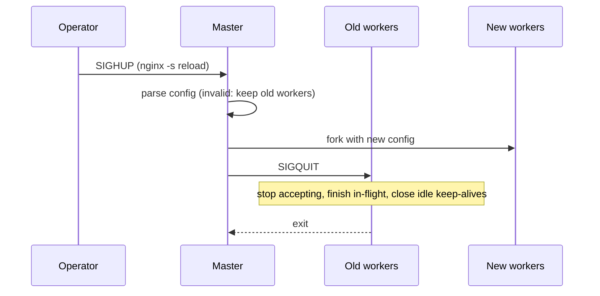
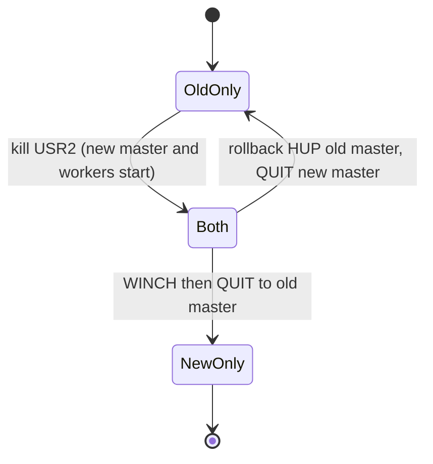
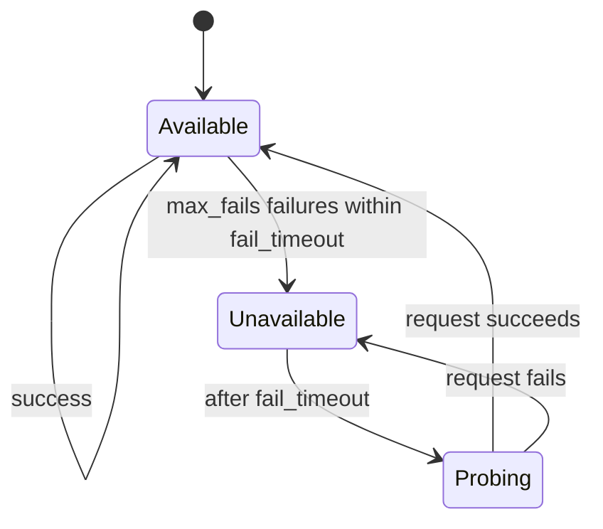
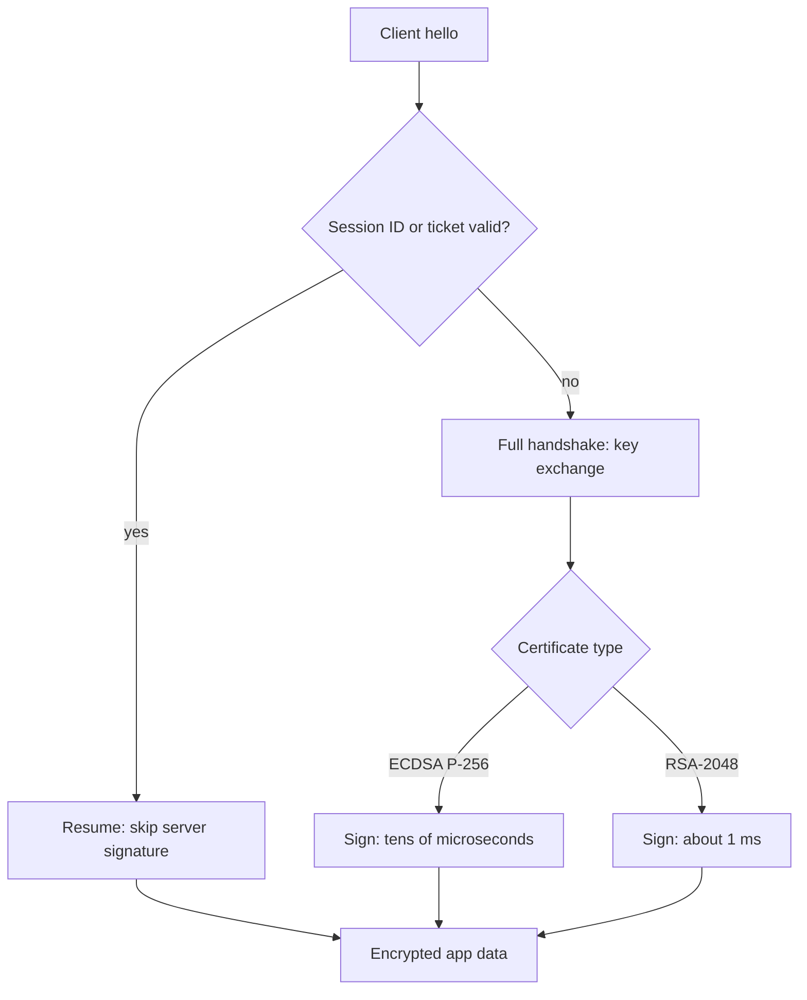
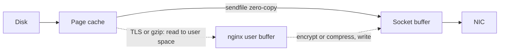

# 🌐 Nginx — Staff-Level Interview Questions

> *10 questions on nginx internals, reverse proxying, TLS, performance and production debugging. Versions referenced: nginx 1.30 (stable, April 2026) and 1.31 (mainline). Several long-standing "facts" changed in 1.29.x/1.30 — upstream keepalive is now on by default, sticky sessions and `least_time` moved into open source — so say which version you mean when it matters.*

---

## Table of Contents

1. [Event-Driven Architecture: Master/Worker Process Model](#1-event-driven-architecture-masterworker-process-model)
2. [Event Loop Internals: epoll, kqueue, io_uring](#2-event-loop-internals-epoll-kqueue-io_uring)
3. [Reverse Proxy Mechanics: Connection Pooling & Buffering](#3-reverse-proxy-mechanics-connection-pooling-buffering)
4. [Load Balancing Algorithms & Health Checks](#4-load-balancing-algorithms-health-checks)
5. [SSL/TLS Termination Optimization](#5-ssltls-termination-optimization)
6. [Static File Serving & sendfile Zero-Copy](#6-static-file-serving-sendfile-zero-copy)
7. [Connection Handling: Keepalive, Timeouts, and Backpressure](#7-connection-handling-keepalive-timeouts-and-backpressure)
8. [Nginx Configuration Patterns for High Traffic](#8-nginx-configuration-patterns-for-high-traffic)
9. [Nginx vs Caddy vs Envoy vs HAProxy](#9-nginx-vs-caddy-vs-envoy-vs-haproxy)
10. [Troubleshooting Nginx in Production](#10-troubleshooting-nginx-in-production)

---

## 1. Event-Driven Architecture: Master/Worker Process Model

**Q:** "Explain Nginx's master/worker process architecture in detail. How does it compare to Apache's process-per-connection or thread-per-connection model? What happens during a graceful reload (nginx -s reload) at the process level?"

**What They're Really Testing:** Whether you understand why an event loop per core beats a thread per connection for I/O-bound proxying, and what a reload really does to in-flight connections.

!!! tip "30-second answer"
    One privileged **master** process reads config, opens listening sockets and manages children; it never serves traffic. N **worker** processes (usually one per core) each run a single-threaded, non-blocking event loop that multiplexes thousands of connections with epoll/kqueue. A connection costs a few hundred bytes to a few KB of state instead of a thread stack, so idle keep-alive connections are nearly free. A reload starts new workers with the new config and asks old workers to finish their in-flight requests and exit; listening sockets are inherited, so no connection is refused.

### Answer

**Process model:**

```
┌──────────────────────────────────────────────────────────────┐
│ MASTER (runs as root so it can bind :80/:443)                 │
│  - parses and validates config                                │
│  - opens listening sockets, forks children                    │
│  - restarts crashed workers (SIGCHLD)                         │
│  - SIGHUP reload, SIGUSR1 reopen logs, SIGUSR2 binary upgrade │
│  - never accepts or serves a client connection                │
└──────────────────────────────────────────────────────────────┘
        │ fork
        ├────────────────┬────────────────┬────────────────┬──────────────────┐
        ▼                ▼                ▼                ▼                  ▼
  ┌───────────┐    ┌───────────┐    ┌───────────┐    ┌─────────────┐   ┌─────────────┐
  │ Worker 1  │    │ Worker 2  │    │ Worker N  │    │ Cache       │   │ Cache       │
  │ (user     │    │           │    │           │    │ manager     │   │ loader      │
  │  nginx)   │    │           │    │           │    │ (evicts by  │   │ (indexes    │
  │ event loop│    │ event loop│    │ event loop│    │  max_size / │   │  disk cache │
  │ over 1000s│    │           │    │           │    │  inactive)  │   │  at startup,│
  │ of conns  │    │           │    │           │    │             │   │  then exits)│
  └───────────┘    └───────────┘    └───────────┘    └─────────────┘   └─────────────┘
        └──────── shared memory zones (cache keys, limit_req, SSL sessions) ────────┘
```

- `worker_processes auto;` gives one worker per core. Workers are single-threaded for request processing, so there are no per-request locks; shared-memory zones (rate limits, cache index, SSL session cache) are protected by mutexes.
- **Optional thread pools** (`aio threads;`, since 1.7.11) exist mainly to offload blocking disk I/O (reads, and temp-file writes with `aio_write`) so a page-cache miss doesn't stall the whole event loop.
- **The catch:** anything blocking inside a worker (a slow disk read without `aio threads`, a slow Lua/njs call, blocking DNS via the system resolver) stalls *every* connection on that worker. That's why nginx doesn't embed application runtimes and talks to apps over HTTP, FastCGI, uwsgi or gRPC.

**Apache vs nginx:**

| Model | Unit of concurrency | Cost per connection | Notes |
|---|---|---|---|
| Apache `prefork` | Process per connection | MBs (process + interpreter, e.g. mod_php) | Needed for non-thread-safe modules; memory caps concurrency |
| Apache `worker` | Thread per connection | Thread stack (hundreds of KB reserved) | Idle keep-alive connections still pin a thread |
| Apache `event` (default since 2.4) | Thread per *active request*; a listener thread holds idle keep-alives | Much lower for idle conns | Closes most of the keep-alive gap; request processing is still thread-per-request |
| nginx | Event loop per core | ~250 bytes idle (nginx docs: ~2.5 MB per 10,000 idle keep-alive connections); a few KB to tens of KB while active (buffers) | Blocking code in a worker is fatal to latency |

**Graceful reload (`nginx -s reload` = SIGHUP to master):**

```
1. Master re-reads and parses the config.
   Invalid config → error logged, old workers keep running unchanged.
2. Master opens sockets only for NEW listen addresses; existing listening
   sockets are reused (they're inherited fds, so the accept queue is never closed).
3. Master forks new workers with the new config.
4. Master sends SIGQUIT to old workers: they stop accepting, finish in-flight
   requests, close idle keep-alives, and exit.
5. Old workers with long-lived connections (WebSocket, gRPC streams, big
   downloads) can linger for hours. worker_shutdown_timeout (no default, i.e.
   unlimited) makes the master close their connections after the given time.
```

Failure modes worth naming:

- **Memory doubling during reload.** Old and new workers coexist, each with their own copies of large per-worker state. Frequent reloads (e.g. a controller reloading on every config change) with long-lived connections pile up "shutting down" workers. This was a chronic issue with Kubernetes ingress controllers.
- **Shared-memory zones survive** a reload if name and size are unchanged; resizing a zone mid-reload fails.

**Binary upgrade (zero-downtime nginx upgrade):**

```bash
kill -USR2 "$(cat /var/run/nginx.pid)"        # old master renames pid → nginx.pid.oldbin,
                                              # execs new binary: new master + workers start,
                                              # both sets now accept connections
kill -WINCH "$(cat /var/run/nginx.pid.oldbin)" # old master gracefully stops ITS workers
# ...verify the new binary is healthy...
kill -QUIT "$(cat /var/run/nginx.pid.oldbin)"  # commit: old master exits

# Rollback instead of committing:
kill -HUP  "$(cat /var/run/nginx.pid.oldbin)"  # old master restarts its workers (without re-reading config)
kill -QUIT "$(cat /var/run/nginx.pid)"         # new master and workers exit
```

**What they probe next:** "Why does `nginx -s reload` not drop WebSocket connections, and why can that be a problem?" (old workers stay alive holding them; set `worker_shutdown_timeout`). "How would you run nginx in a container?" (master as PID 1 with `daemon off;`, SIGQUIT for graceful stop, which is what the official image's `STOPSIGNAL` is set to).

*Reload: new workers start with the new config, old workers drain and exit; listening sockets are inherited.*



*Zero-downtime binary upgrade with USR2, WINCH and QUIT, and the rollback path.*



### 🔍 Staff-Level Evaluation

| Criterion | What I'm Looking For |
|-----------|----------------------|
| **Process model** | Can diagram master/worker and explain why blocking work in a worker hurts every connection on it |
| **Apache comparison** | Knows `event` MPM narrowed the gap for idle connections; the difference is per-request threads |
| **Graceful reload** | Inherited listening sockets, SIGQUIT to old workers, `worker_shutdown_timeout` for long-lived connections |
| **Binary upgrade** | USR2 → WINCH → QUIT, and the HUP rollback path |

---

## 2. Event Loop Internals: epoll, kqueue, io_uring

**Q:** "Walk through Nginx's event loop in detail. How does it use epoll on Linux? What's the difference between edge-triggered and level-triggered notifications? Does io_uring matter for nginx?"

**What They're Really Testing:** Readiness-based I/O (epoll) vs completion-based I/O (io_uring), how nginx avoids the accept thundering herd, and whether you separate what nginx actually ships from what blog posts claim.

!!! tip "30-second answer"
    Each worker loops: compute the nearest timer, `epoll_wait` until an fd is ready or that timer expires, run the read/write handlers for ready connections, expire timers, then run posted (deferred) events. Client and upstream connections are registered **edge-triggered** (`EPOLLET`), so a handler must drain the socket until `EAGAIN`. Accept-side load spreading uses `EPOLLEXCLUSIVE` (default since 1.11.3) or `listen ... reuseport` (one socket per worker, kernel hashes connections across them). Stock nginx does **not** use io_uring; for blocking disk I/O it uses thread pools (`aio threads`) or Linux native AIO with `directio`.

### Answer

**Worker main loop (simplified from `ngx_process_events_and_timers`):**

```c
for (;;) {
    timer = ngx_event_find_timer();          /* ms until nearest timeout in the rbtree,
                                                or infinite if no timers */
    nfds = epoll_wait(ep, events, n, timer); /* sleep until I/O readiness or timeout */

    for (i = 0; i < nfds; i++) {
        c = events[i].data.ptr;              /* connection context */
        if (events[i].events & (EPOLLIN | EPOLLRDHUP | EPOLLERR | EPOLLHUP))
            c->read->handler(c->read);       /* or post it to a queue */
        if (events[i].events & (EPOLLOUT | EPOLLERR | EPOLLHUP))
            c->write->handler(c->write);
    }

    ngx_event_expire_timers();               /* client_header_timeout, proxy_read_timeout, ... */
    ngx_event_process_posted(&posted_events);/* deferred work, e.g. accept events first */
}
```

Timeouts are stored in a red-black tree keyed by expiry, which is why nginx can track 100K+ timeouts cheaply and why `epoll_wait`'s timeout is "time to the next timer", not a fixed interval.

**Edge-triggered vs level-triggered:**

| | Level-triggered (LT, epoll default) | Edge-triggered (ET) |
|---|---|---|
| When notified | Every `epoll_wait` while data remains unread | Only when new data arrives (state change) |
| Handler contract | Can read part and return; you'll be told again | Must read until `EAGAIN`, or you'll never hear about the remaining bytes |
| Syscalls | More `epoll_wait` returns and `epoll_ctl` churn when you want to pause a socket | One registration per connection for its lifetime, no re-arming |
| Bug class | Busy-looping on a socket you can't service yet | Stalled connections when a handler forgets to drain |

nginx registers each connection once with `EPOLLIN|EPOLLOUT|EPOLLET|EPOLLRDHUP` and tracks "ready" flags itself, so it never needs `epoll_ctl` to toggle interest when, say, a write buffer fills. That is the real reason for ET: fewer syscalls per connection, not thundering-herd avoidance.

**Thundering herd on accept** is a separate problem with separate fixes:

| Mechanism | How it works | Notes |
|---|---|---|
| `accept_mutex` | Workers take turns listening | Default **off** since 1.11.3; adds latency |
| `EPOLLEXCLUSIVE` (Linux 4.5+) | Kernel wakes one waiter per event | Used automatically when available |
| `listen ... reuseport` (SO_REUSEPORT) | Each worker gets its own listening socket; kernel hashes the 4-tuple to one socket | Best spread under high accept rates; a stalled worker keeps receiving its share of new connections |

**io_uring: what's true in 2026**

- io_uring (Linux 5.1+) is completion-based: you submit operations to a submission ring and reap results from a completion ring, batching many I/Os per `io_uring_enter` (or none, with SQPOLL).
- **Stock nginx does not use it**, including 1.30/1.31. There have been out-of-tree patches and forks, but nothing merged. Claims of "nginx 1.25+ uses io_uring" are wrong.
- For network sockets, epoll's readiness model is already efficient; io_uring's main win for a proxy would be fewer syscalls per request, and for static files, truly async `openat`/`read` without thread pools.
- What nginx actually ships for blocking disk I/O: `aio threads;` (thread pool reads, works with page cache) and `aio on;` + `directio` (Linux native AIO, O_DIRECT only).
- Many security-hardened environments disable io_uring (some container runtimes' default seccomp profiles block it, and Google restricted it after a run of kernel CVEs), which is part of why proxies have been slow to adopt it.

**Portable event modules:** `epoll` (Linux), `kqueue` (FreeBSD/macOS), `eventport` and `/dev/poll` (Solaris), and `poll`/`select` as fallbacks. nginx picks the best one automatically; `use epoll;` is rarely needed.

**What they probe next:** "A single worker is at 100% CPU and the others are idle — why?" (with `reuseport` the kernel hash is fixed, so one hot client IP or a stuck worker skews the load; without it, one worker can win most accepts under low load). "What happens if a request handler blocks for 200 ms?" (every connection on that worker sees +200 ms).

### 🔍 Staff-Level Evaluation

| Criterion | What I'm Looking For |
|-----------|----------------------|
| **ET vs LT** | Exact semantics, the drain-to-EAGAIN contract, and why nginx prefers ET (no re-arming) |
| **Event loop** | Timers in an rbtree drive the `epoll_wait` timeout; posted events |
| **Accept distribution** | `EPOLLEXCLUSIVE` vs `reuseport` vs `accept_mutex`, and their trade-offs |
| **io_uring** | Knows the model, and knows stock nginx doesn't use it |

---

## 3. Reverse Proxy Mechanics: Connection Pooling & Buffering

**Q:** "Nginx as a reverse proxy: walk through what happens when a client sends a POST request through Nginx to a backend application server. How does Nginx handle the proxying? What's the role of buffering? How does connection pooling work?"

**What They're Really Testing:** Whether you understand that nginx's main job in front of an app server is to absorb slow clients, and the knobs that control that.

!!! tip "30-second answer"
    By default nginx reads the **whole request body** first (memory, then a temp file), only then picks an upstream and sends it, so a slow upload never ties up an app worker. On the way back it reads the response into buffers as fast as the backend sends it, spilling to a temp file if needed, and trickles it to the client, so the backend connection is released early. Upstream connections are kept alive and reused per worker; since nginx 1.29.7 this is the default (`keepalive 32`, HTTP/1.1), before that you had to configure it.

### Answer

**Request lifecycle with default settings:**

```
Client                     nginx worker                          Backend
  │ POST /api/data          │                                       │
  │ Content-Length: 5 MB    │                                       │
  │────────────────────────▶│ 1. read headers, pick location        │
  │ (slow upload, 20 s)     │ 2. read full body (proxy_request_     │
  │────────────────────────▶│    buffering on): client_body_buffer_ │
  │                         │    size in memory, rest to temp file  │
  │                         │ 3. choose upstream peer, take an idle │
  │                         │    keep-alive conn or connect()       │
  │                         │──── POST /api/data HTTP/1.1 ─────────▶│
  │                         │     Host: $proxy_host (default!)      │
  │                         │     body sent in ~ms over LAN         │
  │                         │◀──── 200 OK, 2 MB ────────────────────│
  │                         │ 4. proxy_buffering on: read into      │
  │                         │    proxy_buffers, overflow to temp    │
  │                         │    file; backend conn returned to pool│
  │◀────────────────────────│ 5. send to client at client's pace    │
```

Gotchas the diagram exposes:

- **`Host` defaults to `$proxy_host`** (the upstream name), not the client's Host. Virtual-hosted backends need `proxy_set_header Host $host;`.
- **Client IP is lost** unless you set `X-Forwarded-For`/`X-Real-IP` and the backend trusts only your proxy's addresses for them.
- Step 3 happens after step 2: an app that wants to reject a 5 GB upload early (auth, quota) can't, unless you use `proxy_request_buffering off` or `client_max_body_size`.

**Response buffering:**

```nginx
proxy_buffering on;              # default
proxy_buffer_size 8k;            # first part of response (headers); raise for big cookies/JWTs
proxy_buffers 16 16k;            # per-request in-memory buffers for the body
proxy_busy_buffers_size 32k;     # how much may be "in flight to the client" at once
proxy_max_temp_file_size 1024m;  # default; 0 = never spill to disk, block backend instead
```

nginx does **not** wait for the whole response before sending: it forwards data to the client as buffers fill, but it keeps reading from the backend at backend speed. With buffering off, nginx reads only as fast as the client accepts data, so a slow client holds a backend worker for the whole download.

| Situation | Buffering | Why |
|---|---|---|
| Normal API / HTML behind a thread- or process-limited app server | **on** | Frees app workers quickly; slow mobile clients don't consume them |
| Server-Sent Events, long-polling, streamed LLM tokens | off for that location, or backend sends `X-Accel-Buffering: no` | Client needs bytes immediately |
| WebSocket | Irrelevant | After `101 Switching Protocols` nginx tunnels bytes both ways |
| Very large downloads | on, but consider `proxy_max_temp_file_size 0` | Avoid writing GBs to local disk |
| gRPC streaming | `grpc_pass` handles streaming | |

**Request body buffering:**

```nginx
client_max_body_size 10m;        # default 1m; exceeding it returns 413
client_body_buffer_size 128k;    # bodies larger than this go to a temp file
proxy_request_buffering on;      # default; "off" streams the body as it arrives
```

Turn `proxy_request_buffering off` for large uploads to a backend that streams (Go, Node, S3-style services) to avoid the double write to disk and get first-byte to the backend sooner. Cost: the backend connection is held for the client's upload time, and nginx can no longer retry the request on another upstream once it has started sending the body.

**Upstream connection pooling:**

```nginx
upstream backend_cluster {
    server 10.0.0.1:8000;
    server 10.0.0.2:8000;

    keepalive 32;              # idle connections cached PER WORKER (default since 1.29.7)
    keepalive_requests 1000;   # default since 1.19.10 (was 100)
    keepalive_timeout 60s;     # default; keep it BELOW the backend's own idle timeout
}

server {
    location / {
        proxy_pass http://backend_cluster;
        # Needed before 1.29.7 (the defaults were HTTP/1.0 and "Connection: close");
        # harmless and explicit on newer versions:
        proxy_http_version 1.1;
        proxy_set_header Connection "";
        proxy_set_header Host $host;
    }
}
```

- `keepalive N` caps **idle** cached connections per worker; it does not cap total connections to the upstream. Under a burst, nginx opens as many as needed, then closes the excess LRU idle ones.
- Without pooling, every request pays a TCP (and possibly TLS) handshake and leaves a `TIME_WAIT` socket on the nginx side, which at high rates exhausts ephemeral ports (see Q10).
- **The classic pooling bug:** the backend closes idle connections after 5 s (Node.js's default `keepAliveTimeout`) while nginx keeps them for 60 s. nginx reuses a connection the backend is closing at that moment and gets a reset: intermittent 502 "upstream prematurely closed connection". Fix: nginx's `keepalive_timeout` must be shorter than the backend's.
- Since 1.29.4 nginx can also proxy to backends over **HTTP/2** (`proxy_http_version 2`), which multiplexes many requests over one connection.

**What they probe next:** "Why would you set `proxy_buffering off` globally, and what breaks?" (backend concurrency collapses under slow clients). "How does nginx decide whether it can retry a POST?" (see Q4).

### 🔍 Staff-Level Evaluation

| Criterion | What I'm Looking For |
|-----------|----------------------|
| **Buffering value** | Explains slow-client absorption in both directions and when to turn it off |
| **Defaults** | `Host` is `$proxy_host`; body is fully buffered before connecting; keepalive default changed in 1.29.7 |
| **Connection pool** | `keepalive` is idle-per-worker, not a total cap; timeout ordering vs backend |
| **Streaming** | SSE/LLM streaming needs buffering off or `X-Accel-Buffering: no` |

---

## 4. Load Balancing Algorithms & Health Checks

**Q:** "Design an nginx upstream configuration for a microservice that has variable request processing times (50ms p50, 500ms p99). Some requests are CPU-heavy, some are I/O-bound. Compare the load balancing algorithms and recommend one. How do you handle slow backends without dropping requests?"

**What They're Really Testing:** How algorithms behave under variable service time, what open-source nginx can and can't do for health checking, and retry safety.

!!! tip "30-second answer"
    Use `least_conn` (or `random two least_conn` when you run many nginx instances): with variable service time, outstanding-request count is a good live proxy for backend load, while round-robin keeps feeding a backend that is stuck on slow requests. Open-source nginx only has **passive** health checks (`max_fails`/`fail_timeout`); active checks need NGINX Plus, a sidecar, or the orchestrator removing unhealthy endpoints. Bound retries with `proxy_next_upstream_tries`/`_timeout`, and remember nginx won't retry a non-idempotent request once it's been sent unless you say `non_idempotent`.

### Answer

**Algorithms (one per `upstream` block):**

| Directive | Picks | Good for | Watch out |
|---|---|---|---|
| *(default)* round-robin, optional `weight=` | Next server in weighted order | Uniform, short requests | Ignores current load; a backend stuck on slow requests keeps getting its share |
| `least_conn` | Fewest active connections (weighted) | Variable latency | Each nginx worker and instance counts only its own connections unless a `zone` is shared |
| `random two least_conn` | Two random servers, the one with fewer connections | Many independent LBs in front of the same pool | Avoids herding onto the single "least loaded" server that every LB sees at once |
| `least_time header\|last_byte` | Lowest average response time and fewest connections | Heterogeneous backends | **Open source since 1.31.0** (was NGINX Plus only) |
| `ip_hash` | Hash of client IPv4 /24 (or full IPv6) | Crude stickiness | Skewed by NAT and corporate proxies |
| `hash $key consistent` | Ketama consistent hash of any key | Cache affinity (same URL → same cache node) | Remapping only ~1/N keys when a node changes |
| `sticky cookie\|route` | Server named in a cookie or route | Session affinity | **Open source since 1.29.6**; `sticky learn` is still commercial |

Why least-connections wins here: with p99 = 10× p50, a few slow requests can pile up on one backend. Round-robin keeps sending it a third of new traffic, so fast requests queue behind slow ones and p99 grows. `least_conn` steers new requests away from that backend while it's busy. "Power of two choices" (Mitzenmacher) gets almost the same balance with far less coordination, which matters when 20 nginx pods each see only their own counts.

```nginx
upstream microservice {
    zone microservice 1m;          # share peer state and counters across workers
    least_conn;
    server 10.0.0.1:8000 max_fails=3 fail_timeout=10s;
    server 10.0.0.2:8000 max_fails=3 fail_timeout=10s;
    server 10.0.0.3:8000 max_fails=3 fail_timeout=10s;
    server 10.0.0.4:8000 backup;    # used only when all primaries are unavailable
                                    # (backup isn't allowed with hash, ip_hash or random)
}
```

**Health checks:**

- **Passive (open source):** if `max_fails` attempts fail within `fail_timeout`, the server is marked unavailable for `fail_timeout`; then nginx lets a request through, and success brings it back. What counts as a failure is defined by `proxy_next_upstream` (by default: connection error, timeout, invalid header). With a single server in the group, `max_fails` is ignored.
- **Active (`health_check`), `slow_start`, `queue`:** NGINX Plus only. `slow_start` ramps a recovered server's weight; `queue 100 timeout=5s;` holds requests when all servers are at `max_conns` instead of returning 502.
- **In Kubernetes** you normally don't rely on nginx health checks at all: readiness probes remove the pod from the Service/EndpointSlice, and the proxy follows the endpoint list.
- `server backend.svc resolve;` (open source since 1.27.3, needs a `resolver` and a `zone`) re-resolves DNS at runtime; without it nginx resolves names once at startup and keeps stale IPs forever.

**Timeouts and retries:**

```nginx
proxy_connect_timeout 2s;       # TCP connect to upstream (keep short; fail over fast)
proxy_send_timeout 10s;         # max gap between two successive WRITES to upstream
proxy_read_timeout 30s;         # max gap between two successive READS from upstream
                                # (not a total response deadline!)

proxy_next_upstream error timeout http_502 http_503;
proxy_next_upstream_tries 2;    # total attempts, including the first
proxy_next_upstream_timeout 5s; # total time budget for retries
```

- **Retry safety:** since 1.9.13, nginx does not pass a POST, LOCK or PATCH to the next server after the request has been sent, unless `non_idempotent` is in `proxy_next_upstream`. Adding it is only safe if the backend dedupes (idempotency keys).
- **Retry storms:** `http_500` in the list plus several layers each retrying 3× multiplies load on an already-sick service (3 layers × 3 tries = 27×). Retry at one layer, cap tries, and prefer retrying only connection failures.
- `proxy_read_timeout` is per-read, so a backend that dribbles a byte every 20 s never trips a 30 s timeout. For a hard deadline, enforce it in the application or use a deadline header your services honour.

**What they probe next:** "How does least_conn behave with 3 nginx replicas and 2 workers each?" (six independent views unless `zone` is shared; across replicas they're always independent, which is where P2C helps). "How do you drain a backend for deploy?" (remove from endpoints and let in-flight requests finish; `server ... drain` only affects sticky-bound requests).

*Passive health check: max_fails failures within fail_timeout take a server out for fail_timeout.*



### 🔍 Staff-Level Evaluation

| Criterion | What I'm Looking For |
|-----------|----------------------|
| **Algorithm trade-offs** | Why least_conn beats round-robin under variable latency; P2C for many LBs |
| **OSS vs Plus** | Knows active health checks, `slow_start`, `queue` are Plus; sticky and `least_time` recently moved to OSS |
| **Retry semantics** | `non_idempotent`, tries/timeout caps, retry amplification across layers |
| **Timeouts** | `proxy_read_timeout` is between reads, not total |

---

## 5. SSL/TLS Termination Optimization

**Q:** "Your nginx terminates TLS for 50K connections per second. CPU usage is 80% on all cores, primarily in SSL handshake. Walk through the optimizations you'd make — from protocol selection, session caching, OCSP stapling, to hardware offloading."

**What They're Really Testing:** Where handshake CPU actually goes (the server's private-key signature), and which levers remove it.

!!! tip "30-second answer"
    Full handshakes are dominated by the server's **signature** with its private key. RSA-2048 signing costs tens of times more CPU than ECDSA P-256, so (1) serve an **ECDSA certificate** (keep RSA as a second cert only for old clients), (2) raise the **resumption** rate (session cache or tickets) so returning clients skip the signature, (3) prefer **TLS 1.3** (one round trip fewer, though similar CPU), (4) keep connections alive longer so clients don't re-handshake, and (5) only then consider offload (Intel QAT, or terminating at a cloud load balancer). OCSP stapling is a latency/privacy feature, not a CPU fix, and is fading as CAs drop OCSP.

### Answer

**Layer 1: certificate and protocol**

```nginx
server {
    listen 443 ssl;
    http2 on;
    server_name example.com;

    # Dual certificates: nginx picks ECDSA for clients that support it, RSA otherwise
    ssl_certificate     /etc/ssl/example.com.ecdsa.crt;
    ssl_certificate_key /etc/ssl/example.com.ecdsa.key;
    ssl_certificate     /etc/ssl/example.com.rsa.crt;
    ssl_certificate_key /etc/ssl/example.com.rsa.key;

    ssl_protocols TLSv1.2 TLSv1.3;       # TLSv1/1.1 are off by default since 1.27.3
    ssl_ciphers ECDHE-ECDSA-AES128-GCM-SHA256:ECDHE-RSA-AES128-GCM-SHA256:ECDHE-ECDSA-CHACHA20-POLY1305:ECDHE-RSA-CHACHA20-POLY1305:ECDHE-ECDSA-AES256-GCM-SHA384:ECDHE-RSA-AES256-GCM-SHA384;
    ssl_prefer_server_ciphers off;       # all listed suites are strong; let clients
                                         # without AES-NI choose ChaCha20 (Mozilla "intermediate")

    # Hybrid post-quantum key exchange first (OpenSSL 3.5+); falls back for older clients
    ssl_ecdh_curve X25519MLKEM768:X25519:prime256v1;
}
```

- `ssl_ciphers` only affects TLS 1.2. TLS 1.3 suites are all AEAD and enabled by default; you *can* change them with `ssl_conf_command Ciphersuites ...` (1.19.4+, OpenSSL 1.1.1+), but rarely need to.
- **Post-quantum:** X25519MLKEM768 is the hybrid key exchange browsers now offer by default. It defends against "harvest now, decrypt later". It adds ~1 KB to the handshake and negligible CPU.

**Where the CPU goes in a full handshake**

| Step | TLS 1.2 | TLS 1.3 | CPU cost |
|---|---|---|---|
| Round trips before app data | 2 | 1 (0 with early data) | — |
| Key exchange (ECDHE X25519/P-256) | yes | yes | Small (tens of µs) |
| **Server signature** (proves key ownership) | yes | yes | **Dominant.** RSA-2048 sign ≈ 1 ms; ECDSA P-256 sign ≈ tens of µs |
| Certificate parsing | No, loaded at startup | No | — |

So at 50K full handshakes/s, RSA-2048 alone needs on the order of 50 cores of signing; ECDSA cuts that by more than an order of magnitude. TLS 1.3 saves a round trip (latency) but does the same expensive operations, so don't expect a big CPU drop from it. Run `openssl speed rsa2048 ecdsap256` on your hardware for real numbers.

**Layer 2: resumption (skip the signature)**

```nginx
ssl_session_cache shared:SSL:50m;  # ~4,000 sessions per MB → ~200K sessions, shared by all workers
ssl_session_timeout 1d;
ssl_session_tickets on;            # default on
# ssl_session_ticket_key /etc/nginx/ticket.current.key;   # 80 bytes for AES-256 (48 for AES-128)
# ssl_session_ticket_key /etc/nginx/ticket.previous.key;  # first key encrypts; others only decrypt
```

| | Session cache (stateful) | Session tickets (stateless) |
|---|---|---|
| State | Server shared memory, per host | Encrypted blob held by client |
| Multi-node | Only resumes on the same host (cache isn't shared across servers) | Works across a fleet **if** all nodes share ticket keys |
| Risk | Memory sizing | Ticket key compromise decrypts recorded sessions; rotate keys (e.g. daily) and distribute them securely |

- Without `ssl_session_ticket_key`, each nginx host (and each restart) generates its own random keys, so tickets don't work across a load-balanced fleet.
- Resumption skips the certificate and signature, but a TLS 1.3 resumption still does an ECDHE exchange by default (for forward secrecy), so it's cheaper, not free. It is still 1 RTT; **0-RTT** (`ssl_early_data on`) is a separate opt-in whose early data can be replayed. Only allow it for idempotent requests and pass `$ssl_early_data` to the backend (it's `"1"` when the request came in early data) so the app can reject non-idempotent ones.
- **The biggest win is often not TLS at all:** if clients reconnect for every request, raise `keepalive_timeout`/`keepalive_requests` and make sure HTTP/2 is on so one connection carries many requests.

**Layer 3: OCSP stapling (and why it matters less now)**

```nginx
ssl_stapling on;
ssl_stapling_verify on;
ssl_trusted_certificate /etc/ssl/ca-chain.crt;
resolver 127.0.0.53 valid=300s;    # nginx needs its own resolver to reach the OCSP responder
```

- Stapling sends a signed "not revoked" response inside the handshake (the `CertificateStatus` message in 1.2, a certificate extension in 1.3), so the client doesn't have to query the CA. That saves client latency and hides browsing from the CA. It saves no server CPU.
- **2025–2026 reality:** the CA/Browser Forum made OCSP optional for public CAs, and **Let's Encrypt removed OCSP URLs from certificates in May 2025 and shut down its OCSP responders on 6 August 2025** in favour of CRLs. Chrome hasn't done online OCSP checks for years (it uses CRLSets). With such certificates `ssl_stapling` is simply ignored (nginx logs a warning). Staple if your CA still runs OCSP; don't count it as a performance lever.

**Layer 4: offload**

| Option | What it buys | Cost |
|---|---|---|
| Terminate at cloud LB (ALB, GCP LB) or CDN | Zero handshake CPU on nginx | Re-encrypt to nginx if you need TLS in transit (usually required now), certificate management at the LB |
| Intel QAT via OpenSSL provider/engine | Hardware RSA/ECDSA/ECDHE | Specific hardware, extra build complexity |
| HSM / KMS-backed keys | Key never leaves the device | Usually **slower** and adds latency; it's a key-protection choice, not a performance one |
| Kernel TLS (`ssl_conf_command Options KTLS`) | Record encryption in kernel, keeps `sendfile` zero-copy over TLS | Bulk-transfer win; doesn't help handshakes |

**HTTP/3 (QUIC):** nginx has supported it since 1.25.0, and current docs no longer label it experimental. QUIC runs over UDP and mandates TLS 1.3. For full features (0-RTT) nginx recommends **OpenSSL 3.5.1+**; older OpenSSL uses a compatibility layer without early data. It doesn't need kernel bypass; `quic_gso on` and `reuseport` matter more. Config is in Q8.

**What they probe next:** "Why is RSA so much more expensive than ECDSA to sign but cheap to verify?" "How do you rotate ticket keys across 200 nodes without breaking resumption?" (distribute new key as decrypt-only first, then promote it). "Why might 0-RTT be dangerous for `POST /transfer`?"

*Handshake CPU decision: resume if possible, otherwise pay the server signature, which ECDSA makes cheap.*



### 🔍 Staff-Level Evaluation

| Criterion | What I'm Looking For |
|-----------|----------------------|
| **Cost model** | Knows the private-key signature dominates and ECDSA is the biggest lever |
| **Resumption** | Cache vs tickets, fleet-wide ticket keys, rotation, forward-secrecy trade-off |
| **TLS 1.3** | 1-RTT, 0-RTT replay risk, and that CPU savings are modest |
| **Currency** | OCSP decline (Let's Encrypt shut it down in 2025), post-quantum hybrid key exchange, HTTP/3 status |

---

## 6. Static File Serving & sendfile Zero-Copy

**Q:** "Nginx is known for fast static file serving. Walk through the Linux I/O stack that makes this possible. What is sendfile? How does Nginx use it? What are the memory implications for serving a 10GB file vs a 1KB file?"

**What They're Really Testing:** The zero-copy data path, page cache behaviour, and what breaks zero-copy (TLS, compression).

!!! tip "30-second answer"
    With `sendfile on`, nginx asks the kernel to move file data from the page cache straight to the socket, so bytes never cross into user space: no read/write copies and one syscall per chunk. Small hot files live in the page cache and cost almost nothing. Huge files risk evicting the hot set, so you use `directio` (with `aio`) above a size threshold, or rely on a CDN. Zero-copy disappears with TLS unless you enable kernel TLS, and with on-the-fly gzip, which is why you pre-compress.

### Answer

**Copy counts:**

```
read() + write():
  disk ──DMA──▶ page cache ──CPU copy──▶ user buffer ──CPU copy──▶ socket buffer ──DMA──▶ NIC
  2 DMA copies + 2 CPU copies, 2 syscalls per chunk, 4 user/kernel transitions

sendfile():
  disk ──DMA──▶ page cache ─────(page references)─────▶ socket ──DMA (scatter-gather)──▶ NIC
  2 DMA copies + 0 CPU copies when the NIC supports scatter-gather and checksum offload
  (otherwise 1 in-kernel CPU copy), 1 syscall per chunk
```

**What breaks zero-copy**

| Feature | Effect | Mitigation |
|---|---|---|
| TLS (HTTPS) | Data must be encrypted in user space by OpenSSL, so nginx falls back to read + encrypt + write | Kernel TLS: `ssl_conf_command Options KTLS;` (nginx 1.21.4+, OpenSSL 3.0+, Linux `tls` module); OpenSSL hands the keys to the kernel and `sendfile` works again |
| `gzip on` | Content is transformed in user space | `gzip_static on` / pre-compressed `.gz`/`.br` files served with sendfile |
| `directio` | O_DIRECT reads into user buffers, sendfile disabled for those files | Intended for large files, see below |

**Small vs huge files**

- **1 KB file:** cost is dominated by per-request overhead (syscalls, headers, logging), not copying. Wins come from `open_file_cache` (skip `open`/`stat`), keep-alive and HTTP/2, and `access_log off` or buffered logging.
- **10 GB file:** the page cache is shared and LRU-ish, so a few people streaming large files can evict the small hot files everyone else needs, turning cheap memory hits into disk reads. Options:

```nginx
location /downloads/ {
    sendfile on;
    aio threads;          # page-cache misses read in a thread pool (needs --with-threads; official packages have it)
    directio 16m;         # files ≥16 MB: O_DIRECT, bypass page cache (sendfile off for them)
    output_buffers 2 1m;  # user-space buffers used for directio reads
    sendfile_max_chunk 2m;# cap bytes per sendfile call (default 2m since 1.21.4) so one fast
                          # client can't monopolise the worker
}
```

  `directio_alignment` defaults to 512; XFS needs 4k. Most teams avoid the question entirely by putting large objects in object storage behind a CDN.

**`tcp_nopush` and `tcp_nodelay`:**

```nginx
sendfile on;
tcp_nopush on;    # default OFF. With sendfile, sets TCP_CORK: send response headers and the
                  # start of the file in full packets instead of a tiny header packet first
tcp_nodelay on;   # default ON. Disables Nagle on keep-alive connections so the last
                  # partial packet of a response isn't delayed waiting for an ACK
```

They're complementary: nginx corks while assembling a response and uncorks at the end, then `TCP_NODELAY` flushes the final partial segment immediately.

**Static file config:**

```nginx
server {
    listen 80;
    root /var/www/static;

    open_file_cache max=10000 inactive=30s;   # caches fds, sizes, mtimes, and lookup errors
    open_file_cache_valid 60s;
    open_file_cache_min_uses 2;
    open_file_cache_errors on;

    location /assets/ {                       # fingerprinted file names, e.g. app.3f9a1c.js
        expires 1y;
        add_header Cache-Control "public, immutable";
        add_header X-Content-Type-Options "nosniff" always;
        access_log off;
        gzip_static on;                       # serve app.js.gz if present
        # brotli_static on;                   # needs the third-party ngx_brotli module
    }

    location / {
        try_files $uri $uri/ /index.html;     # SPA fallback
    }
}
```

!!! warning "`add_header` inheritance"
    `add_header` directives are inherited from the enclosing level **only if the current level defines none**. The `/assets/` block above therefore does not get any security headers set at `server` level; you must repeat them (or use an `include` snippet). nginx 1.29.3 added `add_header_inherit merge;` to make the inheritance additive. This silently drops HSTS or CSP from part of a site more often than any other nginx misconfiguration.

**What they probe next:** "Why did enabling HTTPS halve static throughput?" (lost sendfile; kTLS). "Why is `immutable` safe only with fingerprinted file names?" "What does `open_file_cache` do to deploys that overwrite files in place?" (stale metadata for up to `open_file_cache_valid`; deploy to new paths and switch a symlink).

*Static file path: sendfile moves page-cache data to the socket without a user-space copy; TLS and gzip force the slower path.*



### 🔍 Staff-Level Evaluation

| Criterion | What I'm Looking For |
|-----------|----------------------|
| **sendfile mechanics** | Correct copy counts, and the scatter-gather caveat |
| **Zero-copy breakers** | TLS (and kTLS as the fix), gzip vs `gzip_static` |
| **Large files** | Page cache pollution, `directio` + `aio threads`, CDN as the real answer |
| **Config pitfalls** | `tcp_nopush` default, `add_header` inheritance |

---

## 7. Connection Handling: Keepalive, Timeouts, and Backpressure

**Q:** "Your nginx is handling 100K concurrent connections (mostly keepalive). Average response time is 50ms, but you're seeing 504 errors during traffic spikes. Walk through the connection lifecycle. How do worker_connections, keepalive_requests, and various timeouts interact? How do you design for backpressure?"

**What They're Really Testing:** Whether you read the status code correctly (504 means the **upstream** timed out, not that nginx ran out of client slots) and know how nginx's limits interact.

!!! tip "30-second answer"
    504 means nginx connected to (or was waiting on) a backend and hit `proxy_connect_timeout` or `proxy_read_timeout`, so the bottleneck is the backend during the spike, not idle client keep-alives. Fix it with backend capacity, admission control at the edge (`limit_req`, `limit_conn`, return 429/503 fast) and bounded retries. Separately, size `worker_connections` for client **plus** upstream connections and `worker_rlimit_nofile` above that. Idle keep-alive connections are cheap, and nginx closes them first when it runs short of connection slots.

### Answer

**Reading the status codes**

| Code | Meaning in a proxy | Typical cause |
|---|---|---|
| 502 | Bad or no response from upstream | Refused/reset connection, backend crashed, keep-alive race (Q3) |
| 503 | nginx refused: `limit_req`/`limit_conn` (default status), or no available upstream servers | Admission control working, or all servers marked down |
| 504 | Upstream timed out | Backend saturated or slow dependency |
| 499 (log only) | Client closed before response | Client timeout shorter than yours; often precedes or accompanies 504s |
| 408 | Client too slow sending headers or body | `client_header_timeout` / `client_body_timeout` |

**Connection accounting**

```nginx
worker_processes auto;
worker_rlimit_nofile 200000;     # per-worker fd limit; must exceed worker_connections

events {
    worker_connections 65536;    # per worker: client AND upstream connections
}
```

- `worker_connections` counts **connections**, both client-side and upstream-side. A proxied request in flight uses two. Capacity for proxied traffic ≈ `workers × worker_connections / 2`.
- File descriptors are a separate limit (`worker_rlimit_nofile`, or `LimitNOFILE` in systemd): each connection uses one, and so do open files, temp files and cached fds. Set it to at least 2× `worker_connections`.
- When free connections run low, nginx **closes idle keep-alive connections first** (they're marked reusable), and logs `worker_connections are not enough` only when it truly can't. So 100K idle keep-alives are rarely what's breaking you; they cost memory (~250 bytes each), not throughput.

**Keep-alive settings (client side):**

```nginx
keepalive_timeout 30s;      # idle time before closing (default 75s)
keepalive_requests 1000;    # requests per connection before closing (default 1000 since 1.19.10)
```

Lower `keepalive_requests` caps per-connection memory and lets connections rebalance across workers and nodes. It's the mechanism that slowly spreads long-lived HTTP/2 clients onto new nodes after a scale-out.

**Backpressure, from outside in:**

```nginx
http {
    limit_req_zone  $binary_remote_addr zone=per_ip:20m rate=50r/s;
    limit_conn_zone $binary_remote_addr zone=per_ip_conn:20m;

    upstream api {
        zone api 1m;
        least_conn;
        server 10.0.0.1:8080 max_conns=200;  # cap in-flight requests per backend
        server 10.0.0.2:8080 max_conns=200;  # (no free slot → 502 in OSS, queued in Plus)
    }

    server {
        listen 80 reuseport backlog=4096;    # accept queue; capped by net.core.somaxconn

        client_header_timeout 10s;           # slowloris protection → 408
        client_body_timeout 10s;             # between two body reads
        send_timeout 10s;                    # between two writes to the client

        location /api/ {
            limit_req zone=per_ip burst=100 nodelay;
            limit_conn per_ip_conn 50;
            limit_req_status 429;            # default is 503
            limit_conn_status 429;

            proxy_pass http://api;
            proxy_connect_timeout 2s;
            proxy_read_timeout 15s;
            proxy_next_upstream error timeout;
            proxy_next_upstream_tries 2;
        }
    }
}
```

- **Rate limit (`limit_req`)** is a leaky bucket per key: `burst` queues excess requests, and `nodelay` serves the burst immediately but still consumes bucket slots. Per-IP limits are weak behind CGNAT; key on an API key or user ID when you have one.
- **`max_conns`** gives each backend a concurrency cap, so a spike turns into fast failures rather than a growing queue inside the app (which is what produces 504s).
- **Listen backlog:** when the kernel accept queue is full, Linux drops the client's handshake ACK/SYN and the client retransmits after ~1 s, 2 s, 4 s... The user sees connect latency or timeouts, not an HTTP error. Check `ss -lnt` (`Recv-Q` = current queue, `Send-Q` = limit) and `nstat -az TcpExtListenOverflows`.
- **Load shedding priority:** reject early and cheaply at the edge (429/503 with `Retry-After`) instead of letting requests time out deep in the stack after consuming resources everywhere.

**Monitoring:**

```
$ curl -s http://127.0.0.1/nginx_status      # stub_status module
Active connections: 245
server accepts handled requests
 10500 10500 42000
Reading: 5 Writing: 40 Waiting: 200
```

- `accepts != handled` means connections were dropped due to `worker_connections` exhaustion.
- **Writing** counts requests being processed, including ones waiting on upstreams, so a rising Writing with flat traffic means slow backends.
- `stub_status` has no per-upstream data. Log `$upstream_connect_time`, `$upstream_header_time`, `$upstream_response_time` and `$upstream_status`, or export metrics with nginx-prometheus-exporter / OpenTelemetry (`ngx_otel_module`).

**What they probe next:** "How many connections can one box hold?" (memory, fds, and ephemeral ports to upstreams, which is usually first). "Why did adding `nodelay` make p99 worse for the backend?" (bursts arrive at once instead of smoothed).

### 🔍 Staff-Level Evaluation

| Criterion | What I'm Looking For |
|-----------|----------------------|
| **Diagnosis** | 504 points at the upstream; distinguishes 502/503/504/499/408 |
| **Accounting** | Client + upstream connections, fds as a separate limit, idle keep-alives reclaimed |
| **Backpressure** | `limit_req`/`limit_conn`, `max_conns`, short connect timeouts, fast rejection |
| **Observability** | stub_status semantics and upstream timing variables |

---

## 8. Nginx Configuration Patterns for High Traffic

**Q:** "Design an Nginx configuration for a globally distributed SaaS platform serving 50K requests/second. Include: API gateway routing, rate limiting, caching, microservice routing, WebSocket support, and multi-region failover."

**What They're Really Testing:** Whether you can compose nginx's features into one coherent config, and avoid the well-known traps (`add_header` inheritance, caching authenticated responses, hard-coded `Connection: upgrade`).

!!! tip "30-second answer"
    One `http` block with shared zones (rate limits, cache, upstream state), upstream pools per service with keep-alive, a redirect-only port-80 server, and a 443 server with HTTP/2 and HTTP/3, security headers, per-route rate limits, micro-caching only for anonymous GETs, and a WebSocket location using a `map` for `Connection`. Multi-region failover belongs mostly in DNS/anycast/GSLB; inside nginx, a `backup` pool in another region is a last resort because of cross-region latency.

### Answer

**Production configuration (validated with `nginx -t` on 1.31):**

```nginx
user nginx;
worker_processes auto;
worker_rlimit_nofile 131072;
pid /run/nginx.pid;

events {
    worker_connections 32768;
}

http {
    include       mime.types;
    default_type  application/octet-stream;

    sendfile on;
    tcp_nopush on;
    server_tokens off;

    keepalive_timeout 30s;
    client_header_timeout 10s;
    client_body_timeout 10s;
    send_timeout 10s;
    client_max_body_size 10m;

    log_format main '$remote_addr "$request" $status $body_bytes_sent '
                    'rt=$request_time uct=$upstream_connect_time '
                    'urt=$upstream_response_time ua="$upstream_addr" us=$upstream_status '
                    'cache=$upstream_cache_status rid=$request_id';
    access_log /var/log/nginx/access.log main buffer=64k flush=5s;
    error_log  /var/log/nginx/error.log warn;

    # ── Rate limiting ──
    limit_req_zone  $binary_remote_addr zone=per_ip:20m   rate=100r/s;
    limit_req_zone  $binary_remote_addr zone=auth:10m     rate=5r/s;
    limit_conn_zone $binary_remote_addr zone=conn_per_ip:10m;
    limit_req_status  429;
    limit_conn_status 429;

    # ── WebSocket: send "Connection: upgrade" only when the client asked to upgrade ──
    map $http_upgrade $connection_upgrade {
        default upgrade;
        ''      '';
    }

    # ── Upstreams ──
    upstream api_servers {
        zone api_servers 1m;
        least_conn;
        server api-1.internal:8080 max_fails=3 fail_timeout=10s;
        server api-2.internal:8080 max_fails=3 fail_timeout=10s;
        server api-dr-1.other-region.internal:8080 backup;   # last-resort cross-region
        keepalive 64;
    }

    upstream auth_servers {
        zone auth_servers 1m;
        least_conn;
        server auth-1.internal:8080 max_fails=3 fail_timeout=10s;
        server auth-2.internal:8080 max_fails=3 fail_timeout=10s;
        keepalive 16;
    }

    upstream websocket_servers {
        zone websocket_servers 1m;
        least_conn;                  # connections are long-lived; balance by count
        server ws-1.internal:9090;
        server ws-2.internal:9090;
    }

    # ── Micro-cache for anonymous GETs ──
    proxy_cache_path /var/cache/nginx/api levels=1:2 keys_zone=api_cache:100m
                     max_size=10g inactive=10m use_temp_path=off;

    map $http_authorization $skip_cache {
        default 1;                   # any Authorization header → never cache
        ''      0;
    }

    # ── Port 80: redirect only ──
    server {
        listen 80 default_server reuseport;
        server_name _;
        return 301 https://$host$request_uri;
    }

    # ── Main HTTPS server ──
    server {
        listen 443 ssl default_server reuseport;
        listen 443 quic default_server reuseport;   # HTTP/3
        http2 on;
        http3 on;
        server_name api.example.com;

        ssl_certificate     /etc/ssl/certs/api.example.com.pem;
        ssl_certificate_key /etc/ssl/private/api.example.com.key;
        ssl_protocols TLSv1.2 TLSv1.3;
        ssl_session_cache shared:SSL:50m;
        ssl_session_timeout 1d;

        # Security headers (repeated via include in any location that sets its own add_header)
        add_header Strict-Transport-Security "max-age=63072000; includeSubDomains" always;
        add_header X-Content-Type-Options "nosniff" always;
        add_header Referrer-Policy "strict-origin-when-cross-origin" always;
        add_header Alt-Svc 'h3=":443"; ma=86400' always;   # advertise HTTP/3

        limit_req  zone=per_ip burst=200 nodelay;
        limit_conn conn_per_ip 50;

        location = /health {
            access_log off;
            default_type text/plain;
            return 200 "ok\n";
        }

        location /api/v1/ {
            proxy_pass http://api_servers;
            proxy_set_header Host $host;
            proxy_set_header X-Real-IP $remote_addr;
            proxy_set_header X-Forwarded-For $proxy_add_x_forwarded_for;
            proxy_set_header X-Forwarded-Proto $scheme;
            proxy_set_header X-Request-ID $request_id;

            proxy_cache api_cache;
            proxy_cache_methods GET HEAD;            # the default
            proxy_cache_bypass $skip_cache;
            proxy_no_cache     $skip_cache;
            proxy_cache_valid 200 10s;               # micro-cache; upstream Cache-Control wins
            proxy_cache_use_stale error timeout updating http_502 http_503;
            proxy_cache_background_update on;
            proxy_cache_lock on;                     # collapse concurrent misses into one fetch

            proxy_connect_timeout 2s;
            proxy_read_timeout 30s;
            proxy_next_upstream error timeout http_502 http_503;
            proxy_next_upstream_tries 2;
            proxy_next_upstream_timeout 5s;
        }

        location /auth/ {
            limit_req zone=auth burst=20 nodelay;    # replaces (not adds to) the server-level limit_req
            proxy_pass http://auth_servers;
            proxy_set_header Host $host;
            proxy_set_header X-Real-IP $remote_addr;
            proxy_set_header X-Forwarded-For $proxy_add_x_forwarded_for;
            proxy_connect_timeout 2s;
            proxy_read_timeout 10s;
        }

        location /ws/ {
            proxy_pass http://websocket_servers;
            proxy_http_version 1.1;
            proxy_set_header Upgrade $http_upgrade;
            proxy_set_header Connection $connection_upgrade;
            proxy_set_header Host $host;
            proxy_read_timeout 1h;                   # idle limit; app should send pings
            proxy_send_timeout 1h;
        }

        location /admin/ {
            allow 10.0.0.0/8;
            allow 172.16.0.0/12;
            deny  all;
            proxy_pass http://api_servers;
            proxy_set_header Host $host;
        }

        error_page 500 502 503 504 /5xx.html;
        location = /5xx.html {
            root /usr/share/nginx/html;
            internal;
        }
    }
}
```

**Design decisions to call out:**

- **Caching authenticated APIs is the dangerous part.** nginx's cache key ignores `Authorization` and cookies by default. It won't cache responses with `Set-Cookie` or `Cache-Control: private/no-store`, but an app that forgets those headers can serve one user's data to another. The `map` above refuses to cache anything with credentials; cache per-user data only with the user in the key, and only if you really need to.
- **`limit_req` and `add_header` inherit only if the inner level defines none.** `/auth/` gets *only* the auth limit, and any location with its own `add_header` loses the server's security headers.
- **WebSocket:** the `map` avoids sending `Connection: upgrade` on normal requests. Stickiness (`ip_hash`) isn't needed for an established WebSocket (one TCP connection = one backend); only use affinity if reconnects must land on the same node. Long-lived connections also keep old workers alive across reloads (Q1).
- **HTTP/2 syntax:** `listen ... http2` is deprecated since 1.25.1; use `http2 on;`. HTTP/3 needs `listen ... quic`, `http3 on` (default on), UDP/443 open in firewalls and LBs, and the `Alt-Svc` header so browsers discover it.
- **Since 1.29.7** `proxy_http_version 1.1` and an empty `Connection` header are the defaults, which is why the API locations omit them; on older versions add them back or upstream keep-alive won't work.
- **Multi-region:** a `backup` server in another region adds 50–150 ms per request and only triggers when *all* primaries fail. Real regional failover is done with health-checked DNS (Route 53, NS1), anycast, or a global LB, with each region's nginx serving local backends.
- **Removed from older versions of this config:** `X-XSS-Protection` (deprecated by browsers; use CSP), `accept_mutex on` (default off; `reuseport` is better), `ssl_prefer_server_ciphers on` (Mozilla now recommends off).

**What they probe next:** "How do you roll out a config change to 300 nginx nodes safely?" (`nginx -t` in CI, canary nodes, config from Git, reload not restart, watch 5xx and reload count). "Where does this design stop scaling and you'd move to Envoy/Gateway API?" (dynamic config without reloads, per-route retries/circuit breaking, xDS control plane).

### 🔍 Staff-Level Evaluation

| Criterion | What I'm Looking For |
|-----------|----------------------|
| **Composition** | Rate limiting, caching, proxying, WebSocket, HTTP/2+3 in one coherent config |
| **Traps avoided** | `add_header`/`limit_req` inheritance, auth-aware caching, `Connection` map |
| **Currency** | `http2 on`, HTTP/3, 1.29.7 keep-alive defaults, deprecated headers removed |
| **Failover design** | Knows in-nginx backup is a last resort; regional failover lives in DNS/GSLB |

---

## 9. Nginx vs Caddy vs Envoy vs HAProxy

**Q:** "Your team is choosing between Nginx, Caddy, Envoy, and HAProxy for the edge proxy layer. Walk through the architectural and operational differences. For what use cases would you choose each one?"

**What They're Really Testing:** Whether you choose on operational model (static file + reload vs API-driven dynamic config), not on benchmark folklore.

!!! tip "30-second answer"
    All four are fast enough that raw throughput rarely decides. **nginx**: web server + reverse proxy with a huge install base; config is a file you reload. **HAProxy**: the best pure L4/L7 load balancer, rich runtime API for changing servers without reloads. **Envoy**: built for dynamic config over xDS, deep observability, the data plane behind Istio and most Gateway API implementations. **Caddy**: automatic HTTPS and simple config, great for small teams. For Kubernetes ingress specifically, the community `ingress-nginx` controller was **retired in March 2026**, so new clusters should go to a Gateway API implementation.

### Answer

| | nginx | Caddy | Envoy | HAProxy |
|---|---|---|---|---|
| Language | C | Go | C++ | C |
| Concurrency model | Process per core, event loop each | Goroutines | Threads, one event loop per thread | Threads, one event loop per thread |
| Config | `nginx.conf` + reload | Caddyfile or JSON, live admin API | Static YAML or dynamic xDS (gRPC) | `haproxy.cfg` + reload; Runtime API for live changes |
| Dynamic changes without reload | Limited (DNS `resolve`, NGINX Plus API) | Yes (admin API) | Yes, the core design | Partly (servers, weights, maps, certs via Runtime API) |
| Automatic certificates (ACME) | `ngx_http_acme_module` (Rust dynamic module, preview since Aug 2025) | Built in, the headline feature | Via SDS from an external control plane | Built in since 3.2 |
| HTTP/3 | Yes (1.25+) | Yes | Yes | Yes (production since 2.6) |
| Extensibility | C modules, njs, Lua (OpenResty) | Go plugins compiled in (xcaddy) | C++ filters, Wasm, Lua, ext_proc | Lua, SPOE |
| Static file serving | Excellent | Good | Not its job | No |
| Observability | stub_status, logs, OTel module | Prometheus metrics | Very rich stats, tracing, access logs | Rich stats page, Prometheus exporter built in |
| Governance | F5 (open source + NGINX Plus); freenginx fork since 2024 | Open source | CNCF graduated | Open source + HAProxy Enterprise |

**When to choose each:**

- **nginx:** you need a web server and reverse proxy in one, serve static assets, have existing nginx expertise, and change config at deploy time rather than per request. Also the default inside many platforms (OpenResty, Kong's data plane).
- **HAProxy:** high-volume L4/L7 load balancing with sophisticated health checks, stick tables (rate limiting, abuse detection), and runtime changes via its API, without needing to serve files.
- **Envoy:** service mesh (Istio, Consul), Gateway API controllers (Envoy Gateway, Contour, Istio), or any setup where a control plane pushes routes, clusters and certificates continuously. Its cost is operational complexity; you rarely hand-write Envoy config.
- **Caddy:** small-to-medium deployments where automatic TLS and a readable config matter more than ecosystem breadth.

**Kubernetes ingress in 2026:**

- Kubernetes SIG Network announced in November 2025 that the community **`kubernetes/ingress-nginx`** controller would get best-effort maintenance only until **March 2026**, then no releases or security fixes. Existing installs keep running, which is the risk.
- This is **not** F5's NGINX Ingress Controller (`nginxinc/kubernetes-ingress`), which is a different, maintained project; interviewers like checking that you know the difference.
- The recommended direction is **Gateway API** (`Gateway`, `HTTPRoute`, `GRPCRoute`), implemented by Envoy Gateway, Istio, Cilium, Contour, Traefik, NGINX Gateway Fabric, and others. Migration tooling such as `ingress2gateway` converts Ingress objects, but annotations (snippets, rewrites, auth) need manual mapping.

**On benchmarks:** published req/s comparisons swing with TLS library, payload size, keep-alive and tuning, so quote none from memory. The honest answer is "all four saturate a NIC on static or proxied traffic on modern hardware; I'd benchmark our own traffic shape (TLS mix, payload size, connection reuse) and decide on operational model".

**Migration patterns:**

- **nginx → Envoy/Gateway API:** run both behind the same L4 load balancer or DNS name, move routes service by service, compare error rates and latency per route, keep nginx for static assets if useful.
- **Shadowing before cut-over:** nginx's `mirror` directive (or Envoy's request mirroring) copies live requests to the new proxy and discards its responses, so you can diff behaviour without user impact. Beware mirroring non-idempotent requests to real backends.
- **HAProxy in front of nginx:** HAProxy for L4/TLS and connection-level protection, nginx for L7 routing and static files. It adds a hop; only worth it if you need HAProxy's specific features.

**What they probe next:** "Why does Envoy need a control plane?" "What breaks when you migrate ingress-nginx annotations to Gateway API?" (snippets, regex rewrites, auth-url, custom headers). "What's the risk of staying on ingress-nginx?" (no CVE fixes; it had a critical 2025 RCE, CVE-2025-1974 "IngressNightmare").

### 🔍 Staff-Level Evaluation

| Criterion | What I'm Looking For |
|-----------|----------------------|
| **Architecture differences** | Static-file + reload vs API/xDS-driven, threads vs processes, extensibility |
| **Use-case matching** | Envoy for mesh/Gateway API, HAProxy for LB, nginx for web + proxy, Caddy for simplicity |
| **Currency** | ingress-nginx retirement, Gateway API, ACME in nginx/HAProxy, HTTP/3 everywhere |
| **Judgement** | Refuses to decide on folklore benchmarks; plans a measured migration |

---

## 10. Troubleshooting Nginx in Production

**Q:** "Your production nginx is returning intermittent 502 errors. Show me your systematic debugging approach — from checking the basics to deep diving into kernel-level diagnostics."

**What They're Really Testing:** Evidence-driven debugging: read the error log message, correlate with upstream, then go to the kernel only if needed.

!!! tip "30-second answer"
    Start with the **error log line**, because nginx states the cause: `connect() failed (111: Connection refused)`, `upstream prematurely closed connection`, `recv() failed (104: Connection reset by peer)`, `no live upstreams`, or `(99: Cannot assign requested address)`. Correlate with `$upstream_addr`/`$upstream_status` in the access log to see if it's one backend or all. The most common intermittent causes are the **keep-alive race** (backend idle timeout shorter than nginx's), **deploys** (pods killed before they leave the endpoint list) and **ephemeral port exhaustion** to upstreams.

### Answer

**Step 1: logs and scope**

```bash
# What does nginx say? (the message usually names the cause)
grep -E 'upstream|connect\(\)|no live' /var/log/nginx/error.log | tail -50

# One backend or all? Needs $upstream_addr and $upstream_status in log_format (see Q8)
awk '$9 == 502' /var/log/nginx/access.log | tail -20     # adjust field to your format

# Recent change?
nginx -t && nginx -T | less              # -T dumps the full effective config, all includes expanded
```

| Error log message | Usual cause | Fix |
|---|---|---|
| `connect() failed (111: Connection refused)` | Backend not listening (crashed, restarting, wrong port) | Fix backend; readiness gating on deploy |
| `upstream prematurely closed connection` / `recv() failed (104: Connection reset by peer)` on reused connections | **Keep-alive race**: backend closes idle conn as nginx reuses it | nginx `keepalive_timeout` < backend idle timeout (e.g. Node `server.keepAliveTimeout`, Gunicorn `--keep-alive`) |
| Same message on fresh connections | Backend crashed mid-request (OOM kill, panic) | Backend logs, `dmesg`, container restarts |
| `connect() ... (99: Cannot assign requested address)` | Ephemeral ports exhausted toward that upstream | Upstream keep-alive, more upstream IPs, `proxy_bind` split, wider port range |
| `no live upstreams` | All servers marked failed by `max_fails` | Find the original failure; with one server, nginx never marks it down |
| `upstream sent too big header` | Response headers exceed `proxy_buffer_size` (big cookies/JWTs) | Raise `proxy_buffer_size` / `proxy_buffers` |
| `upstream timed out (110)` | That's a **504**, not 502 | See Q7 |

**Step 2: upstream reachability and sockets**

```bash
# Hit each backend directly, bypassing nginx
for ip in 10.0.0.1 10.0.0.2 10.0.0.3; do
    curl -s -o /dev/null --connect-timeout 2 \
         -w "$ip %{http_code} connect=%{time_connect}s total=%{time_total}s\n" \
         "http://$ip:8000/health"
done

# TCP states toward the upstream port
ss -tan state all '( dport = :8000 )' | awk 'NR>1 {print $1}' | sort | uniq -c
#   many TIME-WAIT  → no keep-alive pooling; port pressure
#   many SYN-SENT   → backend unreachable or its accept queue is full
#   many CLOSE-WAIT → nginx side hasn't closed after the backend did (rare; nginx bug or stuck worker)
```

**Step 3: resource limits**

```bash
# File descriptor limit of a worker (systemd LimitNOFILE / worker_rlimit_nofile)
grep 'open files' /proc/"$(pgrep -f 'nginx: worker' | head -1)"/limits

# Ephemeral ports: the limit applies per (src IP, dst IP, dst port), so ~28K
# concurrent+TIME_WAIT connections to ONE upstream ip:port with the default range
sysctl net.ipv4.ip_local_port_range          # default 32768 60999
sysctl -w net.ipv4.ip_local_port_range="15000 64999"
sysctl -w net.ipv4.tcp_tw_reuse=1            # reuse TIME_WAIT for outgoing connections

# Accept queue overflow on nginx's own listeners (shows as client timeouts, not 502)
ss -lnt '( sport = :443 )'                   # Recv-Q = queued now, Send-Q = backlog limit
nstat -az TcpExtListenOverflows TcpExtListenDrops
```

fd exhaustion shows up as `(24: Too many open files)` in the error log and usually produces 500s or refused accepts rather than 502s; check it, but it's rarely the cause of intermittent 502s on a sanely configured box.

**Step 4: kernel-level, when logs aren't enough**

```bash
WORKER=$(pgrep -f 'nginx: worker' | head -1)

# Failed connect() calls from one worker (non-blocking connect normally returns EINPROGRESS)
strace -f -tt -p "$WORKER" -e trace=connect 2>&1 | grep -vE 'EINPROGRESS|= 0$' | head -30
#   ECONNREFUSED  → backend not listening
#   EADDRNOTAVAIL → ephemeral ports exhausted
#   EAGAIN        → (unix sockets) backend's listen backlog full

# Resets on the upstream port
tcpdump -i any -nn 'tcp port 8000 and (tcp[tcpflags] & tcp-rst != 0)' -c 50
#   RST right after a request on an idle reused connection → keep-alive race

# CPU profile of all workers for 10 s
perf record -g -p "$(pgrep -d, -f 'nginx: worker')" -- sleep 10
perf report --stdio | head -60
```

**Kubernetes-specific 502s during deploys:**

- A pod gets SIGTERM at the same time as it's removed from EndpointSlices, but proxies learn about the removal a moment later, so they keep sending requests to a pod that is shutting down. Fix: a `preStop` hook that sleeps a few seconds (or the native `sleep` lifecycle action), have the app keep serving during that window, and use a `terminationGracePeriodSeconds` longer than the drain.
- Readiness probes that pass before the app can serve (e.g. before warm-up) cause 502/503 right after rollout; `minReadySeconds` and a real readiness endpoint help.

**Prevention checklist:**

- Log `$upstream_addr $upstream_status $upstream_connect_time $upstream_response_time $request_id` on every request.
- Alert on 5xx **ratio** per upstream, not absolute counts.
- Keep upstream keep-alive timeouts ordered: client → nginx → backend, each shorter than the next hop's idle timeout.
- Treat `nginx -t` as a CI gate and reloads as deploys (canary, watch, roll back).

### 🔍 Staff-Level Evaluation

| Criterion | What I'm Looking For |
|-----------|----------------------|
| **Systematic approach** | Error log message → scope (one backend vs all) → sockets → limits → kernel tools |
| **Common causes** | Keep-alive race, deploy draining, port exhaustion, buffer-size errors |
| **Status code precision** | 502 vs 504 vs 499; fd exhaustion isn't the usual 502 cause |
| **Diagnostic tools** | `ss`, `nstat`, `strace` errno meanings, `tcpdump` RST filter, `perf` |

---

> *If you remember one thing per question: workers must never block; buffering absorbs slow clients; least_conn for variable latency; ECDSA + resumption for TLS CPU; sendfile dies under TLS without kTLS; 504 points at the backend; validate configs with `nginx -t`; ingress-nginx is retired, so learn Gateway API; and read the error log line before guessing.*
