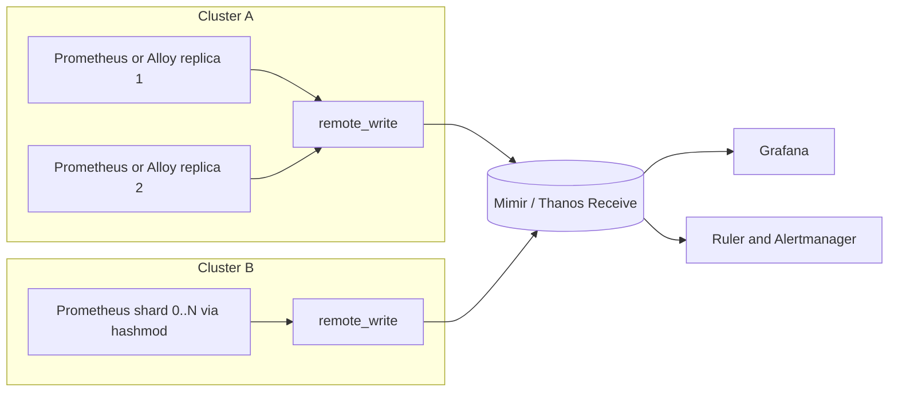
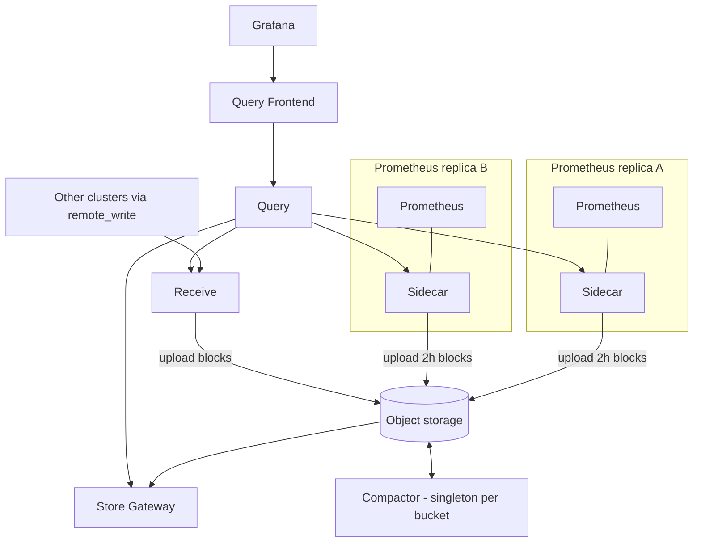
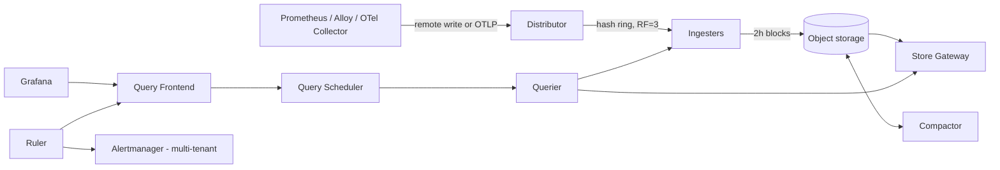
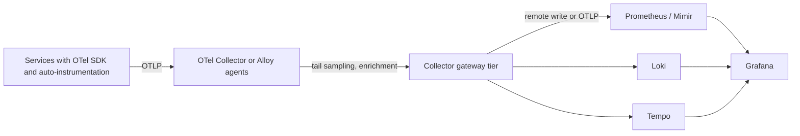

# 📊 Prometheus & Grafana — Staff-Level Interview Questions

> *8 questions on Prometheus architecture, PromQL, alerting, Grafana, scaling with Thanos/Mimir, and observability strategy. Versions referenced: Prometheus 3.x (3.13 LTS, 3.15 current), Alertmanager 0.2x–0.3x, Grafana 12/13, Mimir 3.x. Instrumentation guidance assumes OpenTelemetry as the default path and Grafana Alloy (Grafana Agent reached end of life on 1 November 2025).*

---

## Table of Contents

1. [Prometheus Architecture: Pull Model & Time Series](#1-prometheus-architecture-pull-model-time-series)
2. [Service Discovery & Target Configuration](#2-service-discovery-target-configuration)
3. [PromQL: Queries, Aggregations, Functions](#3-promql-queries-aggregations-functions)
4. [Alerting: Alertmanager, Routing, Silences](#4-alerting-alertmanager-routing-silences)
5. [Grafana: Dashboards, Panels, Data Sources](#5-grafana-dashboards-panels-data-sources)
6. [Recording Rules & Dashboard Efficiency](#6-recording-rules-dashboard-efficiency)
7. [High Availability: Thanos, Cortex, Mimir](#7-high-availability-thanos-cortex-mimir)
8. [Observability Strategy: Metrics, Logs, Traces](#8-observability-strategy-metrics-logs-traces)

---

## 1. Prometheus Architecture: Pull Model & Time Series

**Q:** "Design a Prometheus monitoring architecture for 10,000 microservices producing 50M time series. How does the pull model differ from push-based systems (Graphite, Datadog)? How does the TSDB store and compact data? What happens when a Prometheus server can't keep up with ingestion?"

**What They're Really Testing:** Whether you know the limits of a single Prometheus (memory scales with active series), how the TSDB works, and how to shard and federate data into a horizontally scalable backend.

!!! tip "30-second answer"
    A single Prometheus is a single-node TSDB whose memory grows with **active series** (a few KB each), so one server comfortably holds a few million series, not 50M. The design is: many Prometheus (or Alloy / OTel Collector) instances, sharded by cluster and team, each scraping locally, alerting locally, and **remote-writing** to a horizontally scalable store (Mimir, Thanos Receive, Cortex, VictoriaMetrics) that provides global queries and long retention. Pull gives free liveness (`up`) and keeps targets ignorant of the backend; push (OTLP, remote write, Pushgateway) is for short-lived jobs and networks Prometheus can't reach.

### Answer

**Pull vs push**

| | Pull (Prometheus scrape) | Push (OTLP, StatsD, Datadog agent, Pushgateway) |
|---|---|---|
| Liveness | Free: a failed scrape sets `up == 0` | Need heartbeats or absence alerts |
| Who controls rate | The server (scrape interval) | The client; a misbehaving client can flood you |
| Discovery | Server must discover targets (SD) | Clients must know the endpoint |
| Short-lived jobs | Missed if they exit between scrapes | Natural fit |
| Network | Server must reach every target | Works from behind NAT/firewalls |

**Pushgateway** is for *service-level* batch jobs (e.g. "nightly backup finished at T, 3 GB"), not a general push proxy. It never expires pushed metrics, so a dead job's last values look current forever. It doesn't aggregate, and it becomes a single point of failure. For short-lived processes that emit lots of metrics, push OTLP to a Collector/Alloy or to Prometheus's OTLP endpoint instead.

**TSDB layout**

```
data/
├── 01JB.../                 # persisted block, named by ULID, covers a fixed time range
│   ├── chunks/000001        # compressed samples
│   ├── index                # on-disk inverted index: label pairs → series → chunks (mmapped)
│   ├── meta.json            # time range, stats, compaction level
│   └── tombstones           # pending deletions
├── chunks_head/             # full head chunks memory-mapped to disk
└── wal/                     # write-ahead log segments (00000000, 00000001, ...) + checkpoints
```

1. **Ingest:** each scraped sample goes to the WAL (durability) and the in-memory **head block**. The head holds the most recent ~2–3 hours.
2. **Head compaction:** every 2 hours the oldest 2h of the head is written as an immutable block and the WAL is truncated (with a checkpoint).
3. **Block compaction:** blocks merge into larger ones in steps of 3× (2h → 6h → 18h → 54h ...), capped at 10% of retention or 31 days. Fewer, larger blocks mean a smaller index per series and faster long-range queries.
4. **Retention:** whole blocks past `--storage.tsdb.retention.time` (default 15d) or `.size` are deleted.
5. **Compression:** Gorilla-style delta-of-delta timestamps and XOR-encoded float values give about 1–2 bytes per sample (vs 16 raw).

**Sizing rule of thumb:** memory is driven by active series in the head (series labels, postings, open chunks), roughly a few KB per series including churn. Disk ≈ retention × samples/s × ~1.5 bytes. 50M series at a 30 s scrape is ~1.7M samples/s: far beyond one node.

**Architecture for 50M series**



- **Shard collection** by cluster, then by team or `hashmod` of the target address when one cluster is too big.
- **Keep alerting close to the data** (local Prometheus rules) for critical alerts, so a backend outage doesn't silence paging.
- **Agent mode** (`--agent`) or Alloy runs scrape + WAL + remote write with no local querying, using far less memory.
- **Budget cardinality per team** with `sample_limit`, `label_limit` and per-tenant limits in the backend; a single bad label (user ID, URL path) can add millions of series.

**When Prometheus can't keep up**

| Symptom | Metric to check |
|---|---|
| Memory climbing, OOM kills, long restarts (WAL replay) | `prometheus_tsdb_head_series`, `rate(prometheus_tsdb_head_series_created_total[5m])` (churn) |
| Scrapes slow or timing out | `scrape_duration_seconds`, `up`, `scrape_samples_scraped` per target |
| Rule groups falling behind | `prometheus_rule_group_last_duration_seconds` vs `prometheus_rule_group_interval_seconds`, `prometheus_rule_group_iterations_missed_total` |
| Remote write lagging | `prometheus_remote_storage_highest_timestamp_in_seconds` minus `prometheus_remote_storage_queue_highest_sent_timestamp_seconds` |
| Slow queries | `prometheus_engine_query_duration_seconds` |

Remediation order: find and drop the high-cardinality series (the TSDB status page `/tsdb-status`, or `topk(10, count by (__name__)({__name__=~".+"}))` on a small server), add `metric_relabel_configs` drops, shard, then move long-term storage and global queries to a distributed backend. A longer scrape interval cuts samples per second but not series count, so it barely helps memory.

**What changed in Prometheus 3.x (since November 2024)**

| Change | Why it matters |
|---|---|
| **UTF-8 metric and label names** (3.0) | OpenTelemetry names like `http.server.request.duration` can be stored as-is; in PromQL quote them: `{"http.server.request.duration"}` |
| **OTLP ingestion** (`--web.enable-otlp-receiver`, endpoint `/api/v1/otlp/v1/metrics`) | Apps and Collectors can push OTLP straight to Prometheus; `otlp.promote_resource_attributes` turns chosen resource attributes into labels |
| **Native histograms**, stable since 3.8 (December 2025) | One series per histogram with automatic exponential buckets, instead of one series per `le`. Enable scraping with `scrape_native_histograms: true` (required since 3.9) |
| **Remote Write 2.0** | Adds metadata, created timestamps and native histograms, with string interning to cut bandwidth. Supported in Prometheus but the spec is still marked experimental; v1 remains the default |
| New UI, stricter defaults | Range selectors became left-open (a `[5m]` window no longer includes the sample exactly at its start); `holt_winters` renamed `double_exponential_smoothing` (experimental functions flag) |
| LTS releases | 3.5 (July 2025) and 3.13 (July 2026); pick an LTS for long-lived fleets |

**What they probe next:** "How would you find which team caused a 3M-series jump?" (`/tsdb-status`, `prometheus_tsdb_head_series_created_total`, per-job `scrape_series_added`). "Why does a pod restart storm hurt Prometheus even if the series count looks flat?" (churn: every new pod creates new series that stay in the head and index until compaction).

### 🔍 Staff-Level Evaluation

| Criterion | What I'm Looking For |
|-----------|----------------------|
| **Scale model** | Knows memory tracks active series and churn; one node won't hold 50M |
| **Pull vs push** | Liveness, control of rate, Pushgateway's narrow use case, OTLP push |
| **TSDB** | WAL + head + 2h blocks, 3× compaction steps, Gorilla compression |
| **Currency** | Prometheus 3.x: UTF-8, OTLP receiver, native histograms stable, RW 2.0 status |

---

## 2. Service Discovery & Target Configuration

**Q:** "Your Kubernetes cluster has 500 pods that come and go throughout the day. How does Prometheus discover these targets? Design a scrape configuration using Kubernetes service discovery. How do you handle pod labels, annotations, and relabeling for multi-team namespaces?"

**What They're Really Testing:** Relabeling (the most error-prone part of Prometheus), the difference between target relabeling and metric relabeling, and how teams self-serve scrape config safely.

!!! tip "30-second answer"
    Prometheus watches the Kubernetes API (`kubernetes_sd_configs`) and gets a target per pod, endpoint or node with `__meta_kubernetes_*` labels. **`relabel_configs`** run **before** the scrape on those targets: keep/drop targets, set `__address__`/`__metrics_path__`, and copy metadata into labels. **`metric_relabel_configs`** run **after** the scrape on every sample: drop expensive series and labels. In practice most teams use the Prometheus Operator (or Alloy) with `ServiceMonitor`/`PodMonitor` objects per team, plus per-target `sample_limit` so one team can't take down the shared server.

### Answer

**Annotation-driven pod discovery (plain Prometheus):**

```yaml
scrape_configs:
  - job_name: kubernetes-pods
    kubernetes_sd_configs:
      - role: pod              # also: node, service, endpoints, endpointslice, ingress
    sample_limit: 50000        # scrape fails if a target exposes more samples
    label_limit: 30
    relabel_configs:
      # Keep only pods annotated prometheus.io/scrape: "true"
      - source_labels: [__meta_kubernetes_pod_annotation_prometheus_io_scrape]
        action: keep
        regex: "true"
      # Optional custom path
      - source_labels: [__meta_kubernetes_pod_annotation_prometheus_io_path]
        action: replace
        regex: (.+)
        target_label: __metrics_path__
      # Optional custom port: rewrite host:port
      - source_labels: [__address__, __meta_kubernetes_pod_annotation_prometheus_io_port]
        action: replace
        regex: ([^:]+)(?::\d+)?;(\d+)
        replacement: $1:$2
        target_label: __address__
      # Useful identity labels
      - source_labels: [__meta_kubernetes_namespace]
        target_label: namespace
      - source_labels: [__meta_kubernetes_pod_name]
        target_label: pod
      - source_labels: [__meta_kubernetes_pod_label_app_kubernetes_io_name]
        target_label: app
    metric_relabel_configs:
      # Drop a known-expensive histogram entirely
      - source_labels: [__name__]
        action: drop
        regex: grpc_server_handling_seconds_bucket
      # Strip labels that should never have been labels
      - action: labeldrop
        regex: (request_id|trace_id|user_id|session_id)
```

Notes:

- `__meta_kubernetes_service_name` doesn't exist for `role: pod`; you only get service metadata with `endpoints`/`endpointslice`/`service` roles.
- Prefer `endpointslice` over `endpoints`: Kubernetes deprecated the v1 Endpoints API in 1.33.
- Copying **all** pod labels with `labelmap` is a cardinality trap (pod-template-hash, git SHAs). Map an allow-list.
- `labeldrop` in `metric_relabel_configs` can create duplicate series if the dropped label was the only difference between two series; the scrape then reports errors for duplicates.

**Relabeling pipeline**

```
SD target labels (__meta_*, __address__, __scheme__, __metrics_path__, job)
        │  relabel_configs          (per target, before scrape; can drop the target)
        ▼
target labels; labels starting with __ are removed (except __name__)
        │  scrape
        ▼
samples with target labels attached
        │  metric_relabel_configs   (per sample, after scrape; costs CPU on every scrape)
        ▼
TSDB
```

| Action | Effect |
|---|---|
| `replace` (default) | Regex on joined `source_labels`, write `replacement` to `target_label` |
| `keep` / `drop` | Keep/drop the target (or sample) if the regex matches |
| `keepequal` / `dropequal` | Keep/drop if source value equals `target_label`'s value (2.41+) |
| `hashmod` | Hash into N buckets, for sharding targets across Prometheus instances |
| `labelmap` | Rename labels matching a regex (e.g. `__meta_kubernetes_pod_label_(.+)` → `$1`) |
| `labeldrop` / `labelkeep` | Remove labels by name regex. `labelkeep` in `relabel_configs` will also strip `__address__` and break scraping unless you include it |
| `lowercase` / `uppercase` | Case-normalise a value (2.36+) |

Regexes are fully anchored (`^(...)$`), which surprises people who expect substring matches.

**Multi-team options**

| Approach | Pros | Cons |
|---|---|---|
| **Prometheus Operator: `ServiceMonitor`/`PodMonitor`** per team, selected by namespace label | Teams self-serve in their own namespace; config lives with the app | Need guardrails (`enforcedSampleLimit`, `enforcedNamespaceLabel`) |
| One Prometheus (or Alloy) per team/namespace | Hard isolation of cost and failures | More instances to run; cross-team queries need a global layer |
| Shared Prometheus + team label from namespace | Simple | No isolation: one team's cardinality explosion affects all |

```yaml
apiVersion: monitoring.coreos.com/v1
kind: ServiceMonitor
metadata:
  name: payments-api
  namespace: team-payments
spec:
  selector:
    matchLabels:
      app.kubernetes.io/name: payments-api
  endpoints:
    - port: http-metrics
      interval: 30s
      metricRelabelings:
        - sourceLabels: [__name__]
          regex: go_gc_.*
          action: drop
```

With remote write to a multi-tenant backend (Mimir/Cortex), add the tenant per team (`X-Scope-OrgID`) so limits, retention and queries are enforced per team.

**What they probe next:** "A team added `path` as a label with raw URLs. What happens and how do you stop it?" (series explosion; `metric_relabel_configs` to drop or template the label, `sample_limit` as the circuit breaker, fix in code with route templates). "How do you shard one huge cluster?" (`hashmod` on `__address__` with `modulus: N`, keep where hash = shard index).

### 🔍 Staff-Level Evaluation

| Criterion | What I'm Looking For |
|-----------|----------------------|
| **SD roles** | Pod vs endpointslice vs node; which metadata each provides |
| **Relabel vs metric relabel** | Before-scrape target relabeling vs after-scrape sample relabeling |
| **Multi-team design** | ServiceMonitor/PodMonitor, per-team limits, tenants in the backend |
| **Cardinality control** | `sample_limit`, allow-listed labels, dropping at scrape time |

---

## 3. PromQL: Queries, Aggregations, Functions

**Q:** "You need to compute p99 latency across 500 microservices, grouped by service and region, over a 5-minute window. Write the PromQL query. Explain instant vectors vs range vectors. How does PromQL handle missing data and staleness?"

**What They're Really Testing:** Correct quantile aggregation (aggregate buckets, never quantiles), the evaluation model (lookback and stale markers), and counter semantics.

!!! tip "30-second answer"
    `histogram_quantile(0.99, sum by (le, service, region) (rate(http_request_duration_seconds_bucket[5m])))`: rate each bucket counter, sum buckets across instances keeping `le`, then compute the quantile. Never average per-instance p99s, which is mathematically meaningless. An instant vector has one sample per series at the evaluation time (the latest within a 5-minute lookback); a range vector has all samples in a window and only feeds functions like `rate`. When a target disappears, Prometheus writes **stale markers**, so its series vanish from results immediately rather than lingering for 5 minutes.

### Answer

**p99 with classic and native histograms:**

```promql
# Classic histogram: one series per bucket (le label)
histogram_quantile(
  0.99,
  sum by (le, service, region) (rate(http_request_duration_seconds_bucket[5m]))
)

# Native histogram: one series per histogram, no le label
histogram_quantile(
  0.99,
  sum by (service, region) (rate(http_request_duration_seconds[5m]))
)
```

- **Accuracy is bounded by buckets.** Classic histograms interpolate linearly inside a bucket, so with buckets at 0.25 s and 0.5 s a reported p99 of "0.41 s" only means "somewhere between 0.25 and 0.5". Put bucket boundaries around your SLO threshold, or use native histograms (exponential buckets, typically ~10% error or better).
- **Summaries** compute quantiles in the client and **cannot be aggregated** across instances. Use histograms for anything you'll aggregate.
- Rate window should be at least 4× the scrape interval so each series has enough samples; Grafana's `$__rate_interval` handles this.
- Useful extras: `histogram_fraction(0, 0.3, ...)` gives the share of requests under 300 ms with native histograms, which is exactly what a latency SLO needs.

**Instant vs range vectors**

| | Instant vector | Range vector |
|---|---|---|
| Selector | `http_requests_total{service="payment"}` | `http_requests_total{service="payment"}[5m]` |
| Per series | One sample: the latest at or before eval time, within the lookback delta (default 5m) | All samples in the window |
| Consumed by | Operators, aggregations (`sum`, `topk`), most functions | `rate`, `increase`, `irate`, `delta`, `deriv`, `*_over_time`, `predict_linear` |
| Graphable directly | Yes | No (must go through a function) |

`rate(x)` without a range is a parse error. A **subquery** like `max_over_time(rate(x[5m])[1h:1m])` turns an instant-vector expression into a range vector by evaluating it at each step.

**Staleness and missing data**

- **Lookback delta (5m):** an instant selector returns the most recent sample within 5 minutes. That's why a metric scraped every minute shows a continuous line.
- **Stale markers:** when a target vanishes from SD, a scrape fails, or a series is missing from a successful scrape, Prometheus writes a special NaN stale marker. Instant queries then stop returning that series straight away. The 5-minute lookback only applies to series without stale markers (e.g. data ingested with explicit timestamps or via remote write).
- **Effect on aggregations:** when a pod is replaced, its series ends and a new one starts. `sum(rate(...))` stays correct because each series is rated independently and then summed. The common bug is the reverse order: `rate(sum(...))` breaks counter-reset detection. **Always rate, then sum.**
- **`absent()` / `absent_over_time()`** alert on missing data ("no samples for this job"), which an error-ratio alert can't catch because no data means no alert.

**Counters and resets**

`rate()` treats any decrease in a counter as a reset (process restart) and assumes the counter restarted from 0, so it adds the pre-reset value back. It then extrapolates to the window edges, which is why `increase()` over integer counters can return fractional values. `irate()` uses only the last two samples: responsive, but spiky and easy to miss short bursts on dashboards with large steps.

**Common patterns**

```promql
# Error ratio per service
sum by (service) (rate(http_requests_total{status=~"5.."}[5m]))
  /
sum by (service) (rate(http_requests_total[5m]))

# Memory usage vs limit, per pod (ignore containers without a limit)
sum by (namespace, pod) (container_memory_working_set_bytes{container!=""})
  /
sum by (namespace, pod) (kube_pod_container_resource_limits{resource="memory"})

# Disk will fill within 24h, based on the last 6h trend
predict_linear(node_filesystem_avail_bytes{fstype!~"tmpfs|overlay"}[6h], 24 * 3600) < 0

# Join: attach a pod's owning workload to a metric (many-to-one)
sum by (namespace, pod) (rate(container_cpu_usage_seconds_total{container!=""}[5m]))
  * on (namespace, pod) group_left (owner_name)
max by (namespace, pod, owner_name) (kube_pod_owner)
```

Vector matching: binary operators match series with identical label sets unless you say `on(...)` or `ignoring(...)`; `group_left`/`group_right` allow many-to-one joins and copy labels from the "one" side. "many-to-many matching not allowed" errors mean the "one" side wasn't unique.

**What they probe next:** "Why is `avg(p99 per pod)` wrong?" "Why does my `increase()` show 2.97 instead of 3?" (extrapolation). "What does a 1-minute `rate()` on a 30 s scrape give you?" (often only two samples, so it's noisy or empty).

### 🔍 Staff-Level Evaluation

| Criterion | What I'm Looking For |
|-----------|----------------------|
| **Quantiles** | Aggregates buckets with `le`, knows bucket-bound accuracy, native histogram form |
| **Vector types** | Instant vs range vs subquery; lookback delta |
| **Staleness** | Stale markers vs 5m lookback; `absent()` for missing data |
| **Counters** | Rate-then-sum, reset handling, extrapolation, `irate` trade-offs |

---

## 4. Alerting: Alertmanager, Routing, Silences

**Q:** "Design an alerting pipeline for 500 microservices across 3 environments. How do you reduce alert fatigue? Walk through Alertmanager's grouping, inhibition, and silencing. Design a routing tree that sends critical alerts to PagerDuty and warnings to Slack."

**What They're Really Testing:** The split of responsibilities (Prometheus decides *whether* an alert fires; Alertmanager decides *who hears about it and how often*), and routing-tree semantics, which are easy to get subtly wrong.

!!! tip "30-second answer"
    Prometheus evaluates rules and sends firing alerts to every Alertmanager it knows. Alertmanager **dedups** (identical alerts from HA Prometheus pairs), **groups** related alerts into one notification (`group_by`, `group_wait`, `group_interval`), **routes** them down a tree (first matching child wins unless `continue: true`), **inhibits** symptoms when a cause is firing, and applies **silences**. To cut fatigue, page only on user-facing symptoms (SLO burn rate), send everything else to tickets or chat, and require a runbook link on every page.

### Answer

**Alerting rule:**

```yaml
groups:
  - name: service-alerts
    rules:
      - alert: HighErrorRate
        expr: |
          sum by (service, env) (rate(http_requests_total{status=~"5.."}[5m]))
            /
          sum by (service, env) (rate(http_requests_total[5m]))
            > 0.05
        for: 5m               # must be true on every evaluation for 5m (pending → firing)
        keep_firing_for: 5m   # stay firing 5m after recovery to avoid flapping (2.42+)
        labels:
          severity: critical
          team: payments
        annotations:
          summary: "{{ $labels.service }} error rate above 5%"
          description: "{{ $labels.service }} in {{ $labels.env }} is at {{ $value | humanizePercentage }} errors."
          runbook_url: "https://runbooks.example.com/high-error-rate"
```

States: **inactive** → **pending** (expression true, `for` not yet satisfied) → **firing** (sent to Alertmanager, re-sent periodically) → resolved (Prometheus sends the alert with an end time).

**Alertmanager config (validated with `amtool check-config`):**

```yaml
route:
  receiver: slack-default
  group_by: [alertname, service, env]
  group_wait: 30s        # wait before the FIRST notification for a new group (batch arrivals)
  group_interval: 5m     # wait before notifying about CHANGES to an already-notified group
  repeat_interval: 4h    # re-send an unchanged, still-firing group

  routes:
    # Non-production never pages
    - matchers: ['env=~"staging|dev"']
      receiver: slack-nonprod

    # Infrastructure team has its own on-call
    - matchers: ['team="infrastructure"']
      receiver: slack-infra
      routes:
        - matchers: ['severity="critical"']
          receiver: pagerduty-infra

    # Everyone else: critical pages AND posts to Slack, warnings go to Slack
    - matchers: ['severity="critical"']
      receiver: pagerduty-critical
      repeat_interval: 1h
      continue: true            # also evaluate the next sibling route
    - matchers: ['severity=~"critical|warning"']
      receiver: slack-alerts

receivers:
  - name: slack-default
    slack_configs:
      - api_url: https://hooks.slack.com/services/T000/B000/XXXX
        channel: "#alerts"
  - name: slack-nonprod
    slack_configs:
      - api_url: https://hooks.slack.com/services/T000/B000/XXXX
        channel: "#alerts-nonprod"
  - name: slack-alerts
    slack_configs:
      - api_url: https://hooks.slack.com/services/T000/B000/XXXX
        channel: "#alerts-prod"
        send_resolved: true
        title: '{{ template "slack.default.title" . }}'
        text: '{{ template "slack.default.text" . }}'
  - name: slack-infra
    slack_configs:
      - api_url: https://hooks.slack.com/services/T000/B000/XXXX
        channel: "#alerts-infra"
  - name: pagerduty-critical
    pagerduty_configs:
      - routing_key: YOUR_PD_ROUTING_KEY
  - name: pagerduty-infra
    pagerduty_configs:
      - routing_key: YOUR_INFRA_PD_ROUTING_KEY

inhibit_rules:
  # A critical alert mutes the matching warning for the same service/env
  - source_matchers: ['severity="critical"']
    target_matchers: ['severity="warning"']
    equal: [alertname, service, env]
  # Node down mutes pod-level alerts on that node
  - source_matchers: ['alertname="NodeDown"']
    target_matchers: ['alertname=~".*(Pod|Container).*"']
    equal: [node]
```

Routing rules people get wrong:

- Routes are evaluated **depth-first, in order**; the first match wins and stops, unless `continue: true`. In the tree above the `continue` on the critical route is what lets criticals reach Slack as well.
- Put specific routes (team, env) **before** generic ones (severity), or the generic route swallows them.
- `match`/`match_re`/`source_match`/`target_match` are **deprecated** in favour of `matchers`/`source_matchers`/`target_matchers` (Alertmanager 0.22+). Use the new forms.
- `equal` in inhibition is essential: without it, any critical alert anywhere would mute every warning everywhere.
- `global.resolve_timeout` only matters for alerts that arrive without an end time (some non-Prometheus senders); Prometheus always sets one.

**HA:** run 2+ Prometheus replicas with identical rules and 3 Alertmanagers in a cluster (gossip on port 9094). Every Prometheus sends to every Alertmanager; the cluster shares silences and notification logs so each notification goes out once.

**Reducing alert fatigue**

1. **Page on symptoms, not causes.** Page on "checkout error budget burning 14× too fast" (Q8), not "CPU > 80%". Cause-based alerts become dashboards or tickets.
2. **Every page must be actionable,** with a runbook link, an owner (`team` label) and a dashboard link.
3. **Group sensibly:** one notification per service and alert name, not one per pod.
4. **Inhibit downstream noise** (node down → pod alerts; cluster API down → everything in that cluster).
5. **Review pages weekly:** each one gets a "fix, tune, or delete" decision. Track pages per on-call shift as a team health metric.
6. **Silences for planned work**, created by tooling with an expiry:

```bash
amtool silence add service="payment" severity=~"warning|info" \
  --duration=8h --comment="Payment DB migration CHG-1234" \
  --alertmanager.url=http://alertmanager:9093
```

**What they probe next:** "How do you make sure the alerting pipeline itself is alive?" (a **watchdog**/dead-man's-switch alert that always fires and pages if it stops arriving, e.g. via a heartbeat service). "Why not alert from Grafana instead?" (fine for multi-source alerts, but Prometheus-rule alerting keeps working when Grafana is down and lives in Git next to the code).

### 🔍 Staff-Level Evaluation

| Criterion | What I'm Looking For |
|-----------|----------------------|
| **Grouping mechanics** | Correct meaning of `group_wait`, `group_interval`, `repeat_interval` |
| **Routing tree** | First-match semantics, `continue`, ordering specific before generic, `matchers` syntax |
| **Inhibition** | `equal` labels and why they're essential |
| **Fatigue and HA** | Symptom-based paging, runbooks, watchdog alert, clustered Alertmanager |

---

## 5. Grafana: Dashboards, Panels, Data Sources

**Q:** "Design a Grafana dashboard for a multi-service platform that 5 teams use daily. How do you organize panels, use template variables, and manage dashboard provisioning? How do you handle 1000+ queries per dashboard without overloading Prometheus?"

**What They're Really Testing:** Dashboard design that supports incident response, dashboards as code, and query cost control.

!!! tip "30-second answer"
    One standard **service dashboard** template shared by all teams: RED metrics (rate, errors, duration) at the top, then saturation (CPU, memory, pool usage), then dependencies, driven by `env`/`service` variables, with links to logs and traces. Manage dashboards as code (provisioning from Git, or Grafana 12+'s Git Sync and versioned dashboard API). A dashboard with 1000 queries is a design bug: cut panels, use recording rules for heavy expressions, and put a caching query-frontend (Mimir/Thanos) in front of the TSDB.

### Answer

**Layout (top to bottom = triage order):**

| Row | Panels | Question it answers |
|---|---|---|
| SLO summary | Availability and latency SLI vs target, error budget remaining (stat/gauge) | "Are users hurting?" |
| RED | Request rate, error ratio by status class, p50/p90/p99 latency (time series) | "What's broken and since when?" |
| Saturation | CPU throttling, memory vs limit, thread/connection pool usage, queue depth | "Is it capacity?" |
| Dependencies | Downstream latency and errors, DB and cache hit ratios | "Is it someone else?" |
| Deploys | Annotations from CI/CD on every panel | "Did we just change something?" |

Keep each dashboard to around 20–30 panels; push detail into drill-down dashboards linked by variables.

**Template variables (Prometheus data source):**

| Variable | Type | Query |
|---|---|---|
| `env` | Query | `label_values(up, env)` |
| `service` | Query, multi-value | `label_values(up{env="$env"}, service)` |
| `instance` | Query, multi-value, include All | `label_values(up{env="$env", service=~"$service"}, instance)` |

Panel query using them:

```promql
sum by (service) (rate(http_requests_total{env="$env", service=~"$service"}[$__rate_interval]))
```

`$__rate_interval` is a **Grafana** variable (Grafana 7.2+), not a Prometheus feature: it's max(4 × scrape interval, panel step + scrape interval), which guarantees `rate()` always has enough samples. Set the data source's scrape interval correctly or it's computed wrong.

**Dashboards as code:**

```yaml
# /etc/grafana/provisioning/dashboards/services.yaml  (provider config, not a dashboard)
apiVersion: 1
providers:
  - name: services
    orgId: 1
    folder: Services
    type: file
    disableDeletion: true
    allowUiUpdates: false        # UI edits can't be saved; Git is the source of truth
    updateIntervalSeconds: 60
    options:
      path: /var/lib/grafana/dashboards/services   # dashboard JSON files live here
      foldersFromFilesStructure: true
```

| Tooling | Notes |
|---|---|
| File provisioning (above) | Simple, works everywhere; read-only dashboards in the UI |
| **Git Sync** (Grafana 12+) and the versioned dashboard API (schema v2, Grafana 13) | Edit in the UI, save as a pull request to Git |
| Grafana Foundation SDK (Go, TypeScript, Python, Java) | Typed dashboard generation; successor to Grafonnet/grafanalib-style tools |
| Terraform `grafana` provider | Dashboards, folders, data sources, alert rules and permissions with the rest of your infra |
| `kube-prometheus` / Grafana Operator | Dashboards as Kubernetes objects |

**Keeping query load sane:**

- **Count the cost:** a dashboard with 60 panels × 3 queries, auto-refreshing every 10 s, opened by 50 engineers during an incident, is ~900 queries/s. Default refresh to 1m or off, and set a minimum refresh interval in Grafana config (`min_refresh_interval`).
- **Recording rules** for expensive or widely used expressions (Q6).
- **Query-frontend caching** (Mimir/Thanos/Cortex) splits long ranges by day and caches results; this is the biggest win at scale, more than Grafana-side caching (an Enterprise/Cloud feature).
- **Max data points / min interval** per panel: a 30-day graph doesn't need 15 s resolution.
- **Reuse queries** with the `-- Dashboard --` data source so several panels share one query result.
- **Repeating rows by `service` with "All" selected** multiplies queries by the number of services; limit the multi-select or avoid repeats on overview dashboards.

**What they probe next:** "How do you stop 200 snowflake dashboards?" (a generated standard dashboard per service from a template, ownership via folders/teams, and pruning unused dashboards using usage stats). "How do you link from a latency spike to an example trace?" (exemplars, Q8).

### 🔍 Staff-Level Evaluation

| Criterion | What I'm Looking For |
|-----------|----------------------|
| **Dashboard design** | SLO → RED → saturation → dependencies, deploy annotations |
| **Variables** | Chained variables; knows `$__rate_interval` is a Grafana feature and why it exists |
| **Dashboards as code** | Provisioning, Git Sync / Foundation SDK / Terraform, no UI drift |
| **Query cost** | Refresh discipline, recording rules, query-frontend caching |

---

## 6. Recording Rules & Dashboard Efficiency

**Q:** "Your Prometheus queries are taking 30+ seconds to return, causing Grafana dashboards to time out. How do recording rules improve query performance? Design a recording rule strategy. When should you NOT use recording rules?"

**What They're Really Testing:** That recording rules trade continuous evaluation cost and storage for fast reads, and that what you record determines whether you can still aggregate correctly.

!!! tip "30-second answer"
    A recording rule evaluates an expression every rule interval and stores the result as a new series, so dashboards read a few pre-aggregated series instead of crunching thousands of raw ones per refresh. Record **aggregatable intermediate results** (rates of bucket counters, sums of numerators and denominators), not final quantiles or ratios you'll want to re-aggregate later. Don't record ad-hoc queries, outputs that are nearly as high-cardinality as their inputs, or anything you only look at during incidents.

### Answer

**A good rule set:**

```yaml
groups:
  - name: http-aggregations
    interval: 30s
    rules:
      # 1. Aggregatable building blocks
      - record: service:http_requests:rate5m
        expr: sum by (service, env) (rate(http_requests_total[5m]))

      - record: service:http_requests_errors:rate5m
        expr: sum by (service, env) (rate(http_requests_total{status=~"5.."}[5m]))

      - record: service_le:http_request_duration_seconds_bucket:rate5m
        expr: sum by (service, env, le) (rate(http_request_duration_seconds_bucket[5m]))

      # 2. Derived values built from the building blocks
      - record: service:http_requests:error_ratio_rate5m
        expr: |
          service:http_requests_errors:rate5m
            /
          service:http_requests:rate5m

      - record: service:http_request_duration_seconds:p99_rate5m
        expr: |
          histogram_quantile(0.99, service_le:http_request_duration_seconds_bucket:rate5m)
```

Why this shape:

- **The bucket-rate rule** lets you compute p50, p99 or any quantile later, at service level or rolled up to env level with `sum by (le, env)`. A recorded p99 per service **cannot** be rolled up; averaging p99s is wrong.
- Same for ratios: record numerator and denominator rates, so a cluster-wide error ratio is `sum(errors) / sum(requests)`, not an average of per-service ratios.
- Rules within a group run **sequentially** and see each other's results from the same evaluation, so the derived rules can depend on the building blocks above them. Groups run concurrently with each other.

**Naming convention:** `level:metric:operations`, e.g. `service:http_requests:rate5m`. `level` is the labels kept, `metric` the source metric (minus `_total` for counters), `operations` the functions applied, newest first. It makes recorded series self-describing and easy to find.

**When NOT to use them:**

| Case | Why |
|---|---|
| Output cardinality ≈ input cardinality (e.g. keeping `instance`, `pod`, `path`) | You pay for storage and evaluation and get no speed-up |
| Ad-hoc, exploratory or incident-only queries | Constant evaluation cost for rare reads |
| Rapidly changing definitions | A changed rule writes new values under the same name; history before the change used the old definition. Version the name if semantics change |
| Anything that needs to be exact per request | Recording adds up to one interval of delay and inherits rate-window smoothing |

**Costs to quantify:**

- **Evaluation:** every rule runs every interval forever, whether anyone looks or not. Watch `prometheus_rule_group_last_duration_seconds` against the group interval and alert on `prometheus_rule_group_iterations_missed_total > 0`.
- **Storage:** 1M recorded series at one sample per 30 s for 30 days is 1M × 86,400 ≈ 86 billion samples, about 130 GB at ~1.5 bytes/sample, plus head memory for 1M more active series. Recording rules that reduce cardinality by 100× are cheap; ones that don't are not.
- **Speed-up:** typically orders of magnitude for dashboard panels, because the query touches a handful of series instead of tens of thousands. Measure with the query log (`query_log_file`) rather than assuming.

**Other fixes for slow queries:** query-frontend splitting and caching, shorter dashboard ranges, `--query.max-samples` protection, and dropping unused metrics at scrape time (often the cheapest win of all).

**What they probe next:** "Your p99 recording rule shows a different value from the same expression run ad hoc. Why?" (rule interval alignment and evaluation time; left-open range windows in 3.x). "Where do recording rules run with Mimir/Thanos?" (the backend's ruler, against the global store).

### 🔍 Staff-Level Evaluation

| Criterion | What I'm Looking For |
|-----------|----------------------|
| **What to record** | Aggregatable building blocks (bucket rates, numerators, denominators) |
| **When NOT to use** | Cardinality not reduced, ad-hoc queries, changing semantics |
| **Naming** | `level:metric:operations` |
| **Cost awareness** | Evaluation lag metrics, correct storage arithmetic |

---

## 7. High Availability: Thanos, Cortex, Mimir

**Q:** "Your Prometheus setup has a single point of failure: when the Prometheus server goes down, you lose all monitoring data and alerting. Design a highly available monitoring stack using Thanos or Grafana Mimir. Compare sidecar, receiver, and query-frontend components."

**What They're Really Testing:** Separating HA for **alerting** (cheap: run two identical Prometheus) from HA and scale for **storage and global query** (Thanos or Mimir), and knowing each component's job.

!!! tip "30-second answer"
    Alerting HA is just two identical Prometheus replicas plus a clustered Alertmanager, which dedups notifications. For durable, global, long-term data: **Thanos** either uploads each Prometheus's blocks to object storage via a **sidecar** (Prometheus keeps the recent data) or accepts remote write through **Receive**; **Query** fans out and dedups replicas, **Query Frontend** splits and caches, **Store Gateway** serves object storage, **Compactor** compacts and downsamples. **Mimir** (Cortex's successor fork) is a remote-write-only, multi-tenant system with its own distributors, ingesters, queriers and store-gateways; Mimir 3.0 adds a Kafka-based ingest path that separates reads from writes.

### Answer

**Thanos**



| Component | Role | Notes |
|---|---|---|
| **Sidecar** | Serves its Prometheus's recent data over the StoreAPI and uploads each completed 2h block | Requires Prometheus local compaction off (`--storage.tsdb.min-block-duration` = `max-block-duration` = 2h); Prometheus still scrapes and alerts |
| **Receive** | Accepts remote write, stores in local TSDBs with a hash ring and replication, uploads blocks; supports tenants | Use when you can't run sidecars next to Prometheus or want push-based multi-tenancy |
| **Query** | PromQL across all StoreAPIs; `--query.replica-label=replica` merges HA pairs | Partial response if a store is down (configurable) |
| **Query Frontend** | Splits long queries by day, retries, caches results (memcached/Redis) | Biggest dashboard speed-up |
| **Store Gateway** | Serves historical blocks from object storage, caching index headers and chunks | Shard by time or block hash at scale |
| **Compactor** | Compacts blocks, applies retention, **downsamples**: 5m resolution for blocks older than 40h, 1h for older than 10 days | Exactly one per bucket (or per disjoint shard); downsampling adds data, it doesn't replace raw unless retention says so |
| **Ruler** | Evaluates rules against Query for global rules | Keep critical alerts on local Prometheus; global queries add failure modes |

**Mimir**



- **Write path:** distributors validate, apply per-tenant limits and dedup HA pairs (one replica's samples are accepted per cluster label), then shard series across ingesters with replication factor 3.
- **Read path:** query-frontend splits and caches, the scheduler queues fairly per tenant, queriers read recent data from ingesters and older data from store-gateways.
- **Mimir 3.0 (late 2025):** optional **ingest storage** architecture, where distributors write to a Kafka-compatible log and ingesters consume from it, so query load can't slow ingestion; and the streaming **Mimir Query Engine** is the default, cutting querier memory.
- Deployable as a single binary ("monolithic" mode) or as separately scaled microservices, typically via Helm.

**Comparison**

| | Single Prometheus (HA pair) | Thanos | Mimir |
|---|---|---|---|
| Alerting survives one node loss | Yes (pair + Alertmanager cluster) | Yes | Yes |
| Long-term storage | Local disk only | Object storage | Object storage |
| Global query across clusters | No (federation only for aggregates) | Yes | Yes |
| Ingest model | Scrape | Sidecar (pull-ish) or Receive (push) | Push only (remote write, OTLP) |
| Multi-tenancy and per-tenant limits | No | Basic (Receive tenants) | First-class |
| Downsampling | No | Yes (Compactor) | No; relies on query-frontend caching and fast queriers |
| Operational weight | Low | Medium; incrementally adoptable | Higher; most components stateful or ring-based |

Other credible options: **Cortex** (still a CNCF project), **VictoriaMetrics** (simpler operations, PromQL-compatible MetricsQL), and managed services (Amazon Managed Service for Prometheus, Grafana Cloud, Google Managed Prometheus).

**Choosing:** a single cluster with weeks of retention needs only an HA pair. Many clusters that need global views and months of history, adopted gradually: Thanos with sidecars. A platform team serving many internal tenants with limits and chargeback: Mimir (or a managed service).

**What they probe next:** "Two HA replicas scrape at slightly different times. How do you avoid double counting?" (replica external label + dedup at query time in Thanos, or HA tracker in Mimir's distributor). "What happens if two Thanos compactors run on the same bucket?" (overlapping blocks and corruption; it must be a singleton).

### 🔍 Staff-Level Evaluation

| Criterion | What I'm Looking For |
|-----------|----------------------|
| **HA basics** | Alerting HA via identical pairs + Alertmanager cluster, separate from storage HA |
| **Thanos components** | Sidecar vs Receive, Query + replica label, Query Frontend caching, singleton Compactor |
| **Mimir** | Distributor/ingester/querier/store-gateway roles, tenants, Mimir 3.0 ingest storage |
| **Trade-offs** | Can choose based on number of clusters, tenancy needs and team capacity |

---

## 8. Observability Strategy: Metrics, Logs, Traces

**Q:** "Design a comprehensive observability strategy for a 200-microservices platform. How do metrics, logs, and traces correlate? How do you implement distributed tracing? How do you maintain a 99.9% uptime SLO with observability as the foundation?"

**What They're Really Testing:** That you treat telemetry as one system: a single instrumentation standard (OpenTelemetry), shared identifiers for correlation, sampling that keeps the interesting traces, and SLO-based alerting.

!!! tip "30-second answer"
    Instrument everything with **OpenTelemetry** SDKs and auto-instrumentation, send OTLP to a fleet of **Collectors (or Grafana Alloy)**, and fan out to metrics (Prometheus/Mimir), logs (Loki/Elasticsearch) and traces (Tempo/Jaeger). Correlate via shared **resource attributes** (`service.name`, `deployment.environment`, `k8s.pod.name`), **trace IDs in logs**, and **exemplars** linking metric spikes to example traces. Never put trace or request IDs in metric labels. Alert on **SLO burn rate** using multiple windows, so pages mean "users are being hurt fast enough to matter".

### Answer

**Pipeline**



- **Why a Collector tier:** batching and retries, attaching Kubernetes metadata (`k8sattributes` processor), dropping PII, **tail sampling** (it needs all spans of a trace in one place, so route by trace ID to a gateway tier), and switching vendors without touching apps.
- **Grafana Alloy** is Grafana's distribution of the OTel Collector with Prometheus-native components; it replaced Grafana Agent, which reached **end of life on 1 November 2025**.
- Prometheus can ingest OTLP metrics directly (3.x), which is handy for small setups.

**Correlation**

| Link | Mechanism |
|---|---|
| Metric → trace | **Exemplars:** a histogram bucket sample carries a `trace_id` of one request that landed in it; Grafana shows them as dots on latency panels |
| Trace → logs | Logs carry `trace_id`/`span_id` (OTel log bridge or logging-library integration); Tempo links to Loki by trace ID |
| Logs → metrics | Loki LogQL can derive rates; better to emit a metric for anything you'll alert on |
| Everything → service | Consistent resource attributes, so `service.name="checkout"` means the same thing in every backend |

!!! warning "Trace IDs are not metric labels"
    Every unique label value creates a new time series. A `trace_id` label turns one metric into millions of single-sample series and takes Prometheus down. Use exemplars for metric-to-trace links.

**Instrumentation (Python, zero-code first, then manual spans on critical paths):**

```bash
pip install opentelemetry-distro opentelemetry-exporter-otlp
opentelemetry-bootstrap -a install          # installs instrumentations for detected libraries
export OTEL_SERVICE_NAME=payment-service
export OTEL_RESOURCE_ATTRIBUTES=deployment.environment.name=prod
export OTEL_EXPORTER_OTLP_ENDPOINT=http://otel-collector:4318
export OTEL_EXPORTER_OTLP_PROTOCOL=http/protobuf
opentelemetry-instrument python app.py
```

```python
from opentelemetry import trace

tracer = trace.get_tracer("payments")


def process_payment(order_id: str, amount_cents: int, gateway) -> str:
    with tracer.start_as_current_span("process_payment") as span:
        span.set_attribute("order.id", order_id)
        span.set_attribute("payment.amount_cents", amount_cents)
        # The instrumented HTTP client creates a child span and injects the
        # W3C traceparent header, so the gateway's spans join this trace.
        return gateway.charge(order_id, amount_cents)
```

**Sampling**

| Strategy | Where | Trade-off |
|---|---|---|
| Head sampling (e.g. 5% `parentbased_traceidratio`) | SDK, at the root span | Cheap; decided before you know the outcome, so most errors are dropped |
| Tail sampling (keep all errors, all > 1 s, 5% of the rest) | Collector `tail_sampling` processor (or Alloy) | Keeps interesting traces; needs buffering and trace-ID-aware routing |
| Span-derived metrics | Collector `spanmetrics` connector or Tempo metrics-generator, **before** sampling | RED metrics from 100% of spans; still keep app metrics for anything critical |

**SLO-based alerting (99.9% over 30 days):**

Error budget = 0.1% of 30 days = 43.2 minutes of total outage, or the equivalent fraction of failed requests. **Burn rate** = observed error ratio ÷ 0.001; a burn rate of 1 uses exactly the budget in 30 days. The Google SRE workbook's multi-window, multi-burn-rate alerts:

| Severity | Burn rate | Long window | Short window | Budget consumed when it fires |
|---|---|---|---|---|
| Page | 14.4 | 1h | 5m | 2% |
| Page | 6 | 6h | 30m | 5% |
| Ticket | 1 | 3d | 6h | 10% |

The long window gives significance; the short window makes the alert **reset quickly** once the problem is fixed. Both must exceed the threshold.

```yaml
groups:
  - name: slo-recording
    rules:
      - record: service:sli_errors:ratio_rate5m
        expr: |
          sum by (service) (rate(http_requests_total{status=~"5.."}[5m]))
            /
          sum by (service) (rate(http_requests_total[5m]))
      - record: service:sli_errors:ratio_rate30m
        expr: |
          sum by (service) (rate(http_requests_total{status=~"5.."}[30m]))
            /
          sum by (service) (rate(http_requests_total[30m]))
      - record: service:sli_errors:ratio_rate1h
        expr: |
          sum by (service) (rate(http_requests_total{status=~"5.."}[1h]))
            /
          sum by (service) (rate(http_requests_total[1h]))
      - record: service:sli_errors:ratio_rate6h
        expr: |
          sum by (service) (rate(http_requests_total{status=~"5.."}[6h]))
            /
          sum by (service) (rate(http_requests_total[6h]))

  - name: slo-alerts
    rules:
      - alert: ErrorBudgetBurnFast
        expr: |
          (
            service:sli_errors:ratio_rate1h > (14.4 * 0.001)
            and
            service:sli_errors:ratio_rate5m > (14.4 * 0.001)
          )
          or
          (
            service:sli_errors:ratio_rate6h > (6 * 0.001)
            and
            service:sli_errors:ratio_rate30m > (6 * 0.001)
          )
        labels:
          severity: critical
        annotations:
          summary: "{{ $labels.service }} is burning its 99.9% error budget too fast"
          runbook_url: "https://runbooks.example.com/slo-burn"
```

Error budget remaining over the window (for a dashboard gauge):

```promql
1 - (
  (
    sum by (service) (increase(http_requests_total{status=~"5.."}[30d]))
      /
    sum by (service) (increase(http_requests_total[30d]))
  ) / 0.001
)
```

A 30-day raw-data query is expensive; in production, compute it from recorded rates (or use a generator like **Sloth** or **Pyrra**, or Grafana SLO, which emit all of these rules from a short SLO spec).

**Incident flow this enables:** page from burn-rate alert → service dashboard (RED + deploy annotations) → exemplar on the latency spike → trace shows the slow span in `payment → gateway` → linked logs for that trace show timeouts from the provider → mitigate (fail over provider, shed load), then fix and add a runbook step.

**What they probe next:** "How do you choose the SLI?" (measured as close to the user as possible, e.g. at the load balancer; 4xx usually excluded). "What does tail sampling cost?" (memory for in-flight traces, and a stateful routing tier). "Is profiling a fourth signal?" (yes: continuous profiling with Pyroscope or the OTel profiling signal, linked from spans).

### 🔍 Staff-Level Evaluation

| Criterion | What I'm Looking For |
|-----------|----------------------|
| **Standardisation** | OpenTelemetry SDKs, OTLP, Collector/Alloy tier, consistent resource attributes |
| **Correlation** | Exemplars and trace IDs in logs; never trace IDs as metric labels |
| **Sampling** | Head vs tail, where tail sampling runs, span metrics before sampling |
| **SLO alerting** | Multi-window, multi-burn-rate with correct thresholds and budget maths |

---

> *If you remember one thing per question: memory follows active series; relabel before vs after scrape; aggregate buckets, never quantiles; route specific before generic; dashboards in Git; record building blocks, not finished quantiles; HA alerting is a pair, global storage is Thanos/Mimir; OpenTelemetry in, exemplars across, burn rates out.*
