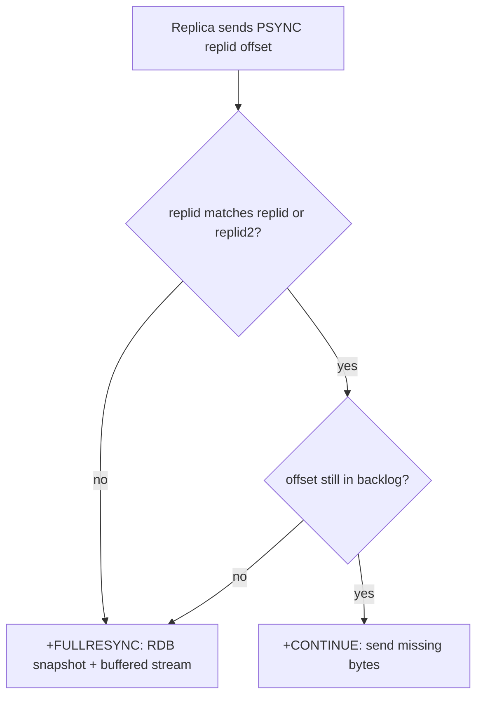
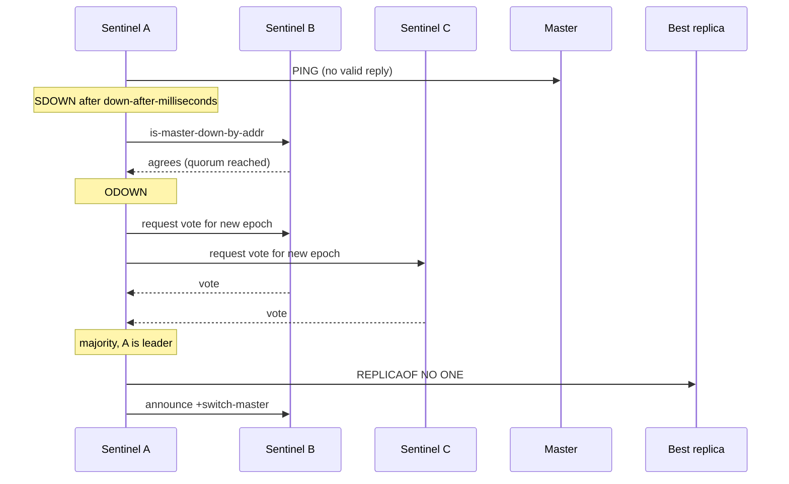
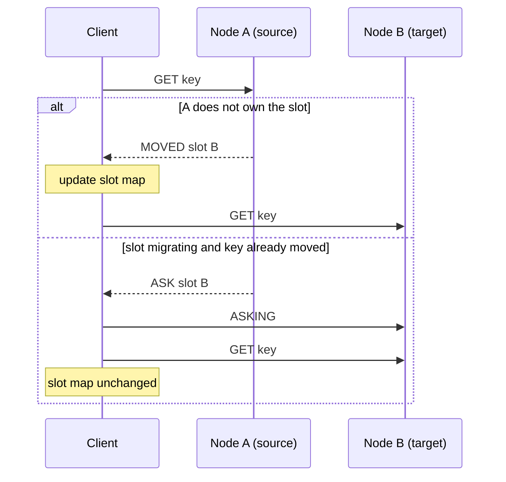
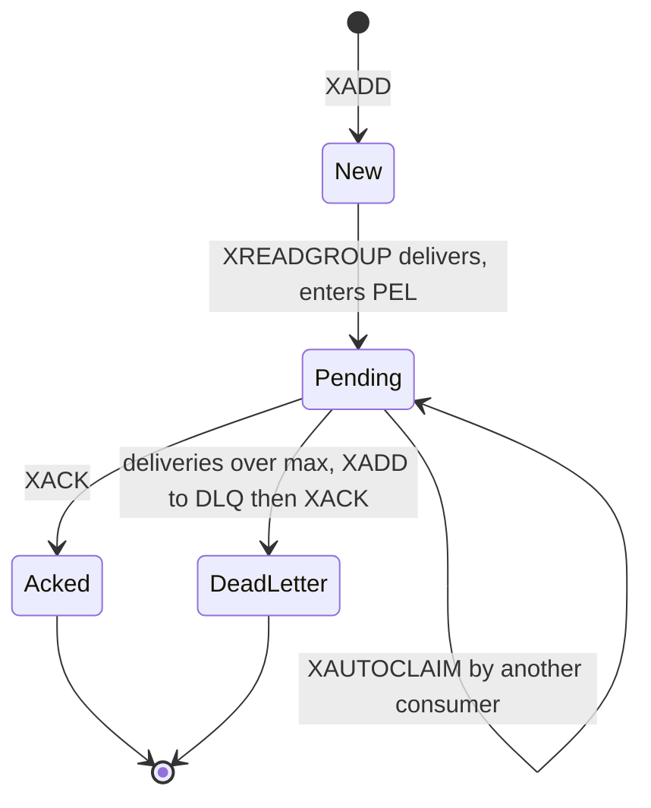
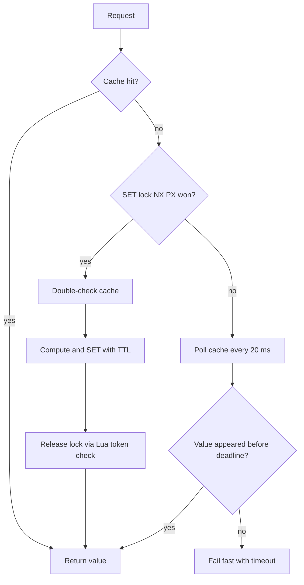

# 🔴 Redis — Staff-Level Interview Questions

> *12 questions covering Redis internals, data structures, persistence, clustering, and operational excellence. Version notes are current as of October 2026 (Redis Open Source 8.10, Valkey 9.x).*

!!! info "Which Redis?"
    - **Redis Open Source 8.x** (Redis Ltd.): since **8.0 (May 2025)** licensed under your choice of **RSALv2, SSPLv1 or AGPLv3**. The Query Engine, JSON, time series, probabilistic structures and vector sets are built in (no more separate Redis Stack modules).
    - **Valkey** (Linux Foundation, **BSD-3**): forked from Redis 7.2.4 in March 2024 after Redis 7.4 moved to RSALv2/SSPLv1. Wire- and RDB-compatible with Redis 7.2; it has since diverged (Valkey 8/9 features are not all in Redis and vice versa).
    - Most internals below (single-threaded command execution, RDB/AOF, PSYNC2, Sentinel, Cluster) apply to both. Where behaviour is version-specific, the version is stated.

---

## Table of Contents

1. [Data Structure Internals](#1-data-structure-internals)
2. [Persistence: RDB vs AOF](#2-persistence-rdb-vs-aof)
3. [Replication: Partial Resync & PSYNC2](#3-replication-partial-resync-psync2)
4. [Redis Sentinel: Auto-Failover](#4-redis-sentinel-auto-failover)
5. [Redis Cluster: Hash Slots & Resharding](#5-redis-cluster-hash-slots-resharding)
6. [Expiry & Eviction Policies](#6-expiry-eviction-policies)
7. [Lua Scripting & MULTI/EXEC](#7-lua-scripting-multiexec)
8. [Streams & Consumer Groups](#8-streams-consumer-groups)
9. [Memory Optimization & Fragmentation](#9-memory-optimization-fragmentation)
10. [Distributed Locks & Redlock](#10-distributed-locks-redlock)
11. [Cache Strategies: Thundering Herd](#11-cache-strategies-thundering-herd)
12. [Redis 7+ Features: ACLs, Functions](#12-redis-7-features-acls-functions)

---

## 1. Data Structure Internals

**Q:** "A user stores 1M small key-value pairs (32B key, 64B value). Redis reports 2GB RSS. Diagnose the overhead. How does Redis store strings (SDS), sets (intset vs listpack vs hashtable), and hashes (listpack vs hashtable)?"

**What They're Really Testing:** Whether you can estimate per-key overhead from first principles, and know the compact encodings and their thresholds.

!!! tip "30-second answer"
    Each top-level key costs roughly **100–150 bytes of overhead** beyond the raw bytes (dict entry, `robj`, SDS headers, hash-table buckets, allocator size-class rounding). 1M such keys should use **~150–200 MB**, not 2 GB. A 10× gap means something else: a past **memory peak** that the allocator hasn't returned (fragmentation), large **client output buffers**, a big **replication backlog**, a **fork in progress** (copy-on-write), or simply far more keys than claimed. Check `INFO memory` and `MEMORY DOCTOR` before blaming the data. The structural fix for many tiny keys is to **bucket them into small hashes** so they use the compact listpack encoding.

### Answer

**Per-key cost (string key → string value, 64-bit build):**

| Component | Approx. bytes | Notes |
|---|---|---|
| `dictEntry` | 24 | key ptr, value ptr, next ptr (chaining) |
| Bucket slot in the main dict | 8–16 | 8 bytes per bucket; table is sized to a power of two ≥ key count |
| Key SDS (32 B) | 32 + 3 header + 1 NUL → **48** size class | Allocators round up to size classes |
| Value `robj` + SDS (64 B, so `raw` encoding) | 16 + (64+3+1 → **80** class) | `embstr` (one allocation) only applies to ≤ 44 bytes |
| Expires dict entry (only if a TTL is set) | ~32 | A second dict maps key → expiry |
| **Total** | **~150–180** | vs 96 raw bytes |

Measured on Redis 8.8 for exactly this shape: **~158 MB for 1M keys**, `MEMORY USAGE` of one key = 144 bytes. Exact numbers shift between versions (Valkey 8 and Redis 8.x both shaved per-key overhead) and allocators, so treat this as an order-of-magnitude estimate.

**So where did 2 GB come from?** Check, in this order:

```bash
INFO memory        # used_memory vs used_memory_rss vs used_memory_peak
MEMORY DOCTOR      # human-readable diagnosis
MEMORY STATS       # breakdown: dataset, overhead, clients, replication backlog, AOF buffer
INFO keyspace      # actual key count per DB
```

| Symptom | Likely cause |
|---|---|
| `used_memory` ≈ 160 MB, RSS ≈ 2 GB, `used_memory_peak` high | Fragmentation after a peak (see [Q9](#9-memory-optimization-fragmentation)) |
| `mem_clients_normal` large | Slow consumers / `MONITOR` / huge pipelined replies filling output buffers |
| `mem_replication_backlog` large | Oversized `repl-backlog-size` |
| RSS spikes during `BGSAVE` / AOF rewrite | Copy-on-write after `fork()`, worse with Transparent Huge Pages |

**SDS (Simple Dynamic String):**

```c
struct __attribute__((__packed__)) sdshdr8 {
    uint8_t len;         // used length → O(1) strlen
    uint8_t alloc;       // allocated length (excluding header and NUL)
    unsigned char flags; // header type: sdshdr5/8/16/32/64
    char buf[];          // binary-safe payload, still NUL-terminated
};
// Header width adapts to string length (1-byte lengths for < 256 B, etc.).
// Why not C strings: O(n) strlen, not binary-safe, and every append reallocates.
// SDS pre-allocates on growth (doubling up to 1 MB, then +1 MB) so APPEND is amortized O(1).
```

**Encodings and thresholds (Redis 7.0+ defaults; listpack replaced ziplist in 7.0):**

| Type | Compact encoding | Switches to | Default threshold (config) |
|---|---|---|---|
| String | `int` (fits in a long), `embstr` (≤ 44 B, one allocation) | `raw` | fixed |
| Hash | `listpack` | `hashtable` | > 512 fields or any value > 64 B (`hash-max-listpack-entries/value`) |
| Set | `intset` (all integers) | `listpack` / `hashtable` | intset ≤ 512 (`set-max-intset-entries`); non-integer listpack ≤ 128 entries, ≤ 64 B (since 7.2) |
| Sorted set | `listpack` | `skiplist` + dict | > 128 entries or member > 64 B (`zset-max-listpack-*`) |
| List | `listpack` (small lists, 7.2+) | `quicklist` (linked list of listpacks) | `list-max-listpack-size -2` (8 KB per node) |

Why listpack replaced ziplist: ziplist entries stored the *previous* entry's length, so one insert could trigger a **cascading update** across the whole list. Listpack stores each entry's own length at its end, removing the cascade.

Compact encodings are O(N) to search but N is small and the data is contiguous, so they are cache-friendly and typically **5–10× smaller** than a hashtable. The conversion is one-way (a hash never shrinks back to listpack until rewritten).

**The bucketing trick** (from Instagram's well-known write-up): instead of 1M string keys, store `HSET bucket:{id // 500} {id % 500} value`. 2,000 hashes of 500 fields each stay under the 512-entry threshold, remain listpack-encoded, and cut per-entry overhead from ~100+ bytes to a few bytes. Trade-off: no per-field TTL in older versions (Redis 7.4+ has **hash field expiration**: `HEXPIRE`, `HTTL`, `HPERSIST`), and eviction works per key, not per field.

### 🔍 Staff-Level Evaluation

| Criterion | What I'm Looking For |
|-----------|----------------------|
| **Estimation** | Gets per-key overhead to the right order of magnitude and notices 2 GB is *not* normal |
| **Diagnosis** | Reaches for `INFO memory`, `MEMORY STATS`, `MEMORY DOCTOR` before guessing |
| **Encodings** | Knows listpack/intset thresholds and that ziplist is gone since 7.0 |
| **Remedy** | Proposes hash bucketing and knows its trade-offs (eviction granularity, field TTL) |

**What they probe next:** "How would you find which key prefixes use the memory?" → `redis-cli --bigkeys` / `--memkeys` (sampled via `SCAN` + `MEMORY USAGE`), or offline RDB analysis; Redis 8.6+ also has `HOTKEYS` and per-type key-size histograms.

---

## 2. Persistence: RDB vs AOF

**Q:** "Your Redis instance holds 50GB and crashes. Walk through recovery. Compare RDB vs AOF. How does AOF rewrite work, and why might it cause latency spikes?"

**What They're Really Testing:** Persistence trade-offs: `fork()` cost, copy-on-write memory amplification, fsync policy, and the recovery-time budget.

!!! tip "30-second answer"
    **RDB** = periodic point-in-time snapshot from a forked child: compact, fast to load, but you lose everything since the last snapshot. **AOF** = log of every write, fsynced per `appendfsync` (`everysec` loses ~1 s). Production default: **AOF `everysec` with the RDB preamble** (`aof-use-rdb-preamble yes`, the default), which gives RDB-speed loading plus a short loss window. Both rely on `fork()`, whose cost is page-table copying (~10–20 ms per GB of RSS on bare metal) plus COW memory growth under write load. Redis replication is async, so persistence alone is not durability across machines.

### Answer

**RDB snapshot (`BGSAVE`):**

```
fork() → child walks the dataset and writes a compact binary .rdb file (LZF-compressed strings)

Memory during BGSAVE:
  1. fork() copies the PAGE TABLES (not the data): ~10-20 ms/GB → 0.5-1 s stall for 50 GB
     (much worse on some hypervisors). The main thread is blocked for this time.
  2. Parent and child share pages copy-on-write.
  3. Every page the parent modifies is copied: peak RSS = dataset + (pages dirtied during the save).
     Example: writes touching 100K distinct 4 KB pages → +400 MB.
  4. With Transparent Huge Pages enabled, each COW copies 2 MB instead of 4 KB → huge RSS spikes
     and latency. Redis warns at startup; disable THP.

Load time: dominated by CPU (deserialising objects, rebuilding dicts), not disk.
  Expect minutes, not seconds, for 50 GB. Measure it; it's your RTO.
```

**AOF (Append-Only File):**

| `appendfsync` | Behaviour | Loss window | Cost |
|---|---|---|---|
| `always` | write + fsync before replying, **batched per event-loop iteration** (group commit) | ~0 (only the in-flight batch) | Throughput bounded by fsync latency; fine on NVMe, painful on network disks |
| `everysec` (default, recommended) | background thread fsyncs once per second | ~1 s (up to ~2 s if the disk stalls; Redis then delays writes) | Near in-memory speed |
| `no` | kernel decides (Linux flushes dirty pages after ~30 s) | up to ~30 s | Fastest |

**AOF rewrite (compaction), Redis 7.0+ multi-part AOF:**

```
appenddirname/
  appendonly.aof.1.base.rdb    ← base snapshot (RDB format by default)
  appendonly.aof.1.incr.aof    ← commands since the base
  appendonly.aof.manifest      ← which files make up the current AOF

Rewrite (triggered by auto-aof-rewrite-percentage / -min-size, or BGREWRITEAOF):
  1. Parent opens a NEW incr file and keeps appending live writes there.
  2. fork() → child writes a new base file from its COW view of the dataset.
  3. On success, the manifest is atomically switched to new base + new incr;
     old files are deleted.

Before 7.0 the parent buffered writes in memory during the rewrite and
the parent had to flush that buffer at the end: extra memory and a final stall.
Multi-part AOF removed both.
```

**Why rewrites (and BGSAVE) cause latency spikes:**

- **`fork()` stall** proportional to RSS (above).
- **COW memory growth** under heavy writes; can trigger the OOM killer if `maxmemory` leaves no headroom.
- **Disk contention:** the child's large sequential write competes with the parent's AOF `fsync`. If the fsync takes > 2 s, `everysec` blocks writes. `no-appendfsync-on-rewrite yes` avoids this **at the cost of a larger loss window during rewrites** (up to ~30 s).
- Mitigations: disable THP, keep instances small (many 10–25 GB shards beat one 100 GB instance), leave 30–50% RAM headroom, run persistence on replicas only if you accept the trade-offs, use fast local disks.

**Recovery order (important, often answered wrong):**

```
appendonly yes  → Redis loads ONLY the AOF (base + incr). It does NOT fall back to the RDB.
                  A truncated tail is tolerated (aof-load-truncated yes); mid-file corruption
                  stops startup → fix with redis-check-aof.
appendonly no   → Redis loads the .rdb file if present.
```

Gotcha: enabling AOF on a running instance by editing the config and restarting starts with an **empty** AOF and loads nothing. Use `CONFIG SET appendonly yes` first (it triggers a rewrite), then persist the config.

**Recommended production config:**

```bash
appendonly yes
appendfsync everysec
aof-use-rdb-preamble yes          # default since 5.0: base file is RDB → fast load
auto-aof-rewrite-percentage 100
auto-aof-rewrite-min-size 64mb
save 3600 1 300 100 60 10000      # Redis 7 default RDB schedule; RDB files are also handy for backups
```

### 🔍 Staff-Level Evaluation

| Criterion | What I'm Looking For |
|-----------|----------------------|
| **fork() cost** | Page-table copy proportional to RSS, COW growth, THP warning |
| **fsync trade-offs** | Knows `always` uses group commit, `everysec` ≈ 1 s loss |
| **Recovery order** | AOF only if enabled; no automatic fallback to RDB |
| **Modern AOF** | Multi-part AOF (7.0), RDB preamble |
| **Durability framing** | Persistence ≠ replication durability; async replicas can still lose acknowledged writes |

**What they probe next:** "How do you back up a 50 GB instance?" → copy the latest RDB/AOF directory (files are immutable once the manifest moves on) from a replica; Redis 8.10 adds a node-side `BACKUP` command built on multi-part AOF.

---

## 3. Replication: Partial Resync & PSYNC2

**Q:** "A Redis replica disconnects from its master for 45 seconds. When it reconnects, the master decides to do a FULL resync instead of a partial resync. Diagnose why. How does PSYNC2 (Redis 4+) improve on PSYNC?"

**What They're Really Testing:** The replication state machine: replication ID, offset, backlog sizing, and what forces a full sync.

!!! tip "30-second answer"
    A partial resync needs two things: the replica's **replication ID** must match one the master knows, and the replica's **offset** must still be inside the master's **backlog** (a circular buffer, default **1 MB**). 45 s of writes almost always overflows 1 MB, so the master falls back to a full RDB transfer. Fix: size `repl-backlog-size` ≈ write throughput × tolerated disconnect × safety factor. PSYNC2 (4.0) keeps the *previous* replication ID after a failover and persists replication info in the RDB, so failovers and replica restarts no longer force full syncs.

### Answer

**State on the master:**

```
master_replid         random 40-char ID for the current replication history
master_replid2        previous ID (PSYNC2), with second_repl_offset
master_repl_offset    bytes of replication stream produced so far
repl_backlog          circular buffer of the most recent repl-backlog-size bytes

Replica (re)connects:  PSYNC <replid> <offset>      (PSYNC ? -1 on first sync)
  replid matches (current, or replid2 with offset ≤ second_repl_offset)
  AND offset is still in the backlog      → +CONTINUE  (partial: send the missing bytes)
  otherwise                               → +FULLRESYNC (RDB snapshot + buffered stream)
```

**Why the full resync happened (most likely first):**

1. **Backlog too small.** Default `repl-backlog-size 1mb`. At even 500 KB/s of writes, 45 s = 22 MB. The replica's offset has been overwritten.
2. **Replica output buffer overflow during an earlier sync.** `client-output-buffer-limit replica 256mb 64mb 60` disconnects a replica that can't keep up, which can loop full syncs forever on a big, busy dataset.
3. **Replication ID mismatch**: the master changed (failover to a node that doesn't share the history), or the master restarted *without* persistence and got a new ID.
4. **Pre-4.0 replica restart**: the replica lost its replid/offset on restart. Since 4.0 they are stored in the RDB, so a replica restarting from its own RDB can partially resync.

**Backlog sizing:**

```bash
# repl-backlog-size ≈ write throughput × max disconnect to survive × safety factor
# 10 MB/s × 300 s × 2 = 6 GB
CONFIG SET repl-backlog-size 6gb   # runtime-settable; memory is allocated as the stream grows
```

Since Redis 7.0 the backlog and all replica output buffers share **one replication buffer** (a linked list of blocks), so a large backlog no longer means each replica gets its own copy. The backlog is freed `repl-backlog-ttl` seconds (default 3600) after the last replica disconnects.

**PSYNC2 (4.0+) after a failover:**

```
Master-A (replid=abc) dies at offset 50000.
Replica B is promoted: replid=xyz, replid2=abc, second_repl_offset=50001.
Replica C reconnects to B with:  PSYNC abc 45000
B: abc == replid2 and 45000 ≤ 50001 → +CONTINUE (partial resync from B's backlog)

Pre-4.0: B would answer FULLRESYNC to every replica after every failover.
```

**Useful settings:**

```bash
repl-diskless-sync yes        # default since 7.0: stream the RDB over the socket, no temp file
repl-diskless-sync-delay 5    # wait to batch several replicas onto one fork
repl-diskless-load disabled   # replica side; 'swapdb'/'on-empty-db' load straight from the socket
replica-serve-stale-data yes  # serve old data while syncing (consistency trade-off)
repl-timeout 60
```

*PSYNC decision on reconnect: partial resync only if the replid is known and the offset is still in the backlog.*



### 🔍 Staff-Level Evaluation

| Criterion | What I'm Looking For |
|-----------|----------------------|
| **PSYNC conditions** | Replid match + offset within backlog |
| **Backlog sizing** | Computes it from throughput × disconnect tolerance; knows default is 1 MB |
| **Full-sync loops** | Mentions replica output-buffer limits |
| **PSYNC2** | Dual replication IDs; replication info persisted in RDB |

**What they probe next:** "What does a full sync cost the master?" → a `fork()` plus streaming the whole dataset, possibly to several replicas; on big instances that is the main reason to keep shards small and backlogs generous.

---

## 4. Redis Sentinel: Auto-Failover

**Q:** "Design a Redis high-availability setup for a payment service that requires <5 seconds of downtime during failover and zero data loss. Walk through Redis Sentinel's monitoring, quorum, and failover process."

**What They're Really Testing:** SDOWN/ODOWN, the leader election among Sentinels, replica selection, and honesty about what async replication can't guarantee.

!!! tip "30-second answer"
    Run ≥ 3 Sentinels in separate failure domains. A Sentinel marks the master **SDOWN** after `down-after-milliseconds`; when `quorum` Sentinels agree it becomes **ODOWN**; a **majority** of Sentinels must then elect one leader (per epoch) to run the failover, which promotes the best replica and reconfigures the rest. Sub-5 s failover is possible with `down-after-milliseconds` ≈ 1–2 s on a reliable network, at the risk of false failovers. **Zero data loss is not achievable**: replication is async, and even `WAIT` doesn't stop Sentinel promoting a replica that missed a write. For money, the source of truth belongs in a database with synchronous replication; Redis is the cache or rate limiter in front.

### Answer

**Architecture:**

```
   Sentinel A        Sentinel B        Sentinel C       (3 AZs, quorum = 2)
       │  PING/INFO every 1 s; gossip via __sentinel__:hello pub/sub
       ▼
  ┌──────────────┐   async replication   ┌────────────┐  ┌────────────┐
  │ Master :6379 │ ───────────────────▶  │ Replica 1  │  │ Replica 2  │
  └──────────────┘                       └────────────┘  └────────────┘
  Clients ask Sentinel "where is master payment-master?" and reconnect on +switch-master.
```

**Failover, step by step:**

```
1. SDOWN   Sentinel A gets no valid PING reply for down-after-milliseconds.
2. ODOWN   A asks the others (SENTINEL is-master-down-by-addr). quorum (2) agree → ODOWN.
3. Elect   A increments the epoch and asks for votes. Each Sentinel votes once per epoch,
           first come first served. Leader needs a MAJORITY of all Sentinels (2 of 3),
           and at least quorum. No majority (e.g. partition) → no failover.
4. Select  Leader filters out replicas disconnected from the master for too long, then ranks:
             replica-priority (lower wins; 0 = never promote)
             → replication offset (most data wins)
             → run ID (lexicographically smallest)
5. Promote REPLICAOF NO ONE on the winner; waits until INFO shows role:master.
6. Reconfigure other replicas: REPLICAOF <new-master> (parallel-syncs at a time).
7. Announce +switch-master; old master is reconfigured as a replica when it returns.
```

Note the two thresholds: **quorum** decides *detection*; **majority** decides *authorization*. Setting quorum = 1 with 3 Sentinels speeds detection but still needs 2 votes to act.

**Timing budget for < 5 s:**

| Phase | Typical |
|---|---|
| Detection | `down-after-milliseconds` (1–2 s on same-region networks; 5 s+ is safer across AZs) |
| ODOWN agreement + election | tens to hundreds of ms |
| Promotion + client reconnection | ~1 s, dominated by clients noticing (Sentinel-aware client, pub/sub notification) |

```bash
sentinel monitor payment-master 10.0.1.10 6379 2
sentinel down-after-milliseconds payment-master 2000
sentinel failover-timeout payment-master 10000   # also the retry back-off between attempts
sentinel parallel-syncs payment-master 1
sentinel auth-pass payment-master <secret>
```

**Reducing (not eliminating) data loss:**

| Mechanism | What it does | What it does not do |
|---|---|---|
| `min-replicas-to-write 1` + `min-replicas-max-lag 10` | A master isolated from its replicas stops accepting writes after ~10 s, bounding split-brain loss | Doesn't make replication synchronous |
| `WAIT 1 100` | Blocks the client until ≥ 1 replica acknowledged the write (or timeout) | Sentinel may still promote a *different* replica that lacks it; a timed-out write is still applied on the master |
| `WAITAOF 1 1 100` (7.2+) | Waits until the write is fsynced to the local AOF and ≥ 1 replica's AOF | Same failover caveat |

Active-active geo-replication (CRDT-based) exists in Redis Software / Redis Cloud, not in Redis Open Source, and it trades consistency for availability rather than giving "zero loss".

*Sentinel failover: SDOWN, ODOWN by quorum, leader election by majority, then promotion.*



### 🔍 Staff-Level Evaluation

| Criterion | What I'm Looking For |
|-----------|----------------------|
| **SDOWN/ODOWN** | Quorum for detection vs majority for the failover leader |
| **Replica selection** | Disconnection filter → priority → offset → run ID |
| **Honesty on loss** | Says zero loss is impossible with async replication; knows `min-replicas-to-write`, `WAIT`, `WAITAOF` limits |
| **Client side** | Clients must discover the master via Sentinel and handle reconnection |

**What they probe next:** "Sentinel or Cluster?" → Sentinel = HA for one dataset that fits in one node; Cluster = sharding + HA built in, at the cost of multi-key restrictions and smarter clients.

---

## 5. Redis Cluster: Hash Slots & Resharding

**Q:** "You need to add 3 nodes to a 6-node Redis Cluster handling 1M ops/s. Walk through hash slot assignment, MOVED/ASK redirections, and resharding without downtime. How do you handle resharding while maintaining p99 < 5ms?"

**What They're Really Testing:** Slot mapping and hash tags, MOVED vs ASK semantics, how key-by-key migration works, and why big keys are what hurt p99.

!!! tip "30-second answer"
    16,384 slots; `slot = CRC16(key) mod 16384`, hashing only the `{tag}` if present. Clients cache slot → node and get **MOVED** (permanent, update the map) or **ASK** (one-off redirect during migration, send `ASKING` first). Classic resharding moves keys one batch at a time with `MIGRATE`, which **blocks both nodes** for each batch, so a single multi-MB key is what blows p99. Mitigate with small batches, finding and splitting big keys first, and moving slots off-peak. **Redis 8.4+** (and Valkey 9.0+) add **atomic slot migration** (`CLUSTER MIGRATION`), which replicates a whole slot in the background and flips ownership atomically, removing ASK redirects and multi-key errors during the move.

### Answer

**Slot mapping and hash tags:**

```
slot = CRC16-XMODEM(key) mod 16384
  user:100:profile      → CRC16("user:100:profile") mod 16384 = 4836
  user:{100}:profile    → only "100" is hashed           → 339
  user:{100}:cart       → only "100" is hashed           → 339   (same slot)

Multi-key commands (MGET, MULTI/EXEC, Lua with several KEYS, SUNIONSTORE…) only work
when all keys share one slot → CROSSSLOT error otherwise. Hash tags make that possible,
at the risk of hot slots if one tag gets too much traffic.
Why 16384? Slot ownership is gossiped as a 2 KB bitmap; 16K slots is plenty for ~1000 nodes.
```

**MOVED vs ASK:**

| | MOVED | ASK |
|---|---|---|
| When | Any node that doesn't own the slot | Source node, during migration, when the key is **not present locally** (already moved or new) |
| Meaning | "This slot lives on B now" | "Try B for this one request" |
| Client action | Update slot map, retry on B | Send `ASKING` then the command to B; **don't** update the map |

If the key is still on the source, the source just serves it. Multi-key operations spanning moved and unmoved keys return `TRYAGAIN`.

**Adding 3 nodes to 6:**

```bash
redis-cli --cluster add-node new1:6379 existing:6379        # repeat for new2, new3 (empty, 0 slots)
redis-cli --cluster add-node r1:6379 existing:6379 --cluster-slave --cluster-master-id <new1-id>  # their replicas

# Move ~16384/9 ≈ 1820 slots onto each new master, evenly from the old ones:
redis-cli --cluster rebalance existing:6379 --cluster-use-empty-masters \
  --cluster-pipeline 10 --cluster-threshold 1

redis-cli --cluster check existing:6379    # all 16384 slots covered, no open slots
```

**Classic migration protocol (per slot), what `redis-cli` does under the hood:**

```
1. On destination: CLUSTER SETSLOT <slot> IMPORTING <source-id>
2. On source:      CLUSTER SETSLOT <slot> MIGRATING <dest-id>
3. Loop:  CLUSTER GETKEYSINSLOT <slot> <count>
          MIGRATE dest-host dest-port "" 0 <timeout> KEYS k1 k2 … kN
          (atomic per call: DUMP + RESTORE + DEL; both nodes block until done)
4. CLUSTER SETSLOT <slot> NODE <dest-id> on destination, source, then everyone (gossip spreads it)
```

**Keeping p99 < 5 ms:**

- **Big keys are the real risk.** Migrating a 50 MB hash serializes and sends it in one `MIGRATE`, blocking both nodes for tens to hundreds of ms. Find them first (`redis-cli --bigkeys`, `MEMORY USAGE`) and split them.
- **Small batches.** `--cluster-pipeline` = keys per `MIGRATE` call (default 10). Smaller = shorter individual stalls, longer total time.
- **Spread and schedule.** Move slots in waves off-peak; watch `latency` / `LATENCY LATEST` and per-slot metrics (`CLUSTER SLOT-STATS`, Redis 8.4+; Valkey 8.0+) and pause if p99 degrades.
- **Client readiness.** Clients must handle MOVED/ASK/TRYAGAIN efficiently (refresh topology on MOVED, not on every ASK).
- **Use atomic slot migration where available** (Redis 8.4+ `CLUSTER MIGRATION IMPORT …`, Valkey 9.0+): the target streams the slot's data and subsequent writes in the background, then ownership switches in one step.
- `cluster-require-full-coverage no` is unrelated to resharding: it lets nodes keep serving their slots when *some* slots have no live owner (availability over consistency).

*MOVED is a permanent redirect; ASK is a one-off redirect while a slot is migrating.*



### 🔍 Staff-Level Evaluation

| Criterion | What I'm Looking For |
|-----------|----------------------|
| **Hash tags** | Knows only `{…}` is hashed and the hot-slot trade-off |
| **MOVED vs ASK** | ASK only for keys not on the source; `ASKING`; no map update |
| **Migration cost** | `MIGRATE` blocks both ends; big keys dominate p99 |
| **Current tooling** | `--cluster rebalance`, per-slot stats, atomic slot migration in 8.4+ / Valkey 9 |

**What they probe next:** "What happens to a Lua script or transaction mid-migration?" → `TRYAGAIN`/ASK-related errors when its keys are split across nodes; atomic slot migration avoids this.

---

## 6. Expiry & Eviction Policies

**Q:** "Your Redis cache reaches its maxmemory limit. Walk through the eviction policies. How does the approximated LRU work? How do you choose between allkeys-lru and volatile-ttl for a social media feed cache?"

**What They're Really Testing:** Sampled eviction, LFU, how expiry interacts with eviction, and choosing a policy from the access pattern.

!!! tip "30-second answer"
    At `maxmemory`, each write triggers eviction per `maxmemory-policy`. Redis doesn't keep an LRU list: it **samples** `maxmemory-samples` keys (default 5) and evicts the best candidate from a small **eviction pool**, which is close to true LRU with 10 samples. **LFU** (4.0+) uses a probabilistic 8-bit counter with decay and is usually better for skewed popularity (viral posts). Expired keys are removed lazily on access plus by an adaptive background sampler. For a feed cache: `allkeys-lfu` (or `allkeys-lru`), not `volatile-ttl`, unless you trust your TTLs more than observed access.

### Answer

**Policies:**

| Policy | Candidates | Use when |
|---|---|---|
| `noeviction` (default) | none: writes fail with OOM | Redis as a primary store / queue |
| `allkeys-lru` | all keys | General cache, recency matters |
| `allkeys-lfu` | all keys | Skewed popularity; resists one-off scans |
| `allkeys-random` | all keys | Uniform access |
| `volatile-lru` / `volatile-lfu` / `volatile-random` | keys with a TTL | Mixed cache + must-keep data (better: separate instances) |
| `volatile-ttl` | keys with a TTL | Evict soonest-to-expire first |
| `allkeys-lrm` / `volatile-lrm` (**8.6+**) | as named | Least Recently **Modified**: reads don't refresh the key's age, so read-hot but stale data can go |

Gotcha: with a `volatile-*` policy and no keys with TTL, Redis behaves like `noeviction`.

**Approximated LRU:**

```
Each object has a 24-bit LRU clock field (seconds resolution, in the robj header).
On eviction:
  1. Sample maxmemory-samples keys (default 5) from the relevant dict.
  2. Insert them into a 16-entry eviction pool ordered by idle time
     (the pool persists across evictions, so good candidates accumulate).
  3. Evict the best candidate in the pool.
No linked list → no 16 bytes of prev/next pointers per key, O(1) per eviction.
maxmemory-samples 10 is very close to true LRU (Redis docs' simulation) for slightly more CPU.
```

**LFU (4.0+):** the same 24 bits hold an 8-bit **logarithmic counter** (increment probability falls as the counter grows, tuned by `lfu-log-factor`) and a 16-bit last-decrement time (counter decays every `lfu-decay-time` minutes). Distinguishes "hot for an hour" from "touched once by a batch job".

**Expiry:**

```
1. Lazy:   on access, if the key is past its TTL → delete and act as missing.
           An expired key is never returned.
2. Active: hz times per second (default 10), sample ~20 keys from the expires dict,
           delete the expired ones, and repeat while more than ~10% of the sample
           was expired, within a CPU-time budget (~25% of a cycle).
           active-expire-effort (1–10, Redis 6+) trades CPU for less memory held by
           expired keys.
Replicas don't expire keys themselves; the master sends DELs (replicas hide logically
expired keys from reads since 3.2).
```

If many keys expire at the same moment (e.g. a bulk load with one fixed TTL), the active cycle keeps re-running and memory is held by dead keys until it catches up: **add jitter to TTLs**.

**Feed cache choice:** `allkeys-lfu`. Popularity is highly skewed and changes; LFU keeps viral items and drops one-hit items without depending on TTL quality. `volatile-ttl` only helps if TTLs genuinely encode value.

### 🔍 Staff-Level Evaluation

| Criterion | What I'm Looking For |
|-----------|----------------------|
| **Sampled LRU** | Sampling + eviction pool, `maxmemory-samples` trade-off |
| **LFU** | Log counter + decay; why it beats LRU for skewed access |
| **Expiry mechanics** | Lazy + adaptive active cycle; TTL jitter |
| **Policy choice** | Driven by access pattern; knows `noeviction` is the default |

**What they probe next:** "Writes start failing with OOM even though you set allkeys-lru" → memory is in non-evictable places (client output buffers, replication backlog, Lua/Function memory) or eviction can't keep up with the write rate; check `INFO memory` and `evicted_keys`.

---

## 7. Lua Scripting & MULTI/EXEC

**Q:** "You need to atomically debit a wallet balance and log the transaction. Compare MULTI/EXEC transactions vs Lua scripting in Redis. How do you ensure that your Lua script doesn't block the event loop for too long?"

**What They're Really Testing:** Atomicity semantics of MULTI/EXEC vs scripts, optimistic locking with WATCH, script limits, and how scripts replicate.

!!! tip "30-second answer"
    `MULTI/EXEC` queues commands and runs them back-to-back with nothing interleaved, but has **no conditional logic and no rollback**; check-then-act needs `WATCH` (optimistic CAS, retry on conflict). A **Lua script** (or a **Function**, 7.0+) runs atomically and can branch, so "check balance, debit, append ledger" is one round-trip. Scripts block the single command thread: keep them O(small), and know that after `busy-reply-threshold` (5 s) Redis only *starts answering BUSY*; it doesn't stop the script. Since 7.0 scripts replicate as their **effects** (the resulting writes), so non-determinism like `TIME` is fine.

### Answer

**MULTI/EXEC semantics:**

```bash
MULTI
DECRBY wallet:100 50
RPUSH ledger:100 "debit:50"
EXEC
```

- Errors **at queue time** (unknown command, wrong arity) → `EXEC` aborts the whole transaction (since 2.6.5).
- Errors **at run time** (e.g. `WRONGTYPE`) → that command fails, **the others still run**. No rollback.
- You can't read a value inside the transaction and branch on it.

**Check-and-set with WATCH (optimistic locking):**

```python
def debit(r, wallet, amount):
    with r.pipeline() as p:
        while True:
            try:
                p.watch(wallet)                     # abort EXEC if wallet changes
                balance = int(p.get(wallet) or 0)
                if balance < amount:
                    p.unwatch()
                    raise ValueError("INSUFFICIENT_FUNDS")
                p.multi()
                p.decrby(wallet, amount)
                p.rpush(f"{wallet}:ledger", f"debit:{amount}")
                p.execute()
                return balance - amount
            except redis.WatchError:
                continue                            # someone else wrote; retry
```

Works, but under contention retries pile up and it costs 2+ round-trips. A script is simpler.

**Lua (one round-trip, atomic, can branch):**

```lua
-- EVAL <script> 2 {wallet:100}:bal {wallet:100}:ledger 50
local balance = tonumber(redis.call("GET", KEYS[1]) or "0")
local amount  = tonumber(ARGV[1])
if balance < amount then
    return redis.error_reply("INSUFFICIENT_FUNDS")
end
redis.call("DECRBY", KEYS[1], amount)
redis.call("RPUSH", KEYS[2], "debit:" .. amount)
return balance - amount
```

Rules: pass **every key via `KEYS`** (Cluster routing and ACL checks depend on it), and in Cluster all keys must hash to one slot (hence the `{wallet:100}` tag). Note: a script error *after* some writes does **not** roll back the earlier writes either; validate first, write last.

**Caching:** `SCRIPT LOAD` returns the SHA1; `EVALSHA <sha>` avoids resending the body; on `NOSCRIPT` (after restart/failover/`SCRIPT FLUSH`) fall back to `EVAL`. Client libraries do this automatically. `EVAL_RO`/`EVALSHA_RO` (7.0) can run on replicas.

**Blocking and limits:**

```
Scripts run on the main thread; nothing else executes meanwhile.
busy-reply-threshold 5000   (was lua-time-limit before 7.0)
  After 5 s Redis does NOT kill the script; it starts replying BUSY to other clients.
  SCRIPT KILL      works only if the script hasn't written yet.
  SHUTDOWN NOSAVE  is the only way out once it has written (to keep atomicity).
```

So: bound the work (`COUNT` limits, no unbounded `KEYS`/`SMEMBERS` loops), and do bulk processing from the client in batches (`SCAN` + pipelines).

**Replication of scripts:**

- Before Redis 5, scripts were replicated **verbatim** and had to be deterministic.
- 5.0 made **effects replication** the default; **7.0 removed verbatim replication**. Replicas and the AOF receive the resulting `DECRBY`/`RPUSH` wrapped in `MULTI/EXEC`, so calling `TIME` or using randomness in a script is safe.
- Shebang flags (7.0+): `#!lua flags=no-writes,allow-stale` etc. (`no-writes`, `allow-oom`, `allow-stale`, `no-cluster`, `allow-cross-slot-keys`).

### 🔍 Staff-Level Evaluation

| Criterion | What I'm Looking For |
|-----------|----------------------|
| **MULTI semantics** | Queue-time vs run-time errors; no rollback; WATCH for CAS |
| **Script atomicity** | Atomic, branches, but partial writes stay on error |
| **Blocking** | `busy-reply-threshold` only triggers BUSY; SCRIPT KILL vs SHUTDOWN NOSAVE |
| **Replication** | Effects replication (verbatim removed in 7.0) |
| **Cluster** | All keys via KEYS, same slot |

**What they probe next:** "Scripts or Functions?" → see [Q12](#12-redis-7-features-acls-functions).

---

## 8. Streams & Consumer Groups

**Q:** "Design a real-time event processing pipeline using Redis Streams for 100K events/second. Compare consumer groups with Kafka consumer groups. How do you handle back-pressure and dead-letter processing?"

**What They're Really Testing:** The stream data model, the Pending Entries List (PEL), reclaiming stuck messages, and when Streams are the wrong tool.

!!! tip "30-second answer"
    A stream is an append-only log keyed by `<ms>-<seq>` IDs, stored as listpacks indexed by a radix tree. A **consumer group** tracks a last-delivered ID plus a **PEL** of delivered-but-unacked entries per consumer; `XACK` removes them. Unlike Kafka, messages in one group are handed out **per message** to any consumer (not per partition), so there is no ordering per key and no partitioning: one stream lives on one shard. Scale by sharding across N stream keys. Handle crashed consumers with `XAUTOCLAIM` (or `XREADGROUP … CLAIM` in 8.4+), use the delivery counter for dead-lettering, and cap memory with `MAXLEN ~` / `MINID`.

### Answer

**Data model:**

```
XADD orders * order_id ORD-123 action created amount 99.99
→ 1728492012345-0          <milliseconds>-<sequence>  (sequence is a 64-bit counter, not 16-bit)

Storage: radix tree keyed by entry ID → each node points to a listpack holding many entries.
Entries in a listpack store field names as deltas against the node's "master entry", so
repeated field names cost almost nothing. Memory is roughly proportional to payload.
```

**Consumer group mechanics:**

```bash
XGROUP CREATE orders processors $ MKSTREAM          # $ = only new entries; 0 = from the start

XREADGROUP GROUP processors c1 COUNT 100 BLOCK 2000 STREAMS orders >
#   ">" = entries never delivered to this group; they enter c1's PEL
XREADGROUP GROUP processors c1 STREAMS orders 0
#   "0" = re-read c1's OWN pending entries (e.g. after c1 restarts)

XACK orders processors 1728492012345-0              # remove from PEL
XPENDING orders processors - + 10                   # id, consumer, idle ms, delivery count
XAUTOCLAIM orders processors c2 60000 0-0 COUNT 100 # 6.2+: take over entries idle > 60 s
XINFO GROUPS orders                                 # 7.0+: includes 'lag' and 'entries-read'
```

Newer additions worth knowing: **8.2** `XACKDEL` (ack and delete in one step) and `XDELEX` with `KEEPREF/DELREF/ACKED` options for how deletion treats other groups' PELs; **8.4** `XREADGROUP … CLAIM <min-idle>` returns idle pending entries and new ones in one call; **8.6** idempotent `XADD` (`IDMP`/`IDMPAUTO`); **8.8** `XNACK` to release pending entries explicitly.

**Consumer with retries and dead-lettering (redis-py):**

```python
import redis

r = redis.Redis(decode_responses=True)
STREAM, GROUP, DLQ = "orders", "processors", "orders:dlq"
MAX_DELIVERIES, CLAIM_IDLE_MS = 5, 60_000

try:
    r.xgroup_create(STREAM, GROUP, id="0", mkstream=True)
except redis.ResponseError as e:
    if "BUSYGROUP" not in str(e):
        raise

def handle(consumer, msg_id, fields):
    try:
        process(fields)                                  # must be idempotent: delivery is at-least-once
        r.xack(STREAM, GROUP, msg_id)
    except Exception as exc:
        # Leave it pending; it will be reclaimed after CLAIM_IDLE_MS.
        log_failure(msg_id, exc)

def consume(consumer):
    while True:
        # 1. Reclaim entries other consumers (or we) left pending for too long.
        _, claimed, _ = r.xautoclaim(STREAM, GROUP, consumer, CLAIM_IDLE_MS, "0-0", count=100)
        for msg_id, fields in claimed:
            deliveries = r.xpending_range(STREAM, GROUP, msg_id, msg_id, 1)[0]["times_delivered"]
            if deliveries > MAX_DELIVERIES:
                r.xadd(DLQ, {"id": msg_id, **fields})
                r.xack(STREAM, GROUP, msg_id)            # poison message: park it, stop retrying
            else:
                handle(consumer, msg_id, fields)

        # 2. Read new entries.
        for _, entries in r.xreadgroup(GROUP, consumer, {STREAM: ">"}, count=100, block=2000) or []:
            for msg_id, fields in entries:
                handle(consumer, msg_id, fields)
```

**Throughput and back-pressure:**

- 100K events/s is reachable on one shard with pipelined `XADD`s, but leaves little headroom; shard by key (`orders:{0..N-1}`) and run one consumer group per shard for linear scaling and per-key ordering.
- **Memory is the back-pressure signal.** Cap with `XADD … MAXLEN ~ 1000000` (the `~` trims whole listpack nodes, much cheaper) or `MINID ~ <id>` for time-based retention. Trimming deletes entries even if a group hasn't read them, so alert on group `lag` (from `XINFO GROUPS`) well before the cap.
- Producers should slow down or shed load when lag grows; Redis won't push back on its own (other than OOM at `maxmemory`).

**Redis Streams vs Kafka:**

| | Redis Streams | Kafka |
|---|---|---|
| Storage | RAM (persisted via RDB/AOF) | Disk, cheap long retention, tiered storage |
| Parallelism unit | Message (any consumer in the group) | Partition (one consumer per partition per group) |
| Ordering | Per stream; lost across consumers in a group | Per partition |
| Ack model | Per-message PEL + XACK | Committed offset per partition |
| Replay | By ID range | By offset/timestamp |
| Durability | Async replication; can lose acked writes on failover | `acks=all` + `min.insync.replicas` |
| Fit | Low-latency job queues, modest retention, already running Redis | High volume, long retention, many consumer groups, ecosystem |

*Stream entry lifecycle in a consumer group: delivery puts it in the PEL, ack removes it, idle entries are reclaimed or dead-lettered.*



### 🔍 Staff-Level Evaluation

| Criterion | What I'm Looking For |
|-----------|----------------------|
| **PEL mechanics** | `>` vs `0`, XACK, XAUTOCLAIM, delivery count |
| **Failure handling** | Idempotent consumers, poison-message DLQ, reclaim after idle |
| **Capacity** | MAXLEN/MINID trimming, lag monitoring, sharding across keys |
| **Kafka comparison** | Per-message vs per-partition assignment; RAM vs disk; durability |

**What they probe next:** "Exactly-once?" → no; at-least-once delivery plus idempotent processing (dedupe key in the consumer's DB, or `XADD IDMP` for producer-side dedupe in 8.6+).

---

## 9. Memory Optimization & Fragmentation

**Q:** "Your Redis instance shows used_memory: 8GB but used_memory_rss: 14GB. That's 75% fragmentation. Diagnose the causes and fix them without restarting the instance. How would you prevent this in the future?"

**What They're Really Testing:** How jemalloc fragments, how active defrag actually works, and sizing `maxmemory` against RSS.

!!! tip "30-second answer"
    `mem_fragmentation_ratio = RSS / used_memory = 1.75`. The usual cause is a **past peak**: when keys are deleted, jemalloc frees *regions* inside slabs, but a slab (and its pages) can only go back to the OS when **every** region in it is free, so scattered survivors pin lots of pages. Fix online with **active defrag** (`activedefrag yes`), which *moves* live allocations out of sparse slabs so whole slabs can be released. If that's too slow, fail over to a freshly synced replica (a full sync rebuilds memory compactly). Prevent it by leaving RSS headroom above `maxmemory` and avoiding big churn of mixed-size values.

### Answer

**Diagnose:**

```bash
INFO memory
# used_memory:            8.0G   bytes Redis allocated
# used_memory_rss:       14.0G   resident pages per the OS
# used_memory_peak:      12.0G   ← dataset was much bigger earlier: prime suspect
# mem_fragmentation_ratio: 1.75  (RSS / used_memory; also includes non-allocator overhead)
# allocator_frag_ratio / allocator_frag_bytes   ← true allocator (external) fragmentation
# allocator_rss_ratio                            ← pages jemalloc retains but isn't using
# mem_allocator: jemalloc-5.x
MEMORY DOCTOR
```

Read the ratio carefully:

- **> 1.5 with a high `used_memory_peak`** → post-peak fragmentation (this case).
- **< 1.0** → part of Redis is **swapped out**: a latency emergency, not "good".
- On small instances (< ~100 MB) the ratio is noisy; look at absolute bytes.

**Kinds of waste:**

1. **Internal**: allocations rounded up to jemalloc size classes (8, 16, 32, 48, 64, 80, 96, 112, 128, …). A 65-byte value uses 80 bytes.
2. **External**: small allocations live in **slabs** dedicated to one size class. After mass deletion, each slab may hold a few live regions, so its pages stay resident. Mixed value sizes and churn make this worse.
3. **Retained/dirty pages**: freed pages jemalloc hasn't returned yet. `jemalloc-bg-thread yes` (default since 6.0) purges them in the background; `MEMORY PURGE` forces it.

**Fix without a restart:**

```bash
CONFIG SET activedefrag yes
# Defaults (Redis 7+): threshold-lower 10 (%), threshold-upper 100 (%),
# active-defrag-ignore-bytes 100mb, cycle-min 1 (% CPU), cycle-max 25 (% CPU)
CONFIG SET active-defrag-cycle-max 50        # optional: defrag faster, at more CPU cost
```

How it works: Redis scans the keyspace and, for each allocation that jemalloc reports lives in an under-utilised slab, **reallocates it** (copy to a fuller slab, update the pointer, free the old one). Freed slabs can then be returned to the OS. Requires Redis built with its bundled jemalloc (the default on Linux). It costs main-thread CPU, so watch latency while it runs; between `cycle-min` and `cycle-max` the effort scales with how fragmented the instance is.

If defrag can't keep up or the ratio stays high: promote a replica that has just done a full sync (its memory is laid out fresh), then resync the old master. With Sentinel/Cluster this is a zero-downtime operation.

**Prevent:**

- **Size `maxmemory` against RSS, not RAM.** `maxmemory` caps `used_memory`, not RSS. Leave headroom for fragmentation, fork COW, client buffers and the replication buffer: commonly `maxmemory` ≈ 60–75% of the node's RAM.
- **Avoid big peaks**: bulk-delete gradually (`UNLINK`, `SCAN`-based deletes, lazyfree options), and spread expirations with TTL jitter.
- **Keep values similar in size** where you control the schema; prefer compact encodings (small hashes) for small objects.
- **Monitor** `allocator_frag_ratio` and `allocator_frag_bytes` with alerts, and keep `activedefrag yes` on for churny workloads.

### 🔍 Staff-Level Evaluation

| Criterion | What I'm Looking For |
|-----------|----------------------|
| **Root cause** | Peak + slab pinning, not "jemalloc is bad" |
| **Active defrag mechanism** | Relocates live allocations; doesn't just `madvise` |
| **Ratio literacy** | < 1 means swap; allocator_* metrics are more precise |
| **Prevention** | `maxmemory` vs RSS headroom, gradual deletes, replica-based reset |

**What they probe next:** "Why does memory not drop after `FLUSHALL`?" → allocator retention and the lazyfree thread; it returns over time or after `MEMORY PURGE`.

---

## 10. Distributed Locks & Redlock

**Q:** "Design a distributed lock for a shared resource that must have mutual exclusion even if the lock holder crashes. Is Redis's SET NX EX sufficient? What about Redlock? Can you prove correctness of your lock under network partitions?"

**What They're Really Testing:** Whether you separate **efficiency** locks from **correctness** locks, know Kleppmann's critique, and reach for fencing tokens.

!!! tip "30-second answer"
    `SET key <random-token> NX PX <ttl>` + compare-and-delete release is a fine lock **for efficiency** (avoid duplicate work). It is **not safe for correctness**: async replication can lose the lock on failover, and any client can be paused (GC, VM stall) past its TTL and keep acting. Redlock (majority of N independent masters) fixes the failover case but still assumes bounded pauses, network delay and clock drift. For correctness, the **resource** must reject stale holders using a **fencing token** from a consensus-backed store (etcd revision, ZooKeeper zxid/sequence) or use the database's own concurrency control.

### Answer

**Single-instance lock:**

```bash
SET lock:invoice:42 <uuid> NX PX 30000     # acquire; nil → someone else holds it
```

```lua
-- release: delete only if we still own it (a bare DEL could remove someone else's lock)
if redis.call("GET", KEYS[1]) == ARGV[1] then
    return redis.call("DEL", KEYS[1])
end
return 0
```

Redis 8.4+ can do the compare-and-delete natively: `DELEX lock:invoice:42 IFEQ <uuid>`.

**Failure modes:**

| Problem | What happens |
|---|---|
| Failover | Master grants the lock, dies before replicating; promoted replica has no lock → second client acquires it |
| Process pause | Holder stalls (GC, swap, VM migration) longer than the TTL, lock expires, B acquires, A resumes and writes |
| Clock jump on the Redis server | TTL expires early if the server's clock jumps forward (Redis uses wall-clock time for expiry) |
| Long operations | Work outlasts the TTL; needs a watchdog that extends the TTL (with an ownership check) |

**Redlock (N = 5 independent masters, no replication between them):**

```python
import time, uuid
import redis

RELEASE = """
if redis.call('GET', KEYS[1]) == ARGV[1] then return redis.call('DEL', KEYS[1]) end
return 0
"""

class Redlock:
    def __init__(self, hosts, drift_factor=0.01):
        # short socket timeouts so one dead node doesn't eat the lock's validity
        self.nodes = [redis.Redis(host=h, socket_timeout=0.05) for h in hosts]
        self.quorum = len(self.nodes) // 2 + 1
        self.drift_factor = drift_factor

    def acquire(self, resource, ttl_ms=30_000):
        token = str(uuid.uuid4())
        start = time.monotonic()
        acquired = 0
        for node in self.nodes:
            try:
                if node.set(f"lock:{resource}", token, nx=True, px=ttl_ms):
                    acquired += 1
            except redis.RedisError:
                pass
        elapsed_ms = (time.monotonic() - start) * 1000
        drift_ms = ttl_ms * self.drift_factor + 2
        validity_ms = ttl_ms - elapsed_ms - drift_ms
        if acquired >= self.quorum and validity_ms > 0:
            return token, validity_ms        # caller must finish within validity_ms
        self.release(resource, token)        # failed: undo partial acquisitions
        return None, 0

    def release(self, resource, token):
        for node in self.nodes:
            try:
                node.eval(RELEASE, 1, f"lock:{resource}", token)
            except redis.RedisError:
                pass
```

**Kleppmann's critique (2016) and antirez's reply:**

- Redlock's safety depends on timing assumptions: bounded network delay, bounded process pauses, bounded clock drift. A distributed system can violate all three.
- Even a perfect lock service can't stop a paused client from acting after its lease expires. Only the **resource** can, if each write carries a **monotonically increasing fencing token** and the resource rejects anything older than the highest token it has seen.
- Redlock doesn't produce such a token. antirez argued the timing assumptions are reasonable in practice and that random tokens can be checked by the resource with compare-and-set; the consensus remains: **for correctness, use fencing**.

**Fencing token flow:**

```
etcd:      acquire via a lease + transaction; token = the key's create/mod revision (monotonic)
ZooKeeper: ephemeral sequential znode; token = sequence number (or zxid)

Client A gets token 33 → pauses
Lock expires → Client B gets token 34 → writes to storage with 34
Client A resumes → writes with 33 → storage: "33 < 34 seen" → REJECT
```

A single Redis `INCR` can hand out increasing numbers, but after an async-replication failover the counter can go **backwards**, so it isn't a safe fencing source without extra care.

**Practical guidance:**

| Need | Use |
|---|---|
| Avoid duplicate work, occasional double-run is OK | Single-instance `SET NX PX` + safe release |
| Mutual exclusion that protects data | Fencing tokens from etcd/ZooKeeper, or DB-level locking (`SELECT … FOR UPDATE`, conditional writes, unique constraints) |
| Redlock | Rarely the right answer: more ops cost than one Redis, still not fenced |

### 🔍 Staff-Level Evaluation

| Criterion | What I'm Looking For |
|-----------|----------------------|
| **Efficiency vs correctness** | States which kind of lock is needed first |
| **Safe release** | Token check (Lua or `DELEX IFEQ`), never bare DEL |
| **Redlock details** | Validity time = TTL − elapsed − drift; independent masters |
| **Fencing** | Resource-side rejection with monotonic tokens from a consensus store |

**What they probe next:** "How do you extend a lock for long jobs?" → watchdog that renews with a compare-and-`PEXPIRE` script while the owner is alive; still needs fencing because the watchdog can stall too.

---

## 11. Cache Strategies: Thundering Herd

**Q:** "A popular API endpoint's cache key expires. 10,000 requests hit your Redis cache simultaneously, all miss, and all hit the database. The database falls over. Design a cache strategy to prevent this. Compare cache-aside, read-through, and refresh-ahead."

**What They're Really Testing:** Stampede prevention (coalescing, locks, early refresh), serving stale data deliberately, and naming write patterns correctly.

!!! tip "30-second answer"
    Make sure only **one** request recomputes a hot key and everyone else gets either the old value or waits briefly. Layers: (1) **request coalescing** in each app instance (singleflight), (2) a **short Redis lock** (`SET NX PX`) so one instance across the fleet recomputes, (3) **stale-while-revalidate**: keep a soft TTL inside the value and a longer hard TTL, serve stale while one worker refreshes, (4) **probabilistic early refresh (XFetch)** so hot keys are refreshed before they expire, and (5) **TTL jitter** so many keys don't expire together. Protect the database with a concurrency limit regardless.

### Answer

**Why it falls over:** 10K concurrent misses × a 100 ms query against a pool of ~100 connections queue for ~10 s; requests time out and retry, which adds more load. The cache miss turns into a database outage.

**1. Lock-based recompute (cache-aside + mutex):**

```python
import time, uuid
import redis

r = redis.Redis()
RELEASE = "if redis.call('GET',KEYS[1])==ARGV[1] then return redis.call('DEL',KEYS[1]) end return 0"

def get_or_compute(key, compute, ttl=300, lock_ttl_ms=5000, wait_s=2.0):
    value = r.get(key)
    if value is not None:
        return value

    token = str(uuid.uuid4())
    if r.set(f"lock:{key}", token, nx=True, px=lock_ttl_ms):
        try:
            value = r.get(key)                    # double-check after winning the lock
            if value is None:
                value = compute()
                r.set(key, value, ex=ttl)
            return value
        finally:
            r.eval(RELEASE, 1, f"lock:{key}", token)   # never delete someone else's lock

    deadline = time.monotonic() + wait_s          # losers poll briefly for the winner's result
    while time.monotonic() < deadline:
        time.sleep(0.02)
        value = r.get(key)
        if value is not None:
            return value
    raise TimeoutError(f"cache fill for {key} timed out")   # fail fast, don't stampede the DB
```

Weakness: losers wait (latency) and the lock is a single point of slowness. Pair it with stale serving.

**2. Probabilistic early expiration (XFetch):** from *Vattani, Chierichetti & Lowenstein, "Optimal Probabilistic Cache Stampede Prevention", VLDB 2015*. Store the value, how long it took to compute (`delta`), and its logical expiry. Each reader recomputes early with probability that rises sharply near expiry:

```python
import math, random, time, json

def xfetch(key, compute, ttl=300, beta=1.0):
    raw = r.get(key)
    if raw is not None:
        entry = json.loads(raw)
        # recompute if  now - delta * beta * ln(rand) >= expiry   (ln(rand) ≤ 0)
        if time.time() - entry["delta"] * beta * math.log(random.random()) < entry["expiry"]:
            return entry["value"]

    start = time.time()
    value = compute()
    delta = time.time() - start
    entry = {"value": value, "delta": delta, "expiry": time.time() + ttl}
    # hard TTL a bit longer than the logical one so readers can still see it while refreshing
    r.set(key, json.dumps(entry), ex=int(ttl + max(60, 10 * delta)))
    return value
```

Why it works: expensive computations (large `delta`) start refreshing earlier; with many readers, typically one of them refreshes shortly before expiry, and the rest keep hitting the cache. `beta > 1` refreshes earlier.

**3. Stale-while-revalidate:** soft TTL in the payload, hard TTL on the key. Past the soft TTL, one request (guarded by `SET NX`) refreshes in the background while all requests get the stale value. Best user latency; requires that slightly stale data is acceptable.

**4. Refresh-ahead / pre-warming:** a background job refreshes known hot keys before expiry. Simple and predictable for a small, known hot set; wasteful for long tails.

**Naming the patterns correctly:**

| Pattern | Reads | Writes | Stampede protection |
|---|---|---|---|
| Cache-aside | App reads cache, on miss reads DB and fills | App writes DB, then deletes/updates cache | None by itself |
| Read-through | Cache library loads from DB on miss | — | Only if the library coalesces loads per key |
| Write-through | — | Write cache and DB **synchronously** in the write path | Keys are pre-populated, fewer misses |
| Write-behind (write-back) | — | Write cache, flush DB **asynchronously** | Same, but risks losing writes if the cache dies |
| Refresh-ahead / XFetch / SWR | Refresh before or during expiry | — | Yes |

On invalidation, prefer **delete** over writing the new value from the write path (writing races with concurrent readers filling an older value); use versioned values or CDC-driven invalidation when ordering matters. If a delete on a very hot key would itself cause a stampede, rely on the lock/SWR machinery above.

**Also:** TTL jitter (`ttl * random.uniform(0.9, 1.1)`), client-side caching with server-assisted invalidation (`CLIENT TRACKING`, Redis 6+) for the hottest keys, and a DB-side bulkhead (bounded concurrency + load shedding).

*Lock-based recompute: one request refills the key, the others poll the cache briefly.*



### 🔍 Staff-Level Evaluation

| Criterion | What I'm Looking For |
|-----------|----------------------|
| **Layered defense** | Coalescing + lock + stale serving + jitter, not one trick |
| **Lock hygiene** | Token-checked release, bounded wait, no recursive retry storm |
| **XFetch** | Correct formula and attribution; why `delta` matters |
| **Terminology** | Distinguishes write-through from write-behind; read-through needs coalescing |

**What they probe next:** "Hot key that's too hot for one shard even when cached?" → local in-process cache with short TTL, key replication (`key:{n}` copies read randomly), or client-side caching.

---

## 12. Redis 7+ Features: ACLs, Functions

**Q:** "Your Redis instance serves 5 microservices. Each should only access its own keys. How does Redis 7's ACL system work? What about Redis Functions vs Lua scripts? Design an ACL policy for a multi-tenant API gateway backed by Redis."

**What They're Really Testing:** ACL design (users, key patterns, categories, selectors), Functions vs EVAL, and awareness of what changed in Redis 7.x/8.x and Valkey.

!!! tip "30-second answer"
    ACLs (6.0+) give each service a user with a password, allowed **commands/categories**, and allowed **key patterns**; 7.0 added **read/write-specific key patterns** (`%R~`, `%W~`) and **selectors** (extra permission sets). Turn off or lock down the `default` user. **Functions** (7.0+) are named, versioned libraries stored in Redis itself (persisted in RDB/AOF and replicated), invoked with `FCALL`; they solve the "every client ships its own script" problem but share Lua's blocking and key rules. ACLs are not tenant resource isolation: there are no per-user memory, CPU or connection limits, so noisy tenants still need separate instances.

### Answer

**Per-service users:**

```bash
ACL SETUSER payments on >long-random-secret ~payments:* &payments:* +@all -@dangerous
#           │        │  │                   │           │           │     └ remove admin/risky commands
#           │        │  │                   │           │           └ start from all categories
#           │        │  │                   │           └ Pub/Sub channel pattern
#           │        │  │                   └ key pattern
#           │        │  └ password (stored as SHA-256)
#           │        └ enabled
#           └ username

ACL SETUSER orders on >secret2 ~orders:* &orders:* +@all -@dangerous
ACL SETUSER analytics on >secret3 %R~orders:* %R~payments:* +@read +@connection   # read-only on others' keys
ACL SETUSER monitoring on >secret4 nocommands +info +ping +latency|latest +slowlog|get
ACL SETUSER default off                                                           # no anonymous access
ACL SAVE                                                                          # with an aclfile configured
```

Useful categories: `@read`, `@write`, `@keyspace`, `@string`, `@hash`, `@list`, `@set`, `@sortedset`, `@stream`, `@pubsub`, `@scripting`, `@admin`, `@dangerous` (e.g. `FLUSHALL`, `CONFIG`, `DEBUG`, `KEYS`, `SHUTDOWN`), `@fast`, `@slow`, `@connection`. Redis 8 adds module categories such as `@search`, `@json`, `@timeseries`, `@bloom`. `ACL CAT <category>` lists the commands; categories change between versions, so audit with `ACL DRYRUN <user> <command> [args]` (7.0+).

**Gotchas:**

- Key patterns are checked against a command's **key arguments** only. Commands without key arguments (`SCAN`, `RANDOMKEY`, `DBSIZE`, and `FLUSHDB` if allowed) still see or touch the whole keyspace, so `+@all ~payments:*` lets a tenant enumerate other tenants' key names. Remove them explicitly (`-scan -randomkey`) when tenants share an instance.
- Scripts and Functions are checked per `redis.call()` against the caller's permissions, so a tenant can't escape its key pattern via Lua, provided keys are passed correctly.
- `ACL LOG` shows denied commands and failed authentications: wire it into security monitoring.

**Functions vs EVAL:**

```lua
#!lua name=paylib

redis.register_function('debit_wallet', function(keys, args)
    local balance = tonumber(redis.call('GET', keys[1]) or '0')
    local amount  = tonumber(args[1])
    if balance < amount then
        return redis.error_reply('INSUFFICIENT_FUNDS')
    end
    redis.call('DECRBY', keys[1], amount)
    redis.call('RPUSH', keys[2], 'debit:' .. keys[1] .. ':' .. amount)
    return balance - amount
end)

redis.register_function{
    function_name = 'get_balance',
    callback = function(keys, args) return redis.call('GET', keys[1]) end,
    flags = { 'no-writes' }          -- only read-only functions may use this flag; enables FCALL_RO on replicas
}
```

```bash
redis-cli -x FUNCTION LOAD REPLACE < paylib.lua
FCALL debit_wallet 2 {w:100}:bal {w:100}:audit 50     # → 50
FCALL_RO get_balance 1 {w:100}:bal

# Allow a tenant to call only this function (first-argument match on FCALL):
ACL SETUSER payments -fcall +fcall|debit_wallet
```

| | `EVAL`/`EVALSHA` | Functions (7.0+) |
|---|---|---|
| Where code lives | Client sends it; server cache is volatile | Server-side library, persisted and replicated |
| Invocation | SHA1 of body | Library + function name |
| Deployment | Each client app, `NOSCRIPT` handling | `FUNCTION LOAD [REPLACE]`, `FUNCTION DUMP/RESTORE` |
| Execution model | Atomic, blocking, keys via `KEYS` | Same |

Both are still supported; Functions are the better choice for shared server-side logic.

**Other Redis 6/7 features worth knowing:**

- **Client-side caching** (6.0): `CLIENT TRACKING` with RESP3 push invalidations (or broadcast mode by prefix).
- **Threaded I/O** (6.0, rewritten in 8.0): `io-threads` offloads socket reads/writes and parsing; command execution stays single-threaded.
- **Sharded Pub/Sub** (7.0): `SPUBLISH`/`SSUBSCRIBE` route by channel slot instead of broadcasting to every cluster node.
- **Multi-part AOF** (7.0), **`WAITAOF`** (7.2), **hash field expiration** (7.4: `HEXPIRE`, `HPEXPIRE`, `HTTL`, `HPERSIST`; 8.0 added `HGETEX`, `HSETEX`, `HGETDEL`).

### Redis 8.x and Valkey: what changed

| Release | What matters in an interview |
|---|---|
| **Redis 7.4** (2024) | License moved from BSD to **RSALv2/SSPLv1** (source-available, not OSI open source); hash field expiration |
| **Valkey 7.2.5 / 8.0** (2024) | Linux Foundation fork under **BSD-3**, backed by AWS, Google, Oracle and others; Valkey 8 added a new multi-threaded I/O design and memory-efficiency work; managed offerings (ElastiCache, Memorystore) adopted it |
| **Redis 8.0** (May 2025) | Adds **AGPLv3** as a third license option; Query Engine (search, vector search), JSON, time series, Bloom/Cuckoo/CMS/Top-k/t-digest built in; **vector sets** (beta: `VADD`, `VSIM`); new I/O threading |
| **Redis 8.2** (Aug 2025) | `XACKDEL`/`XDELEX`; per-slot and key-size metrics; new `BITOP` operators |
| **Redis 8.4** (Nov 2025) | **Atomic slot migration** (`CLUSTER MIGRATION`), `CLUSTER SLOT-STATS`, compare-and-set/delete on strings (`SET … IFEQ`, `DELEX`, `DIGEST`), `MSETEX`, `XREADGROUP CLAIM`, hybrid search (`FT.HYBRID`) |
| **Redis 8.6** (Feb 2026) | LRM eviction policies, `HOTKEYS`, idempotent `XADD`, lower memory for big hashes/sorted sets |
| **Redis 8.8 / 8.10** (2026) | Array data type, `INCREX` rate-limiter counter, `XNACK`; compact hashes with shared field names, `BACKUP` |
| **Valkey 9.x** (2025–26) | Atomic slot migration, hash field expiration, multiple logical databases in cluster mode |

How to talk about the choice: AGPLv3 matters if you modify Redis and offer it as a network service; RSAL/SSPL restrict offering it as a competing managed service. Most companies using Redis internally are unaffected by any of the three; cloud users mostly get Valkey or the provider's managed Redis. Valkey and Redis remain broadly protocol-compatible for core commands, but newer features (Redis 8 Query Engine and data types, Valkey-specific cluster features) are not interchangeable, so pin to one when you depend on them.

### 🔍 Staff-Level Evaluation

| Criterion | What I'm Looking For |
|-----------|----------------------|
| **ACL design** | Correct `ACL SETUSER` syntax, key + channel patterns, `%R~`/`%W~`, default user off |
| **Limits of ACLs** | No per-user resource limits; keyless commands span all keys |
| **Functions vs EVAL** | Persisted, replicated, named; same blocking and key rules |
| **Ecosystem awareness** | Redis 8 licensing (AGPL option), Valkey fork, what's built in now |

**What they probe next:** "Would you use Redis as your vector database?" → vector sets or the Query Engine are fine for small-to-medium, latency-sensitive workloads that fit in RAM; for billion-scale or disk-based indexes, a dedicated vector store or Postgres + pgvector may be cheaper.

---

> *Version references were checked against Redis release notes up to 8.10 (July 2026) and Valkey 9.x.*
