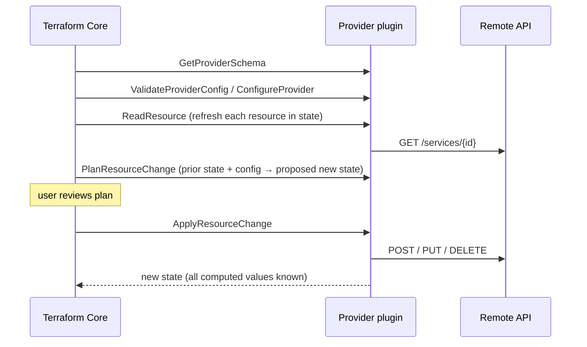

# 🏗️ Terraform — Staff-Level Interview Questions

> *8 questions on Terraform state, the resource graph, modules, environments, providers, CI/CD, HCL and security. Versions referenced: Terraform 1.16 (current in October 2026) and OpenTofu 1.12. Several answers changed recently: S3 has native state locking (DynamoDB locking is deprecated), secrets can stay out of state with ephemeral values and write-only arguments, and `import`/`moved`/`removed` blocks replace most `terraform state` surgery.*

---

## Table of Contents

1. [State Management: Local vs Remote, Locking, Migration](#1-state-management-local-vs-remote-locking-migration)
2. [Resource Graph & Dependency Resolution](#2-resource-graph-dependency-resolution)
3. [Modules: Composition, Versioning, Registry](#3-modules-composition-versioning-registry)
4. [Workspaces & Multi-Environment Strategy](#4-workspaces-multi-environment-strategy)
5. [Providers: Architecture, CRUD, Custom Providers](#5-providers-architecture-crud-custom-providers)
6. [CI/CD Integration: Terraform Cloud, Atlantis](#6-cicd-integration-terraform-cloud-atlantis)
7. [Advanced HCL: Functions, Dynamic Blocks, Expressions](#7-advanced-hcl-functions-dynamic-blocks-expressions)
8. [Security: Secrets Management, IAM, Policy as Code](#8-security-secrets-management-iam-policy-as-code)

!!! info "Licensing and the OpenTofu fork (know this cold)"
    In August 2023 HashiCorp moved Terraform from MPL 2.0 to the **Business Source License 1.1** (from Terraform 1.6). You can use it freely, including commercially, but can't offer a competing hosted product. The community forked the last MPL version as **OpenTofu**, now a Linux Foundation project accepted into the CNCF in April 2025. IBM completed its acquisition of HashiCorp in February 2025, and Terraform Cloud was renamed **HCP Terraform** in 2024. OpenTofu stays CLI- and state-compatible for most configurations but has diverged: it shipped client-side **state encryption** (1.7), `for_each` on provider blocks (1.9), `-exclude` (1.9) and OCI registry support (1.10). Terraform has HCP-only features such as Stacks. Pick one per organisation and pin it.

---

## 1. State Management: Local vs Remote, Locking, Migration

**Q:** "Your team of 10 engineers is managing AWS infrastructure with Terraform. Two engineers ran `terraform apply` simultaneously and caused a resource conflict. Design a remote state strategy with locking. How does Terraform state work? How do you migrate state from local to S3 without downtime?"

**What They're Really Testing:** That you treat state as a critical, sensitive database: remote, locked, versioned, access-controlled, split by blast radius, and only modified through reviewed code.

!!! tip "30-second answer"
    State maps each resource address (`aws_instance.web`) to a real object ID plus the last-known attributes, so Terraform can compute diffs and order deletes. Put it in a remote backend with **locking** (S3 with `use_lockfile = true`, or HCP Terraform), turn on bucket versioning and encryption with a restricted KMS key, and split state by environment and component to limit blast radius. Concurrent applies are prevented by the lock; runs should only happen from CI. Moving local state to S3 is `terraform init -migrate-state`; it touches no infrastructure, so there's no downtime question at all.

### Answer

**What state contains:**

```json
{
  "version": 4,
  "terraform_version": "1.16.5",
  "serial": 42,
  "lineage": "6f1c2a9e-...",
  "outputs": {},
  "resources": [
    {
      "mode": "managed",
      "type": "aws_instance",
      "name": "web",
      "provider": "provider[\"registry.terraform.io/hashicorp/aws\"]",
      "instances": [
        {
          "schema_version": 1,
          "attributes": { "id": "i-0abcd1234efgh5678", "instance_type": "t3.micro" },
          "dependencies": ["aws_security_group.web", "aws_subnet.main"]
        }
      ]
    }
  ]
}
```

| Field | Purpose |
|---|---|
| `serial` | Incremented on every write; a saved plan records it, so applying a plan made against an older state fails as "stale" |
| `lineage` | UUID fixed at state creation; stops you pushing an unrelated state over this one |
| `attributes` | Every attribute the provider returned, **including secrets in plain text**. Terraform itself does not encrypt state (OpenTofu can) |
| `dependencies` | Recorded so Terraform can destroy in the right order even after the config is deleted |

**Remote state with locking (current recommendation):**

```hcl
terraform {
  required_version = ">= 1.11"

  backend "s3" {
    bucket       = "acme-tfstate-prod"
    key          = "network/terraform.tfstate"
    region       = "us-east-1"
    encrypt      = true
    kms_key_id   = "alias/terraform-state"
    use_lockfile = true # S3-native lock (conditional writes); GA since Terraform 1.11
  }
}
```

- **Locking:** with `use_lockfile`, Terraform creates `network/terraform.tfstate.tflock` using an S3 conditional write (`If-None-Match`), which fails if the object already exists. `dynamodb_table` locking still works but is **deprecated since 1.11**; migrate by enabling both for a while, then removing DynamoDB.
- **A crashed run keeps the lock.** Nothing expires it. Check that no run is still active (CI logs), then `terraform force-unlock <LOCK_ID>`. Forcing a lock that's actually in use is how state gets corrupted.
- **Bucket settings:** versioning on (recovery), public access blocked, SSE-KMS with a key policy limited to the CI role and break-glass admins, access logging/CloudTrail data events, and ideally a separate AWS account for state.
- **Split state** by environment × component (`prod/network`, `prod/data`, `prod/app`). Smaller states plan faster, lock less contention, and a mistake touches fewer resources. Share outputs via `terraform_remote_state` or, better, SSM parameters/data sources so consumers don't need read access to the whole state.

| Backend | Locking | Notes |
|---|---|---|
| local | Only on one machine | Never for teams |
| S3 (`use_lockfile`) | Yes | Most common on AWS; DynamoDB no longer needed |
| GCS / azurerm | Yes (native) | Equivalent on GCP/Azure |
| HCP Terraform / Terraform Enterprise | Yes | Plus run queue, RBAC, policy, audit; pricing is per resource under management |
| Spacelift, env0, Scalr | Yes | Commercial TACOS (Terraform automation and collaboration software) that also run OpenTofu |
| pg, consul, kubernetes | Yes | Niche |

**Migrating local → S3:**

```bash
# 1. Add the backend block, then:
terraform init -migrate-state      # copies state to S3 after confirmation
terraform plan                     # must show "No changes" - proves nothing was lost
# 2. Delete local terraform.tfstate* files: they hold secrets
```

**Recovery and refactoring without `terraform state` surgery:**

| Need | Old way | Since Terraform 1.x |
|---|---|---|
| Rename/move a resource or into a module | `terraform state mv` | `moved { from = ..., to = ... }` block (1.1), reviewed in a PR and applied by CI |
| Adopt existing infrastructure | `terraform import` per resource | `import { to = ..., id = ... }` block (1.5), with `-generate-config-out=generated.tf` to draft the HCL; `for_each` on imports (1.7) |
| Stop managing without destroying | `terraform state rm` | `removed { from = ...; lifecycle { destroy = false } }` (1.7) |
| Find unmanaged resources to import | Manual inventory | `terraform query` with list resources (1.14), which can generate import config |
| Restore corrupted state | — | Previous S3 object version, then `terraform plan` to confirm |

```hcl
import {
  to = aws_s3_bucket.logs
  id = "acme-prod-logs"
}

moved {
  from = aws_instance.web
  to   = module.web.aws_instance.this
}

removed {
  from = aws_iam_user.legacy
  lifecycle {
    destroy = false
  }
}
```

**What they probe next:** "Someone ran apply from a laptop with an old provider version and now CI fails. What happened?" (state was written with a newer provider schema; pin versions in `required_providers`, commit `.terraform.lock.hcl`, and block laptop applies with IAM). "Who should be able to read state?" (only the identities that run Terraform for that stack, because state is a secrets store).

### 🔍 Staff-Level Evaluation

| Criterion | What I'm Looking For |
|-----------|----------------------|
| **State mechanics** | Serial, lineage, secrets in plain text, dependencies |
| **Locking** | S3 `use_lockfile` (DynamoDB deprecated), locks never expire, careful `force-unlock` |
| **Blast radius** | Splits state by environment and component; restricts state access |
| **Modern refactoring** | `import`, `moved`, `removed` blocks instead of CLI state edits |

---

## 2. Resource Graph & Dependency Resolution

**Q:** "You have 100 Terraform resources with complex interdependencies. `terraform plan` takes 5 minutes to compute. How does Terraform's dependency graph work? How do implicit and explicit dependencies differ? How do you optimize plan time and avoid dependency cycles?"

**What They're Really Testing:** The DAG walk (refresh, plan, apply), why plans are slow in practice, and how cycles arise.

!!! tip "30-second answer"
    Terraform builds a DAG from references between blocks (implicit dependencies) plus `depends_on` (explicit), then walks it with up to 10 concurrent operations (`-parallelism`). Plan time is dominated by **refreshing** every resource and evaluating data sources through provider API calls, so 5 minutes for 100 resources usually means API throttling, slow data sources, or a state that's simply too big. Fix by splitting state, removing unnecessary data sources, and (with care) `-refresh=false` for fast feedback. Cycles usually come from two resources referencing each other; break them by splitting the mutual part into a separate resource.

### Answer

**Implicit vs explicit dependencies:**

```hcl
resource "aws_instance" "web" {
  ami                    = data.aws_ami.ubuntu.id # implicit: data source
  instance_type          = "t3.micro"
  subnet_id              = aws_subnet.main.id          # implicit
  vpc_security_group_ids = [aws_security_group.web.id] # implicit
}

# Explicit: a hidden dependency Terraform can't see from references.
# The function reads config.json from S3 at startup, so the object must exist first.
resource "aws_s3_object" "config" {
  bucket = aws_s3_bucket.data.id
  key    = "config.json"
  source = "config.json"
}

resource "aws_lambda_function" "processor" {
  function_name = "processor"
  role          = aws_iam_role.lambda.arn
  runtime       = "python3.13"
  handler       = "app.handler"
  filename      = "build/processor.zip"

  depends_on = [aws_s3_object.config]
}
```

Use `depends_on` only for real hidden dependencies (IAM policy attachments needed before a service uses the role, side effects of another resource). It's coarse: `depends_on` on a **module** makes every data source inside it wait until apply, which often turns a clean plan into "known after apply" noise.

**What the graph walk does:**

1. **Refresh** (inside plan): call `ReadResource` for every managed resource in state, and read every data source.
2. **Plan:** for each resource, the provider's `PlanResourceChange` computes create/update/replace/delete; unknown values propagate along edges.
3. **Apply:** execute changes in dependency order; independent branches run in parallel (default 10). With `create_before_destroy`, replacements create the new object before destroying the old one, which reverses some edges.

**Why plans are slow and what to do:**

| Cause | Fix |
|---|---|
| API rate limiting (AWS throttling, GitHub/Datadog APIs) | Lower `-parallelism`, not higher; provider retry settings |
| Huge state (thousands of resources) | Split into smaller states by component; this is the real fix |
| Many or slow data sources | Pass IDs between stacks via outputs or parameters instead of lookups |
| Need fast feedback while iterating | `terraform plan -refresh=false` (trusts state; misses drift, so never for the final apply) |
| Emergency targeted change | `-target=...` (Terraform warns: plans can be incomplete; don't make it routine) |

`terraform plan -refresh-only` is not a speed-up: it shows drift between state and reality and, with `apply -refresh-only`, writes the real values into state.

**Dependency cycles:**

```hcl
# Cycle: each group's inline rule references the other group
resource "aws_security_group" "app" {
  name   = "app"
  vpc_id = aws_vpc.main.id
}

resource "aws_security_group" "db" {
  name   = "db"
  vpc_id = aws_vpc.main.id
}

# Fix: groups have no inline rules; rules are separate resources that reference both,
# so the graph is groups → rules with no loop.
resource "aws_vpc_security_group_ingress_rule" "db_from_app" {
  security_group_id            = aws_security_group.db.id
  referenced_security_group_id = aws_security_group.app.id
  ip_protocol                  = "tcp"
  from_port                    = 5432
  to_port                      = 5432
}

resource "aws_vpc_security_group_egress_rule" "app_to_db" {
  security_group_id            = aws_security_group.app.id
  referenced_security_group_id = aws_security_group.db.id
  ip_protocol                  = "tcp"
  from_port                    = 5432
  to_port                      = 5432
}
```

Other common cycle sources: `create_before_destroy` on one resource but not its dependents, modules whose outputs feed back into their own inputs via another module, and provider configurations that depend on resources in the same state (e.g. configuring the Kubernetes provider from an EKS cluster created in the same apply). The last one is better solved by splitting into two stacks (or Terraform Stacks/Terragrunt dependencies).

**Inspecting the graph:** `terraform graph -type=plan | dot -Tsvg > graph.svg` (Graphviz). On large configs it's unreadable; `terraform plan -json` plus tooling, or reading the cycle error message, is usually more useful.

**What they probe next:** "Why does a change to a tag show the whole instance as 'known after apply'?" (an upstream value became unknown, e.g. a replaced resource or a `depends_on` on a module). "When does parallelism > 10 help?" (large numbers of independent, slow-to-create resources, if the API's rate limits allow it).

### 🔍 Staff-Level Evaluation

| Criterion | What I'm Looking For |
|-----------|----------------------|
| **Implicit vs explicit** | References build the graph; `depends_on` only for hidden dependencies, with its module-level cost |
| **Plan cost** | Refresh and data sources dominate; splitting state is the real fix |
| **Flags** | `-refresh=false` vs `-refresh-only` vs `-target`, and their risks |
| **Cycles** | Separate rule resources, `create_before_destroy` interactions, provider-from-resource cycles |

---

## 3. Modules: Composition, Versioning, Registry

**Q:** "Your team manages 50 infrastructure components using Terraform modules. Design a module strategy for reusability across 3 environments (dev, staging, prod). How do you version modules? How do you publish to a private registry? When should you NOT use a module?"

**What They're Really Testing:** Module API design, versioning and testing discipline, and judgement about abstraction.

!!! tip "30-second answer"
    Treat a module like a library: a small, typed, validated input interface, documented outputs, provider version constraints (but no provider configuration inside), semantic versions published as Git tags or to a private registry, and automated tests (`terraform test`). Environments consume pinned versions, and promote a new version dev → staging → prod. Don't wrap a single resource just to rename its arguments, and avoid deep module nesting that makes plans unreadable.

### Answer

**Module layout:**

```
modules/network/
├── main.tf          # VPC, subnets, route tables, NAT
├── variables.tf     # typed inputs with validation
├── outputs.tf       # documented outputs
├── versions.tf      # required_version + required_providers (constraints only)
├── README.md        # generated with terraform-docs
└── tests/
    └── network.tftest.hcl
```

```hcl
# variables.tf
variable "environment" {
  type        = string
  description = "Environment name."
  validation {
    condition     = contains(["dev", "staging", "prod"], var.environment)
    error_message = "environment must be dev, staging or prod."
  }
}

variable "vpc_cidr" {
  type        = string
  description = "CIDR block for the VPC."
  validation {
    condition     = can(cidrhost(var.vpc_cidr, 0))
    error_message = "vpc_cidr must be a valid CIDR block."
  }
}

variable "nat" {
  type = object({
    enabled    = optional(bool, true)
    single_nat = optional(bool, false) # one NAT for all AZs: cheaper, less resilient
  })
  default = {}
}

# versions.tf
terraform {
  required_version = ">= 1.11"
  required_providers {
    aws = {
      source  = "hashicorp/aws"
      version = ">= 6.0, < 7.0"
    }
  }
}
```

Rules that keep modules composable:

- **No `provider` blocks inside reusable modules.** The caller configures providers and passes aliases via `providers = { aws = aws.us_east_1 }`. A module with its own provider block can't be used with `for_each` or `count`, and removing it orphans resources.
- **Typed object inputs with `optional()` defaults** instead of 40 loose string variables.
- **Outputs are the contract.** Removing or renaming an output, or changing a resource address without a `moved` block, is a breaking change → major version.

**Versioning and distribution:**

```hcl
module "network_git" {
  source      = "git::https://github.com/acme/terraform-aws-network.git?ref=v1.4.2"
  environment = "prod"
  vpc_cidr    = "10.0.0.0/16"
}

module "network_registry" {
  source      = "app.terraform.io/acme/network/aws" # private registry
  version     = "~> 1.4"                            # >= 1.4.0, < 2.0.0
  environment = "prod"
  vpc_cidr    = "10.0.0.0/16"
}
```

| Constraint | Allows |
|---|---|
| `= 1.4.2` | Exactly that version (prod, if you want explicit upgrades) |
| `~> 1.4.2` | ≥ 1.4.2, < 1.5.0 (patches only) |
| `~> 1.4` | ≥ 1.4.0, < 2.0.0 (minor and patch) |
| `>= 1.4, < 2.0` | Same as above, explicit |

- Git sources ignore `version`; the `ref` is the version. Pin to tags or commit SHAs, never branches.
- Private registries (HCP Terraform, Terraform Enterprise, Artifactory, GitLab, Spacelift; OCI registries in OpenTofu 1.10+) need repos named `terraform-<PROVIDER>-<NAME>` and semver tags.
- Since Terraform 1.15, `source` and `version` can reference variables and locals, which helps centralise version pins.
- Automate upgrades with Renovate or Dependabot, which open PRs for new module and provider versions.

**Testing modules (`terraform test`, 1.6+):**

```hcl
# tests/network.tftest.hcl
variables {
  environment = "dev"
  vpc_cidr    = "10.10.0.0/16"
}

run "rejects_bad_environment" {
  command = plan
  variables {
    environment = "qa"
  }
  expect_failures = [var.environment]
}

run "creates_vpc_with_requested_cidr" {
  command = plan
  assert {
    condition     = aws_vpc.this.cidr_block == "10.10.0.0/16"
    error_message = "VPC CIDR does not match input."
  }
}
```

`command = plan` tests are fast and need no real infrastructure when combined with `mock_provider` (1.7+); `command = apply` runs create real resources in a sandbox account and destroy them afterwards, which catches provider/API behaviour that mocks can't.

**When NOT to use a module:**

- **Passthrough wrappers:** a module that exposes every argument of one `aws_s3_bucket` adds indirection and a release cycle without encoding any decision. Either encode the decision (encryption, public-access block, lifecycle, logging always on) or use the resource directly.
- **Deep nesting** (module → module → module): plan output and debugging become painful, and `moved` refactors get hard. Two levels is usually enough.
- **Before you have three real uses.** Premature modules freeze the wrong interface.

Good candidates encode **organisation policy and related resources that always travel together**: a VPC with its subnets, routes and NAT; a service with its IAM role, log group, alarms and DNS record.

**What they probe next:** "How do you roll a breaking module change across 60 consumers?" (major version, `moved` blocks inside the module, upgrade guide, Renovate PRs, deprecate old versions with a date). "How do you test modules against real AWS cheaply?" (`command = apply` tests in an ephemeral account, nightly rather than per commit).

### 🔍 Staff-Level Evaluation

| Criterion | What I'm Looking For |
|-----------|----------------------|
| **Interface design** | Typed objects, `optional()` defaults, validation, no provider blocks inside |
| **Versioning** | Semver, pinned refs, constraint semantics, automated upgrades |
| **Testing** | `terraform test`, `mock_provider`, plan vs apply tests |
| **Judgement** | Avoids passthrough and deep nesting; modules encode decisions |

---

## 4. Workspaces & Multi-Environment Strategy

**Q:** "Design a Terraform directory structure for 3 environments (dev, staging, prod) with shared modules. Compare workspaces vs directory layouts. How do you manage environment-specific variables? How do you prevent a staging change from affecting production?"

**What They're Really Testing:** Isolation of credentials and state between environments, and a promotion flow that makes prod changes boring.

!!! tip "30-second answer"
    Use **one root configuration per environment and component** (directories, or HCP Terraform workspaces/Stacks deployments), each with its own state, its own backend location and, crucially, **its own cloud account and credentials**. CLI workspaces share one backend and one set of credentials, so they're fine for short-lived copies (feature branches, test stacks) but not for separating prod from dev. Promote the same module version through environments, and let only CI apply, using OIDC-issued, environment-scoped roles.

### Answer

**CLI workspaces vs separate roots:**

| | CLI workspaces | Directory per environment |
|---|---|---|
| State | Same backend, path `env:/<workspace>/<key>` | Separate keys or buckets, can be separate accounts |
| Credentials | Same backend credentials for all | Per environment |
| Visibility | Current workspace is invisible in the code | The path says `prod/` |
| Divergence between envs | Only via variables and `terraform.workspace` conditionals | Explicit, reviewable |
| Good for | Ephemeral copies of one stack | Long-lived environments |

HashiCorp's own docs say CLI workspaces are not suitable for strong separation between environments, because they share the backend and its credentials.

**Layout:**

```
modules/
  network/  database/  service/
live/
  dev/
    network/   main.tf  backend.tf  terraform.tfvars
    database/  ...
  staging/
    network/   ...
  prod/
    network/   main.tf  backend.tf  terraform.tfvars
    database/  ...
```

```hcl
# live/prod/network/main.tf
provider "aws" {
  region = "us-east-1"
  assume_role {
    role_arn = "arn:aws:iam::111122223333:role/terraform-prod-network"
  }
  default_tags {
    tags = {
      Environment = "prod"
      ManagedBy   = "terraform"
      Stack       = "network"
    }
  }
}

module "network" {
  source      = "app.terraform.io/acme/network/aws"
  version     = "1.4.2" # promoted here only after dev and staging ran it
  environment = "prod"
  vpc_cidr    = var.vpc_cidr
}
```

```hcl
# live/prod/network/terraform.tfvars
vpc_cidr = "10.0.0.0/16"
```

- **Duplication** of the small root files is the price of explicitness. Tools reduce it: **Terragrunt** (DRY backend/provider config, dependencies between stacks, `run --all`), or **Terraform Stacks** in HCP Terraform (GA since September 2025), which define components once and deploy them to many "deployments" (environments, regions) with orchestrated dependencies.
- **Environment-specific values** go in `terraform.tfvars` per root (non-secret), or HCP Terraform variable sets. Secrets never go in tfvars (Q8).
- `default_tags` on the provider tags everything consistently without per-resource code.

**Preventing staging changes from reaching prod:**

1. **Separate AWS accounts** per environment (AWS Organizations). A staging role physically can't touch prod.
2. **Only CI applies**, with short-lived credentials via OIDC (GitHub Actions → AWS role, or HCP Terraform dynamic provider credentials), and the role's trust policy restricted to the right repo, branch and GitHub environment. Humans get read-only in prod.
3. **Promotion by version:** a module change is a new version; prod's root bumps the pin in its own PR after staging has been running it.
4. **Plan visible in the PR** for each affected root, and **apply the reviewed plan file**, not a fresh plan (Q6).
5. **Drift detection** (scheduled `plan -detailed-exitcode`, or HCP Terraform health assessments) so console changes don't surprise the next deploy.

**What they probe next:** "Your prod and staging configs have drifted apart in 40 small ways. How do you converge?" (move differences into explicit variables, upgrade both to the same module version, diff the plans). "How do you handle a resource shared across environments, such as a Route 53 zone?" (a separate `shared/` stack owned by the platform team, exposing IDs to others).

### 🔍 Staff-Level Evaluation

| Criterion | What I'm Looking For |
|-----------|----------------------|
| **Workspace vs directory** | Knows CLI workspaces share credentials and backend, and where they're still useful |
| **Isolation** | Separate accounts, state and OIDC-scoped CI roles per environment |
| **Promotion** | Same module version moves dev → staging → prod |
| **Tooling awareness** | Terragrunt, Terraform Stacks, drift detection |

---

## 5. Providers: Architecture, CRUD, Custom Providers

**Q:** "You need to manage a third-party SaaS API (e.g., Datadog, PagerDuty) with Terraform. How does a Terraform provider work? Walk through the CRUD lifecycle. How would you build a custom provider for an internal API?"

**What They're Really Testing:** The plugin protocol, the plan/apply split for providers, and good provider design (correct `Read`, import support, computed attributes).

!!! tip "30-second answer"
    A provider is a separate Go binary that Terraform launches and talks to over **gRPC** (plugin protocol v5/v6). Core asks it for schemas, validates config, and during plan calls `ReadResource` (refresh) and `PlanResourceChange`; during apply it calls `ApplyResourceChange`, which the SDK maps to your `Create`/`Update`/`Delete`. Build new providers with the **Terraform Plugin Framework**. The most important method is `Read`: it must reflect reality and remove the resource from state on 404, or drift detection is broken.

### Answer

**Protocol flow:**



- Providers are downloaded by `terraform init` from a registry, checksum-verified against `.terraform.lock.hcl`, and run as child processes.
- **Plan vs apply contract:** values unknown at plan time are "(known after apply)"; after apply, the provider must return a state consistent with the plan, or Core reports "Provider produced inconsistent result" (a provider bug).
- Other RPCs worth knowing: `ImportResourceState`, `UpgradeResourceState` (schema version migrations), `MoveResourceState` (moving between resource types), ephemeral resources (`OpenEphemeralResource`, 1.10+), and list resources for `terraform query` (1.14+).

**A resource with the Plugin Framework:**

```go
package provider

import (
	"context"
	"errors"

	"github.com/hashicorp/terraform-plugin-framework/path"
	"github.com/hashicorp/terraform-plugin-framework/resource"
	"github.com/hashicorp/terraform-plugin-framework/resource/schema"
	"github.com/hashicorp/terraform-plugin-framework/resource/schema/planmodifier"
	"github.com/hashicorp/terraform-plugin-framework/resource/schema/stringplanmodifier"
	"github.com/hashicorp/terraform-plugin-framework/types"

	"example.com/internal/api" // your API client
)

var (
	_ resource.Resource                = (*serviceResource)(nil)
	_ resource.ResourceWithImportState = (*serviceResource)(nil)
)

type serviceResource struct{ client *api.Client }

type serviceModel struct {
	ID        types.String `tfsdk:"id"`
	Name      types.String `tfsdk:"name"`
	Team      types.String `tfsdk:"team"`
	CreatedAt types.String `tfsdk:"created_at"`
}

func (r *serviceResource) Metadata(_ context.Context, req resource.MetadataRequest, resp *resource.MetadataResponse) {
	resp.TypeName = req.ProviderTypeName + "_service"
}

func (r *serviceResource) Schema(_ context.Context, _ resource.SchemaRequest, resp *resource.SchemaResponse) {
	resp.Schema = schema.Schema{
		Attributes: map[string]schema.Attribute{
			"id": schema.StringAttribute{
				Computed:      true,
				PlanModifiers: []planmodifier.String{stringplanmodifier.UseStateForUnknown()},
			},
			"name": schema.StringAttribute{
				Required:      true,
				PlanModifiers: []planmodifier.String{stringplanmodifier.RequiresReplace()}, // API can't rename
			},
			"team": schema.StringAttribute{Required: true},
			"created_at": schema.StringAttribute{
				Computed:      true,
				PlanModifiers: []planmodifier.String{stringplanmodifier.UseStateForUnknown()},
			},
		},
	}
}

func (r *serviceResource) Create(ctx context.Context, req resource.CreateRequest, resp *resource.CreateResponse) {
	var plan serviceModel
	resp.Diagnostics.Append(req.Plan.Get(ctx, &plan)...)
	if resp.Diagnostics.HasError() {
		return
	}
	out, err := r.client.CreateService(ctx, api.Service{Name: plan.Name.ValueString(), Team: plan.Team.ValueString()})
	if err != nil {
		resp.Diagnostics.AddError("Creating service failed", err.Error())
		return
	}
	plan.ID = types.StringValue(out.ID)
	plan.CreatedAt = types.StringValue(out.CreatedAt)
	resp.Diagnostics.Append(resp.State.Set(ctx, &plan)...)
}

func (r *serviceResource) Read(ctx context.Context, req resource.ReadRequest, resp *resource.ReadResponse) {
	var state serviceModel
	resp.Diagnostics.Append(req.State.Get(ctx, &state)...)
	if resp.Diagnostics.HasError() {
		return
	}
	out, err := r.client.GetService(ctx, state.ID.ValueString())
	if errors.Is(err, api.ErrNotFound) {
		resp.State.RemoveResource(ctx) // deleted outside Terraform: plan will recreate it
		return
	}
	if err != nil {
		resp.Diagnostics.AddError("Reading service failed", err.Error())
		return
	}
	state.Name = types.StringValue(out.Name) // write what the API says, so drift shows up in plan
	state.Team = types.StringValue(out.Team)
	state.CreatedAt = types.StringValue(out.CreatedAt)
	resp.Diagnostics.Append(resp.State.Set(ctx, &state)...)
}

func (r *serviceResource) Update(ctx context.Context, req resource.UpdateRequest, resp *resource.UpdateResponse) {
	var plan, state serviceModel
	resp.Diagnostics.Append(req.Plan.Get(ctx, &plan)...)
	resp.Diagnostics.Append(req.State.Get(ctx, &state)...)
	if resp.Diagnostics.HasError() {
		return
	}
	// Core only calls Update when the plan differs from state.
	if err := r.client.UpdateServiceTeam(ctx, state.ID.ValueString(), plan.Team.ValueString()); err != nil {
		resp.Diagnostics.AddError("Updating service failed", err.Error())
		return
	}
	resp.Diagnostics.Append(resp.State.Set(ctx, &plan)...)
}

func (r *serviceResource) Delete(ctx context.Context, req resource.DeleteRequest, resp *resource.DeleteResponse) {
	var state serviceModel
	resp.Diagnostics.Append(req.State.Get(ctx, &state)...)
	if resp.Diagnostics.HasError() {
		return
	}
	err := r.client.DeleteService(ctx, state.ID.ValueString())
	if err != nil && !errors.Is(err, api.ErrNotFound) { // already gone is success
		resp.Diagnostics.AddError("Deleting service failed", err.Error())
	}
	// On success the framework removes the resource from state.
}

func (r *serviceResource) ImportState(ctx context.Context, req resource.ImportStateRequest, resp *resource.ImportStateResponse) {
	resource.ImportStatePassthroughID(ctx, path.Root("id"), req, resp)
}
```

Design points that interviewers look for:

- **Config vs computed:** `name`/`team` come from the user; `id`/`created_at` come from the API. `UseStateForUnknown` keeps stable computed values from showing as "(known after apply)" on every update.
- **`RequiresReplace`** for fields the API can't change in place, so the plan says "must be replaced" up front instead of failing at apply.
- **Idempotent delete** and **404 handling in Read** make the provider robust to out-of-band changes.
- **Eventual consistency:** many APIs return before an object is readable; retry reads after create, or Terraform reports inconsistent results.

**Build vs alternatives:**

| Option | When |
|---|---|
| Existing provider (official, partner or community, e.g. Datadog, PagerDuty) | Almost always for SaaS |
| `terraform_data` + `local-exec` provisioner calling a script | One-off side effects (successor to `null_resource` since 1.4); no drift detection, no real Read, last resort |
| Generic REST provider (e.g. community `restapi`) | Simple JSON CRUD APIs, prototypes |
| Custom provider with Plugin Framework | An internal platform API many teams will manage declaratively; you need plan diffs, import and drift detection |

Workflow for a custom provider: scaffold from `terraform-provider-scaffolding-framework`, generate schemas from OpenAPI with the provider code generator if available, test with `terraform-plugin-testing` acceptance tests against a real or fake API, use `dev_overrides` in `~/.terraformrc` for local development, and publish signed releases (GoReleaser + GPG) to a private or public registry.

**What they probe next:** "A user changes a setting in the SaaS UI. What does Terraform do?" (Read picks it up, plan proposes to revert it). "How do you evolve a resource's schema without breaking existing state?" (schema `Version` + `UpgradeState`).

### 🔍 Staff-Level Evaluation

| Criterion | What I'm Looking For |
|-----------|----------------------|
| **Protocol** | Separate process over gRPC; plan-time vs apply-time RPCs |
| **CRUD semantics** | Read reflects reality, 404 removes from state, idempotent delete |
| **Schema design** | Computed vs configured, `UseStateForUnknown`, `RequiresReplace`, import |
| **Judgement** | When a custom provider is worth it vs existing or generic options |

---

## 6. CI/CD Integration: Terraform Cloud, Atlantis

**Q:** "Design a CI/CD pipeline for Terraform infrastructure changes. How does Atlantis automate terraform plan/apply on pull requests? Compare Terraform Cloud vs Atlantis vs GitHub Actions. How do you handle concurrent PRs that modify the same resources?"

**What They're Really Testing:** Plan/apply integrity (apply exactly what was reviewed), credential handling (OIDC, no static keys), and concurrency control across PRs.

!!! tip "30-second answer"
    On every PR: `fmt`, `validate`, lint/policy checks, and a `plan` per affected root posted to the PR. After approval, **apply the saved plan file** that was reviewed, from CI only, with short-lived OIDC credentials scoped to that environment. Concurrency is handled at two levels: the state lock stops simultaneous applies, and a **per-project PR lock** (Atlantis) or a run queue (HCP Terraform) stops two PRs from planning against the same state. A saved plan becomes **stale** if state changes after it was made, and Terraform refuses to apply it, so the second PR re-plans.

### Answer

**Atlantis (self-hosted, PR-native):**

```
PR opened ─▶ webhook ─▶ Atlantis: plan each affected project ─▶ plan posted as PR comment
                                   (project is now LOCKED to this PR)
reviewer approves ─▶ comment "atlantis apply" ─▶ apply saved plan ─▶ merge PR ─▶ lock released
```

Atlantis applies **before** merge, so `main` always reflects what's deployed only if you require "mergeable" and keep branches up to date.

```yaml
# atlantis.yaml (repo level)
version: 3
automerge: true                  # merge the PR after all applies succeed
parallel_plan: true
projects:
  - name: dev-network
    dir: live/dev/network
    autoplan:
      when_modified: ["*.tf", "*.tfvars", "../../../modules/network/**/*.tf"]
  - name: prod-network
    dir: live/prod/network
    workflow: prod
    autoplan:
      when_modified: ["*.tf", "*.tfvars", "../../../modules/network/**/*.tf"]
    apply_requirements: [approved, mergeable, undiverged]

workflows:
  prod:
    plan:
      steps:
        - init
        - plan:
            extra_args: ["-lock-timeout=5m"]
    apply:
      steps:
        - apply
```

```yaml
# repos.yaml (server side: what repos may override)
repos:
  - id: github.com/acme/infra
    apply_requirements: [approved, mergeable]
    allowed_overrides: [apply_requirements, workflow]
    allow_custom_workflows: false
```

**GitHub Actions (plan on PR, apply the reviewed plan after merge):**

```yaml
name: terraform-prod-network
on:
  pull_request:
    paths: ["live/prod/network/**", "modules/network/**"]
  push:
    branches: [main]
    paths: ["live/prod/network/**", "modules/network/**"]

permissions:
  contents: read
  id-token: write        # OIDC token for AWS
  pull-requests: write   # plan comment

concurrency:
  group: tf-prod-network # one run at a time for this root
  cancel-in-progress: false

env:
  TF_IN_AUTOMATION: "true"
  WORKDIR: live/prod/network

jobs:
  plan:
    runs-on: ubuntu-latest
    environment: prod-plan                       # role trust policy: plan-only role
    steps:
      - uses: actions/checkout@v7
      - uses: hashicorp/setup-terraform@v4
        with:
          terraform_version: 1.16.5
          terraform_wrapper: false
      - uses: aws-actions/configure-aws-credentials@v6
        with:
          role-to-assume: arn:aws:iam::111122223333:role/gha-terraform-plan
          aws-region: us-east-1
      - run: terraform init -input=false
        working-directory: ${{ env.WORKDIR }}
      - run: terraform plan -input=false -lock-timeout=5m -out=tfplan
        working-directory: ${{ env.WORKDIR }}
      - run: terraform show -no-color tfplan > plan.txt
        working-directory: ${{ env.WORKDIR }}
      - uses: actions/upload-artifact@v7
        with:
          name: tfplan-${{ github.sha }}
          path: ${{ env.WORKDIR }}/tfplan
      # (post plan.txt to the PR with a comment action; truncate to the 65k comment limit)

  apply:
    if: github.event_name == 'push' && github.ref == 'refs/heads/main'
    needs: plan
    runs-on: ubuntu-latest
    environment: prod                            # required reviewers gate here
    steps:
      - uses: actions/checkout@v7
      - uses: hashicorp/setup-terraform@v4
        with:
          terraform_version: 1.16.5
          terraform_wrapper: false
      - uses: aws-actions/configure-aws-credentials@v6
        with:
          role-to-assume: arn:aws:iam::111122223333:role/gha-terraform-apply
          aws-region: us-east-1
      - uses: actions/download-artifact@v8
        with:
          name: tfplan-${{ github.sha }}
          path: ${{ env.WORKDIR }}
      - run: terraform init -input=false
        working-directory: ${{ env.WORKDIR }}
      - run: terraform apply -input=false tfplan  # exactly the plan the approver saw
        working-directory: ${{ env.WORKDIR }}
```

- **Approve the plan, not just the diff.** In this design the reviewer approves at the `prod` environment gate after seeing the plan generated from `main`. Applying a fresh plan with `-auto-approve` applies something nobody reviewed.
- **OIDC, no static keys:** the AWS role trust policy should require `token.actions.githubusercontent.com:sub` = `repo:acme/infra:environment:prod` so only that repo and environment can assume the apply role.
- **Plan files contain secrets** (they include state values); keep artifact retention short and access restricted.

**Comparison:**

| | HCP Terraform / TFE | Atlantis | GitHub Actions (DIY) | Spacelift / env0 / Scalr |
|---|---|---|---|---|
| Hosting | SaaS or self-hosted (TFE) | Self-hosted | Your CI | SaaS |
| Plan/apply UX | Runs UI + VCS checks | PR comments | Whatever you build | Runs UI + PR checks |
| Concurrency | Run queue per workspace | Per-project PR lock | `concurrency` groups + state lock | Run queue, stack locks |
| Policy | Sentinel and OPA | Conftest via custom steps | Any tool you add | OPA |
| Credentials | Dynamic provider credentials (OIDC) | Server's credentials (big blast radius) | OIDC per job | OIDC |
| OpenTofu | No | Yes | Yes | Yes |
| Cost model | Resources under management | Free (ops cost) | Runner minutes | Per seat/run |

**Concurrent PRs on the same root:**

1. PR A and PR B both plan against state serial 42.
2. Atlantis: PR B can't plan at all while PR A holds the project lock ("locked by PR A"). Without Atlantis, both plans exist.
3. PR A applies → state serial 43.
4. PR B tries to apply its saved plan → Terraform refuses: **"Saved plan is stale"**, because the plan recorded serial 42. B must rebase and re-plan, and the reviewer sees the new plan.
5. If B's pipeline doesn't use saved plans (`apply -auto-approve` without a plan file), Terraform silently re-plans and applies whatever is now needed. That's the failure mode to design out.

The state lock (`-lock-timeout=5m`) only serialises **simultaneous** operations; it doesn't detect that a plan was made against old state. Saved plans and PR-level locks do.

**What they probe next:** "Atlantis runs with admin credentials for every account. How do you limit blast radius?" (one Atlantis per environment or account, per-project roles assumed from the server, or move to OIDC-based CI). "How do you detect drift between deploys?" (scheduled plans with `-detailed-exitcode`: exit 2 means changes).

### 🔍 Staff-Level Evaluation

| Criterion | What I'm Looking For |
|-----------|----------------------|
| **Plan integrity** | Applies the reviewed saved plan; knows about stale-plan rejection |
| **Credentials** | OIDC roles per environment; no static keys; plan vs apply roles |
| **Concurrency** | State lock vs PR/project locks vs CI concurrency groups |
| **Tool comparison** | HCP Terraform vs Atlantis vs DIY vs other TACOS, including OpenTofu support |

---

## 7. Advanced HCL: Functions, Dynamic Blocks, Expressions

**Q:** "You need to create 50 security group rules from a list of ports and protocols. Using HCL functions and dynamic blocks, write a Terraform configuration that creates these rules without repeating code. How do for_each, count, and dynamic blocks differ?"

**What They're Really Testing:** Stable resource addressing, data reshaping with `for` expressions, and knowing when the "clever" HCL is the wrong answer.

!!! tip "30-second answer"
    `count` creates N copies addressed by **index**, so removing an item from the middle shifts and recreates everything after it; use it only for "0 or 1" toggles or truly identical copies. `for_each` addresses instances by **stable keys** from a map or set, so adds and removals touch only that key. `dynamic` blocks generate repeated **nested blocks** inside one resource. For 50 security group rules, prefer a separate `aws_vpc_security_group_ingress_rule` resource per rule with `for_each` (AWS's recommended pattern) over 50 inline `ingress` blocks.

### Answer

**Rules as individual resources (recommended):**

```hcl
variable "ingress_rules" {
  type = map(object({
    port        = number
    protocol    = optional(string, "tcp")
    cidr        = string
    description = optional(string, "Managed by Terraform")
  }))
  default = {
    https    = { port = 443, cidr = "10.0.0.0/8" }
    ssh      = { port = 22, cidr = "10.10.0.0/16", description = "Bastion SSH" }
    postgres = { port = 5432, cidr = "10.20.0.0/16" }
  }
}

resource "aws_security_group" "app" {
  name   = "app"
  vpc_id = aws_vpc.main.id
}

resource "aws_vpc_security_group_ingress_rule" "app" {
  for_each = var.ingress_rules

  security_group_id = aws_security_group.app.id
  ip_protocol       = each.value.protocol
  from_port         = each.value.port
  to_port           = each.value.port
  cidr_ipv4         = each.value.cidr
  description       = each.value.description
}
```

Each rule is `aws_vpc_security_group_ingress_rule.app["ssh"]`: removing `ssh` deletes one rule; nothing else moves. Inline rules, by contrast, are one big attribute set on the group: a change rewrites the set, and mixing inline and standalone rule resources on the same group makes them fight.

**Dynamic blocks (when the API only offers nested blocks):**

```hcl
resource "aws_security_group" "legacy" {
  name   = "legacy"
  vpc_id = aws_vpc.main.id

  dynamic "ingress" {
    for_each = var.ingress_rules
    content {
      from_port   = ingress.value.port
      to_port     = ingress.value.port
      protocol    = ingress.value.protocol
      cidr_blocks = [ingress.value.cidr]
      description = ingress.value.description
    }
  }
}
```

The iterator is named after the block (`ingress.key`, `ingress.value`), or set `iterator = rule`. Overusing dynamic blocks hides the shape of a resource; use them for genuinely variable nested blocks (listener rules, IAM statements, settings lists).

**count vs for_each:**

```hcl
# Index-addressed: aws_iam_user.by_index[0], [1], [2]
resource "aws_iam_user" "by_index" {
  count = length(var.user_names)
  name  = var.user_names[count.index]
}
# Removing the first name shifts every index: [1] becomes [0], and Terraform
# plans changes to every user after the removed one.

# Key-addressed: aws_iam_user.by_name["alice"]
resource "aws_iam_user" "by_name" {
  for_each = toset(var.user_names)
  name     = each.key
}

# count is still right for an on/off toggle
resource "aws_cloudwatch_log_group" "debug" {
  count = var.enable_debug_logs ? 1 : 0
  name  = "/app/debug"
}
```

- `for_each` keys must be **known at plan time**: you can't key on an attribute that's only known after apply (e.g. a generated ID). Key on input values or names.
- Migrate from `count` to `for_each` without recreation using `moved` blocks (`from = aws_iam_user.by_index[0]`, `to = aws_iam_user.by_name["alice"]`).
- Sets of objects can't be `for_each` keys; build a map with a `for` expression.

**Reshaping data:**

```hcl
locals {
  # Flatten nested input into one map with stable composite keys
  sg_rules = merge([
    for sg_name, sg in var.security_groups : {
      for rule in sg.rules :
      "${sg_name}-${rule.port}" => merge(rule, { sg_name = sg_name })
    }
  ]...)

  # Subnet CIDRs: /16 + 8 bits = /24 per AZ
  subnet_cidrs = [for i in range(3) : cidrsubnet("10.0.0.0/16", 8, i)]
  # ["10.0.0.0/24", "10.0.1.0/24", "10.0.2.0/24"]

  instance_names = formatlist("%s-instance-%02d", "${var.environment}-web", range(3))
  # ["prod-web-instance-00", "prod-web-instance-01", "prod-web-instance-02"]

  tags = merge(var.default_tags, { Service = "web" }, var.extra_tags) # later maps win

  endpoint = try(var.config.endpoint, "https://default.internal") # safe lookup
}
```

The `merge([...]...)` idiom (expanding a list of maps into arguments) is how you build a single map for `for_each` from nested structures; the older `flatten()` returns a list, which you then still have to convert into a map with unique keys.

**Guardrails in HCL:**

```hcl
resource "aws_db_instance" "main" {
  identifier          = "orders"
  engine              = "postgres"
  instance_class      = var.db_instance_class
  allocated_storage   = 100
  username            = "app"
  storage_encrypted   = true
  skip_final_snapshot = false

  manage_master_user_password = true # AWS stores and rotates it in Secrets Manager

  lifecycle {
    prevent_destroy = true
    precondition {
      condition     = var.environment != "prod" || startswith(var.db_instance_class, "db.r")
      error_message = "Production databases must use a memory-optimised (db.r*) class."
    }
  }
}

check "orders_api_healthy" {
  data "http" "health" {
    url = "https://orders.internal.example.com/health"
  }
  assert {
    condition     = data.http.health.status_code == 200
    error_message = "Orders API health check failed after apply."
  }
}
```

`precondition`/`postcondition` fail the plan or apply; `check` blocks (1.5+) only warn, which suits post-deploy health checks and drift signals. Use `terraform console` to try expressions interactively.

**What they probe next:** "Why does `for_each = toset(aws_instance.web[*].id)` fail on first apply?" (keys unknown until apply). "When would you move logic out of HCL?" (complex transformations belong in a typed input file or a small program generating JSON; HCL has no tests for local functions, though Terraform 1.15 added `convert()` and provider-defined functions help).

### 🔍 Staff-Level Evaluation

| Criterion | What I'm Looking For |
|-----------|----------------------|
| **Addressing** | `count` index shifting vs `for_each` stable keys; keys known at plan time |
| **Resource design** | Separate rule resources over inline blocks; dynamic blocks only where needed |
| **Data reshaping** | `for` expressions, `merge(...)` expansion, `cidrsubnet`, `try`, `optional()` |
| **Guardrails** | `moved` for migrations, `prevent_destroy`, pre/postconditions, `check` blocks |

---

## 8. Security: Secrets Management, IAM, Policy as Code

**Q:** "Design a secure Terraform workflow for managing secrets across environments. How do you avoid storing secrets in state files? Compare Vault, AWS Secrets Manager, and SOPS for secrets management. How do you enforce policies like 'no public S3 buckets' using Sentinel or OPA?"

**What They're Really Testing:** Whether you know what actually ends up in state (and what newer Terraform features keep out of it), how to scope Terraform's own credentials, and where policy checks belong.

!!! tip "30-second answer"
    Anything Terraform reads through a data source or sets on a normal resource argument is written to state in plain text, and `sensitive = true` only hides it from CLI output. Keep secrets out of state by (1) letting the service generate and own them (`manage_master_user_password` on RDS), (2) using **ephemeral resources** (1.10+) to fetch secrets and **write-only arguments** (1.11+, e.g. `password_wo`) to pass them on without persisting them, and (3) treating state as a secret anyway (KMS, tight IAM; OpenTofu can encrypt state client-side). Terraform runs with OIDC-issued, least-privilege roles, and policy-as-code (OPA/Conftest, Sentinel, Checkov/Trivy) runs on the plan JSON in CI before apply.

### Answer

**What leaks into state, and the fixes:**

| Pattern | Secret in state? | Notes |
|---|---|---|
| `password = var.db_password` | **Yes** | Also lives wherever the variable came from |
| `data "aws_secretsmanager_secret_version"` | **Yes** | Data source results are stored in state |
| `sensitive = true` on a variable or output | **Yes** | Only redacts CLI/plan output |
| `random_password` resource | **Yes** | Generated value is a resource attribute |
| `manage_master_user_password = true` (RDS) | No | AWS generates, stores and rotates the password in Secrets Manager |
| `ephemeral` resource + write-only argument | No | Value exists only during the run |

**Ephemeral values and write-only arguments:**

```hcl
ephemeral "random_password" "db" {
  length  = 32
  special = true
}

resource "aws_secretsmanager_secret" "db" {
  name = "prod/orders/db-password"
}

resource "aws_secretsmanager_secret_version" "db" {
  secret_id                = aws_secretsmanager_secret.db.id
  secret_string_wo         = ephemeral.random_password.db.result
  secret_string_wo_version = 1 # bump to rotate: write-only values can't be diffed
}

resource "aws_db_instance" "orders" {
  identifier          = "orders"
  engine              = "postgres"
  instance_class      = "db.r7g.large"
  allocated_storage   = 100
  username            = "app"
  password_wo         = ephemeral.random_password.db.result
  password_wo_version = 1
  storage_encrypted   = true
  skip_final_snapshot = false
}
```

- **Ephemeral resources** (Terraform 1.10, OpenTofu 1.11) are opened during the run and never stored in state or plan files. Providers offer them for things like Secrets Manager secret versions, Vault secrets and generated passwords.
- **Write-only arguments** (`*_wo`, Terraform 1.11) accept ephemeral values and are sent to the API but not stored. Terraform can't see their value to detect changes, so a companion `*_wo_version` argument triggers updates.
- Only use them where the provider supports them; check the resource docs.

**Secret stores compared:**

| | AWS Secrets Manager / SSM Parameter Store | HashiCorp Vault / OpenBao | SOPS (age/KMS-encrypted files in Git) |
|---|---|---|---|
| Best for | AWS-native apps, rotation of AWS credentials | Multi-cloud, dynamic short-lived credentials (DB, cloud) | GitOps; secrets versioned with code |
| How Terraform reads it | Ephemeral resource or data source | `vault` provider, ephemeral resources | `sops` provider (ephemeral support) or decrypt in CI |
| Rotation | Built-in for RDS/Redshift/DocumentDB, Lambda for others | Native leases and revocation | Manual re-encrypt and commit |
| Main risk | IAM policy sprawl | Operating Vault itself (or its licence: Vault is also BSL; OpenBao is the open fork) | Key management; plaintext copies on disk |

Often the best answer is that **Terraform shouldn't handle the secret at all**: it creates the secret container and IAM permissions, and the application or a rotation function populates and reads the value.

**Terraform's own credentials:**

- **CI only, via OIDC** (GitHub Actions, GitLab, HCP Terraform dynamic credentials): no long-lived access keys anywhere.
- **Separate plan and apply roles:** plan needs read access (and state read); apply needs write. PR plans from forks must not get the apply role.
- **Per-stack roles** scoped to the services that stack manages, rather than one admin role for everything.
- **Privilege escalation guard:** a role that can `iam:CreateRole` and `iam:AttachRolePolicy` can grant itself admin. Require a permissions boundary on everything it creates:

```json
{
  "Version": "2012-10-17",
  "Statement": [
    {
      "Sid": "CreateRolesOnlyWithBoundary",
      "Effect": "Allow",
      "Action": ["iam:CreateRole", "iam:PutRolePermissionsBoundary"],
      "Resource": "arn:aws:iam::111122223333:role/app/*",
      "Condition": {
        "StringEquals": {
          "iam:PermissionsBoundary": "arn:aws:iam::111122223333:policy/AppWorkloadBoundary"
        }
      }
    },
    {
      "Sid": "StateAccess",
      "Effect": "Allow",
      "Action": ["s3:GetObject", "s3:PutObject", "s3:DeleteObject"],
      "Resource": "arn:aws:s3:::acme-tfstate-prod/network/*"
    },
    {
      "Sid": "StateList",
      "Effect": "Allow",
      "Action": "s3:ListBucket",
      "Resource": "arn:aws:s3:::acme-tfstate-prod"
    }
  ]
}
```

A permissions boundary on the Terraform role itself limits only that role; it's the **condition on role creation** that stops it minting more powerful roles. Service control policies (SCPs) in AWS Organizations add a further ceiling per account.

**Policy as code on the plan:**

```bash
terraform plan -out=tfplan
terraform show -json tfplan > plan.json
conftest test plan.json --policy policy/      # OPA/Rego via Conftest
```

```rego
# policy/s3.rego  (OPA 1.0 syntax: "contains" and "if" are required)
package main

import rego.v1

deny contains msg if {
	rc := input.resource_changes[_]
	rc.type == "aws_s3_bucket_public_access_block"
	some setting in ["block_public_acls", "block_public_policy", "ignore_public_acls", "restrict_public_buckets"]
	rc.change.after[setting] == false
	msg := sprintf("%s: %s must be true", [rc.address, setting])
}

deny contains msg if {
	rc := input.resource_changes[_]
	rc.type == "aws_db_instance"
	rc.change.after.storage_encrypted == false
	msg := sprintf("%s: RDS storage must be encrypted", [rc.address])
}
```

Sentinel (HCP Terraform / Terraform Enterprise only):

```sentinel
import "tfplan/v2" as tfplan

allowed_types = ["t3.micro", "t3.small", "t3.medium", "m7g.large"]

instances = filter tfplan.resource_changes as _, rc {
	rc.type is "aws_instance" and
	(rc.change.actions contains "create" or rc.change.actions contains "update")
}

main = rule {
	all instances as _, rc {
		rc.change.after.instance_type in allowed_types
	}
}
```

| | OPA / Conftest | Sentinel | Static scanners (Checkov, Trivy (formerly tfsec), KICS) |
|---|---|---|---|
| Input | Plan JSON (or HCL) | Plan, config, state, run data | HCL source |
| Runs in | Any CI; HCP Terraform supports OPA policy sets too | HCP Terraform / TFE | Any CI, pre-commit |
| Strength | One language for Terraform, Kubernetes admission, APIs | Enforcement levels (advisory / soft-mandatory / hard-mandatory), tight TFC integration | Hundreds of ready-made rules |
| Weakness | Rego learning curve | Proprietary | Can't see computed values; source only |

Layer them: static scanning in pre-commit and PRs for fast feedback, plan-based policy as the merge gate, and cloud-side guardrails (SCPs, S3 Block Public Access at the account level, AWS Config) as the backstop for anything created outside Terraform.

**What they probe next:** "A plan file was uploaded as a CI artifact. Is that a problem?" (yes, plan files contain prior state values; restrict access and retention). "How do you rotate a DB password managed by Terraform with zero downtime?" (prefer service-managed rotation; otherwise dual-user rotation, then bump `password_wo_version`).

### 🔍 Staff-Level Evaluation

| Criterion | What I'm Looking For |
|-----------|----------------------|
| **Secrets in state** | Knows data sources and `sensitive` still persist values; ephemeral + write-only; service-managed secrets |
| **Credentials** | OIDC, plan vs apply roles, privilege-escalation guard via boundary conditions |
| **Policy as code** | Plan JSON + OPA (1.0 syntax) or Sentinel as a merge gate, layered with scanners and SCPs |
| **State hygiene** | State and plan files treated as secrets; OpenTofu state encryption as an option |

---

> *If you remember one thing per question: state is a secret-bearing database, locked natively in S3 now; plans are slow because of refresh, so split state; modules are versioned, tested libraries; environments are separate accounts, not CLI workspaces; providers live or die by `Read`; apply the plan you reviewed; key on `for_each`, not `count`; and keep secrets out of state with ephemeral values and write-only arguments.*
